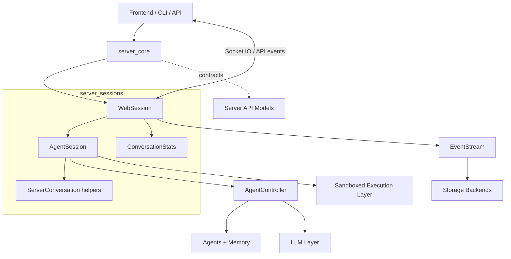
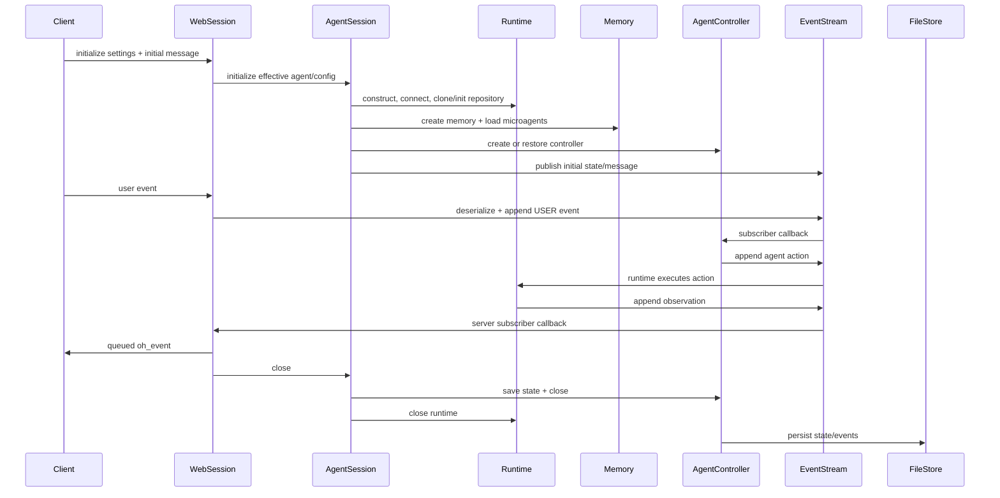

# Server Sessions

The `server_sessions` module is the conversation-service tier that turns a server
request into a running OpenHands conversation. It owns the boundary between web
transport, durable events, agent orchestration, sandbox runtime lifecycle, memory
initialization, and per-conversation LLM statistics.

It is not the agent loop itself and does not implement runtime backends. Instead, it
assembles those lower layers and controls their lifetime for one stable conversation
ID (`sid`).

## Position in the system

The [Server Core](server_core.md) layer supplies HTTP/authentication and middleware
policies. Routes and request schemas are described by [Server API Models](server_api_models.md).
The session layer then composes the [Agent Controller](agent_controller.md),
[Sandboxed Execution Layer](sandboxed_execution_layer.md), [LLM Layer](llm_layer.md),
[Memory and Condensers](memory_and_condensers.md), [Event System](event_system.md), and
[Storage Backends](storage_backends.md).

## Sub-modules

| Documentation | Components | Scope |
| --- | --- | --- |
| [Web Session](server_sessions_web.md) | `WebSession`, compatibility alias `Session` | Socket.IO lifecycle, settings overlay, event serialization, outbound queue, status/error delivery. |
| [Agent Session](server_sessions_agent.md) | `AgentSession` | Runtime, memory, MCP, controller, provider secrets, replay, restore, and shutdown orchestration. |
| [Server Conversation](server_sessions_conversation.md) | `ServerConversation` | Lightweight runtime/event-stream facade with explicit ownership-aware attach behavior. |
| [Conversation Statistics](server_sessions_stats.md) | `ConversationStats` | LLM metric restoration, registration, aggregation, merging, and persistence. |

## End-to-end lifecycle

## Ownership and invariants

* `sid` identifies the event stream, persisted state, metrics file, and Socket.IO room.
* Runtime creation precedes controller creation; a controller cannot be built without
  a runtime.
* `WebSession` owns the web-facing lifecycle, while `AgentSession` owns the execution
  lifecycle. `ServerConversation` can borrow an existing runtime and must not close it.
* Event delivery is asynchronous and queued at the web boundary; durable event
  persistence remains the responsibility of `EventStream` and its store.
* Startup and close are guarded against duplicate or partial lifecycle transitions.
* User/session settings override selected base configuration values, but the final
  effective configuration is still passed through the normal agent/runtime contracts.

## Failure and recovery paths

Runtime connection failure is surfaced through a runtime status callback. Agent startup
errors are converted into safe client-facing errors by `WebSession`. Persisted event
history enables controller state restoration; replay can instead seed the controller
from a recorded trajectory. LLM retry status is delivered through the same status
queue as runtime status.

For detailed behavior, follow the sub-module links above rather than duplicating the
implementation details here.
