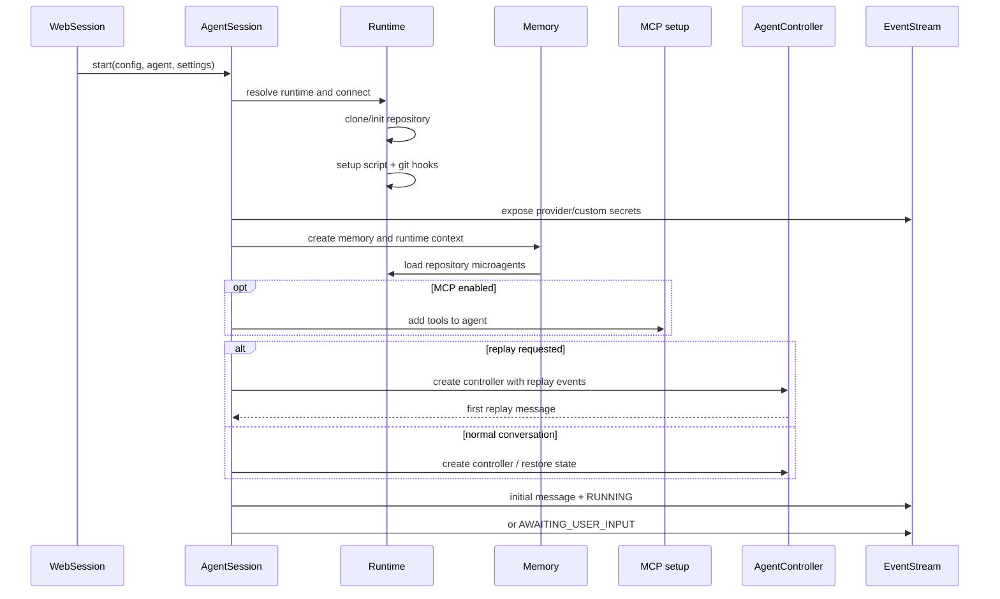
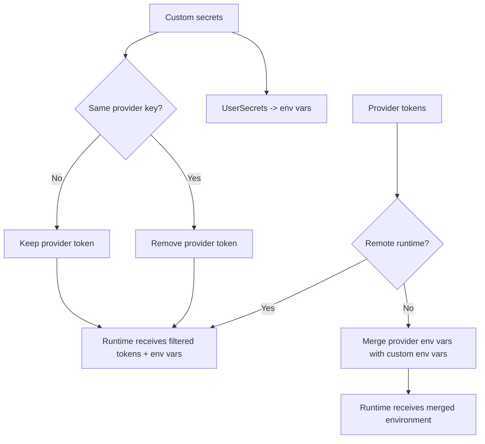

# Server Sessions: Agent Session

`AgentSession` is the execution-facing session object for one conversation. It owns
the conversation event stream, runtime, memory, and (after startup) the
`AgentController`. It translates server-level initialization inputs into the objects
needed by the agent reasoning loop.

Source: `openhands/server/session/agent_session.py::AgentSession`

## Responsibilities

| Responsibility | Behavior |
| --- | --- |
| Runtime lifecycle | Resolves a runtime class, injects secrets and provider tokens, connects it, initializes the repository, and runs setup hooks. |
| Memory setup | Creates `Memory`, supplies runtime/repository context, and loads repository microagents. |
| Controller setup | Creates `AgentController` only after runtime and memory preparation; passes limits, LLM/agent configuration, security analyzer, and optional replay events. |
| Event coordination | Creates the per-session `EventStream` and adds initial user/state events. |
| Recovery | Attempts to restore controller state from persisted session events. |
| Shutdown | Waits briefly for startup, closes the stream, saves/closes the controller, and closes the runtime asynchronously. |

## Startup sequence

Startup is guarded against duplicate runtime/controller creation. A runtime failure
is reported through the status callback as `ERROR_RUNTIME_DISCONNECTED`; startup is
logged with duration and whether state restoration succeeded.

## Secret and provider handling

Custom secrets are converted into environment variables. For remote runtimes,
provider tokens are passed separately, but a custom secret takes precedence when it
maps to the same provider environment key. For local and other runtime types, the
provider handler's exposed environment variables are merged into the custom-secret
environment before runtime construction.

The event stream receives redacted/managed secret information through provider and
custom-secret handlers; the session does not expose raw values to the web wrapper.

## Restoration, replay, and state

`_maybe_restore_state()` calls `State.restore_from_session`. If persisted events exist
but state restoration fails, the session logs a warning; an empty stream is treated as
a new conversation. Replay uses `ReplayManager` to build a controller with recorded
events, returns the first `MessageAction`, and still supplies current limits and LLM
configuration for any interaction after replay.

See [Agent Controller](agent_controller.md), [Agent Controller State](agent_controller_state.md),
and [Agent Controller Safeguards Replay](agent_controller_safeguards_replay.md) for the
owned components.

## Shutdown and observable state

`close()` is idempotent. It marks the session closed, waits up to the startup grace
period for initialization, closes the event stream, persists controller state, and
submits runtime close work to the shared executor. `get_state()` returns the
controller's `AgentState`; if initialization remains incomplete past the grace period,
it reports `ERROR`.

