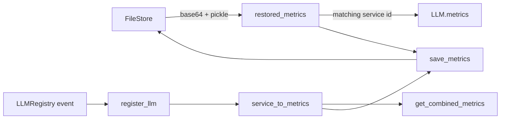

# Server Sessions: Conversation Statistics

`ConversationStats` persists and aggregates per-LLM-service metrics for one
conversation. It listens to `LLMRegistry` creation events, restores prior metrics from
the conversation file store, attaches restored values to newly registered LLMs, and
saves the combined result.

Source: `openhands/server/services/conversation_stats.py::ConversationStats`

## Data model and lifecycle

The metrics file location is derived from conversation ID and user ID. Restored
metrics remain separate until the corresponding service is registered; registration
copies the saved metrics to the LLM and removes the restored entry. This preserves
metrics for services that have not yet been recreated.

## Operations

| Method | Purpose |
| --- | --- |
| `maybe_restore_metrics()` | Best-effort restore; missing files are normal for new conversations. |
| `register_llm(event)` | Registers a service's live `Metrics`, restoring matching historical values. |
| `get_combined_metrics()` | Merges metrics from currently registered services. |
| `get_metrics_for_service(id)` | Returns one live service's metrics or raises for an unknown ID. |
| `save_metrics()` | Thread-safely serializes restored and live metrics, preferring live values on duplicate IDs. |
| `merge_and_save(other)` | Merges restored metrics from another stats object, drops zero-cost entries, and persists. |

Saving uses a lock because registry callbacks and session lifecycle operations can
overlap. The serialized format is an internal persistence detail: base64-encoded
Python pickle stored through `FileStore`, so it should only be read by trusted
application code and compatible versions.

## Relationship to the session

`WebSession` creates and passes `ConversationStats` to `AgentSession`; the latter
passes it into `AgentController`, where LLM activity can be associated with the
conversation. The metrics implementation itself is part of the [LLM Layer](llm_layer.md),
while durable storage is supplied by [Storage Backends](storage_backends.md).

