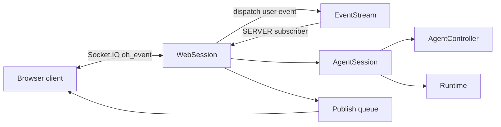
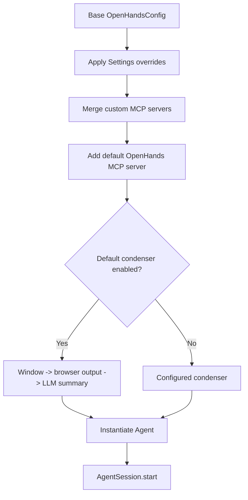

# Server Sessions: Web Session

`WebSession` is the web transport adapter for a conversation. It combines a stable
conversation ID, a Socket.IO server, an `AgentSession`, and an asynchronous outbound
queue. It converts internal events into the `oh_event` messages expected by the web
client and converts incoming dictionaries back into typed events.

Source: `openhands/server/session/session.py::WebSession` (`Session` remains a
backward-compatible alias).

## Architecture

The queue decouples event production from websocket delivery. `_monitor_publish_queue`
serially drains the queue, preserving the order in which the wrapper accepted events.
During the first send it waits briefly for the Socket.IO room to have a listener,
which avoids losing early initialization messages.

## Initialization and configuration overlay

`initialize_agent()` first publishes `LOADING`, then overlays request/session
`Settings` onto the base `OpenHandsConfig`. The overlay can select the agent,
confirmation mode, security analyzer, sandbox images, Git identity, iteration and
budget limits, search/sandbox credentials, MCP configuration, and optional repository
metadata supplied by `ConversationInitData`.

When enabled, the default condenser is a three-stage pipeline:

1. `ConversationWindowCondenser` handles explicit window condensation.
2. `BrowserOutputCondenser` limits browser-output attention.
3. `LLMSummarizingCondenser` summarizes the remaining view with the selected LLM.

The configured agent is then instantiated and passed to `AgentSession.start()`.

## Event translation

Events from the agent and user are serialized and forwarded. Selected environment
events—command output, agent-state changes, and recall observations—are relabeled as
agent events because the frontend displays them as agent-visible progress. Error
observations are treated the same way. Null actions and observations are suppressed.

Incoming image messages are checked against the active model's vision capabilities
before being appended as user events; unsupported images produce a client error.

## Status, errors, and close

Runtime and LLM retry status is placed on the same outbound queue as normal events.
An error status attempts to move the controller to `AgentState.ERROR` and emits a
structured `status_update`. Initialization catches microagent validation errors and
value errors separately to provide useful messages while avoiding raw exception
details for other failures.

`close()` emits `STOPPED`, marks the web session dead, closes the underlying
`AgentSession`, and cancels the queue monitor. Websocket send failures mark the
session inactive so subsequent messages are discarded.

See [Server Core](server_core.md) for transport/server boundaries and [Event System](event_system.md)
for event persistence and subscription semantics.

