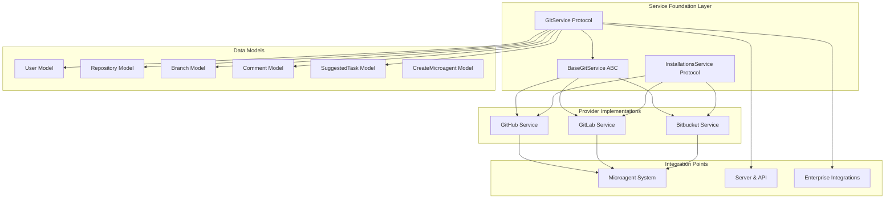
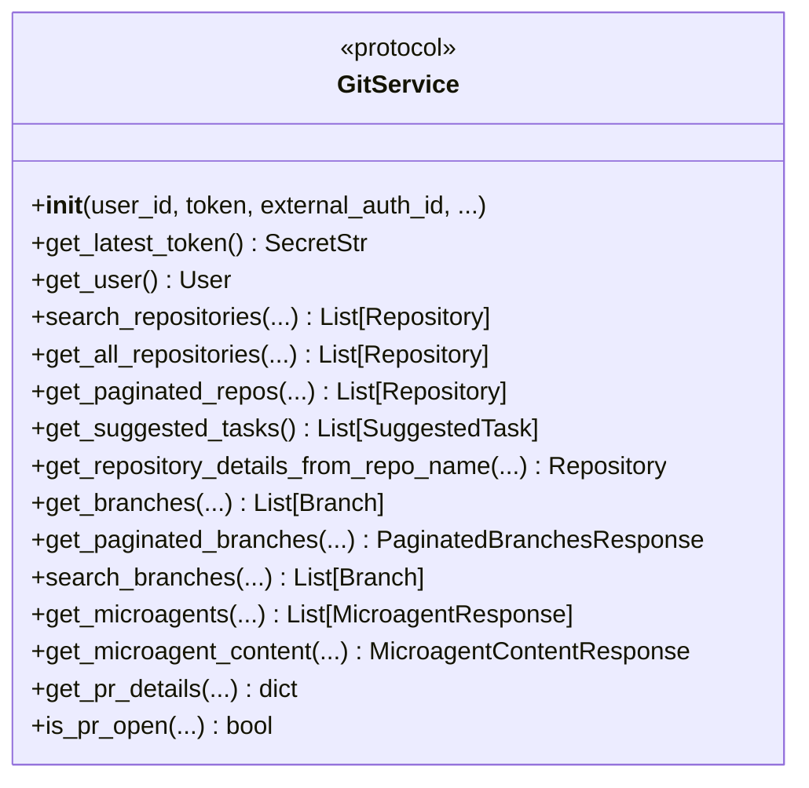
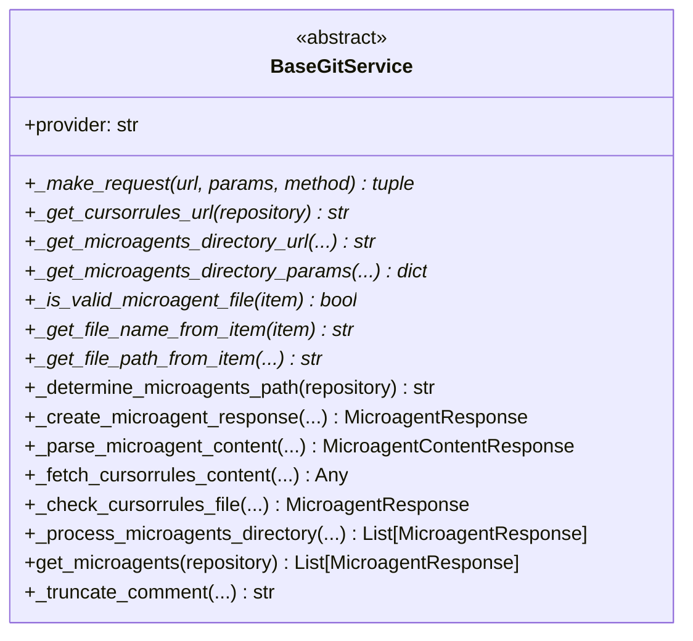
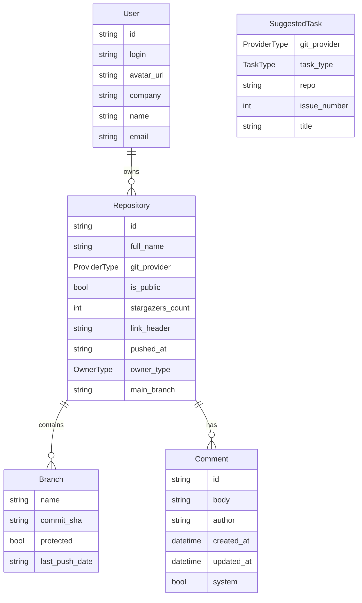
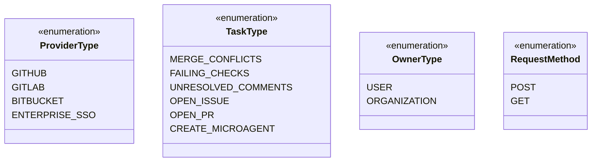
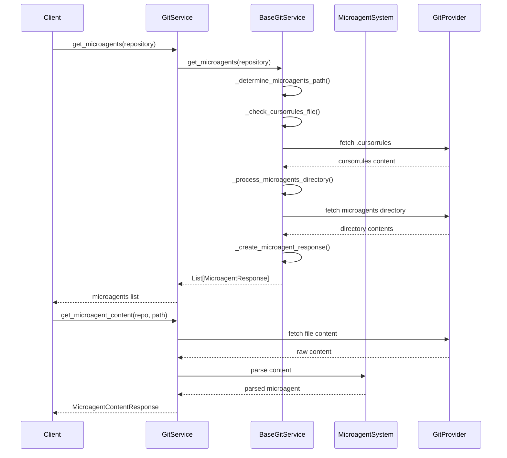
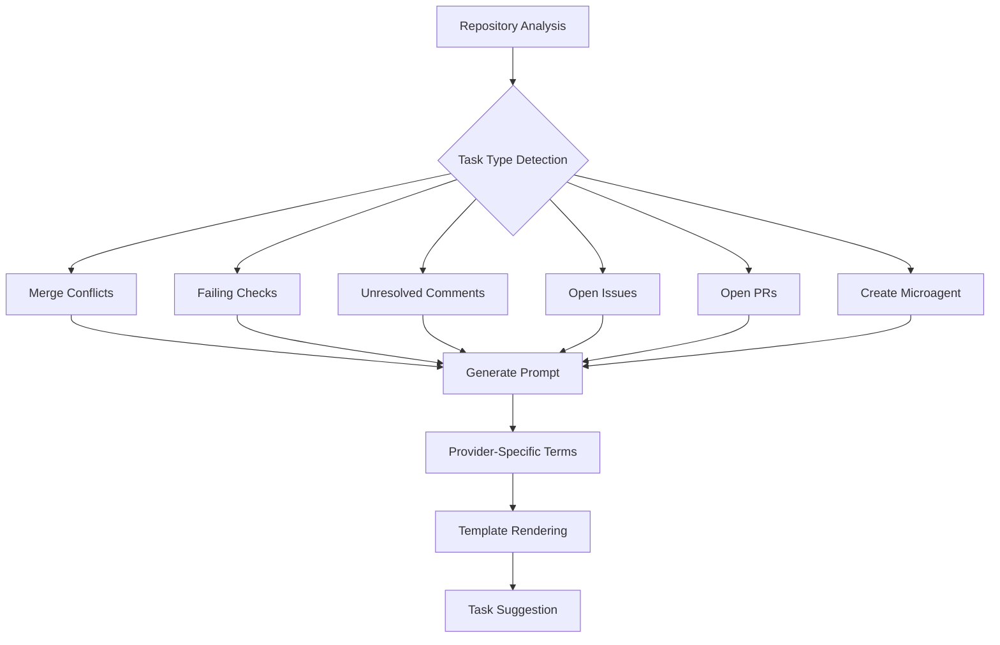
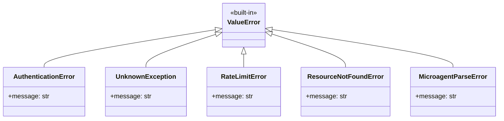
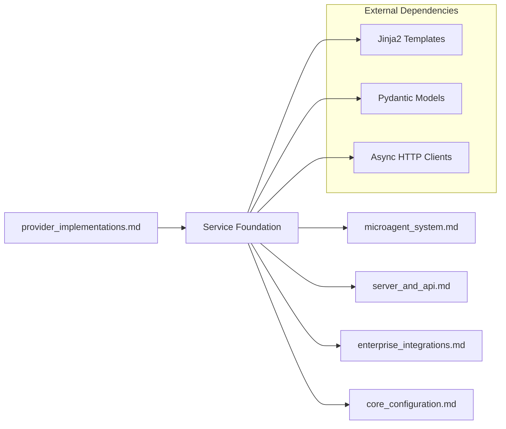
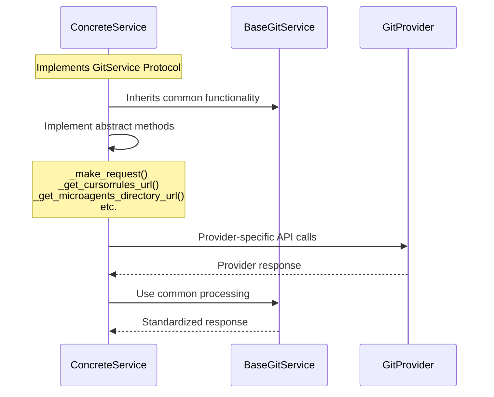

# Service Foundation Module

## Overview

The Service Foundation module (`openhands.integrations.service_types`) provides the foundational abstractions and protocols for Git service integrations within the OpenHands system. This module defines the core interfaces, data models, and base implementations that enable seamless integration with various Git providers (GitHub, GitLab, Bitbucket) while maintaining a consistent API across different provider implementations.

## Core Purpose

- **Unified Git Provider Interface**: Establishes a common protocol for interacting with different Git service providers
- **Microagent Integration**: Provides standardized mechanisms for discovering and managing microagents across repositories
- **Task Management**: Defines structures for automated task suggestions and repository operations
- **Authentication Abstraction**: Standardizes authentication patterns across different Git providers

## Architecture Overview



## Core Components

### GitService Protocol

The primary interface defining the contract for all Git service implementations:



### BaseGitService Abstract Base Class

Provides common functionality and abstract methods for concrete implementations:



## Data Models

### Core Entity Models



### Enumeration Types



## Microagent Integration

The service foundation provides comprehensive microagent discovery and management capabilities:



## Task Suggestion System

The module includes a sophisticated task suggestion system that analyzes repositories and suggests actionable tasks:



## Error Handling

The module defines a comprehensive error hierarchy for robust error handling:



## Integration Dependencies

The service foundation module integrates with several other system components:



## Provider Implementation Pattern

The module establishes a clear pattern for implementing provider-specific services:



## Configuration and Authentication

The service foundation supports multiple authentication patterns:

- **Direct Token Authentication**: Using provider-specific tokens
- **External Authentication**: Integration with external auth systems
- **Enterprise SSO**: Support for enterprise single sign-on
- **Token Management**: Automatic token refresh and validation

## Key Features

### Repository Management
- Repository discovery and search
- Branch management and pagination
- Repository metadata extraction
- Access control validation

### Microagent Discovery
- Automatic microagent detection in repositories
- Support for `.cursorrules` files
- Microagent content parsing and validation
- Template-based microagent creation

### Task Automation
- Intelligent task suggestion based on repository state
- Provider-specific prompt generation
- Template-driven task descriptions
- Multi-provider task normalization

### Performance Optimization
- Paginated API responses
- Efficient directory scanning
- Content truncation for large responses
- Caching-friendly data structures

## Usage Patterns

The service foundation enables consistent usage patterns across all Git providers:

```python
# Initialize service (provider-specific implementation)
service = GitHubService(user_id="user123", token=SecretStr("token"))

# Common operations work across all providers
user = await service.get_user()
repositories = await service.get_all_repositories(sort="updated", app_mode=AppMode.OSS)
microagents = await service.get_microagents("owner/repo")
tasks = await service.get_suggested_tasks()
```

## Related Documentation

- [Provider Implementations](provider_implementations.md) - Concrete implementations for GitHub, GitLab, and Bitbucket
- [Microagent System](microagent_system.md) - Microagent parsing and execution system
- [Server and API](server_and_api.md) - Web API integration points
- [Enterprise Integrations](enterprise_integrations.md) - Enterprise-specific Git service features
- [Core Configuration](core_configuration.md) - Configuration management for Git services

The Service Foundation module serves as the cornerstone for Git provider integrations, ensuring consistent behavior, robust error handling, and extensible architecture across the entire OpenHands ecosystem.