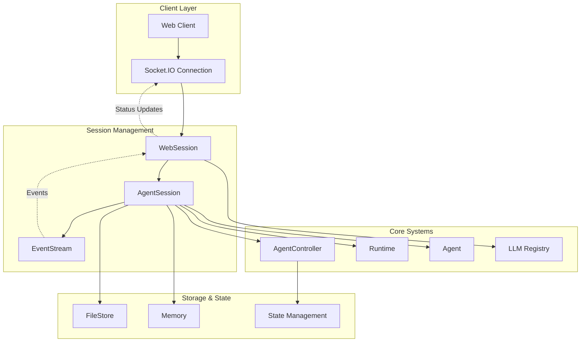
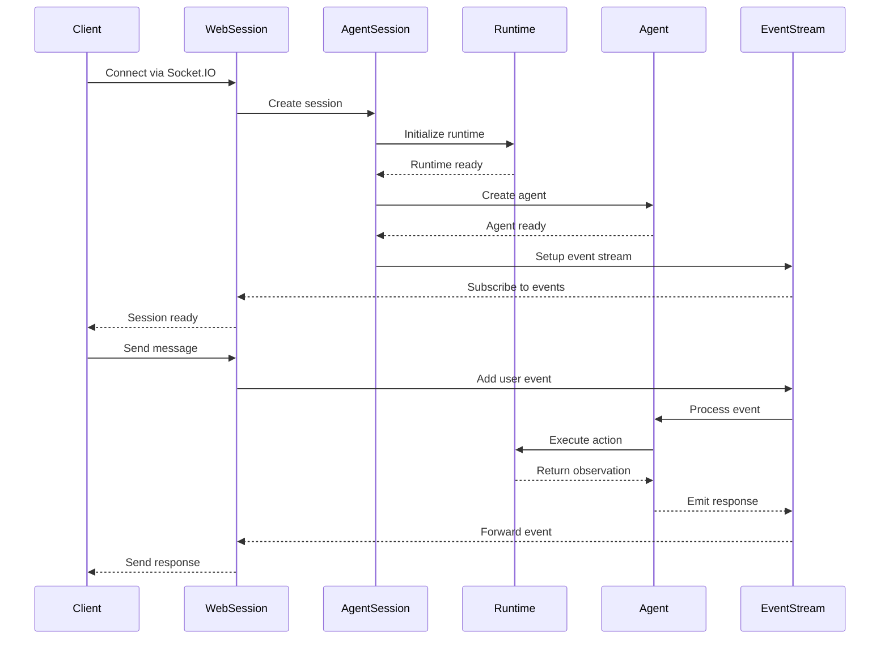
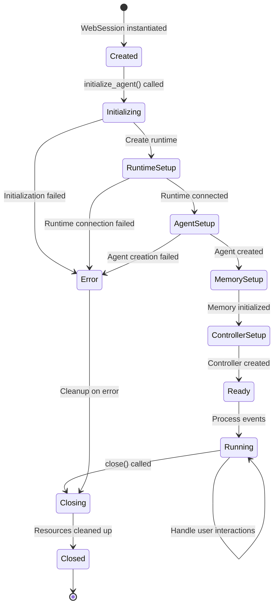
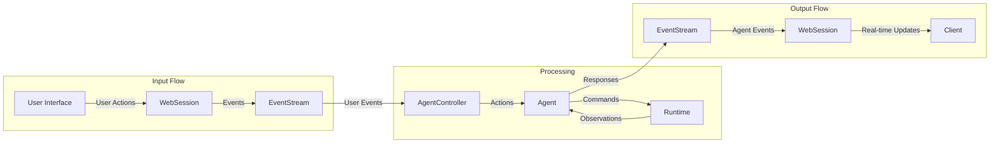
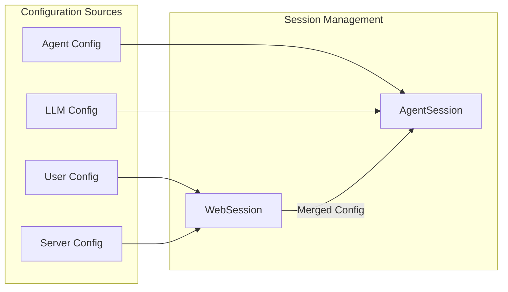

# Session Management Module

The session management module provides the core infrastructure for managing web client sessions and their associated agent interactions within the OpenHands system. It orchestrates the lifecycle of user conversations, from initial connection through agent execution to session termination.

## Overview

The session management module consists of two primary components that work together to provide a complete session management solution:

- **WebSession**: Web server-bound session wrapper that manages client connections and communication
- **AgentSession**: Core agent session that coordinates runtime environments and LLM interactions

This module serves as the bridge between the web interface and the underlying agent execution system, handling real-time communication, state management, and resource coordination.

## Architecture



## Core Components

### WebSession

The `WebSession` class manages individual web client connections and serves as the primary interface between the frontend and backend systems.

**Key Responsibilities:**
- WebSocket connection management via Socket.IO
- Real-time event streaming to clients
- Session lifecycle coordination
- Error handling and status reporting
- Agent initialization and configuration

**Key Attributes:**
- `sid`: Stable conversation identifier
- `sio`: Socket.IO server instance
- `agent_session`: Associated AgentSession instance
- `config`: OpenHands configuration
- `llm_registry`: LLM access registry
- `file_store`: File storage interface

### AgentSession

The `AgentSession` class coordinates the core agent execution environment, managing runtime connections, agent controllers, and memory systems.

**Key Responsibilities:**
- Runtime environment initialization
- Agent controller creation and management
- Memory system setup
- Event stream coordination
- State persistence and restoration
- Resource cleanup

**Key Attributes:**
- `controller`: AgentController instance
- `runtime`: Runtime environment
- `event_stream`: Event communication stream
- `memory`: Agent memory system
- `llm_registry`: LLM registry access

## Component Interactions



## Session Lifecycle



## Data Flow



## Key Features

### Real-time Communication
- WebSocket-based bidirectional communication
- Asynchronous event streaming
- Status update broadcasting
- Error propagation to clients

### Session State Management
- Persistent session storage
- State restoration across reconnections
- Event history maintenance
- Configuration persistence

### Resource Management
- Runtime environment lifecycle
- Memory system coordination
- File storage integration
- Cleanup on session termination

### Error Handling
- Graceful error recovery
- Client error notification
- Resource cleanup on failures
- Detailed error logging

## Integration Points

### Dependencies on Other Modules

The session management module integrates with several other system modules:

- **[Core Agent System](core_agent_system.md)**: Uses Agent, AgentController, and state management components
- **[Events and Actions](events_and_actions.md)**: Leverages EventStream, Event, Action, and Observation systems
- **[Runtime System](runtime_system.md)**: Manages Runtime instances and their lifecycle
- **[LLM Integration](llm_integration.md)**: Accesses LLM services through LLMRegistry
- **[Storage System](storage_system.md)**: Uses FileStore for persistent storage
- **[Server and API](server_and_api.md)**: Integrates with ConversationManager and server infrastructure

### Configuration Integration



## Usage Patterns

### Session Creation
```python
# WebSession initialization
session = WebSession(
    sid=session_id,
    config=openhands_config,
    llm_registry=llm_registry,
    conversation_stats=stats,
    file_store=file_store,
    sio=socketio_server,
    user_id=user_id
)

# Agent initialization
await session.initialize_agent(
    settings=user_settings,
    initial_message=message,
    replay_json=replay_data
)
```

### Event Handling
```python
# Event dispatch from client
await session.dispatch(event_data)

# Event streaming to client
session.on_event(agent_event)
```

### Session Cleanup
```python
# Graceful session termination
await session.close()
```

## Performance Considerations

### Asynchronous Operations
- Non-blocking event processing
- Concurrent session handling
- Efficient WebSocket management
- Background task coordination

### Resource Optimization
- Lazy resource initialization
- Efficient memory usage
- Connection pooling
- Cleanup automation

### Scalability Features
- Session isolation
- Resource sharing where appropriate
- Configurable timeouts
- Memory management

## Security Considerations

### Session Security
- Session ID validation
- User authentication integration
- Resource access control
- Secure communication channels

### Data Protection
- Sensitive data handling
- Secure storage integration
- Error message sanitization
- Access logging

## Monitoring and Observability

### Logging Integration
- Structured logging with session context
- Performance metrics collection
- Error tracking and reporting
- Debug information capture

### Health Monitoring
- Session lifecycle tracking
- Resource usage monitoring
- Connection status reporting
- Performance metrics

## Error Handling Strategies

### Connection Management
- WebSocket reconnection handling
- Session recovery mechanisms
- Graceful degradation
- Client notification systems

### Resource Recovery
- Runtime reconnection
- State restoration
- Memory recovery
- File system consistency

The session management module provides the foundational infrastructure for managing user interactions within the OpenHands system, ensuring reliable, scalable, and secure session handling across the entire platform.