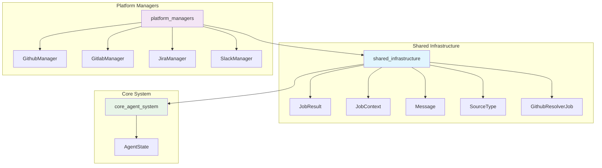
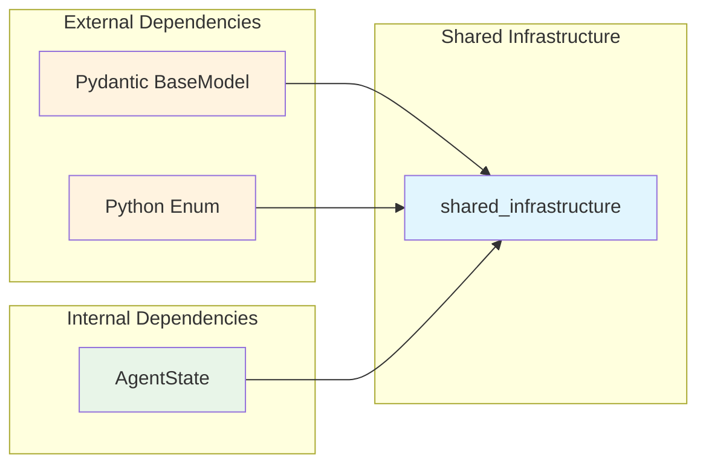
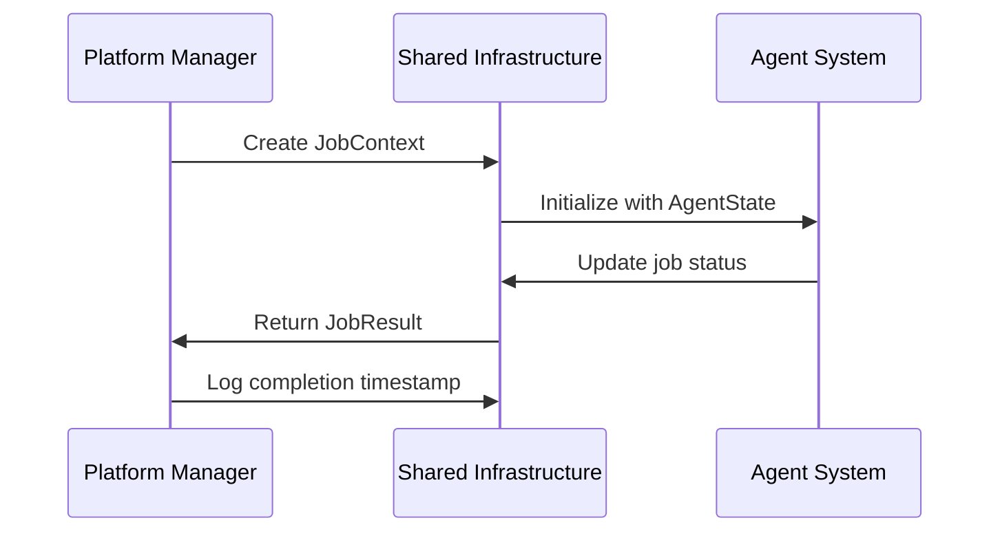
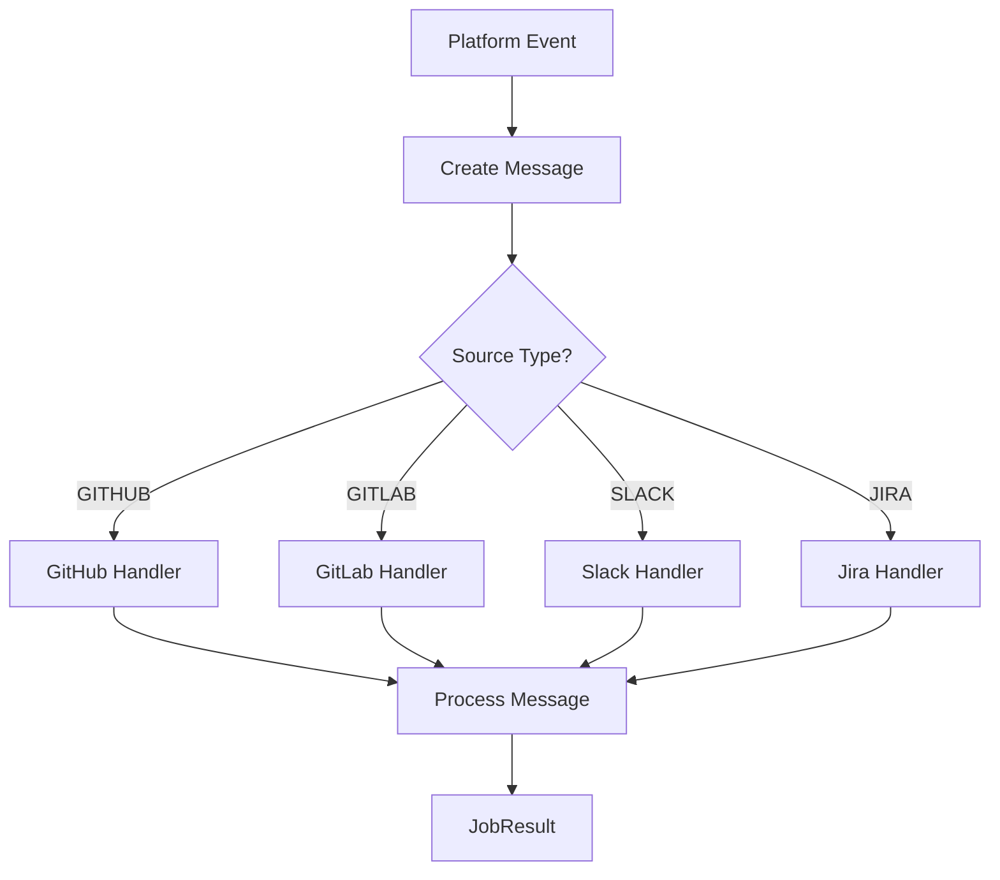

# Shared Infrastructure Module

The shared_infrastructure module provides common data models and types used across enterprise integrations within the OpenHands platform. This module serves as the foundational layer for enterprise-level integrations, defining standardized interfaces for job management, messaging, and platform-specific operations.

## Overview

This module is part of the enterprise integrations system and provides shared infrastructure components that enable consistent communication and data exchange between different platform integrations (GitHub, GitLab, Jira, Slack, etc.). It establishes common patterns for job execution, result handling, and cross-platform messaging.

## Architecture



## Core Components

### JobResult

The `JobResult` class represents the outcome of a job execution within the enterprise integration system.

**Attributes:**
- `result: str` - The primary result or output of the job
- `explanation: str` - Detailed explanation of the job execution and results

**Purpose:**
- Standardizes job outcome representation across all platform integrations
- Provides consistent result format for job tracking and reporting
- Enables uniform error handling and success reporting

### JobContext

The `JobContext` class encapsulates all contextual information required for job execution across different platforms.

**Attributes:**
- `issue_id: str` - Unique identifier for the issue being processed
- `issue_key: str` - Platform-specific key for the issue
- `user_msg: str` - User message or instruction
- `user_email: str` - Email of the requesting user
- `display_name: str` - Display name of the user
- `platform_user_id: str` - Platform-specific user identifier (optional)
- `workspace_name: str` - Name of the workspace or organization
- `base_api_url: str` - Base API URL for the platform (optional)
- `issue_title: str` - Title of the issue (optional)
- `issue_description: str` - Description of the issue (optional)

**Purpose:**
- Provides comprehensive context for job execution
- Enables platform-agnostic job processing
- Supports user identification and workspace management

### Message

The `Message` class defines a standardized messaging format for cross-platform communication.

**Attributes:**
- `source: SourceType` - The source platform of the message
- `message: str | dict` - The message content (string or structured data)
- `ephemeral: bool` - Whether the message is temporary (default: False)

**Purpose:**
- Standardizes message format across different platforms
- Supports both simple text and structured message content
- Enables ephemeral messaging for temporary notifications

### SourceType

An enumeration defining supported platform types within the enterprise integration system.

**Values:**
- `GITHUB` - GitHub platform integration
- `GITLAB` - GitLab platform integration
- `OPENHANDS` - Internal OpenHands platform
- `SLACK` - Slack messaging platform
- `JIRA` - Atlassian Jira issue tracking
- `JIRA_DC` - Jira Data Center deployment
- `LINEAR` - Linear issue tracking platform

**Purpose:**
- Provides type safety for platform identification
- Enables platform-specific logic and routing
- Supports extensibility for new platform integrations

### GithubResolverJob

A specialized job class for GitHub-specific operations and issue resolution.

**Attributes:**
- `type: SourceType` - Source type (typically GITHUB)
- `status: AgentState` - Current state of the job execution
- `result: JobResult` - Job execution result
- `owner: str` - GitHub repository owner
- `repo: str` - GitHub repository name
- `installation_token: str` - GitHub App installation token
- `issue_number: int` - GitHub issue number
- `runtime_id: int` - Runtime environment identifier
- `created_at: int` - Job creation timestamp
- `completed_at: int` - Job completion timestamp

**Purpose:**
- Specializes job handling for GitHub platform
- Tracks GitHub-specific metadata and authentication
- Provides timeline tracking for job execution

## Dependencies



## Integration Patterns

### Job Lifecycle Management



### Cross-Platform Messaging



## Usage Examples

### Creating a Job Context

```python
from enterprise.integrations.models import JobContext, SourceType

context = JobContext(
    issue_id="12345",
    issue_key="PROJ-123",
    user_msg="Please fix the bug in authentication",
    user_email="developer@company.com",
    display_name="John Developer",
    workspace_name="engineering-team",
    issue_title="Authentication Bug",
    issue_description="Users cannot log in with SSO"
)
```

### Processing Job Results

```python
from enterprise.integrations.models import JobResult, Message, SourceType

# Create a result
result = JobResult()
result.result = "Issue resolved successfully"
result.explanation = "Fixed authentication flow and updated tests"

# Create notification message
message = Message(
    source=SourceType.GITHUB,
    message="Issue has been resolved and PR is ready for review",
    ephemeral=False
)
```

## Related Modules

- **[platform_managers](platform_managers.md)** - Implements platform-specific managers that utilize these shared models
- **[core_agent_system](core_agent_system.md)** - Provides AgentState enumeration used in job tracking
- **[enterprise_server](enterprise_server.md)** - Server infrastructure that processes jobs using these models

## Extension Points

The shared infrastructure module is designed for extensibility:

1. **New Platform Types**: Add new values to `SourceType` enum for additional platform integrations
2. **Enhanced Job Context**: Extend `JobContext` with platform-specific fields as needed
3. **Specialized Job Types**: Create new job classes following the `GithubResolverJob` pattern
4. **Message Types**: Extend `Message` class for platform-specific messaging requirements

## Best Practices

1. **Type Safety**: Always use `SourceType` enum values instead of string literals
2. **Context Completeness**: Populate all relevant `JobContext` fields for comprehensive job tracking
3. **Result Documentation**: Provide detailed explanations in `JobResult` for debugging and auditing
4. **Message Clarity**: Use structured message content for complex notifications
5. **Timestamp Tracking**: Always set creation and completion timestamps for job lifecycle management

This module serves as the foundation for enterprise-level integrations, ensuring consistency and reliability across all platform interactions within the OpenHands ecosystem.