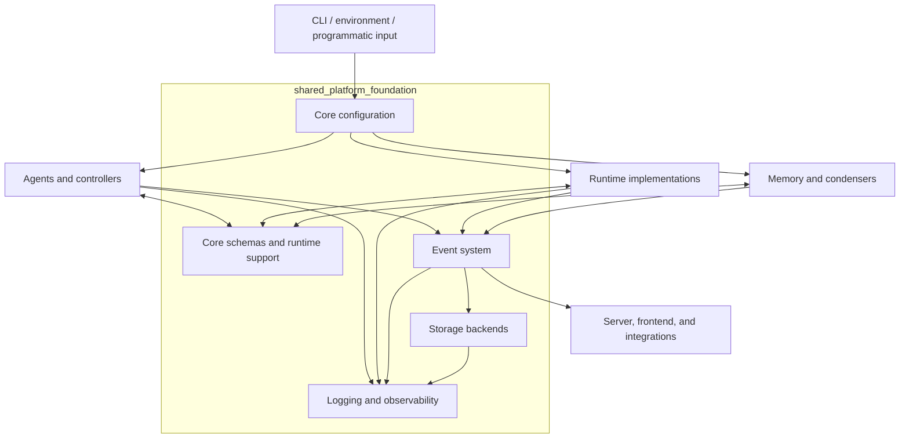
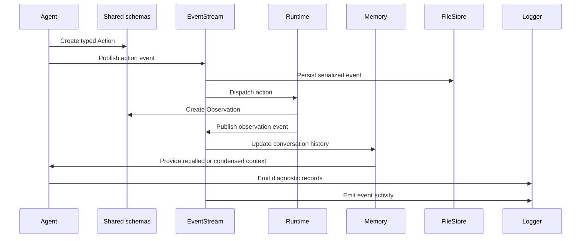

# Shared Platform Foundation

The `shared_platform_foundation` module provides OpenHands’ cross-cutting platform services and contracts. It standardizes configuration, shared schemas, event transport, persistence, and observability so that agents, controllers, runtimes, memory, servers, and clients can interoperate without depending on implementation-specific details.

## Architecture

The primary runtime interaction is an event-driven action/observation loop:

## Core components

- [Core Configuration](core_configuration.md) — typed and validated settings for CLI behavior, Kubernetes runtimes, security controls, and conversation condensation.
- [Core Schema and Runtime Support](core_schema_and_runtime_support.md) — shared action, observation, agent-state, message, prompt, serialization, bootstrap, and terminal-support contracts.
- [Logging](logging.md) — application and LLM logging, JSON or colored output, secret redaction, rotating files, exception context, and runtime progress display.
- [Event System](event_system.md) — typed event hierarchy, ordered event streams, subscriber dispatch, event serialization, and durable event persistence.
- [Storage Backends](storage_backends.md) — the `FileStore` abstraction with local, in-memory, Google Cloud Storage, S3-compatible, and webhook-enabled implementations.

Together, these components form the platform boundary beneath OpenHands’ agent reasoning, sandbox execution, conversation service, integrations, and user-facing clients.