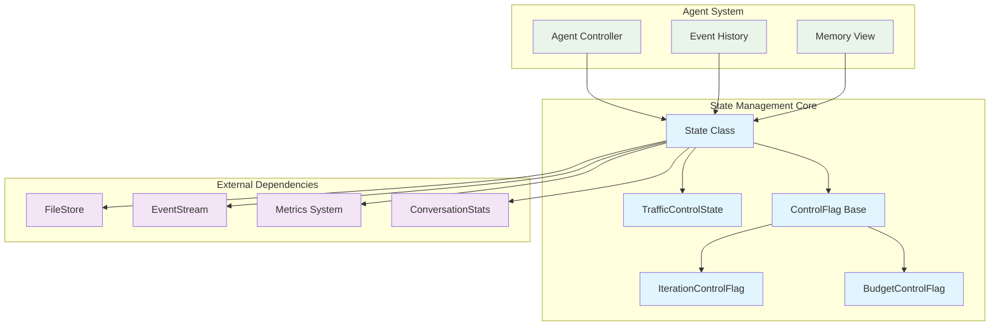
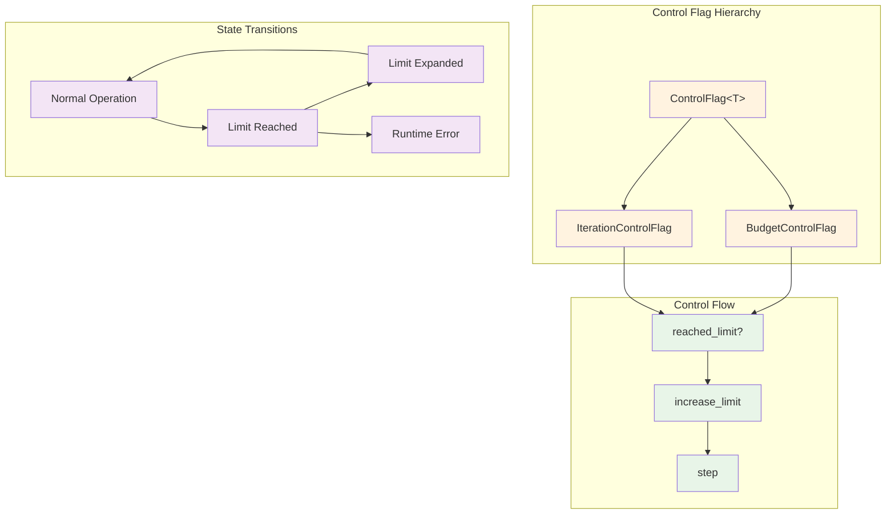
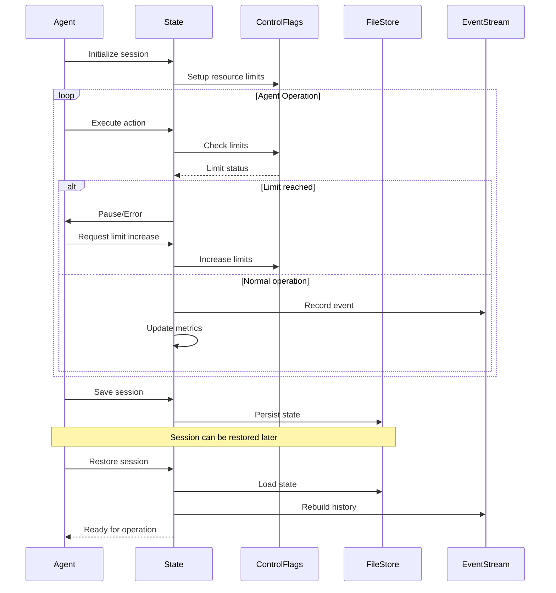
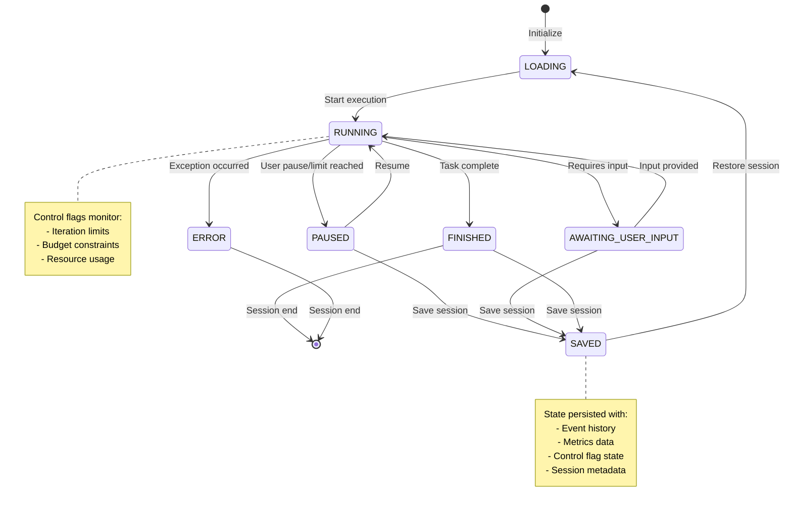

# State Management Module

The state_management module is a critical component of the OpenHands system that manages the runtime state, control flow, and persistence of agent operations. It provides sophisticated state tracking, resource control, and session management capabilities that enable agents to operate reliably across different execution contexts.

## Overview

This module serves as the backbone for maintaining agent state throughout their lifecycle, from initialization to completion. It handles complex scenarios including multi-agent delegation, resource limiting, session persistence, and state recovery. The module ensures that agents can be paused, resumed, and controlled effectively while maintaining data integrity and operational continuity.

## Architecture



## Core Components

### State Class

The `State` class is the central component that encapsulates all runtime information for an agent:

**Key Responsibilities:**
- **Session Management**: Handles saving and restoring agent state across sessions
- **Multi-agent Coordination**: Manages delegate levels and parent-child relationships
- **Resource Tracking**: Monitors iterations, budget, and other resource constraints
- **Event History**: Maintains chronological record of agent actions and observations
- **Persistence**: Serializes state data for storage and recovery

**Core Attributes:**
- `session_id`: Unique identifier for the current session
- `agent_state`: Current operational state (LOADING, RUNNING, PAUSED, etc.)
- `history`: Complete event history for the agent
- `delegate_level`: Hierarchical level for multi-agent scenarios
- `iteration_flag`: Controls iteration limits and progression
- `budget_flag`: Manages cost/resource budget constraints

### Control Flags System

The control flags system provides sophisticated resource management and flow control:



#### IterationControlFlag

Manages the number of steps an agent can take:
- **Limit Tracking**: Monitors current vs. maximum iterations
- **Dynamic Expansion**: Allows limit increases in interactive mode
- **Step Control**: Increments iteration count and enforces limits

#### BudgetControlFlag

Controls resource consumption (typically cost-related):
- **Budget Monitoring**: Tracks spending against allocated budget
- **Flexible Limits**: Supports dynamic budget adjustments
- **Cost Control**: Prevents runaway resource consumption

### TrafficControlState (Deprecated)

Legacy enumeration for rate limiting states:
- `NORMAL`: Default operation mode
- `THROTTLING`: Rate-limited operation
- `PAUSED`: Temporarily suspended operation

*Note: This component is deprecated and maintained for backward compatibility.*

## Data Flow



## Integration Points

### Core Agent System Integration

The state_management module integrates closely with the [core_agent_system](core_agent_system.md):

- **Agent Controller**: Provides state tracking and control flow management
- **Action Processing**: Records action execution and maintains event history
- **Traffic Control**: Implements resource limiting and flow control

### Storage System Integration

Integrates with the [storage_system](storage_system.md) for persistence:

- **Session Storage**: Saves and restores complete agent state
- **Event Persistence**: Coordinates with event storage systems
- **File Management**: Handles state serialization and file operations

### Events and Actions Integration

Works with the [events_and_actions](events_and_actions.md) system:

- **Event History**: Maintains chronological record of all events
- **Action Tracking**: Records agent actions and their outcomes
- **Observation Management**: Stores environmental observations

## State Lifecycle



## Key Features

### Session Persistence

The module provides robust session management:

```python
# Save current state
state.save_to_session(session_id, file_store, user_id)

# Restore previous state
restored_state = State.restore_from_session(session_id, file_store, user_id)
```

**Features:**
- **Serialization**: Uses pickle and base64 encoding for reliable storage
- **Backward Compatibility**: Handles state format migrations
- **Error Recovery**: Graceful handling of corrupted or missing state files
- **User Isolation**: Supports multi-user environments with proper isolation

### Multi-Agent Support

Sophisticated support for agent delegation and hierarchy:

- **Delegate Levels**: Tracks hierarchical relationships between agents
- **Metrics Isolation**: Maintains separate metrics for parent and child agents
- **State Inheritance**: Proper state management across delegation boundaries
- **Resource Sharing**: Coordinated resource management across agent hierarchy

### Resource Control

Advanced resource management capabilities:

- **Iteration Limits**: Prevents infinite loops and runaway execution
- **Budget Control**: Manages cost constraints for LLM operations
- **Dynamic Adjustment**: Interactive limit increases in non-headless mode
- **Graceful Degradation**: Proper error handling when limits are exceeded

### Memory and History Management

Efficient event history and memory management:

- **Event Caching**: Optimized view generation with checksum-based caching
- **Memory Views**: Provides filtered and processed views of event history
- **History Reconstruction**: Rebuilds event history from persistent storage
- **Selective Persistence**: Optimizes storage by excluding transient data

## Usage Patterns

### Basic State Management

```python
# Initialize state
state = State(session_id="session_123")

# Configure control flags
state.iteration_flag = IterationControlFlag(
    limit_increase_amount=100,
    current_value=0,
    max_value=100
)

# Execute with control
try:
    state.iteration_flag.step()
    # Perform agent action
except RuntimeError as e:
    # Handle limit exceeded
    pass
```

### Session Persistence

```python
# Save state
state.save_to_session(session_id, file_store, user_id)

# Later, restore state
restored_state = State.restore_from_session(session_id, file_store, user_id)

# Continue operation
if restored_state.resume_state:
    # Handle resumption logic
    pass
```

### Multi-Agent Delegation

```python
# Parent agent creates child state
child_state = State(
    session_id=parent_state.session_id,
    delegate_level=parent_state.delegate_level + 1,
    parent_metrics_snapshot=parent_state.metrics.copy(),
    parent_iteration=parent_state.iteration_flag.current_value
)

# Child operates independently
# Parent can access child metrics via get_local_metrics()
```

## Error Handling and Recovery

The module implements comprehensive error handling:

- **Graceful Degradation**: Continues operation when possible despite errors
- **State Recovery**: Attempts to restore from corrupted or incomplete state
- **Limit Enforcement**: Proper error reporting when resource limits are exceeded
- **Backward Compatibility**: Handles legacy state formats during restoration

## Performance Considerations

- **Lazy Loading**: Event history and views are computed on-demand
- **Caching Strategy**: Checksum-based caching for expensive view operations
- **Selective Serialization**: Excludes transient data from persistence
- **Memory Management**: Efficient handling of large event histories

## Future Enhancements

The module is designed for extensibility:

- **Additional Control Flags**: Framework supports new resource types
- **Enhanced Persistence**: Pluggable storage backends
- **Advanced Metrics**: More sophisticated resource tracking
- **Distributed State**: Support for distributed agent operations

This state management system provides the foundation for reliable, scalable, and maintainable agent operations in the OpenHands ecosystem.