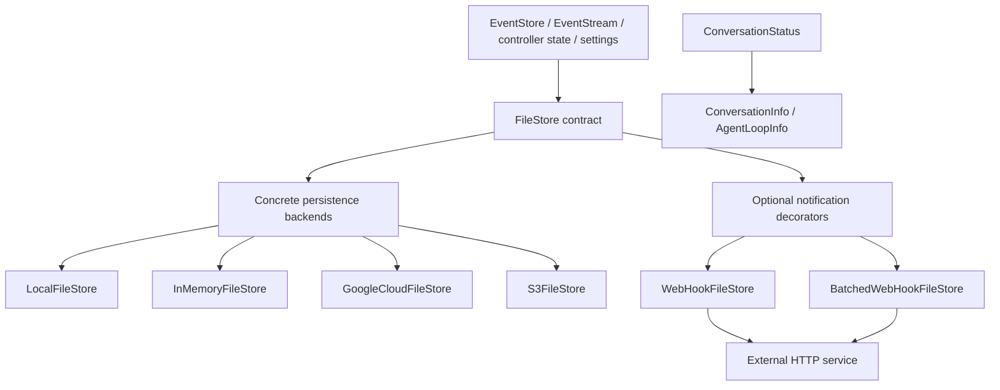
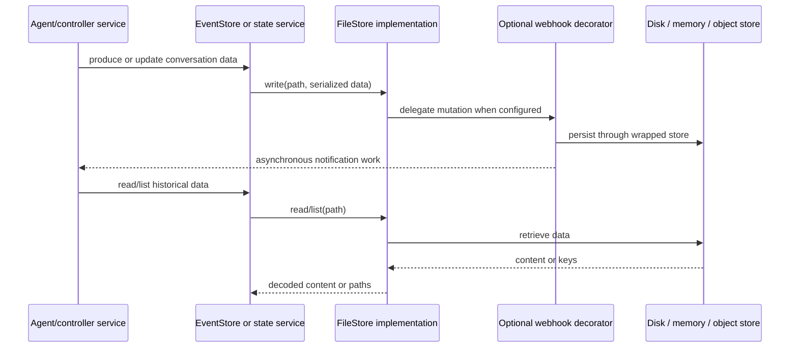

# Storage Backends

The `storage_backends` module provides a uniform file-oriented persistence boundary for OpenHands. Consumers work with `FileStore` operations—write, read, list, and delete—while deployment configuration selects local disk, memory, Google Cloud Storage, or S3-compatible object storage. Decorators can additionally notify external systems through immediate or batched webhooks.

## Architecture overview

The module has three concerns:

1. interchangeable persistence implementations;
2. post-mutation integration notifications;
3. lifecycle vocabulary for conversations associated with persisted and active state.

## Sub-modules

- [Core file stores](storage_backends_core.md) — the `FileStore` contract and local, in-memory, GCS, and S3 implementations.
- [Webhook decorators](storage_backends_webhooks.md) — asynchronous per-operation notifications and lock-protected batching.
- [Conversation status](storage_backends_conversation_status.md) — lifecycle states consumed by server conversation and agent-loop models.

## How it fits into OpenHands

The event subsystem serializes conversation events into logical paths and uses a supplied `FileStore` to persist and retrieve them. Controller state and related services use the same abstraction, which keeps storage choice out of their core logic. Remote backends provide shared durability for deployments with multiple processes or hosts; local and memory stores support simpler or test environments. Webhook decorators extend persistence with external synchronization without changing consumers.

## Operational notes

- Remote stores use prefix scans to emulate directory listing and recursive deletion; object stores do not require physical directories.
- `InMemoryFileStore` decodes byte writes as UTF-8, so binary fidelity is not equivalent to S3/GCS/local stores.
- Standard webhook delivery is asynchronous after the underlying mutation; batched delivery is also asynchronous unless `flush()` is used.
- Backend and webhook errors should be handled by callers according to whether persistence or external synchronization is the critical operation.
