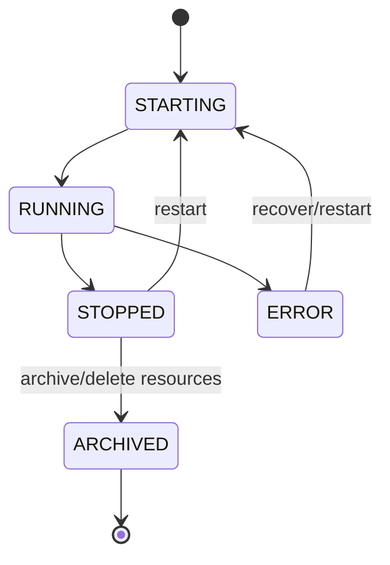

# Storage Backends: Conversation Status Model

`ConversationStatus` is the storage package’s conversation lifecycle vocabulary. It is an enum, not a persistence backend, but it travels through server data models that describe stored or active conversations.

## States

| State | Meaning |
|---|---|
| `STARTING` | Conversation initialization is in progress. |
| `RUNNING` | Conversation is active; the agent may be working or idle. |
| `STOPPED` | Conversation is not running but may be restarted; this corresponds to runtime `paused`. |
| `ARCHIVED` | Conversation cannot be restarted because it has been archived/deleted. |
| `ERROR` | The runtime encountered a conversation-level failure. |

The enum deliberately distinguishes `STOPPED` from `ARCHIVED`: both are inactive, but only the former is restartable. It also differs from `RuntimeStatus`, which describes the runtime and has a separate meaning.

`ConversationInfo` defaults to `STOPPED`, while `AgentLoopInfo` defaults to `RUNNING`. These defaults reflect their contexts: a listed conversation is normally idle until resumed, whereas an agent loop record represents an active loop unless stated otherwise.
