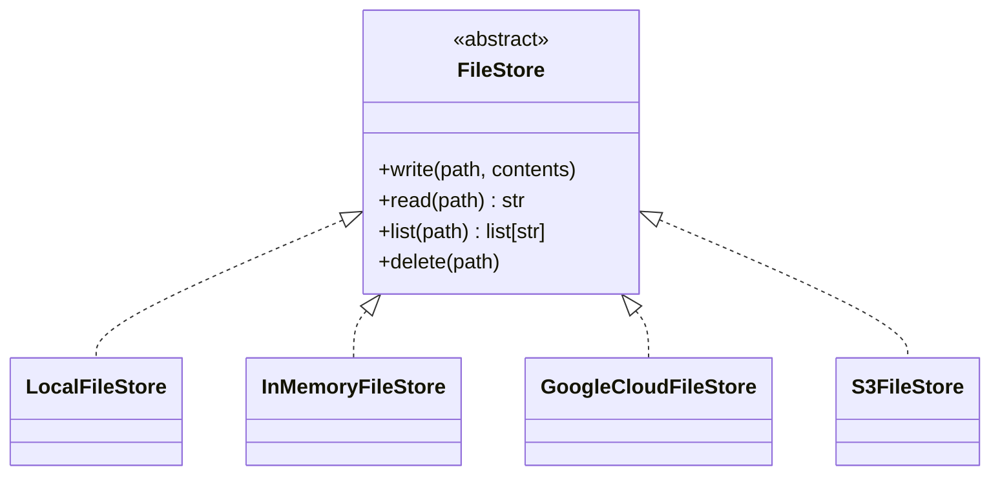
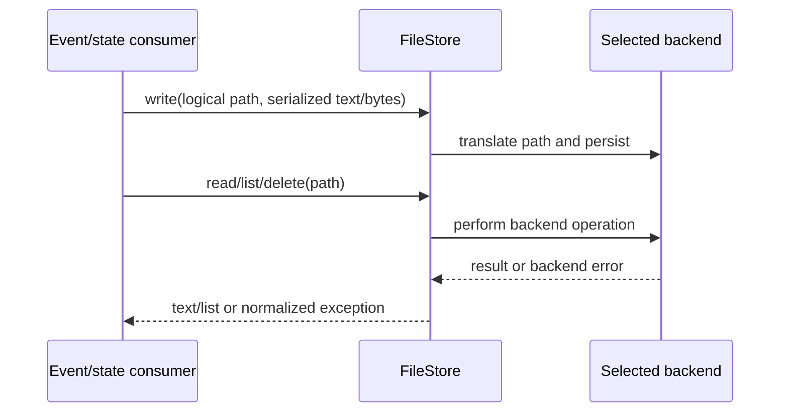

# Storage Backends: Core File Stores

This sub-module documents the concrete stores that implement OpenHands’ `FileStore` contract: local disk, process memory, Google Cloud Storage, and Amazon S3-compatible object storage.

## Common contract

`openhands.storage.files.FileStore` defines four operations:

| Operation | Contract |
|---|---|
| `write(path, contents)` | Persist text or bytes at a logical path. |
| `read(path)` | Return the stored value as text; missing data is reported as `FileNotFoundError`. |
| `list(path)` | Return immediate files and directory-like descendants beneath a prefix. |
| `delete(path)` | Remove a file, or remove a directory/prefix and its descendants. |

The interface intentionally hides the persistence medium. `EventStore`, `EventStream`, controller state, settings, and other services can therefore receive a store through dependency injection without knowing whether data is local, ephemeral, or remote.

## Implementations

### `LocalFileStore`

Uses a configured root directory. A leading `/` is treated as a logical path marker and removed before joining with the root. Writes create parent directories, and deletes handle both files and directories. A leading `~` in the root is expanded with `os.path.expanduser`.

### `InMemoryFileStore`

Stores paths in a dictionary and is useful for tests, temporary workflows, and isolated services. Byte writes are decoded as UTF-8, so this implementation is text-oriented despite accepting `bytes`. Listing reconstructs immediate child directory entries from key prefixes.

### `GoogleCloudFileStore`

Maps logical paths to Google Cloud Storage blob names. The bucket comes from the constructor or `GOOGLE_CLOUD_BUCKET_NAME`; authentication is delegated to the Google client library. Listing emulates immediate-child directories by scanning a prefix, and deletion removes both descendants and an object at the requested path.

### `S3FileStore`

Maps paths to S3 object keys using `boto3`. The bucket comes from the constructor or `AWS_S3_BUCKET`. `AWS_ACCESS_KEY_ID`, `AWS_SECRET_ACCESS_KEY`, `AWS_S3_ENDPOINT`, and `AWS_S3_SECURE` configure credentials and S3-compatible endpoints. Object-store errors are normalized to `FileNotFoundError` with contextual messages.

## Backend selection considerations

| Backend | Persistence | Namespace model | Typical use |
|---|---|---|---|
| Local | Durable on host volume | Files/directories | Single-node deployments |
| Memory | Process lifetime only | Dictionary keys | Unit tests and transient state |
| GCS | Remote/durable | Blob names and prefixes | Google Cloud deployments |
| S3 | Remote/durable | Object keys and prefixes | AWS or S3-compatible deployments |

All remote implementations treat directories as conventions over prefixes; there is no required physical directory object. Callers should use normalized logical paths and should not depend on ordering from `list`.

## Persistence flow

