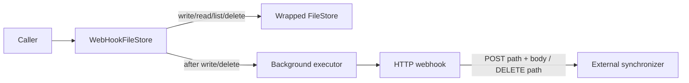
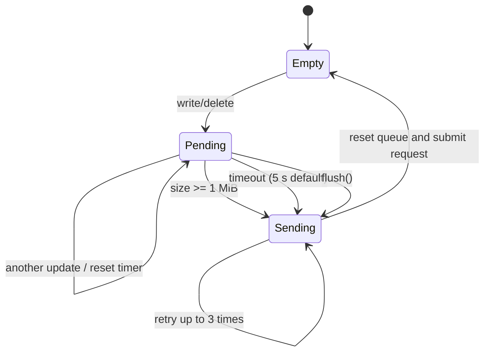

# Storage Backends: Webhook Decorators

The webhook stores decorate any `FileStore` and preserve its read/list behavior while notifying an external HTTP service after writes and deletes. They are integration layers, not independent persistence backends.

## Standard webhook behavior

`WebHookFileStore` delegates the mutation first, then submits notification work to the shared executor. A write sends `POST {base_url}{path}` with the contents as the request body; a delete sends `DELETE {base_url}{path}`. Both requests retry up to three attempts with a one-second fixed delay and raise for non-success HTTP responses.



Because persistence happens before notification is queued, a successful `write` or `delete` does not mean the webhook has already succeeded. Failures occur asynchronously in the executor and should be observed through application logging/monitoring.

## Batched webhook behavior

`BatchedWebHookFileStore` queues the latest operation per path under a thread lock. A batch is dispatched when:

- no new update arrives for five seconds by default (the timer resets after each insert);
- queued write content reaches 1 MiB by default; or
- `flush()` is called explicitly.

The payload is a JSON array posted to `base_url`:

```json
[
  {"method": "POST", "path": "events/1.json", "content": "..."},
  {"method": "DELETE", "path": "events/0.json"}
]
```

UTF-8 bytes are sent as strings. Non-UTF-8 bytes are base64 encoded and marked with `"encoding": "base64"`. Repeated updates to the same path replace the earlier queued update and adjust the size accounting. Batch requests use the same three-attempt, one-second retry policy; failures are logged by the background sender.



## Choosing a decorator

Use `WebHookFileStore` when each mutation should be delivered independently and the receiver expects path-specific endpoints. Use `BatchedWebHookFileStore` when mutation volume is high or the receiver supports a JSON batch endpoint. Call `flush()` during orderly shutdown when pending updates must be submitted synchronously.
