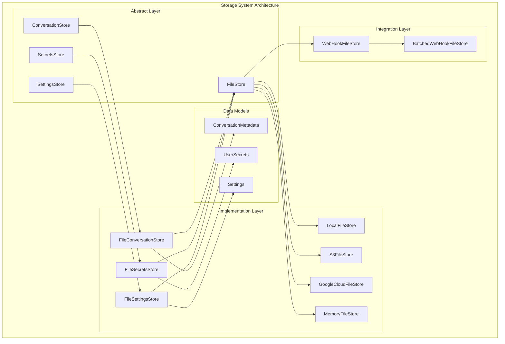
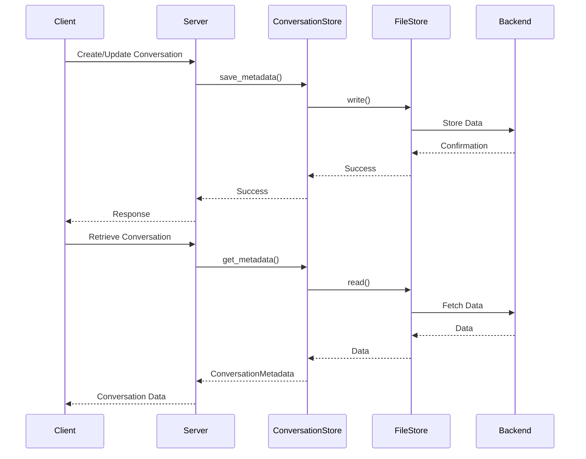

# Storage System Documentation

## Overview

The OpenHands Storage System is a comprehensive data persistence layer that provides unified interfaces for storing and managing different types of application data. The system implements a pluggable architecture that allows for multiple storage backends while maintaining consistent APIs across the application.

## Purpose and Core Functionality

The storage system serves as the central data persistence layer for OpenHands, handling:

- **Conversation Management**: Storing conversation metadata, including user interactions, repository information, and session state
- **User Settings**: Persisting user preferences, configuration settings, and application state
- **Secrets Management**: Secure storage and retrieval of sensitive information like API keys and tokens
- **File Operations**: Providing abstracted file storage capabilities across different backends (local, cloud, memory)

## Architecture Overview

The storage system follows a layered architecture with abstract base classes defining contracts and concrete implementations providing specific storage mechanisms:



## System Components

### Core Storage Interfaces

The storage system is built around four primary abstract interfaces:

1. **ConversationStore**: Manages conversation metadata and session information
2. **SecretsStore**: Handles secure storage of sensitive user data
3. **SettingsStore**: Persists user preferences and configuration settings
4. **FileStore**: Provides low-level file operations across different backends

### Data Models

The system uses well-defined data models to ensure type safety and consistency:

- **ConversationMetadata**: Contains conversation details, repository information, cost metrics, and session state
- **UserSecrets**: Manages provider tokens and custom secrets with secure serialization
- **Settings**: Stores user preferences, LLM configurations, and application settings

### Storage Backends

The system supports multiple storage backends through the FileStore interface:

- **Local Storage**: File system-based storage for development and single-user deployments
- **Cloud Storage**: S3 and Google Cloud Storage for scalable, distributed deployments
- **Memory Storage**: In-memory storage for testing and temporary data
- **Webhook Integration**: Real-time synchronization with external systems

## Sub-Module Architecture

The storage system is organized into specialized sub-modules, each handling specific aspects of data persistence:

### Conversation Management
**File**: [conversation_management.md](conversation_management.md)

Provides persistent storage and management capabilities for conversation metadata, enabling OpenHands to maintain conversation history, user associations, and conversation lifecycle management. This module implements the ConversationStore abstract interface with support for metadata validation, search operations, and parallel data retrieval.

### User Data Management  
**File**: [user_data_management.md](user_data_management.md)

Manages secure storage of user-specific data including settings and secrets. This module handles sensitive information like API keys and authentication tokens through the SecretsStore interface, while managing user preferences and configuration through the SettingsStore interface. Both stores implement secure serialization and proper data validation.

### File Storage Infrastructure
**File**: [file_storage_infrastructure.md](file_storage_infrastructure.md)

Provides the foundational file storage capabilities that underpin all other storage operations. This module implements the FileStore abstract interface with support for multiple backends (local, S3, Google Cloud, memory) and includes webhook integration for real-time synchronization with external systems. The infrastructure supports both standard and batched webhook operations for optimal performance.

## Integration with Other Modules

The storage system integrates closely with several other OpenHands modules:

### Server and API Integration
- **ConversationManager** ([server_and_api.md](server_and_api.md)): Uses ConversationStore for session management
- **UserAuth** ([server_and_api.md](server_and_api.md)): Integrates with SecretsStore for authentication tokens

### Configuration Management
- **OpenHandsConfig** ([core_configuration.md](core_configuration.md)): Provides configuration for storage backends
- **SecurityConfig** ([core_configuration.md](core_configuration.md)): Defines security policies for sensitive data

### Git Integrations
- **GitService** ([git_integrations.md](git_integrations.md)): Stores repository credentials and provider tokens through SecretsStore

## Data Flow and Operations



## Security and Data Protection

The storage system implements several security measures:

- **Secret Masking**: Sensitive data is automatically masked in serialization contexts
- **User Validation**: Conversation ownership validation prevents unauthorized access
- **Secure Serialization**: Custom serializers handle sensitive fields appropriately
- **Event Stream Protection**: Secrets are automatically masked from event streams

## Configuration and Deployment

The storage system supports flexible configuration through the OpenHands configuration system:

```toml
[core]
file_store = "local"  # Options: local, s3, google_cloud, memory
file_store_path = "/path/to/storage"

# Webhook integration (optional)
file_store_web_hook_url = "https://api.example.com/webhook"
file_store_web_hook_batch = true

[server]
conversation_store_class = "custom.ConversationStore"
secrets_store_class = "custom.SecretsStore"
settings_store_class = "custom.SettingsStore"
```

## Extension Points

The storage system provides several extension points for customization:

1. **Custom Store Implementations**: Applications can implement custom storage backends
2. **Webhook Integrations**: Real-time synchronization with external systems
3. **Data Model Extensions**: Additional fields can be added to data models
4. **Backend Plugins**: New storage backends can be added through the FileStore interface

## Performance Considerations

- **Async Operations**: All storage operations are asynchronous for better performance
- **Batch Processing**: Webhook operations support batching for improved throughput
- **Parallel Operations**: Multiple metadata operations can be executed in parallel
- **Caching**: Implementation-specific caching can be added at the FileStore level

## Error Handling and Reliability

The storage system implements robust error handling:

- **Retry Logic**: Webhook operations include automatic retry mechanisms
- **Validation**: Data models include comprehensive validation rules
- **Graceful Degradation**: Missing or corrupted data is handled gracefully
- **Logging**: Comprehensive logging for debugging and monitoring

This storage system provides a solid foundation for OpenHands' data persistence needs while maintaining flexibility for different deployment scenarios and integration requirements.