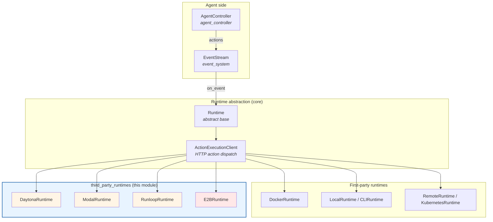
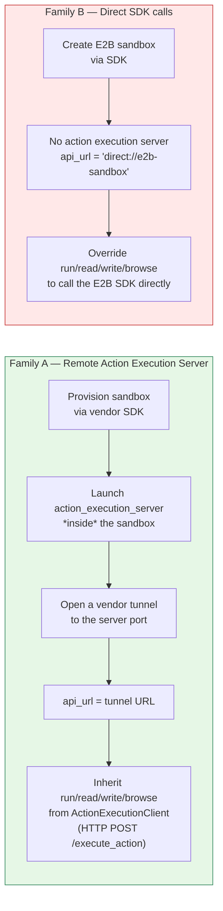
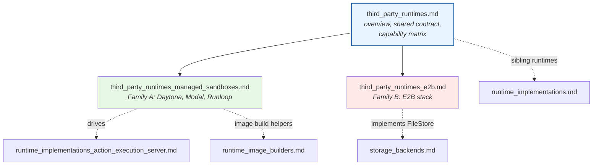
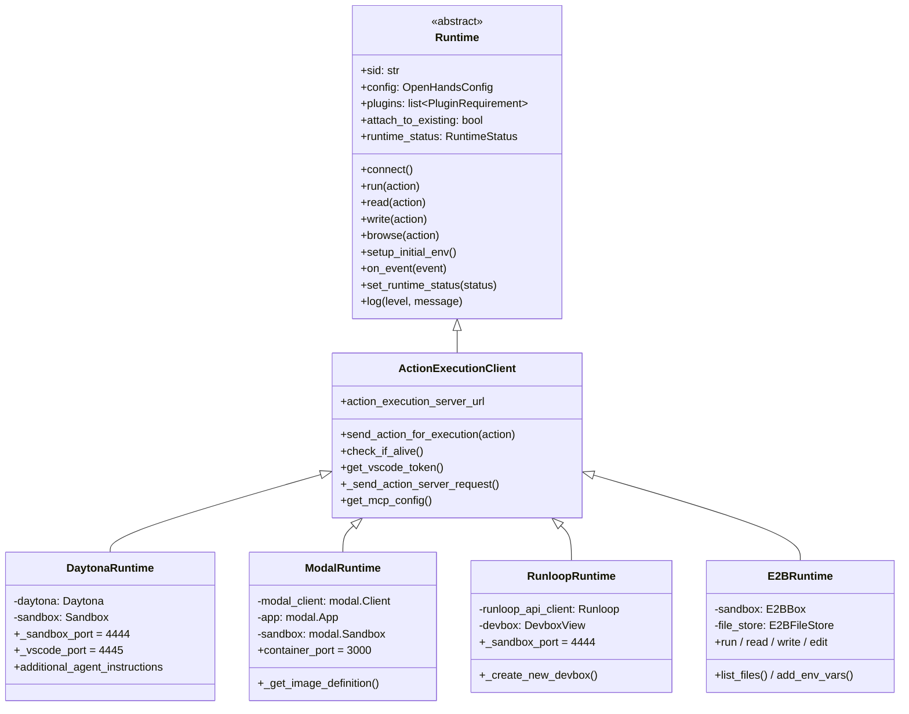
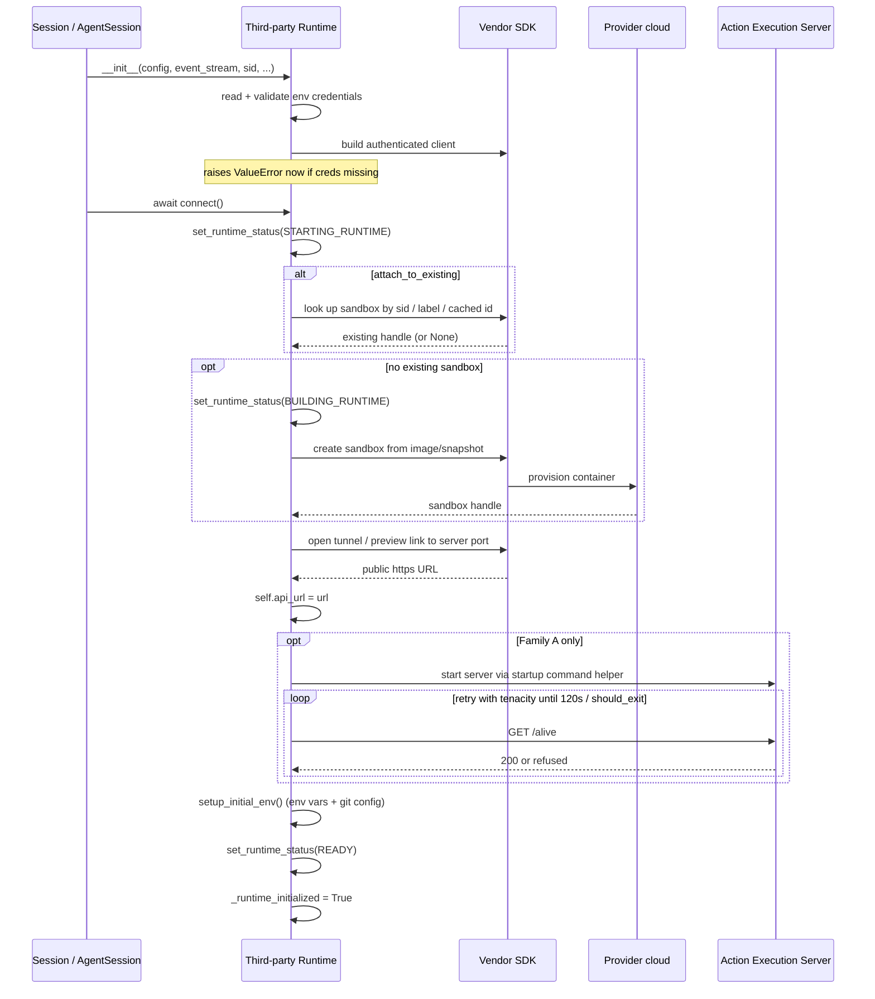
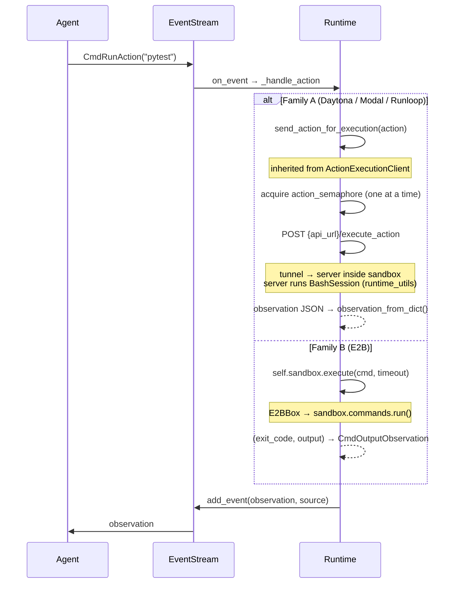
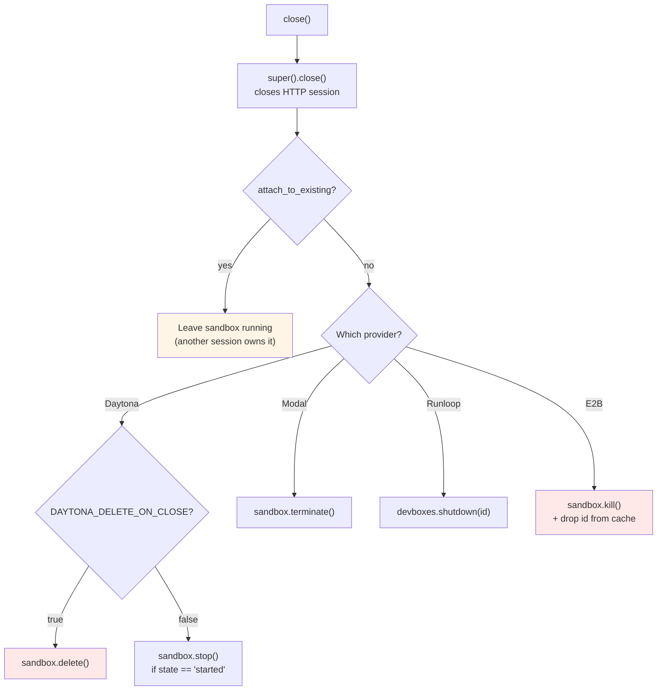
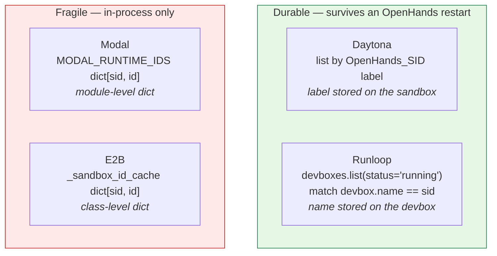
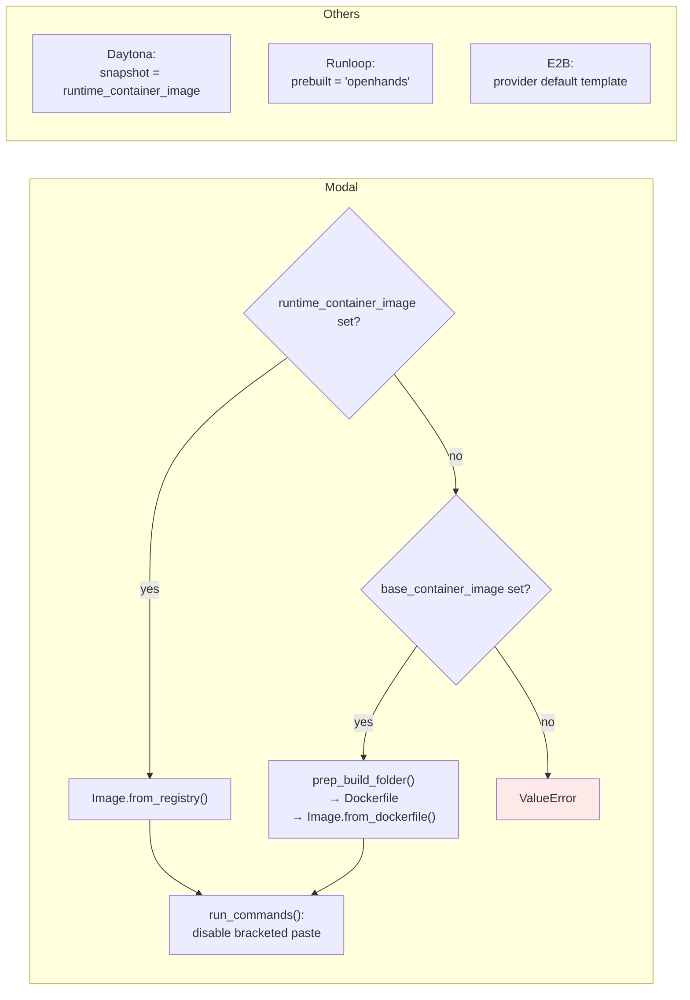
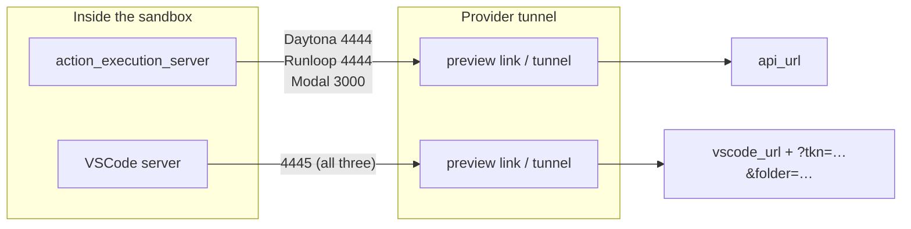

# Third-Party Runtimes

## Purpose

The `third_party_runtimes` module holds runtime backends that run the agent's sandbox on a **commercial cloud sandbox provider** instead of on hardware OpenHands manages itself. Four providers live here:

| Runtime | Provider | What the provider gives us |
| --- | --- | --- |
| `DaytonaRuntime` | [Daytona](https://daytona.io) | Snapshot-booted sandboxes with public preview links |
| `ModalRuntime` | [Modal](https://modal.com) | Serverless sandboxes with encrypted port tunnels |
| `RunloopRuntime` | [Runloop](https://runloop.ai) | "Devboxes" booted from a prebuilt image, with tunnels |
| `E2BRuntime` | [E2B](https://e2b.dev) | Code-interpreter sandboxes with a native filesystem + command API |

These files sit under `third_party/` rather than `openhands/` on purpose. Each one pulls in a **vendor SDK as a hard import** (`daytona`, `modal`, `runloop_api_client`, `e2b_code_interpreter`) and needs **vendor credentials from environment variables**. Keeping them outside the core tree means a stock OpenHands install never has to install those SDKs, and the vendors can be maintained without touching core code.

Every runtime here is a drop-in substitute for the first-party runtimes documented in [runtime_implementations](runtime_implementations.md). The agent loop in [agent_controller](agent_controller.md) never knows which one it is talking to — it just emits actions onto the event stream.

## Where this module sits



The runtime is selected by name at startup. `get_runtime_cls(name)` first checks a table of built-in names, and if the name is not there it resolves the string as a fully-qualified class path via `get_impl`. That second path is exactly how the third-party runtimes get loaded — they are never hard-wired into the core table.

## Two very different integration shapes

This is the single most important thing to understand about the module. The four runtimes split into two families that share a base class but almost nothing else.



**Family A — Daytona, Modal, Runloop.** These are thin provisioning shims. Each one boots a container from the same OpenHands runtime image used by `DockerRuntime`, starts the standard action execution server inside it using the shared `get_action_execution_server_startup_command()` helper, and publishes the server through a vendor-specific tunnel. From that point on, *all* action handling is inherited unchanged from `ActionExecutionClient`. The runtime subclass typically only implements `connect()`, `close()`, `action_execution_server_url`, and `vscode_url`. Details in **[third_party_runtimes_managed_sandboxes](third_party_runtimes_managed_sandboxes.md)**.

**Family B — E2B.** E2B does not run the action execution server at all. `E2BRuntime` sets a placeholder `api_url` of `direct://e2b-sandbox` and instead **overrides every action handler** to talk to the E2B SDK directly. That means it also has to re-implement file reads/writes/edits, env-var injection, file listing, and `check_if_alive()` — and it loses features it cannot emulate (interactive browsing, VSCode, real MCP). Details in **[third_party_runtimes_e2b](third_party_runtimes_e2b.md)**.

## Sub-modules

### [third_party_runtimes_managed_sandboxes](third_party_runtimes_managed_sandboxes.md)

`DaytonaRuntime`, `ModalRuntime`, and `RunloopRuntime` — the three Family A providers. Covers how each one authenticates, provisions or re-attaches to a sandbox, builds the server start command, wires up tunnels and VSCode URLs, and tears down on close. Also covers the retry/backoff patterns each uses while waiting for the sandbox to come up, and the differences in how each tracks sandbox identity across sessions.

### [third_party_runtimes_e2b](third_party_runtimes_e2b.md)

`E2BRuntime`, `E2BBox`, `E2BFileStore`, and `SupportsFilesystemOperations` — the Family B provider. Covers the three-layer design (runtime → sandbox wrapper → file store adapter), the direct-execution action handlers, the defensive SDK-version shims in `E2BBox`, the `FileStore` adapter that bridges E2B's filesystem into the interface used by [storage_backends](storage_backends.md), and the capability gaps versus the Family A runtimes.

### Source file → documentation map

| Source file | Core components | Documented in |
| --- | --- | --- |
| `third_party/runtime/impl/daytona/daytona_runtime.py` | `DaytonaRuntime` | [third_party_runtimes_managed_sandboxes](third_party_runtimes_managed_sandboxes.md) |
| `third_party/runtime/impl/modal/modal_runtime.py` | `ModalRuntime` | [third_party_runtimes_managed_sandboxes](third_party_runtimes_managed_sandboxes.md) |
| `third_party/runtime/impl/runloop/runloop_runtime.py` | `RunloopRuntime` | [third_party_runtimes_managed_sandboxes](third_party_runtimes_managed_sandboxes.md) |
| `third_party/runtime/impl/e2b/e2b_runtime.py` | `E2BRuntime` | [third_party_runtimes_e2b](third_party_runtimes_e2b.md) |
| `third_party/runtime/impl/e2b/sandbox.py` | `E2BBox` (alias `E2BSandbox`) | [third_party_runtimes_e2b](third_party_runtimes_e2b.md) |
| `third_party/runtime/impl/e2b/filestore.py` | `E2BFileStore`, `SupportsFilesystemOperations` | [third_party_runtimes_e2b](third_party_runtimes_e2b.md) |



## Shared contract: what every runtime here must provide

All four inherit from `ActionExecutionClient`, which in turn inherits from the abstract `Runtime`. The base class does a lot of work for them.



### The constructor contract

Every runtime here takes the same argument list, which is what lets them be swapped freely:

```python
def __init__(
    config: OpenHandsConfig,            # see core_configuration
    event_stream: EventStream,          # see event_system
    sid: str = 'default',               # session id
    plugins: list[PluginRequirement] | None = None,   # see runtime_plugins
    env_vars: dict[str, str] | None = None,
    status_callback: Callable | None = None,
    attach_to_existing: bool = False,
    headless_mode: bool = True,
    user_id: str | None = None,
    git_provider_tokens: PROVIDER_TOKEN_TYPE | None = None,
)
```

`E2BRuntime` additionally takes an `llm_registry: LLMRegistry` (see [llm_layer_registry](llm_layer_registry.md)) and an optional pre-built `sandbox`, matching the newer base-class signature.

### Credentials come from the environment, and failures are loud

Every runtime reads its vendor credentials from environment variables in `__init__` and raises `ValueError` right away if they are missing. This is deliberate: it fails at construction time, before any sandbox is provisioned or billed.

| Runtime | Required | Optional |
| --- | --- | --- |
| Daytona | `DAYTONA_API_KEY` | `DAYTONA_API_URL`, `DAYTONA_TARGET`, `DAYTONA_DISABLE_AUTO_STOP`, `DAYTONA_DELETE_ON_CLOSE` |
| Modal | `MODAL_TOKEN_ID`, `MODAL_TOKEN_SECRET` | — |
| Runloop | `RUNLOOP_API_KEY` | — |
| E2B | `E2B_API_KEY` | `E2B_DOMAIN` |

Note that these are read from `os.getenv` directly rather than from `OpenHandsConfig` — an intentional split, since the rest of the sandbox settings (image, timeout, workspace path) *do* come from config.

### Nobody supports `workspace_base`

All four log a warning and ignore `config.workspace_base`. None of these providers can bind-mount a host directory into a remote sandbox, so the local-workspace workflow that `DockerRuntime` and `LocalRuntime` support simply is not available. Code has to get into the sandbox by `git clone` (via [git_provider_integrations](git_provider_integrations.md)) or by explicit `copy_to`.

## Lifecycle: how a sandbox comes up



Status is reported outward through `set_runtime_status()`, which forwards `RuntimeStatus` enum values to the `status_callback` the server session supplied. Those values (`STARTING_RUNTIME`, `BUILDING_RUNTIME`, `READY`, `ERROR`, …) are what the user eventually sees in the UI — see [server_sessions](server_sessions.md) and [frontend_state](frontend_state.md).

## Action flow at runtime

Once connected, the two families diverge sharply.



For Family A, the work actually happens in [runtime_implementations_action_execution_server](runtime_implementations_action_execution_server.md), using the shell and plugin machinery in [runtime_utils](runtime_utils.md), [runtime_plugins](runtime_plugins.md), and [browser_environment](browser_environment.md). The third-party code contributes nothing to execution — only to transport.

For Family B, none of that applies. E2B builds observations itself from raw SDK results.

## Resilience patterns

Cloud sandboxes are slow and flaky to boot, so every Family A runtime wraps its readiness check in `tenacity` retries. A shared helper, `stop_if_should_exit()` from [runtime_utils](runtime_utils.md), is OR'd into the stop condition so a user pressing Ctrl-C is not stuck waiting out the full timeout.

| Runtime | Readiness retry | Notable extras |
| --- | --- | --- |
| Daytona | 120s deadline, fixed 1s wait | Also retries **HTTP 502** on every action request — cloud tunnels return 502 while warming up |
| Modal | 120s deadline, fixed 2s wait, retries `ConnectionError`/`httpx.NetworkError` | Sandbox creation itself retries 5× with exponential backoff; plus a blunt `sleep(20)` after tunnel setup |
| Runloop | 120s deadline, fixed 1s wait | Separate 120-attempt poll loop waiting for devbox `status == "running"` |
| E2B | none | `check_if_alive()` is a no-op that only checks the handle is non-null |

## Teardown and cost control

Because these sandboxes cost money per minute, `close()` behaviour matters more here than for `DockerRuntime`.



Daytona adds a second safety net independent of `close()`: an **auto-stop interval of 60 minutes** is set at creation time, so an orphaned sandbox eventually shuts itself down. `DAYTONA_DISABLE_AUTO_STOP=true` turns that off. Modal sets a hard `timeout=60 * 60` on the sandbox for the same reason.

## Re-attaching to an existing sandbox

When a user reloads a conversation, the server tries to reconnect to the sandbox that was already running rather than pay to boot a new one. Each provider solves the "find my sandbox again" problem differently, and the approaches are not equally robust.



Daytona and Runloop store the session id **on the provider side** — as a label and as the devbox name respectively — so lookup works from any process. Modal and E2B keep the mapping in a **Python dict in memory**, which means the mapping is lost on process restart and is not shared between replicas. The Modal source flags this explicitly (`FIXME: this will not work in HA mode`). Treat these two as single-process-only for now.

Daytona also asserts that exactly one sandbox matches the SID, so a duplicate label is a hard failure rather than a silent pick-one.

## Capability matrix

Not every runtime supports every feature. This table is the quick answer to "why doesn't X work on provider Y?".

| Capability | Daytona | Modal | Runloop | E2B |
| --- | :---: | :---: | :---: | :---: |
| Bash commands | ✅ via server | ✅ via server | ✅ via server | ✅ direct |
| Jupyter / IPython | ✅ plugin | ✅ plugin | ✅ plugin | ✅ native interpreter |
| File read / write / edit | ✅ via server | ✅ via server | ✅ via server | ⚠️ re-implemented |
| Simple URL fetch (`browse`) | ✅ | ✅ | ✅ | ⚠️ `curl`/`wget` shell-out |
| Interactive browsing | ✅ | ✅ | ✅ | ❌ error observation |
| VSCode URL | ✅ | ✅ | ✅ | ❌ empty token |
| MCP tool calls | ✅ | ✅ | ✅ | ❌ empty config |
| `workspace_base` mount | ❌ | ❌ | ❌ | ❌ |
| Image built from `base_container_image` | ❌ snapshot only | ✅ via Dockerfile | ❌ prebuilt only | ❌ |
| Port hints to the agent | ✅ `additional_agent_instructions` | ❌ | ❌ | ❌ |

Daytona is the only one that overrides `additional_agent_instructions`, telling the agent to advertise its own preview-link URLs instead of `localhost:3000` — without that hint, an agent starting a dev server would give the user an unreachable address.

## Image sourcing

Only Modal can build an image from scratch; the other three require a pre-existing image on the provider side.



Modal reuses `prep_build_folder` and `BuildFromImageType` from [runtime_image_builders](runtime_image_builders.md) — the same helpers `DockerRuntime` uses — so a Modal image is built from the identical Dockerfile template. Runloop hardcodes a `prebuilt='openhands'` image maintained on Runloop's side.

## Port conventions



All Family A runtimes construct `vscode_url` the same way: fetch a connection token from the action execution server via the inherited `get_vscode_token()`, then append `?tkn=<token>&folder=<workspace_mount_path_in_sandbox>` to the tunnel URL for port 4445. The result is cached in `_vscode_url` so the token is fetched once. E2B returns `""` from `get_vscode_token()`, which disables the feature entirely.

## Adding a new provider

The pattern for Family A is small and worth copying rather than inventing:

1. Subclass `ActionExecutionClient`.
2. In `__init__`: read and validate credentials from env vars, build the vendor SDK client, warn if `workspace_base` is set, then call `super().__init__(...)` with the full argument list.
3. Implement `connect()`: attach-or-create the sandbox, open a tunnel to the server port, set `self.api_url`, start the server with `get_action_execution_server_startup_command()`, poll `check_if_alive()` under `tenacity` retries, call `setup_initial_env()`, set status to `READY`, and set `_runtime_initialized = True`.
4. Expose `action_execution_server_url` as a property returning `self.api_url`.
5. Implement `close()`, respecting `attach_to_existing`.
6. Optionally implement `vscode_url` and `additional_agent_instructions`.

Everything else — action dispatch, observation decoding, file transfer, MCP, git handling — comes free from the base classes. The Family B (E2B) shape requires far more code and should only be used when the provider genuinely cannot host the action execution server.

## Related modules

- [runtime_implementations](runtime_implementations.md) — the first-party runtimes these mirror
- [runtime_implementations_action_execution_server](runtime_implementations_action_execution_server.md) — the in-sandbox HTTP server Family A drives
- [runtime_image_builders](runtime_image_builders.md) — `prep_build_folder` / `BuildFromImageType`, used by Modal
- [runtime_plugins](runtime_plugins.md) — the `PluginRequirement` list passed into every runtime
- [runtime_utils](runtime_utils.md) — `stop_if_should_exit`, `BashSession`, git handling
- [browser_environment](browser_environment.md) — what real browsing uses, and what E2B lacks
- [event_system](event_system.md) — the `EventStream` every runtime subscribes to
- [core_configuration](core_configuration.md) — `OpenHandsConfig` and sandbox settings
- [storage_backends](storage_backends.md) — the `FileStore` interface `E2BFileStore` implements
- [agent_controller](agent_controller.md) — the loop that produces the actions
- [server_sessions](server_sessions.md) — what constructs runtimes and consumes status callbacks
