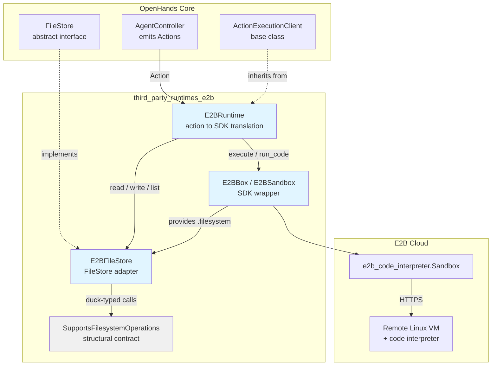
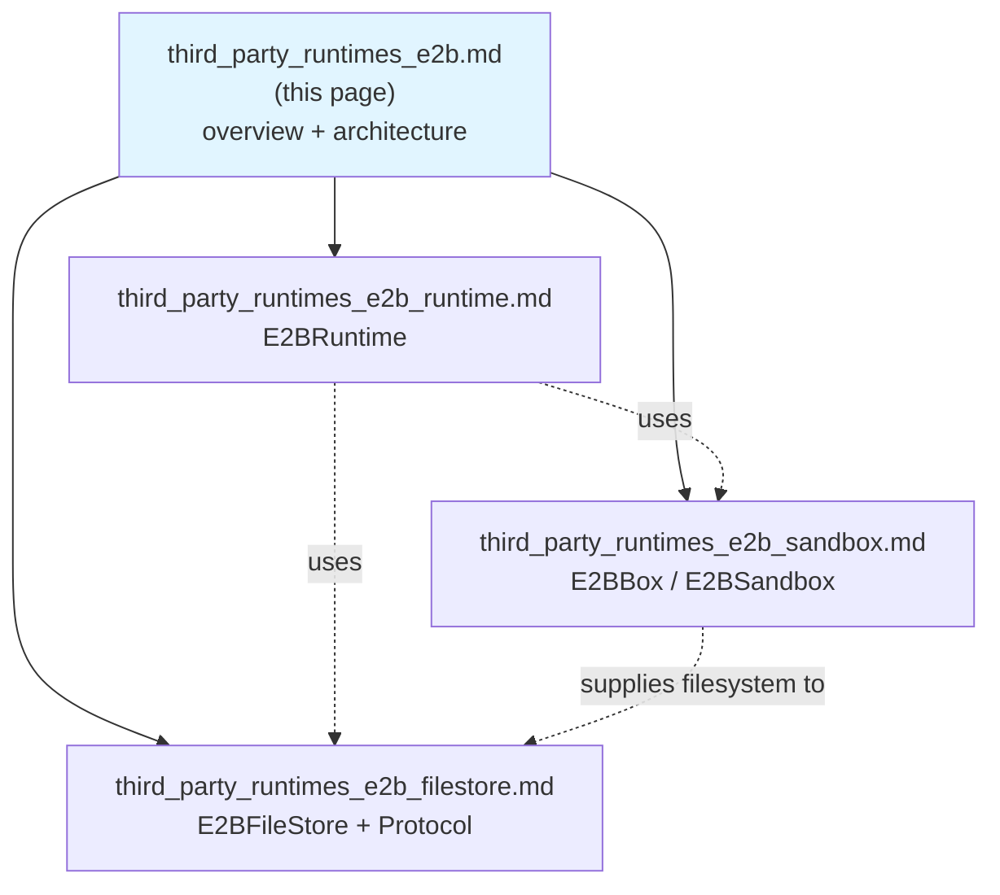
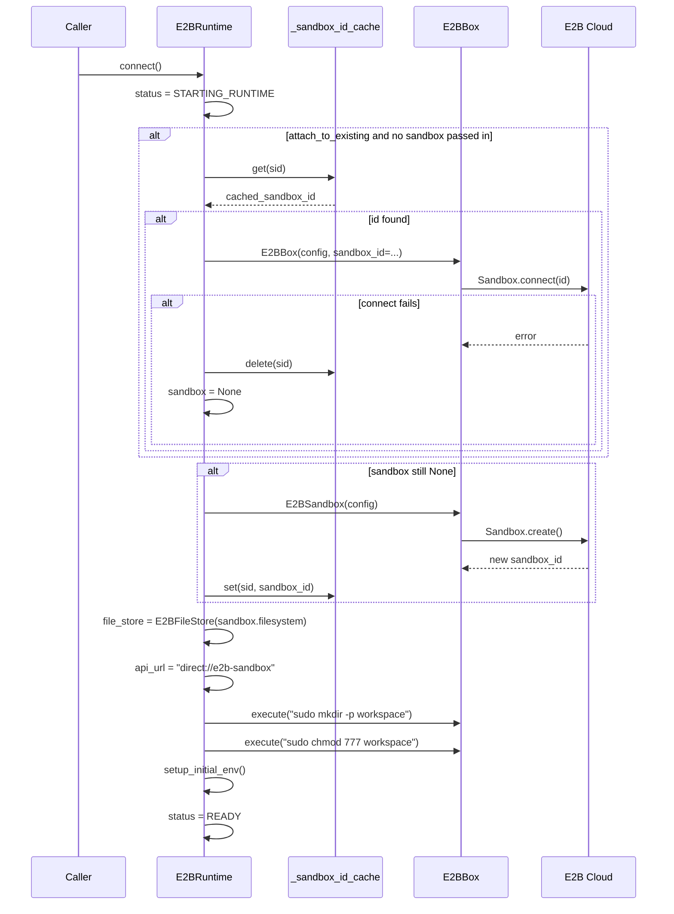
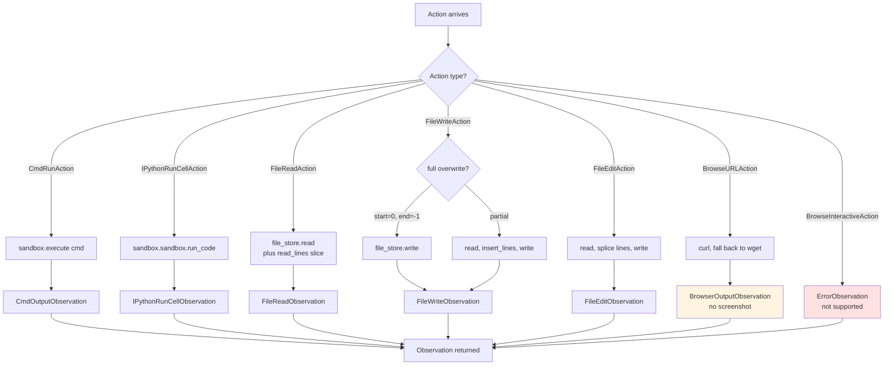
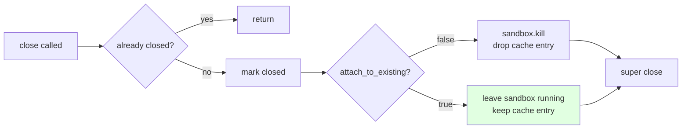
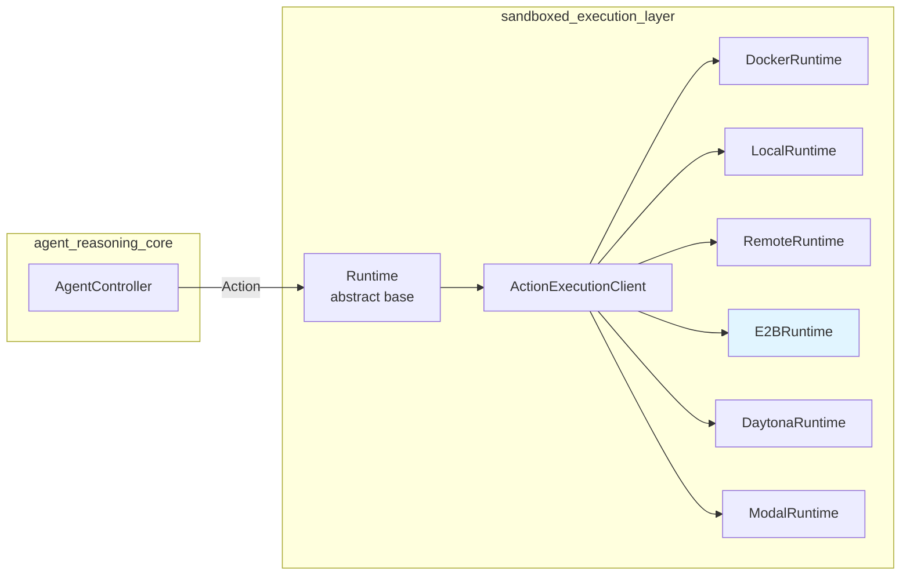

# third_party_runtimes_e2b

## 1. What This Module Is

The `third_party_runtimes_e2b` module lets OpenHands run agent work inside an **E2B cloud sandbox**.

E2B is a hosted service that gives you a throwaway Linux machine in the cloud with a code interpreter built in. This module wraps that service so the rest of OpenHands can treat it like any other runtime: the agent emits an `Action`, the module runs it in the E2B sandbox, and an `Observation` comes back.

The module lives in `third_party/`, outside the core `openhands/` tree. That placement is deliberate — E2B support is optional. It needs the `e2b_code_interpreter` package and an `E2B_API_KEY`, so it is kept out of the default install path. See [third_party_runtimes](third_party_runtimes.md) for the other optional providers that sit alongside it.

### What Makes E2B Different

Most OpenHands runtimes work by starting a small HTTP server (the **action execution server**) inside the sandbox and posting actions to it over the network. See [runtime_implementations_action_execution_server](runtime_implementations_action_execution_server.md) for how that normally works.

**E2B does not do that.** There is no server inside the E2B sandbox. Instead, `E2BRuntime` overrides every action handler and calls the E2B SDK directly. The inherited HTTP machinery from `ActionExecutionClient` is bypassed entirely.

You can see this in one line of code:

```python
# E2B doesn't use action execution server - set dummy URL
self.api_url = "direct://e2b-sandbox"
```

That URL is a placeholder. Nothing ever connects to it. It exists only so the `action_execution_server_url` property from the parent class has something to return.

This single design choice explains almost every quirk in the module — why interactive browsing is missing, why VSCode returns an empty token, why MCP config is a bare dict, and why `check_if_alive()` does nothing.

---

## 2. The Three Files

The module is small — three files, each with one clear job.

| File | Component | Job |
| --- | --- | --- |
| `e2b_runtime.py` | `E2BRuntime` | Translates OpenHands `Action` objects into E2B SDK calls |
| `sandbox.py` | `E2BBox` (alias `E2BSandbox`) | Thin wrapper over the E2B SDK: create, connect, run commands, upload files, kill |
| `filestore.py` | `E2BFileStore`, `SupportsFilesystemOperations` | Adapts E2B's file API to the OpenHands `FileStore` interface |

They stack in a straight line. Each layer only knows about the one below it.



---

## 3. Sub-Module Documentation

Each layer has its own detailed page.

### 3.1 [third_party_runtimes_e2b_runtime](third_party_runtimes_e2b_runtime.md)

The `E2BRuntime` class — the entry point and the biggest piece.

Covers the full lifecycle (`connect` → act → `close`), the class-level `_sandbox_id_cache` that allows reconnecting to a live sandbox across sessions, every action handler (`run`, `run_ipython`, `read`, `write`, `edit`, `browse`), and the stubbed-out capabilities (interactive browsing, VSCode, MCP). Also explains the error-handling style: nearly every handler catches broadly and returns an `ErrorObservation` rather than raising.

### 3.2 [third_party_runtimes_e2b_sandbox](third_party_runtimes_e2b_sandbox.md)

The `E2BBox` class — the SDK boundary.

Covers reading `E2B_API_KEY` and `E2B_DOMAIN` from the environment, the create-vs-connect branch, the `filesystem` property that papers over an SDK rename (`files` vs `filesystem`), the tar-based `copy_to` upload path, and the `kill`-vs-`close` shutdown fallback. This is where all the E2B SDK version compatibility work lives.

### 3.3 [third_party_runtimes_e2b_filestore](third_party_runtimes_e2b_filestore.md)

The `E2BFileStore` adapter and the `SupportsFilesystemOperations` protocol.

The smallest piece — a four-method pass-through. Covers why the `Protocol` exists (structural typing, so no import of E2B types is needed) and how this plugs into the wider [storage_backends](storage_backends.md) family.

### 3.4 Document Map

Which page to open, by source file and by question:

| Source file | Component | Documentation page |
| --- | --- | --- |
| `third_party/runtime/impl/e2b/e2b_runtime.py` | `E2BRuntime` | [third_party_runtimes_e2b_runtime.md](third_party_runtimes_e2b_runtime.md) |
| `third_party/runtime/impl/e2b/sandbox.py` | `E2BBox`, `E2BSandbox` | [third_party_runtimes_e2b_sandbox.md](third_party_runtimes_e2b_sandbox.md) |
| `third_party/runtime/impl/e2b/filestore.py` | `E2BFileStore`, `SupportsFilesystemOperations` | [third_party_runtimes_e2b_filestore.md](third_party_runtimes_e2b_filestore.md) |

| If you want to know... | Go to |
| --- | --- |
| How an `Action` becomes an `Observation` | [third_party_runtimes_e2b_runtime](third_party_runtimes_e2b_runtime.md) |
| How sandbox reuse and the ID cache work | [third_party_runtimes_e2b_runtime](third_party_runtimes_e2b_runtime.md) |
| Which E2B SDK calls are made, and version quirks | [third_party_runtimes_e2b_sandbox](third_party_runtimes_e2b_sandbox.md) |
| How `E2B_API_KEY` / `E2B_DOMAIN` are read | [third_party_runtimes_e2b_sandbox](third_party_runtimes_e2b_sandbox.md) |
| How host files get uploaded (tar path) | [third_party_runtimes_e2b_sandbox](third_party_runtimes_e2b_sandbox.md) |
| How file reads and writes reach E2B | [third_party_runtimes_e2b_filestore](third_party_runtimes_e2b_filestore.md) |



---

## 4. How A Request Flows Through

### 4.1 Startup

`connect()` is the only async setup step. It decides whether to reuse a sandbox or make a new one.



If anything in that block throws, the status is set to `FAILED` and the exception is re-raised. Note the workspace-directory step is *not* fatal — a failure there only logs a warning.

### 4.2 Running An Action

Once connected, each action type takes its own short path. No HTTP hop, no serialization.



Two things stand out:

- **Browsing is degraded.** `browse()` shells out to `curl` (then `wget`) and returns raw HTML with `screenshot=None`. There is no real browser. Agents that need a live DOM — see [browser_environment](browser_environment.md) and [agents_browsing](agents_browsing.md) — will not work well here.
- **File edits are line-index based.** `edit()` splices lines directly; it does not use the LLM-based edit path that other runtimes support.

### 4.3 Shutdown

`close()` behaves differently depending on `attach_to_existing`:



This is what makes sandbox reuse possible: a session that attached to an existing sandbox will not tear it down on exit.

---

## 5. Where It Sits In The System

`E2BRuntime` is one of several interchangeable runtime backends. The agent loop does not know or care which one is active.



Related documentation:

| Topic | Page |
| --- | --- |
| Sibling third-party runtimes (Daytona, Modal, Runloop) | [third_party_runtimes_managed_sandboxes](third_party_runtimes_managed_sandboxes.md) |
| Built-in runtimes (Docker, Local, CLI) | [runtime_implementations](runtime_implementations.md) |
| The HTTP server E2B skips | [runtime_implementations_action_execution_server](runtime_implementations_action_execution_server.md) |
| `FileStore` interface and other backends | [storage_backends](storage_backends.md) |
| Action and Observation event types | [event_system](event_system.md) |
| `SandboxConfig`, `OpenHandsConfig` | [core_configuration](core_configuration.md) |
| Who calls `connect()` / `close()` | [server_sessions](server_sessions.md) |
| The controller that drives the loop | [agent_controller](agent_controller.md) |
| Plugins E2B does *not* install | [runtime_plugins](runtime_plugins.md) |

---

## 6. Capability Matrix

A quick reference for what works and what does not.

| Capability | Status | Notes |
| --- | --- | --- |
| Shell commands | Full | Via `sandbox.commands.run()` |
| IPython / notebook cells | Full | Native E2B code interpreter; text, HTML, and PNG results |
| File read / write / edit | Full | Through `E2BFileStore` |
| Upload host files to sandbox | Full | Tar archive plus remote extract |
| Download from sandbox | Inherited | Uses parent's HTTP path — will not work without a server |
| Simple URL fetch | Degraded | `curl`/`wget` only, no screenshot, no JavaScript |
| Interactive browsing | Not supported | Always returns `ErrorObservation` |
| VSCode | Not supported | `get_vscode_token()` returns `""` |
| MCP servers | Minimal | Returns a plain dict, not a real `MCPConfig` |
| Health check | No-op | `check_if_alive()` only checks the local handle is set |
| `workspace_base` mount | Not supported | Logs a warning; E2B has its own filesystem |
| Runtime plugins (Jupyter, AgentSkills) | Not installed | No action execution server to host them |

---

## 7. Setup Requirements

Two environment variables control the module:

| Variable | Required | Purpose |
| --- | --- | --- |
| `E2B_API_KEY` | Yes | Auth for the E2B API. `E2BBox.__init__` raises `ValueError` without it. |
| `E2B_DOMAIN` | No | Custom E2B host. Sets `E2B_API_URL` to `https://<domain>`. |

The `setup()` and `teardown()` class methods are empty stubs — E2B needs no image build step, unlike the Docker path in [runtime_image_builders](runtime_image_builders.md).

---

## 8. Known Rough Edges

Points worth knowing before relying on this runtime:

1. **`E2BSandbox` is just an alias for `E2BBox`.** The `isinstance(self.sandbox, (E2BSandbox, E2BBox))` check in `connect()` is therefore a single check written twice.
2. **The sandbox ID cache is per-process and unbounded.** `_sandbox_id_cache` is a plain class attribute keyed by `sid`. It does not survive a restart, is not shared between workers, and entries are only removed on a non-attached `close()` or a failed reconnect.
3. **`edit()` has a contradictory existence check.** It calls `self.file_store.list(action.path)` — passing a *file* path to a directory-listing call — then tests whether the path is in the result.
4. **`write()` line joins may lose newlines.** The partial-write branch joins with `""` after splitting on `"\n"`, which differs from the `"\n"` join used in `edit()`.
5. **Broad exception catching.** Almost every method wraps its body in `try/except Exception`. This keeps the agent loop alive but can hide real failures — check the logs, not just the observations.
6. **`copy_to` writes a temp tar next to the source.** `_archive()` places the archive in the source's parent directory, which requires that directory to be writable.
