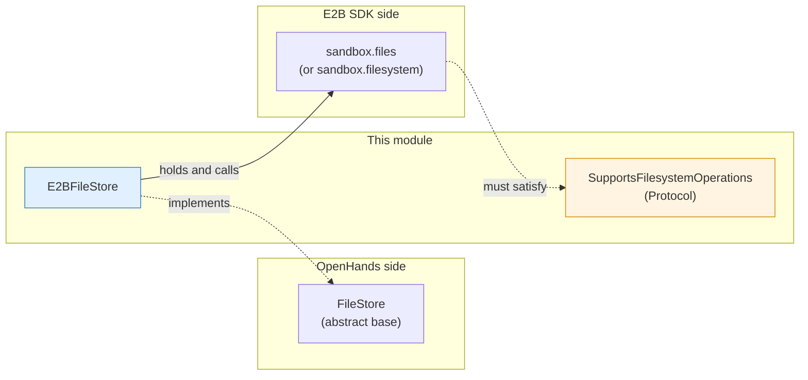
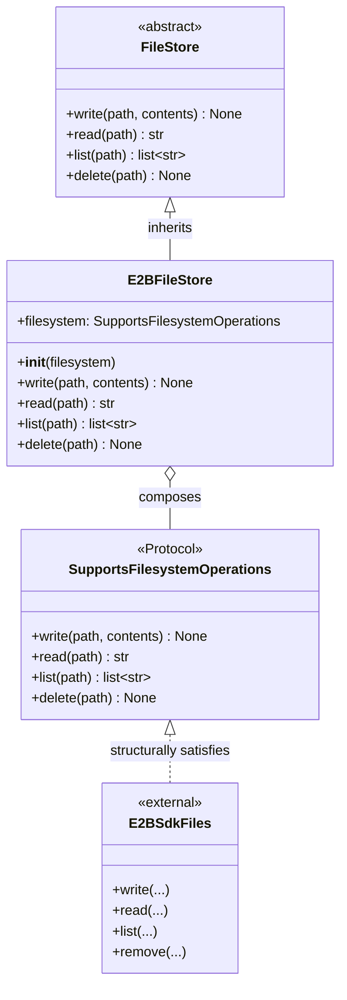
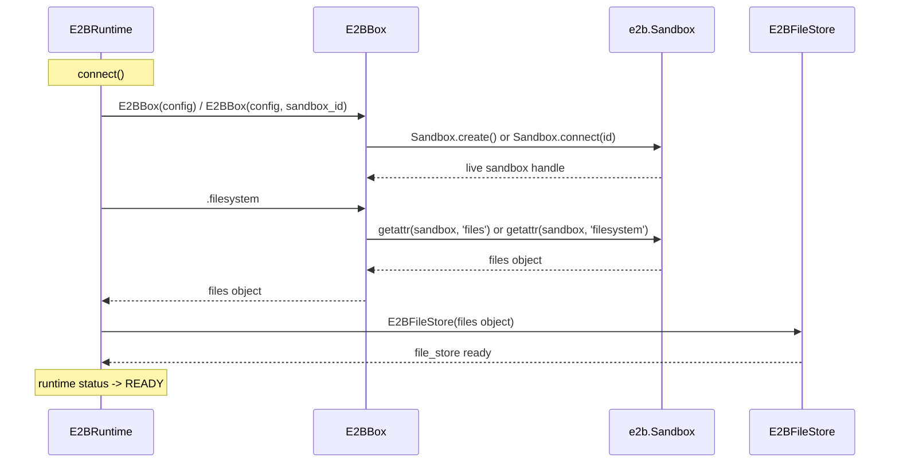
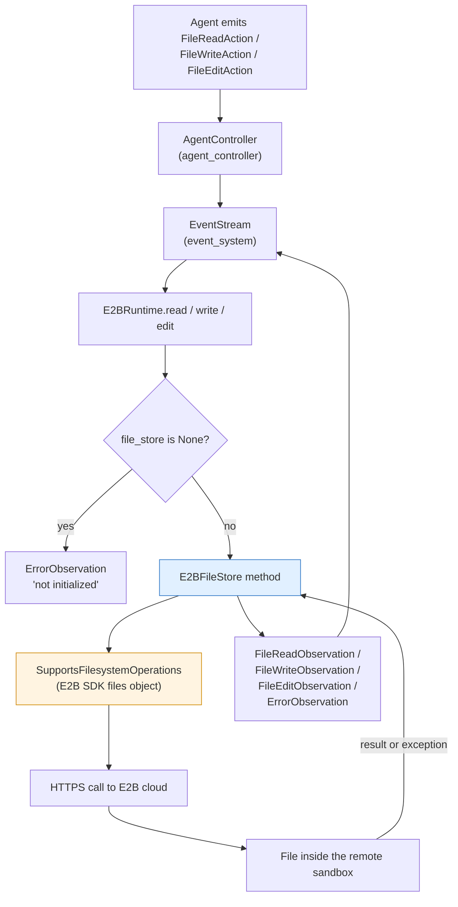
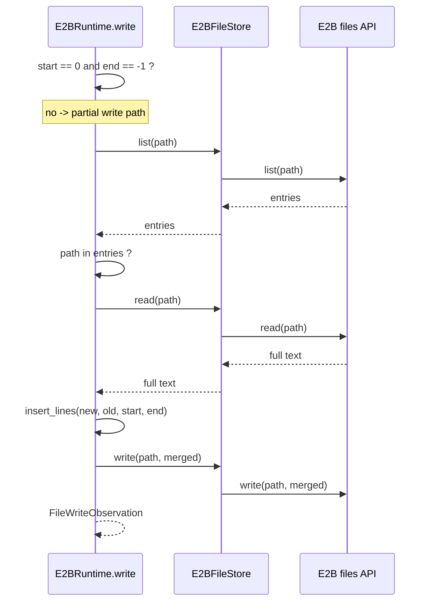
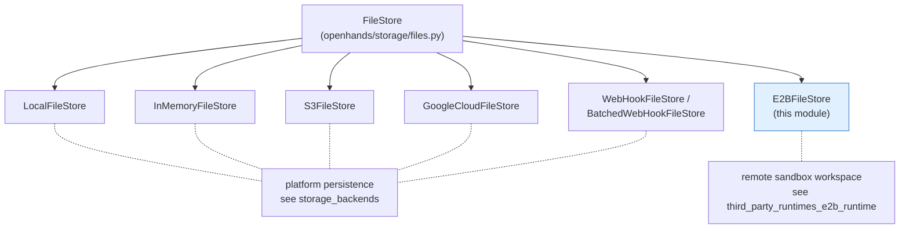

# E2B File Store (`third_party_runtimes_e2b_filestore`)

## Introduction

This module is the thin file-access layer for the E2B runtime. It has one job: take the file operations that OpenHands needs (write, read, list, delete) and pass them straight through to the file system that lives inside a remote E2B sandbox.

It contains only two things:

| Component | File | What it is |
|---|---|---|
| `SupportsFilesystemOperations` | `third_party/runtime/impl/e2b/filestore.py` | A `typing.Protocol` that describes the four methods the E2B SDK file-system object must have |
| `E2BFileStore` | `third_party/runtime/impl/e2b/filestore.py` | A `FileStore` subclass that forwards each call to that object |

The whole file is about 25 lines. That small size is the point: all the real work happens in the E2B SDK, and the module only makes the SDK look like a normal OpenHands `FileStore`. This is the classic **Adapter** pattern.

Related docs:

- [E2B runtime](third_party_runtimes_e2b_runtime.md) — the runtime that creates and owns this file store
- [E2B sandbox box](third_party_runtimes_e2b_sandbox.md) — the `E2BBox` wrapper that exposes the `filesystem` object
- [Storage backends](storage_backends.md) — the other `FileStore` implementations (local, memory, S3, GCS, web hook)
- [Third-party runtimes](third_party_runtimes.md) and [Sandboxed execution layer](sandboxed_execution_layer.md) — the wider context

---

## 1. Why this module exists

Most OpenHands runtimes talk to files through an action execution server that runs *inside* the sandbox. The E2B runtime does not do that. E2B already gives you a file-system API over the network, so the runtime uses it directly.

But the rest of OpenHands does not know about E2B. It knows about `FileStore` — the small abstract base class in `openhands/storage/files.py` with four abstract methods. So something has to sit in the middle.



Two contracts meet in one small class:

1. **Upward contract** — `E2BFileStore` *is a* `FileStore`, so any OpenHands code that expects a file store can use it.
2. **Downward contract** — `SupportsFilesystemOperations` says what the injected object must be able to do. Because it is a `Protocol`, the E2B SDK never has to import or inherit anything from OpenHands. It just has to have matching methods (structural typing, checked by the type checker, not at run time).

---

## 2. Component structure



### `SupportsFilesystemOperations`

A `Protocol` with four method signatures and no bodies (`...`). It is a *type-level* description only.

| Method | Signature | Meaning |
|---|---|---|
| `write` | `(path: str, contents: str \| bytes) -> None` | Create or overwrite a file. Accepts text or raw bytes. |
| `read` | `(path: str) -> str` | Return the whole file as text. |
| `list` | `(path: str) -> list[str]` | Return the entries under a path. |
| `delete` | `(path: str) -> None` | Remove a file. |

Using a `Protocol` instead of a concrete type gives three practical wins:

- **No hard import of the E2B SDK.** The module imports nothing from `e2b`, so it can be type-checked and unit-tested without the SDK installed or an API key set.
- **Easy fakes in tests.** Any object (a small stub class, a `MagicMock`) with those four methods type-checks fine.
- **Room for SDK drift.** `E2BBox.filesystem` returns `sandbox.files` on E2B v2 and falls back to `sandbox.filesystem` on older SDKs. Both are accepted as long as the method names line up.

### `E2BFileStore`

Holds one attribute, `self.filesystem`, set in the constructor. Each of the four public methods is a single delegating call — no path rewriting, no caching, no retries, no error wrapping.

```python
class E2BFileStore(FileStore):
    def __init__(self, filesystem: SupportsFilesystemOperations) -> None:
        self.filesystem = filesystem

    def write(self, path: str, contents: str | bytes) -> None:
        self.filesystem.write(path, contents)
    # read / list / delete follow the same one-line pattern
```

Because there is no logic, there is nothing to go wrong here on its own — but it also means **every failure surfaces as whatever exception the E2B SDK raises**. Callers must handle that themselves (see §5).

---

## 3. How it is wired into the runtime

The file store is not created by this module. It is created by `E2BRuntime.connect()` in [the E2B runtime module](third_party_runtimes_e2b_runtime.md), right after the sandbox is up:

```python
self.file_store = E2BFileStore(self.sandbox.filesystem)
```

`self.sandbox` is an [`E2BBox`](third_party_runtimes_e2b_sandbox.md), whose `filesystem` property digs the right object out of the live E2B `Sandbox`.



Note the ordering rule: `self.file_store` starts as `None` and only becomes real inside `connect()`. That is why every file-related runtime method begins with a guard:

```python
if self.file_store is None:
    return ErrorObservation("E2B file store not initialized. Call connect() first.")
```

---

## 4. Data flow: from agent action to sandbox file

The file store is the last OpenHands-side hop before the network call. Here is the full path for the three file actions the runtime supports.



### Which runtime method uses which file-store call

| Runtime method | File-store calls used | Notes |
|---|---|---|
| `read(FileReadAction)` | `read` | Result is split into lines and trimmed with `read_lines(start, end)` |
| `write(FileWriteAction)` | `write`, and `list` + `read` + `write` for a partial write | Full overwrite when `start == 0 and end == -1`; otherwise splice the new lines in with `insert_lines` |
| `edit(FileEditAction)` | `list`, `read`, `write` | Read-modify-write; validates the line range before writing |
| `list_files(path)` | *none* | Uses a shell `find` through `sandbox.execute` instead, so it returns paths, not just names |

A worked example — a partial file write:



Two things stand out from this trace:

- **Read-modify-write is done on the OpenHands side.** There is no server-side patching, so a partial edit costs at least three network round trips.
- **No locking.** Two concurrent partial writes to the same path can lose each other's changes. In practice a single agent loop is sequential, so this rarely bites — but it is a real property of the design.

---

## 5. Design notes and limits

### What the pass-through deliberately does *not* do

| Not done here | Where it is handled instead |
|---|---|
| Path normalisation / sandbox-prefixing | Callers pass absolute sandbox paths; `E2BBox.copy_to` handles `_cwd` joining for uploads |
| Error translation | `E2BRuntime` wraps every call in `try/except` and returns `ErrorObservation` |
| Retries / timeouts | Left to the E2B SDK's own HTTP client |
| Directory creation | `E2BRuntime.connect()` shells out `sudo mkdir -p <workspace_dir>` |
| Recursive upload of local trees | `E2BBox.copy_to`, which tars the source and extracts it in the sandbox |

### Type-signature gaps worth knowing

These are places where the declared types are looser than reality, so they are easy to trip over:

- **`read` returns `str`, never `bytes`.** `write` accepts `str | bytes`, but there is no way to read binary content back through this interface. Binary data has to go through `E2BBox.copy_to` or a shell command.
- **`list` returns `list[str]`, but the shape is up to the SDK** — names or full paths, files or directories. `E2BRuntime.write` and `edit` both check `action.path in self.file_store.list(action.path)`, which assumes `list` on a *file* path returns something containing that same path string. That assumption depends on SDK behaviour and is not enforced anywhere in this module.
- **`delete` is declared but unused by `E2BRuntime`.** It exists to satisfy the `FileStore` contract; no runtime code path calls it today.

### Comparison with the other file stores

`E2BFileStore` sits alongside the stores in [storage_backends](storage_backends.md), but its role is different: those back OpenHands' own persistence (conversation state, settings, event logs), while this one backs *agent workspace files* inside a sandbox.



Practical consequence: do **not** hand an `E2BFileStore` to code that expects a persistence store. It has no namespacing, no bucket prefix, and its contents disappear when the sandbox is killed.

---

## 6. Testing and extension

Because the dependency is a `Protocol`, testing needs no E2B account:

```python
class FakeFs:
    def __init__(self): self.files = {}
    def write(self, path, contents): self.files[path] = contents
    def read(self, path): return self.files[path]
    def list(self, path): return [p for p in self.files if p.startswith(path)]
    def delete(self, path): del self.files[path]

store = E2BFileStore(FakeFs())
store.write("/workspace/a.py", "print(1)")
assert store.read("/workspace/a.py") == "print(1)"
```

If you want to add behaviour (caching, retries, path prefixing, binary reads), the clean move is a new class that also satisfies `FileStore` and wraps `E2BFileStore` — keeping this module a pure, boring pass-through. Any other provider whose SDK exposes the same four methods can reuse `SupportsFilesystemOperations` in the same way; see the sibling sandboxes in [third_party_runtimes_managed_sandboxes](third_party_runtimes_managed_sandboxes.md).

---

## 7. Summary

- The module is a two-class adapter: `E2BFileStore` (concrete `FileStore`) plus `SupportsFilesystemOperations` (structural contract for the injected E2B object).
- It is created once, inside `E2BRuntime.connect()`, from `E2BBox.filesystem`.
- It carries no logic — no paths, no retries, no errors — which keeps it easy to reason about and to fake in tests, but pushes all error handling up into `E2BRuntime`.
- Its blast radius is small, but its assumptions (text-only reads, `list`-contains-path checks, no locking) are worth remembering when debugging E2B file behaviour.
