# E2B Runtime

## Introduction

`E2BRuntime` is the OpenHands runtime that runs agent work inside an [E2B](https://e2b.dev) cloud sandbox. E2B gives you a fresh Linux micro-VM on demand, with a shell, a Python code interpreter, and a filesystem — all reachable through the `e2b_code_interpreter` Python SDK.

This module holds one class: `E2BRuntime` (in `third_party/runtime/impl/e2b/e2b_runtime.py`). It is the *translation layer*. Its job is to take OpenHands `Action` objects, turn them into E2B SDK calls, and turn the results back into OpenHands `Observation` objects.

It leans on two sibling modules to do the low-level work:

| Module | What it gives `E2BRuntime` |
| --- | --- |
| [E2B Sandbox](third_party_runtimes_e2b_sandbox.md) | `E2BBox` / `E2BSandbox` — creating, connecting to, running commands in, and killing the sandbox |
| [E2B File Store](third_party_runtimes_e2b_filestore.md) | `E2BFileStore` — read / write / list / delete files inside the sandbox |

Both siblings, plus this runtime, are grouped under [E2B Runtime Family](third_party_runtimes_e2b.md) and the wider [Third-Party Runtimes](third_party_runtimes.md) tree.

### The one thing to understand first

Nearly every other OpenHands runtime works by starting an HTTP server *inside* the sandbox — the [Action Execution Server](runtime_implementations_action_execution_server.md) — and POSTing actions to it. `E2BRuntime` **does not do this.** It extends `ActionExecutionClient` for the class contract and constructor plumbing, but then overrides every action method to call the E2B SDK directly from the host process.

The giveaway is in `connect()`:

```python
# E2B doesn't use action execution server - set dummy URL
self.api_url = "direct://e2b-sandbox"
```

That URL is a placeholder, not a real endpoint. Keeping this in mind explains most of the design — and most of the caveats listed near the end of this document.

---

## Where this module sits

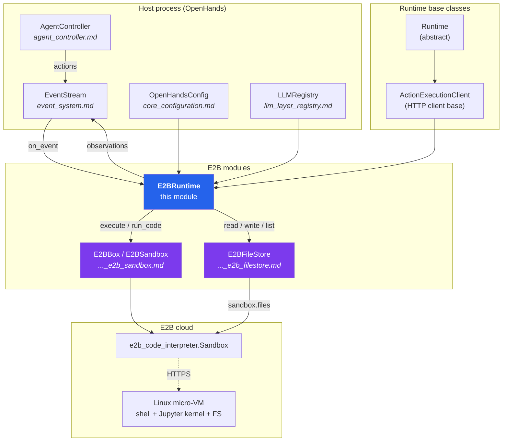

The runtime is a *subscriber* on the [EventStream](event_system.md). It never polls; `Runtime.on_event` hands it each `Action` the agent emits, and it pushes the resulting `Observation` back onto the stream. See [Agent Controller](agent_controller.md) for the loop that drives this.

---

## Class anatomy

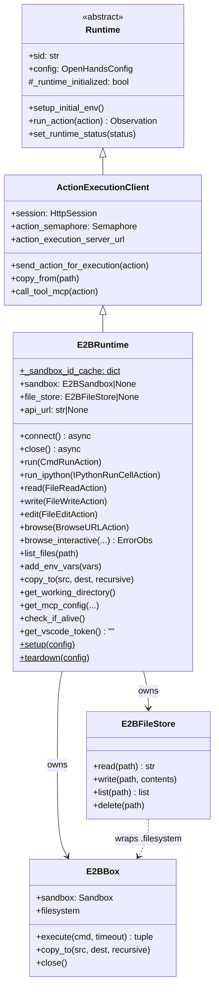

### Instance state

| Attribute | Set in | Meaning |
| --- | --- | --- |
| `_sandbox_id_cache` | class body | **Class-level** `dict[sid, sandbox_id]`. Lets a later `connect()` re-attach to a sandbox from an earlier session in the same process. |
| `sandbox` | `__init__` / `connect` | The `E2BBox` handle. May be injected by the caller (useful for tests). |
| `file_store` | `connect` | `E2BFileStore` wrapping `sandbox.filesystem`. `None` until `connect()` runs. |
| `api_url` | `connect` | Sentinel string `"direct://e2b-sandbox"`. Its only real job is to be non-`None` so `action_execution_server_url` stops raising. |
| `_action_server_port` | `__init__` | Set to `8000` but never read — vestigial. |
| `_runtime_initialized` | `connect` | Flips to `True` on success; read by the base `runtime_initialized` property. |

### Constructor notes

`__init__` warns and ignores `config.workspace_base`, because an E2B sandbox has its own isolated filesystem and there is nothing on the host to bind-mount into it. Everything else is forwarded straight to `ActionExecutionClient.__init__`, which builds the `HttpSession`, the action semaphore, and the base `Runtime` wiring (event-stream subscription, `GitHandler`, provider tokens, security analyzer).

---

## Lifecycle

### `connect()` — bring the sandbox up

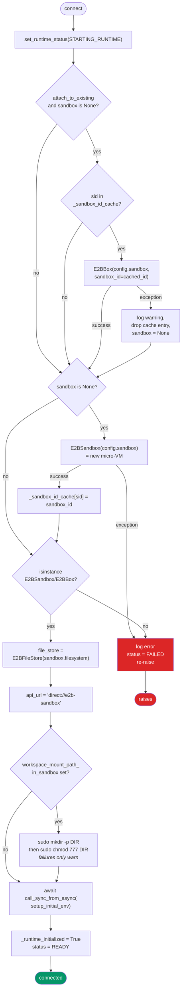

Three things worth calling out:

1. **Attach is best-effort.** If the cached sandbox is gone, the failure is downgraded to a warning, the stale entry is evicted, and a brand-new sandbox is created. The agent never sees the hiccup.
2. **Workspace setup is best-effort too.** A failed `mkdir` only logs a warning; `connect()` still reports `READY`. Later file operations against that path will then fail one at a time.
3. **`setup_initial_env()` is inherited** from `Runtime`. It short-circuits when `attach_to_existing` is `True`; otherwise it calls this class's `add_env_vars()` and then `_setup_git_config()` (which shells out via `run()`).

> Note: the status set on the failure path is written as `RuntimeStatus.FAILED`. The [`RuntimeStatus`](runtime_utils.md) enum defines `ERROR`, `STOPPED`, and friends — not `FAILED` — so this line raises `AttributeError` inside the `except` block rather than reporting a clean failure status. Worth fixing to `RuntimeStatus.ERROR`.

### `close()` — tear down (or don't)

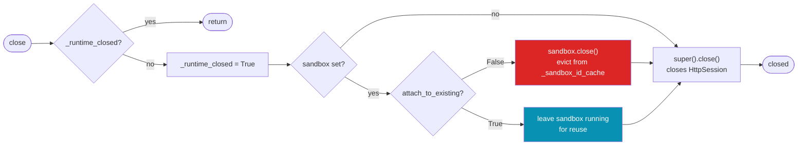

The `attach_to_existing` flag is the switch between *ephemeral* and *reusable* sandboxes. When it is `True`, `close()` deliberately leaves the E2B micro-VM alive so the next session can re-attach — which also means **you are still paying for it** until E2B's own idle timeout kills it.

`close()` is declared `async` here, but `ActionExecutionClient.close()` is synchronous. The code handles this by awaiting the parent's return value only when it is not `None`:

```python
parent_close = super().close()
if parent_close is not None:
    await parent_close
```

Note that the base `Runtime.__init__` registers `close` with `atexit`. Since this override is a coroutine function, the `atexit` hook creates an un-awaited coroutine at interpreter shutdown rather than actually closing anything — so rely on the conversation manager calling `close()`, not on process exit.

---

## Action dispatch

`Runtime.run_action()` dispatches by looking up `getattr(self, action.action)`. So the method names below *are* the routing table.

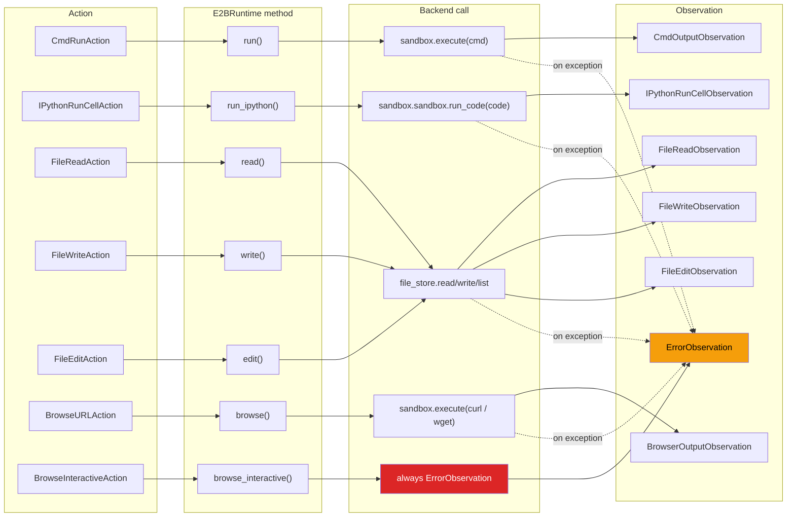

**Uniform error policy.** Every handler follows the same shape:

```python
if self.sandbox is None:          # or self.file_store is None
    return ErrorObservation("E2B sandbox not initialized")
try:
    ...
except Exception as e:
    return ErrorObservation(f"Failed to ...: {e}")
```

Nothing propagates upward. The agent always gets a readable observation and can decide what to do next, instead of the whole conversation dying on a transient sandbox error. See [Event System](event_system.md) for how observations flow back.

### Command execution — `run()`

Resolves the timeout as `action.timeout or config.sandbox.timeout`, then calls `E2BBox.execute()`, which returns a `(exit_code, output)` tuple with stdout and stderr concatenated. That becomes a `CmdOutputObservation`.

Because `E2BBox.execute()` calls `sandbox.commands.run(cmd)` fresh each time, **each command runs in its own shell**. There is no persistent bash session, so `cd`, `export`, and shell functions do not carry over between actions. This is the biggest behavioural difference from runtimes built on the stateful [`BashSession`](runtime_utils.md).

### Notebook execution — `run_ipython()`

Reaches past the wrapper (`self.sandbox.sandbox`) to call the E2B SDK's `run_code()` directly, using the sandbox's built-in Jupyter kernel — no [Jupyter plugin](runtime_plugins.md) needs installing.

Result extraction walks `result.results` and takes the first available representation per entry, in priority order:

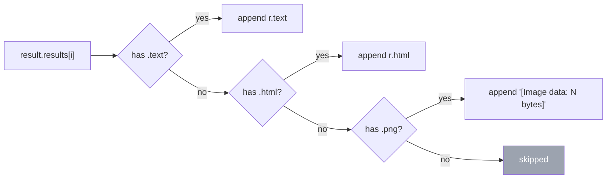

Images are reduced to a byte-count placeholder — the actual image data is discarded, so multimodal agents get no picture here. If `result.error` is set, the whole cell returns an `ErrorObservation` instead.

### File operations

All three file handlers go through `E2BFileStore`, never through the shell.

`read()` fetches the whole file, then trims to the requested window with the shared [`read_lines`](runtime_utils.md) helper.

`write()` has three branches:

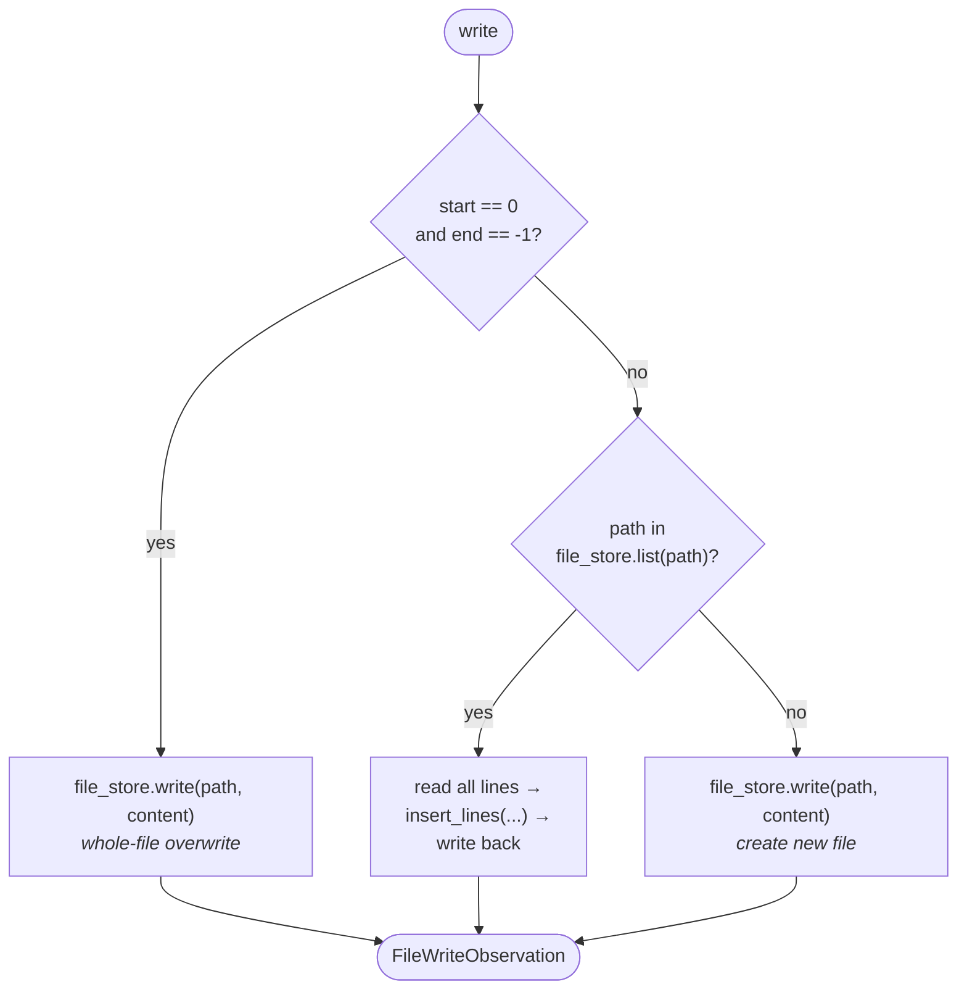

`edit()` replaces the half-open line range `[start, end)` with new content and returns a `FileEditObservation` carrying `old_content` so the UI can render a diff. It validates the range (`start < 0` or `end > len(lines)` is rejected) but **only handles the OSS/range-based edit path** — it does not check `action.impl_source`, so an LLM-based edit request is not routed to `llm_based_edit()` the way `ActionExecutionClient.send_action_for_execution()` would route it.

Both `write()` and `edit()` test existence with `action.path in self.file_store.list(action.path)` — listing the file's *own* path and looking for itself in the results. Whether that succeeds depends entirely on how the E2B SDK's `files.list()` behaves when handed a file rather than a directory; treat this check as fragile.

### Browsing — deliberately shallow

`browse()` does not use a real browser. It shells out to `curl -s -L`, and on non-zero exit retries with `wget -qO-`, then wraps the raw response body in a `BrowserOutputObservation` with `screenshot=None`.

`browse_interactive()` always returns an `ErrorObservation`. There is no [BrowserEnv](browser_environment.md) / BrowserGym instance in an E2B sandbox, so clicking, typing, and screenshots are simply unavailable. Agents that depend on interactive browsing — see [Browsing Agents](agents_browsing.md) — will not work on this runtime.

> The URL is interpolated straight into a shell string (`f"curl -s -L '{action.url}'"`) with only single quotes around it. A URL containing a single quote can break out of the quoting and inject shell commands. Since URLs can originate from model output or fetched page content, this is worth hardening with `shlex.quote`.

---

## Supporting operations

| Method | Behaviour |
| --- | --- |
| `list_files(path)` | Runs `find {path} -maxdepth 1 -type f -o -type d`, then strips the `path/` prefix from each result. Defaults to `workspace_mount_path_in_sandbox` or `/workspace`. Returns `[]` (never raises) on any problem. |
| `add_env_vars(vars)` | Records vars in `self._env_vars`, then runs one `export KEY='value'` per var, with `'` escaped as `'"'"'`. |
| `get_working_directory()` | Runs `pwd`; falls back to the configured workspace path or `/workspace`. |
| `copy_to(src, dest, recursive)` | Delegates to `E2BBox.copy_to`, which tars locally, uploads, and untars in the sandbox. Overrides the base class's HTTP upload. |
| `check_if_alive()` | Only asserts `sandbox is not None` — it does **not** ping the sandbox. Overrides the base `GET /alive`. |
| `get_vscode_token()` | Returns `""`; E2B has no [VSCode plugin](runtime_plugins.md) support. |
| `get_mcp_config(...)` | Returns a plain `dict` with just `stdio_servers` — effectively disabling MCP. |
| `setup()` / `teardown()` | Class methods that only log. Unlike Docker, there is no image to build; provisioning is E2B's job. See [Runtime Image Builders](runtime_image_builders.md) for the contrast. |

### Environment variables: an important caveat

`add_env_vars()` issues `export KEY=value` as its own `sandbox.execute()` call. Because every `execute()` starts a new shell, that export dies with the shell and is **not** visible to the next command. Nothing is written to `~/.bashrc` either (the base `Runtime.add_env_vars` does write to `.bashrc`; this override does not).

The `self._env_vars` dict is populated but never consumed, so it does not compensate. Practically: git tokens and other secrets injected during `setup_initial_env()` are unlikely to be present when the agent later runs a command. This is the most likely source of confusing "why is my token missing" behaviour on this runtime.

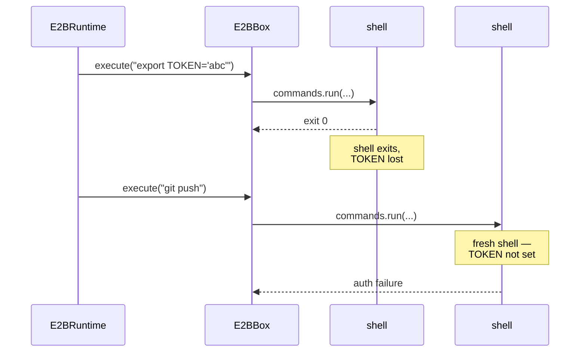

---

## End-to-end request flow

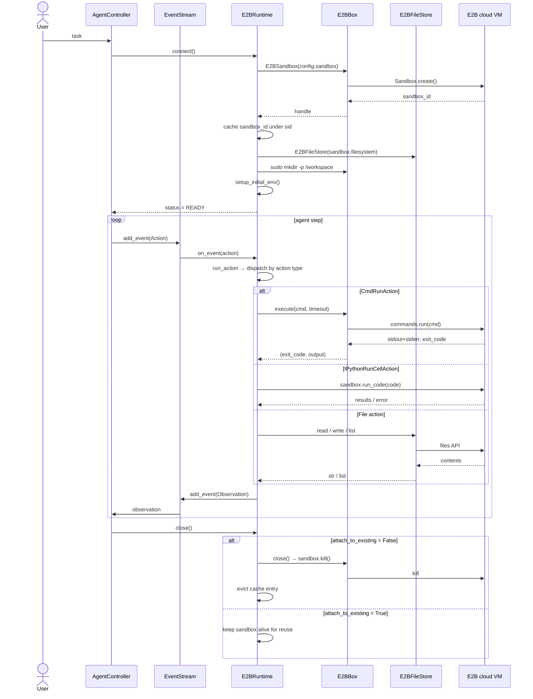

---

## Sandbox reuse across sessions

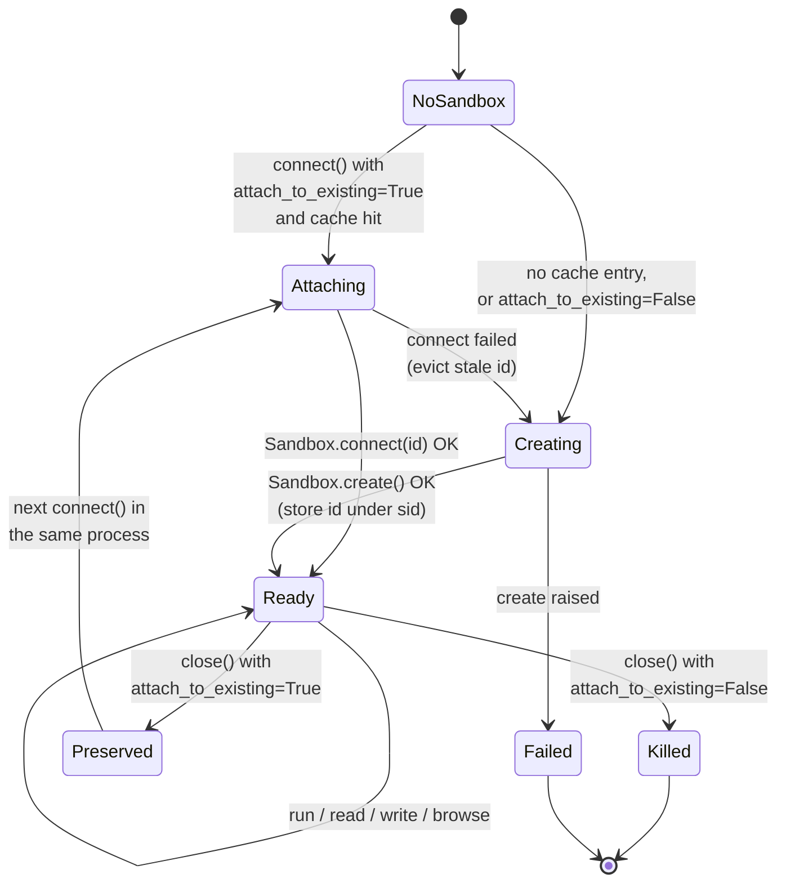

`_sandbox_id_cache` is a plain class attribute — an in-memory dict on the Python class. That has real consequences:

- **Process-local.** Restart the server and every mapping is gone. The E2B sandboxes may still be running and billable, but OpenHands can no longer find them. Durable reuse would need a real store — see [Storage Backends](storage_backends.md).
- **Shared across instances.** Every `E2BRuntime` in the process reads and writes the same dict, keyed by `sid`. Two conversations with the same `sid` would collide.
- **Unsynchronised.** Reads, writes, and `del` happen without a lock, so concurrent `connect()` / `close()` calls on the same `sid` can race.

---

## Capability comparison

How E2B stacks up against the first-party runtimes:

| Capability | E2B | [Docker](runtime_implementations_docker.md) | [Remote](runtime_implementations_orchestrated_remote_runtime.md) | [CLI](runtime_implementations_local_execution_cli_runtime.md) |
| --- | --- | --- | --- | --- |
| Action execution server | ✗ direct SDK | ✓ HTTP | ✓ HTTP | ✗ direct |
| Persistent shell session | ✗ per-command shell | ✓ `BashSession` | ✓ | ✓ |
| IPython / notebook | ✓ native E2B kernel | ✓ Jupyter plugin | ✓ | limited |
| Simple URL fetch | ✓ curl / wget | ✓ | ✓ | ✓ |
| Interactive browsing | ✗ | ✓ BrowserGym | ✓ | ✗ |
| VSCode | ✗ | ✓ | ✓ | ✗ |
| MCP tools | ✗ | ✓ | ✓ | partial |
| Custom runtime image | ✗ E2B-managed | ✓ | ✓ | n/a |
| `copy_from` (download) | ✗ not implemented | ✓ | ✓ | ✓ |
| Workspace bind-mount | ✗ isolated FS | ✓ | ✗ | ✓ host FS |

---

## Known constraints and caveats

Collected here so maintainers do not have to rediscover them. Items marked **bug** look like genuine defects rather than deliberate trade-offs.

### Inherited HTTP methods that cannot work

`E2BRuntime` overrides most action methods but not all of the base class's HTTP-backed helpers. The ones left inherited still point at `action_execution_server_url`, which is the sentinel `"direct://e2b-sandbox"`:

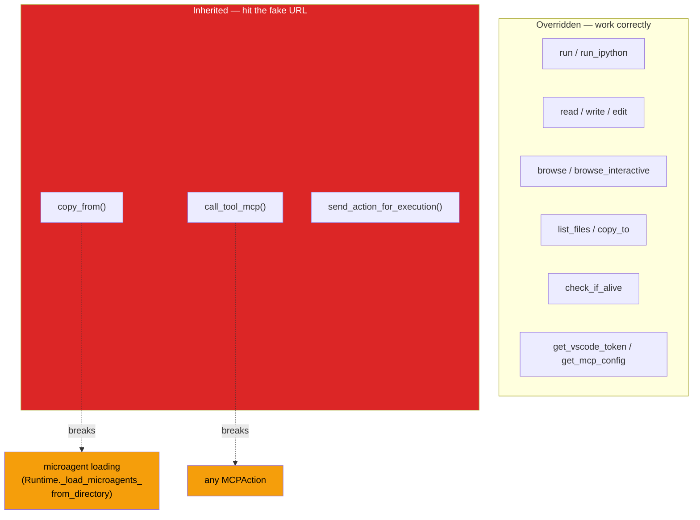

- **bug — `copy_from()` is not overridden.** The inherited version streams `GET {url}/download_files`. Against `direct://e2b-sandbox` this fails, which in turn breaks `get_microagents_from_selected_repo()`, since [microagent](microagents.md) loading zips the microagents directory out of the sandbox. Repo- and org-level microagents therefore will not load on E2B.
- **bug — `call_tool_mcp()` is not overridden.** It calls `get_mcp_config()` and expects an `MCPConfig`, but this class returns a plain `dict`, so attribute access on the result fails. Any `MCPAction` errors out.

### Type-contract deviations

- **`get_mcp_config()` returns `dict`, not `MCPConfig`.** The abstract signature on `Runtime` promises `MCPConfig`. Callers that touch `.sse_servers` / `.stdio_servers` will raise.
- **`close()` is `async`, the base is sync.** Handled defensively for the `super()` call, but it makes the inherited `atexit` registration a no-op (see Lifecycle above).

### Behavioural gaps

- **bug — `RuntimeStatus.FAILED` does not exist.** The `except` branch of `connect()` raises `AttributeError` instead of setting an error status. Should be `RuntimeStatus.ERROR`.
- **`timeout` is accepted but ignored.** `run()` computes a timeout and passes it to `E2BBox.execute()`, which does not forward it to `sandbox.commands.run()`. Long commands are bounded only by E2B's own defaults.
- **No shell state between actions.** `cd`, `export`, and shell functions do not persist (see above).
- **Environment variables do not stick** (see the dedicated section above).
- **No plugin support.** `plugins` is accepted and stored by the base class, but nothing installs [AgentSkills, Jupyter, or VSCode](runtime_plugins.md) in the sandbox. IPython works only because E2B ships its own kernel.
- **Images are dropped** from IPython results, replaced by a byte-count string.
- **Shell injection** risk in `browse()` and, more mildly, in the `mkdir`/`chmod`/`find` command construction, since paths come from config.
- **`E2BSandbox` is just an alias.** `sandbox.py` ends with `E2BSandbox = E2BBox`, so the `isinstance(self.sandbox, (E2BSandbox, E2BBox))` check tests the same class twice.

---

## Configuration

| Source | Key | Used for |
| --- | --- | --- |
| Env var | `E2B_API_KEY` | **Required.** `E2BBox.__init__` raises `ValueError` without it. |
| Env var | `E2B_DOMAIN` | Optional self-hosted E2B endpoint; sets `E2B_API_URL`. |
| [`SandboxConfig`](core_configuration.md) | `timeout` | Default command timeout (currently not enforced end-to-end). |
| `SandboxConfig` | `initialize_plugins` | Read by `E2BBox` but not acted on. |
| [`OpenHandsConfig`](core_configuration.md) | `workspace_mount_path_in_sandbox` | Directory created and `chmod 777`ed during `connect()`; default working dir. |
| `OpenHandsConfig` | `workspace_base` | **Ignored** — warns if set. |
| `OpenHandsConfig` | `git_user_name` / `git_user_email` | Applied by the inherited `_setup_git_config()`. |

Selecting this runtime happens through the usual `get_runtime_cls()` lookup described in [Sandboxed Execution Layer](sandboxed_execution_layer.md).

---

## Related documentation

- [E2B Sandbox](third_party_runtimes_e2b_sandbox.md) — `E2BBox`, command execution, tar-based upload
- [E2B File Store](third_party_runtimes_e2b_filestore.md) — `E2BFileStore`, `SupportsFilesystemOperations`
- [E2B Runtime Family](third_party_runtimes_e2b.md) — the three E2B modules together
- [Third-Party Runtimes](third_party_runtimes.md) — E2B alongside Daytona, Modal, Runloop
- [Managed Sandboxes](third_party_runtimes_managed_sandboxes.md) — the other hosted-sandbox providers
- [Sandboxed Execution Layer](sandboxed_execution_layer.md) — the runtime abstraction as a whole
- [Action Execution Server](runtime_implementations_action_execution_server.md) — the HTTP protocol E2B bypasses
- [Runtime Utils](runtime_utils.md) — `BashSession`, `GitHandler`, `read_lines` / `insert_lines`
- [Runtime Plugins](runtime_plugins.md) — AgentSkills, Jupyter, VSCode (unsupported here)
- [Event System](event_system.md) — actions, observations, and the `EventStream`
- [Agent Controller](agent_controller.md) — the loop that drives the runtime
- [Core Configuration](core_configuration.md) — `OpenHandsConfig`, `SandboxConfig`
