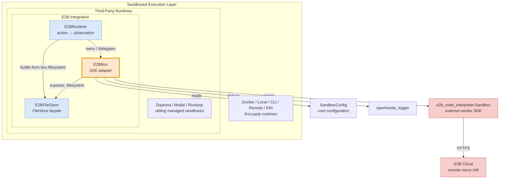
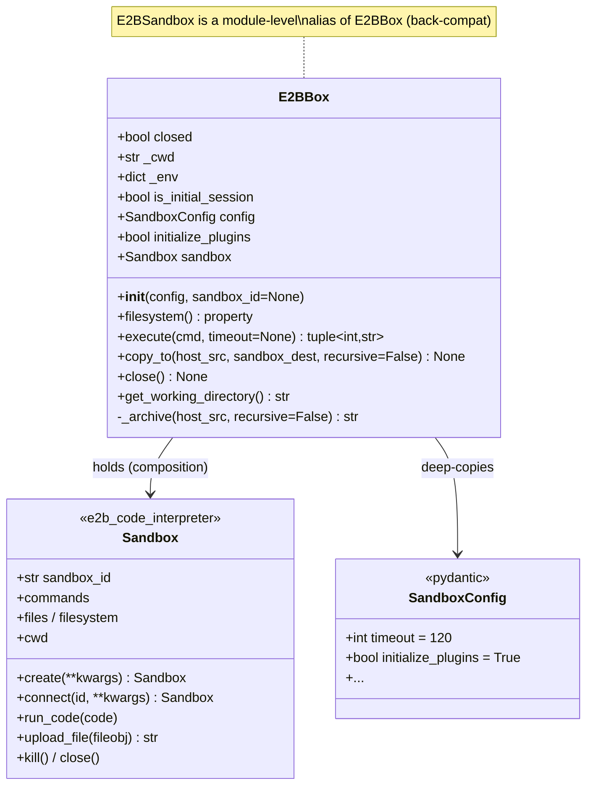
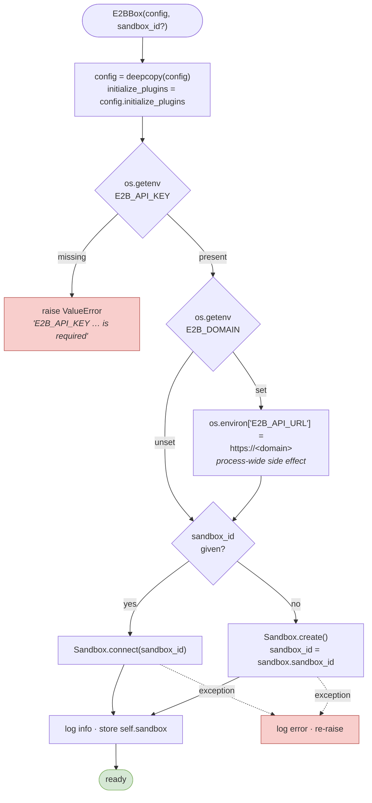
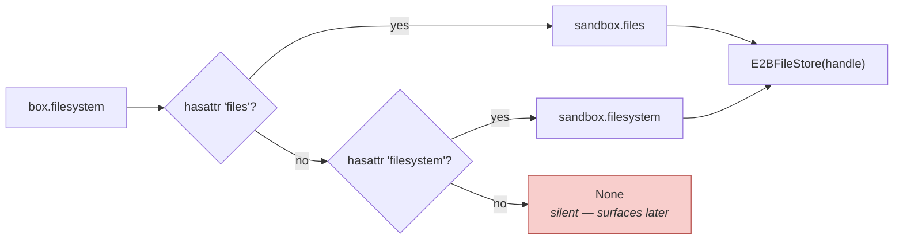
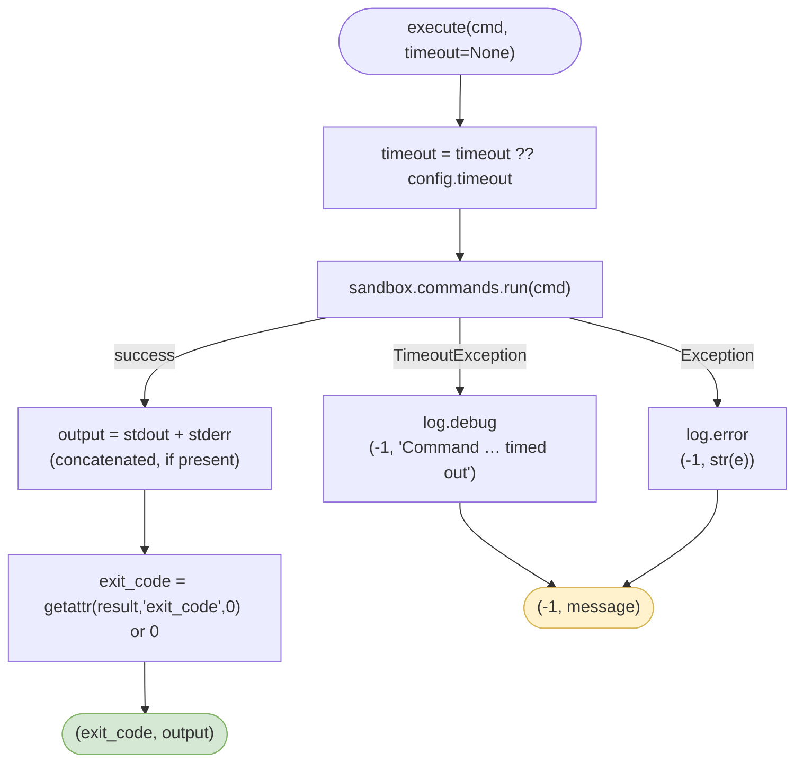
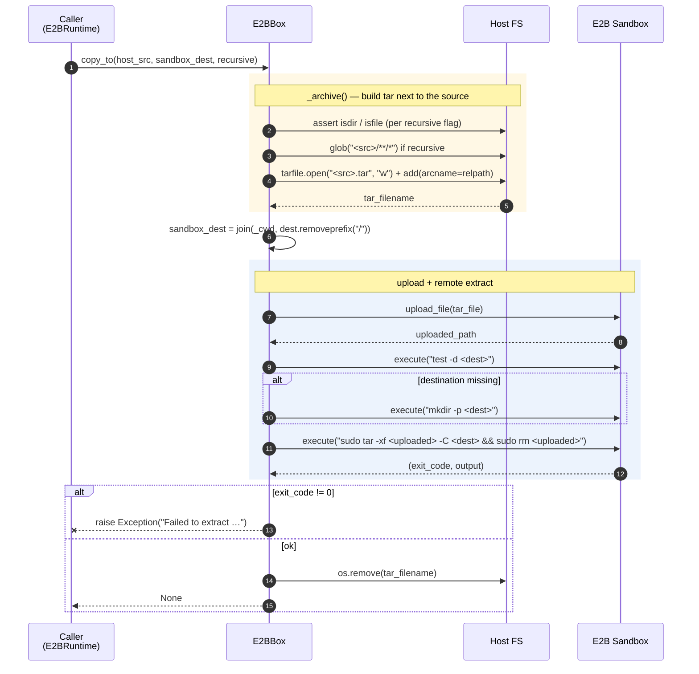
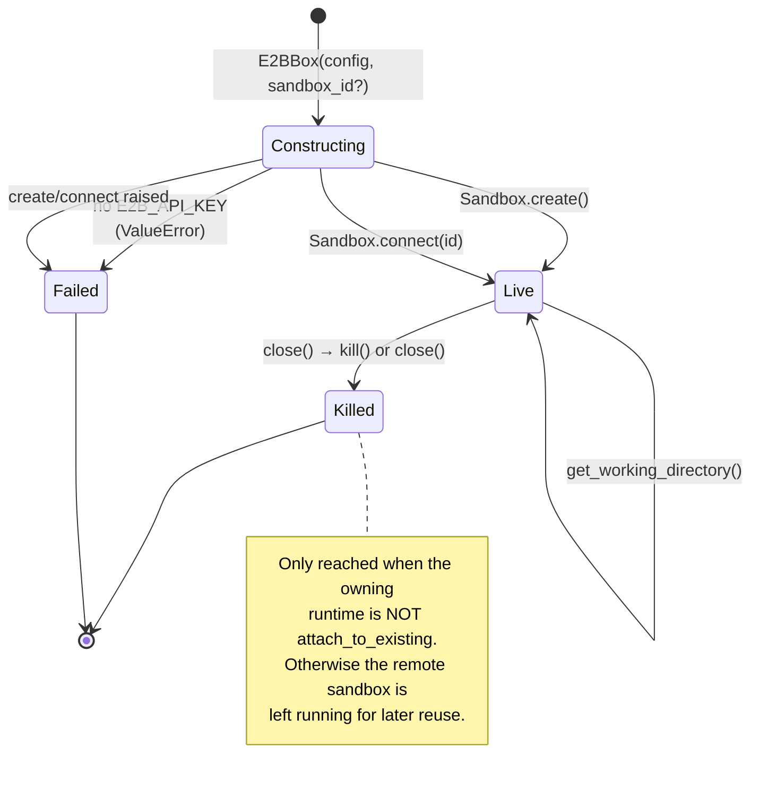
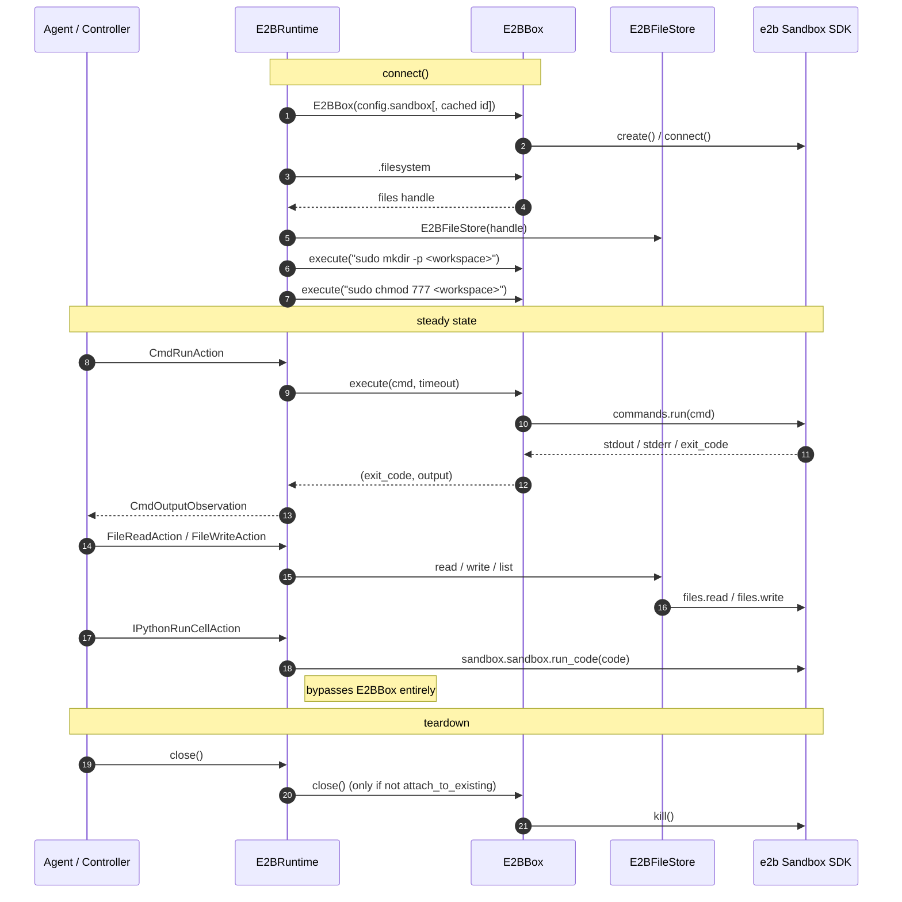
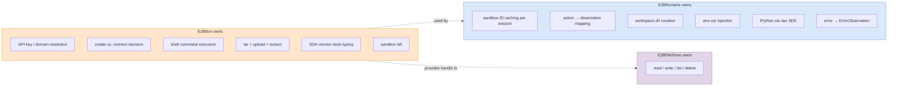

# E2B Sandbox (`E2BBox`)

## Introduction

`E2BBox` is the thin adapter that sits between OpenHands and the [E2B](https://e2b.dev) cloud sandbox SDK (`e2b_code_interpreter.Sandbox`). It is a single class in a single file — `third_party/runtime/impl/e2b/sandbox.py` — and its whole job is to turn the E2B vendor SDK into the small, boring shape that the rest of OpenHands expects: *run a command, copy a file in, hand me a filesystem handle, shut down*.

It is deliberately **not** a `Runtime`. It does not know about actions, observations, or the event stream. It knows about API keys, tar archives, and shell exit codes. The `Runtime`-level concerns live one level up in [`E2BRuntime`](third_party_runtimes_e2b_runtime.md), which owns an `E2BBox` and translates agent actions into calls on it.

Think of `E2BBox` as the *driver* and `E2BRuntime` as the *car*.

---

## Where this module sits

`E2BBox` is one of three pieces that make up the E2B integration (see [E2B integration overview](third_party_runtimes_e2b.md)):

| Piece | File | Role |
|---|---|---|
| [`E2BRuntime`](third_party_runtimes_e2b_runtime.md) | `e2b_runtime.py` | Runtime contract: actions → observations |
| **`E2BBox`** (this doc) | `sandbox.py` | Vendor SDK adapter: commands, uploads, lifecycle |
| [`E2BFileStore`](third_party_runtimes_e2b_filestore.md) | `filestore.py` | `FileStore` façade over the sandbox filesystem |



Related reading:

- [Sandboxed Execution Layer](sandboxed_execution_layer.md) — the whole execution tier
- [Third-Party Runtimes](third_party_runtimes.md) — how vendor runtimes plug in
- [Managed Sandboxes](third_party_runtimes_managed_sandboxes.md) — Daytona / Modal / Runloop, which solve the same problem differently
- [Core Configuration](core_configuration.md) — where `SandboxConfig` comes from
- [Logging](logging.md) — the `openhands_logger` used throughout

---

## Core purpose

`E2BBox` exists to absorb three kinds of messiness so nothing above it has to:

1. **Credential and endpoint wiring.** The E2B API key and optional custom domain come from environment variables, not from `SandboxConfig`. `E2BBox` reads them, validates them, and fails loudly if the key is missing.
2. **SDK version drift.** The E2B SDK renamed things between major versions (`filesystem` → `files`, `close()` → `kill()`). `E2BBox` uses duck-typing so both shapes work.
3. **Host → sandbox file transfer.** There is no shared volume with a cloud micro-VM. `E2BBox` tars locally, uploads a single blob, and untars remotely.

---

## Class structure



> **Note on the class attributes.** `closed`, `_cwd`, `_env`, and `is_initial_session` are declared at *class* level and never reassigned per-instance in `__init__`. `_cwd` and `is_initial_session` are read-only constants in practice, so this is harmless for them. `_env` is a **mutable dict shared by every `E2BBox` instance in the process** — if anything ever writes to it, the write leaks across sandboxes. `closed` is likewise never flipped by `close()`. Treat all four as "declared but effectively inert" today.

---

## Construction and connection

`__init__` does the credential handshake and either **creates** a fresh sandbox or **reconnects** to an existing one by ID. The `sandbox_id` branch is what makes session reuse possible — [`E2BRuntime`](third_party_runtimes_e2b_runtime.md) keeps a class-level `_sandbox_id_cache` keyed by session ID and passes the cached ID back in when `attach_to_existing` is set.



### Configuration inputs

| Input | Source | Required | Effect |
|---|---|---|---|
| `E2B_API_KEY` | environment | **yes** | Authenticates the SDK. Missing → `ValueError` at construction. |
| `E2B_DOMAIN` | environment | no | Sets `E2B_API_URL` to `https://<domain>` for self-hosted / regional E2B. |
| `config.timeout` | [`SandboxConfig`](core_configuration.md) | no (default `120`) | Default command timeout used by `execute`. |
| `config.initialize_plugins` | [`SandboxConfig`](core_configuration.md) | no (default `True`) | Stored on the instance; consumed by callers, not by `E2BBox` itself. |
| `sandbox_id` | constructor arg | no | Reconnect instead of create. |

> **Implementation detail worth knowing.** `create_kwargs` and `connect_kwargs` are built as empty dicts and never populated — the custom domain is applied by mutating `os.environ` instead of by passing an argument. That mutation is global to the Python process, so it affects every later E2B client in the same run, not just this box. The inline comment in the source flags this as version-dependent and possibly needing adjustment.

### Version-tolerant filesystem handle

```python
@property
def filesystem(self):
    return getattr(self.sandbox, 'files', None) or getattr(self.sandbox, 'filesystem', None)
```

The property prefers the newer `files` attribute and falls back to the older `filesystem`. If neither exists it returns `None` — silently. This handle is exactly what [`E2BFileStore`](third_party_runtimes_e2b_filestore.md) wraps, and it must satisfy that module's `SupportsFilesystemOperations` protocol (`write` / `read` / `list` / `delete`).



---

## Command execution

`execute` is the workhorse. Everything the runtime can't do through the filesystem — `mkdir`, `pwd`, `find`, `curl`, env-var exports — funnels through here as a shell string.



**Contract:** always returns a `(exit_code, output)` tuple. It never raises — failures are encoded as `exit_code == -1`. Callers therefore only need to check the code, which is why [`E2BRuntime.run`](third_party_runtimes_e2b_runtime.md) can wrap it in a single `CmdOutputObservation`.

Three behaviours to be aware of:

- **`timeout` is computed but never used.** The resolved value is not forwarded to `commands.run()`, so the SDK's own default governs. The `TimeoutException` handler still works — it just fires on the SDK's schedule, not on `config.timeout`. Callers that pass a per-action timeout (which `E2BRuntime.run` does) will not see it honoured.
- **stdout and stderr are merged** into one string with no separator or ordering guarantee. Interleaving is lost.
- **`exit_code` falls back to `0`.** The `or 0` also maps a genuine `0` and a missing attribute to the same result — fine here, but it means "no exit code reported" reads as success.

---

## Copying files into the sandbox

There is no shared mount with a remote micro-VM, so `copy_to` uses an archive round-trip. `_archive` is the private helper that builds the tarball on the **host**.



### `_archive` details

| `recursive` | Precondition | Members added |
|---|---|---|
| `True` | `host_src` must be a directory (`assert`) | Every `glob("<src>/**/*", recursive=True)` hit, `arcname` relative to the *parent* of `host_src` — so the directory name is preserved inside the tar |
| `False` | `host_src` must be a file (`assert`) | The single file, `arcname` = its basename |

In both cases the tar is written to `<dirname(host_src)>/<basename(host_src)>.tar` — **beside the source on the host**, not in a temp directory.

Things to watch out for in this path:

- **Destination rebasing.** `sandbox_dest` is always re-anchored under `_cwd` (`/home/user`). Passing `/workspace` yields `/home/user/workspace`, not `/workspace`. Absolute paths are *not* respected.
- **`sudo` is assumed** to be available and password-less in the sandbox image for both extract and cleanup.
- **The local tar leaks on failure.** `os.remove(tar_filename)` runs only on the success path; the raise on a non-zero extract skips it, leaving a stray `.tar` next to the source. There is no `try/finally`.
- **The tar path collides** if two copies of the same source run concurrently, and it needs write permission in the source's parent directory.
- **`assert` for validation** means these preconditions vanish under `python -O`.

---

## Lifecycle



`close()` is version-tolerant in the same style as `filesystem`:

```python
if hasattr(self.sandbox, 'kill'):   self.sandbox.kill()
elif hasattr(self.sandbox, 'close'): self.sandbox.close()
```

If the SDK object has neither method, `close()` is a **silent no-op** — the remote sandbox keeps running (and keeps billing). Note also that the class-level `closed` flag is never set to `True`, so it cannot be used to tell whether shutdown happened; `E2BRuntime` tracks that itself with its own `_runtime_closed`.

`get_working_directory()` returns `self.sandbox.cwd` — the *SDK's* notion of cwd, which is a different value from the class-level `_cwd` constant that `copy_to` anchors against. Newer SDK versions may not expose `.cwd` at all, in which case this raises `AttributeError` (unlike `filesystem`/`close`, there is no `getattr` guard here). `E2BRuntime` sidesteps the whole question by shelling out to `pwd` through `execute` instead.

---

## Interaction with the runtime above

This is the practical picture of who calls what. Note how the runtime reaches *through* the box to the raw SDK for IPython execution — `run_code` has no `E2BBox` wrapper.



### Division of responsibility



---

## Public surface reference

| Member | Signature | Returns | Raises |
|---|---|---|---|
| `__init__` | `(config: SandboxConfig, sandbox_id: str \| None = None)` | — | `ValueError` if no API key; re-raises SDK create/connect errors |
| `filesystem` | property | files handle, or `None` | — |
| `execute` | `(cmd: str, timeout: int \| None = None)` | `tuple[int, str]` | never — errors become `(-1, msg)` |
| `copy_to` | `(host_src: str, sandbox_dest: str, recursive: bool = False)` | `None` | `AssertionError` on bad source type; `Exception` on extract failure |
| `close` | `()` | `None` | — (no-op if SDK exposes neither `kill` nor `close`) |
| `get_working_directory` | `()` | `str` | `AttributeError` if SDK lacks `.cwd` |
| `_archive` | `(host_src: str, recursive: bool = False)` | tar path `str` | `AssertionError` on precondition |

### `E2BSandbox` alias

```python
E2BSandbox = E2BBox
```

A module-level alias kept for backward compatibility. Both names refer to the same class, which is why [`E2BRuntime`](third_party_runtimes_e2b_runtime.md) can write `isinstance(self.sandbox, (E2BSandbox, E2BBox))` — a check that is always redundant but harmless.

---

## How this compares to other sandbox adapters

`E2BBox` is unusually thin for a sandbox integration, because E2B's own SDK already provides the process and filesystem primitives.

| Aspect | `E2BBox` | First-party runtimes ([Docker](runtime_implementations_docker.md), [Local](runtime_implementations_local_execution.md)) |
|---|---|---|
| Command execution | One-shot `commands.run()` per call | Persistent [`BashSession`](runtime_utils.md) with PS1 parsing, interactive input, incremental output |
| Action protocol | Direct method calls; no HTTP hop | [Action Execution Server](runtime_implementations_action_execution_server.md) over HTTP |
| State between commands | **None** — each `execute` is a fresh shell, so `cd` and `export` do not persist | Retained in the shell session |
| File transfer | tar → upload → remote untar | Volume mount or HTTP upload endpoint |
| Plugins | Not supported ([Jupyter/VSCode/AgentSkills](runtime_plugins.md) all absent) | Full plugin support |
| Browsing | `curl`/`wget` text fetch only; no [`BrowserEnv`](browser_environment.md) | Full interactive browsing |

The **stateless shell** is the most consequential difference. Because every `execute` call starts a new process, the env-var exports that `E2BRuntime.add_env_vars` issues (`export KEY='value'`) do not survive into the next command. Anything that needs to persist must be written to a file or an rc script instead.

---

## Operational notes

**Setup.** Export `E2B_API_KEY` before starting OpenHands. Optionally set `E2B_DOMAIN` for a self-hosted or regional endpoint. Neither lives in `config.toml` — they are read straight from the environment at construction time.

**Sandbox reuse and cost.** A cloud sandbox is a billable resource. When `E2BRuntime` runs with `attach_to_existing`, `E2BBox.close()` is intentionally *not* called, so the remote sandbox survives for the next session. That is the point — but it also means an orphaned sandbox can keep running if the process dies before cleanup. The cache is in-process only, so a restart loses the ID and leaves the remote sandbox stranded.

**Debugging checklist.**

| Symptom | Likely cause |
|---|---|
| `ValueError: E2B_API_KEY … is required` | Env var not exported into the OpenHands process |
| `'NoneType' has no attribute 'read'` from file ops | `filesystem` returned `None` — SDK exposes neither `files` nor `filesystem` |
| Commands time out sooner/later than `config.timeout` | `timeout` is not forwarded to `commands.run()`; SDK default applies |
| `cd` / `export` "don't work" | Each `execute` is a fresh shell — no state carries over |
| Files land in `/home/user/<dest>` not `<dest>` | `copy_to` re-anchors every destination under `_cwd` |
| Stray `.tar` beside a source directory | An extract failed and the cleanup was skipped |
| Sandbox still billing after shutdown | `attach_to_existing` was set, or the SDK object had no `kill`/`close` |

---

## Summary

`E2BBox` is a ~140-line adapter with a four-method surface: `execute`, `copy_to`, `close`, and the `filesystem` property. It handles credentials from the environment, tolerates two generations of the E2B SDK through `getattr`/`hasattr` probing, and moves files by tarring them locally and untarring them remotely.

Its simplicity is both the strength and the constraint. There is very little to go wrong inside it — but because it exposes only one-shot command execution with no session state, the [E2B runtime](third_party_runtimes_e2b_runtime.md) built on top necessarily supports a narrower feature set than the [first-party runtimes](runtime_implementations.md): no plugins, no interactive browsing, no persistent shell.
