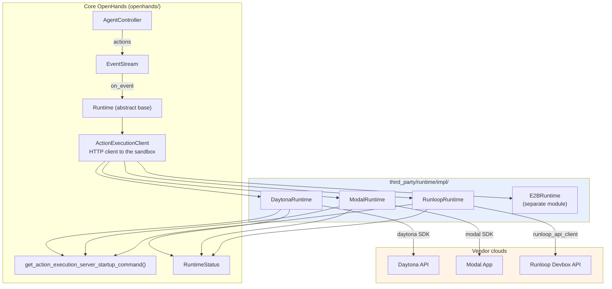
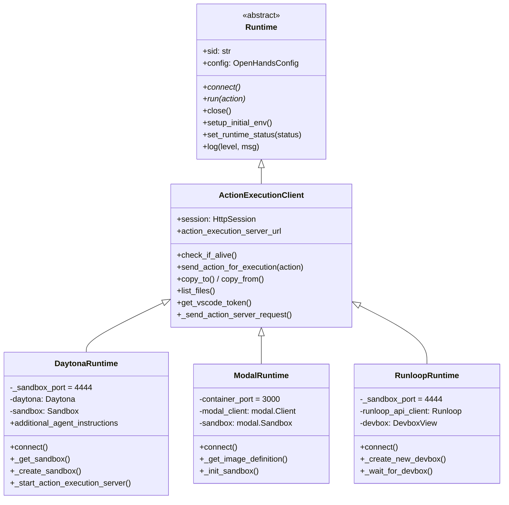
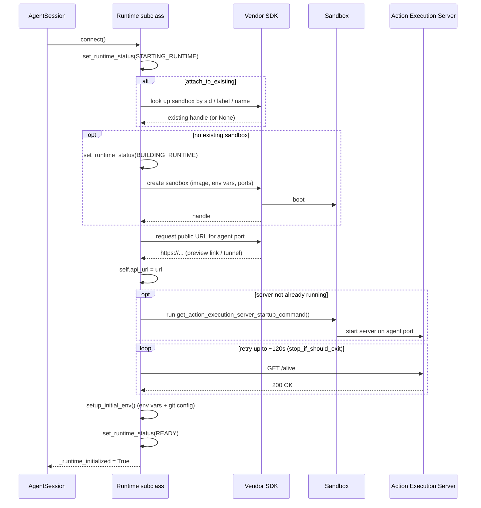
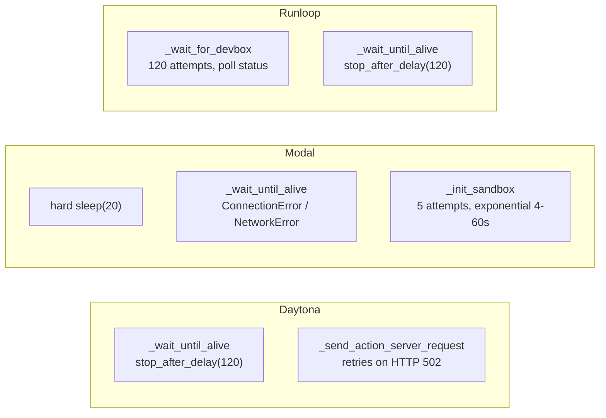
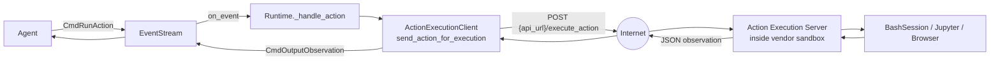
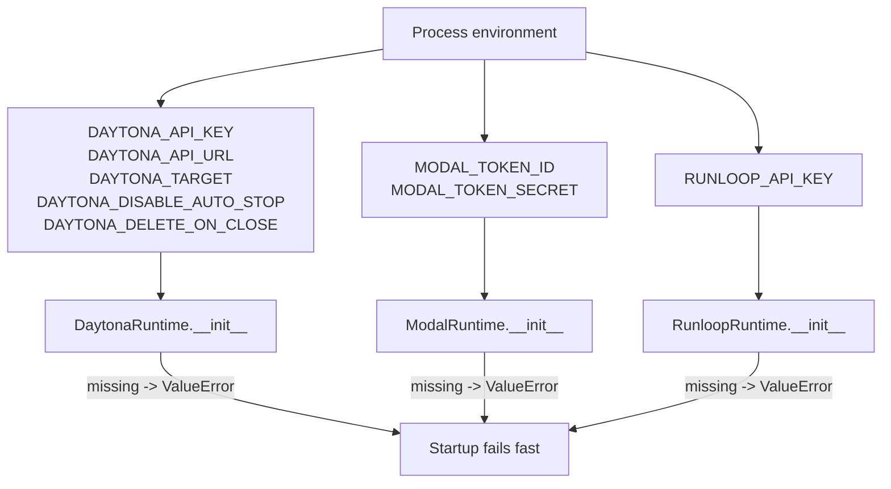
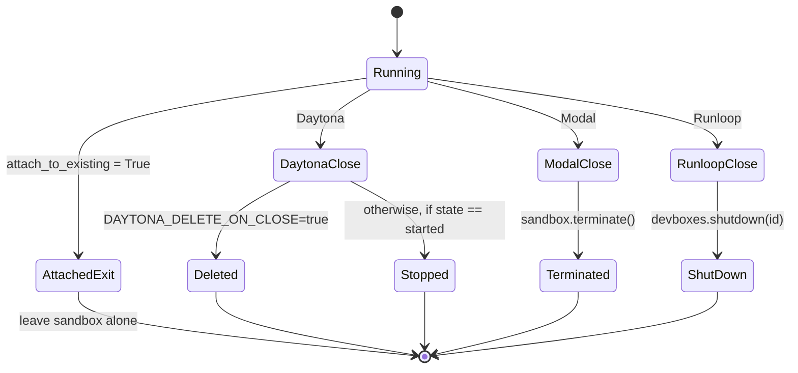
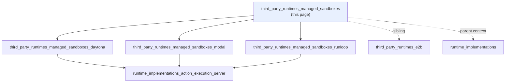

# Third-Party Managed Sandbox Runtimes

## Introduction

This module holds three runtime backends that run the OpenHands agent inside a sandbox owned by an outside company: **Daytona**, **Modal**, and **Runloop**.

The idea is simple. OpenHands needs a safe, throw-away machine where the agent can run shell commands, edit files, and open a browser. Normally OpenHands starts a Docker container on your own computer (see [runtime_implementations_docker](runtime_implementations_docker.md)). These three runtimes instead ask a cloud vendor to start that machine, and then talk to it over HTTPS.

All three do the same job in the same shape:

1. Read an API key from an environment variable. If it is missing, fail right away.
2. Ask the vendor SDK to create (or find) a sandbox.
3. Start the OpenHands **action execution server** inside that sandbox.
4. Get back a public HTTPS URL for the sandbox port.
5. Wait until the server answers, then hand control to the shared client code.
6. On shutdown, stop or delete the sandbox.

Because step 6 costs real money, each runtime is careful about cleanup, and each one behaves a bit differently.

| | Daytona | Modal | Runloop |
|---|---|---|---|
| Vendor unit | Sandbox (snapshot) | Sandbox (App) | Devbox |
| Credentials | `DAYTONA_API_KEY` | `MODAL_TOKEN_ID` + `MODAL_TOKEN_SECRET` | `RUNLOOP_API_KEY` |
| Agent port | 4444 | 3000 | 4444 |
| VSCode port | 4445 | 4445 | 4445 |
| Public URL from | `get_preview_link(port)` | `sandbox.tunnels()[port]` | `create_tunnel(id, port)` |
| Can build its own image? | No — snapshot only | **Yes** — from Dockerfile | No — `prebuilt="openhands"` |
| Finds existing sandbox by | Label `OpenHands_SID` | In-process dict `MODAL_RUNTIME_IDS` | Devbox `name == sid` |
| On close | Stop, or delete if opted in | Terminate | Shutdown |
| Docs | [daytona](third_party_runtimes_managed_sandboxes_daytona.md) | [modal](third_party_runtimes_managed_sandboxes_modal.md) | [runloop](third_party_runtimes_managed_sandboxes_runloop.md) |

## Where this module sits

These runtimes are *not* part of the core `openhands` package. They live under `third_party/`, and they are picked up by name through `get_runtime_cls()`, which falls back to resolving any subclass of `Runtime`. That keeps vendor SDKs (`daytona`, `modal`, `runloop_api_client`) out of the main dependency set — you only need them if you actually use that backend.

Related modules:

- [runtime_implementations](runtime_implementations.md) — the built-in Docker, Local, CLI, Remote, and Kubernetes backends these three mirror.
- [runtime_implementations_action_execution_server](runtime_implementations_action_execution_server.md) — the HTTP server that gets started *inside* every sandbox.
- [third_party_runtimes_e2b](third_party_runtimes_e2b.md) — the fourth third-party backend, which takes a different approach (it does not use `ActionExecutionClient`).
- [runtime_plugins](runtime_plugins.md) — the Jupyter / VSCode / AgentSkills plugins passed into the startup command.
- [runtime_image_builders](runtime_image_builders.md) — `BuildFromImageType` and `prep_build_folder`, used only by Modal.
- [event_system](event_system.md) — the `EventStream` each runtime subscribes to.
- [core_configuration](core_configuration.md) — `OpenHandsConfig` and its `sandbox` section.

## The shared shape

Every runtime here extends `ActionExecutionClient`, which extends `Runtime`. That parent does almost all of the real work: turning agent `Action` objects into HTTP `POST /execute_action` calls, uploading and downloading files, listing files, and wiring up MCP.

So each subclass only has to supply four things:

| Contract | What the subclass provides |
|---|---|
| `connect()` | Create or attach to the sandbox, start the server, wait for it |
| `action_execution_server_url` | The base HTTPS URL the parent posts to |
| `close()` | Tear down the vendor resource |
| `vscode_url` | A browser link to the in-sandbox editor |

## The common startup flow

The three `connect()` methods differ in detail but follow one rhythm. The diagram below shows that shared rhythm; the vendor-specific steps are called out in each sub-module doc.

### Waiting is the hard part

A freshly booted cloud sandbox is not instantly reachable. Each runtime handles this with `tenacity` retries, and each picks a slightly different flavour:

All the delay-based waits also combine with `stop_if_should_exit()`, so a shutdown signal breaks the loop instead of making the user wait out the full two minutes. See [runtime_utils](runtime_utils.md).

## Data flow once running

After `connect()` returns, these runtimes are just thin URL holders. Everything else flows through the parent class.

The `api_url` set during `connect()` is the only thing that makes these three classes different at request time. The subclass supplies it through the `action_execution_server_url` property.

## Shared constraints

A few limits apply to all three, and they come from the same root cause: you cannot bind-mount a folder from your laptop into somebody else's cloud VM.

- **No `workspace_base`.** Daytona and Modal both log a warning and carry on if `config.workspace_base` is set. Files must be pushed in with `copy_to()` instead.
- **Public ports.** The agent port and the VSCode port are exposed through vendor tunnels. Daytona marks the sandbox `public=True`; Modal uses `encrypted_ports`; Runloop declares `available_ports`. The VSCode link is guarded by a token fetched from the server via `get_vscode_token()`.
- **Cost and timeouts.** Idle sandboxes burn money, so each vendor gets an auto-stop: Daytona uses a 60-minute `auto_stop_interval`, Modal a 1-hour sandbox `timeout`, and Runloop relies on explicit `shutdown()`.
- **Credentials come from the process environment**, not from `OpenHandsConfig`. This means the keys are never written into conversation state or logs.

## Shutdown

`close()` is where the three diverge most, because each vendor charges differently for a stopped versus deleted sandbox.

Note the shared guard: if `attach_to_existing` is true, none of them tear anything down. The sandbox was not theirs to begin with.

## Sub-modules

Each backend is documented on its own page, with its full lifecycle, its vendor-specific quirks, and its known rough edges.

### [Daytona Runtime](third_party_runtimes_managed_sandboxes_daytona.md)

`DaytonaRuntime` runs the agent in a Daytona Sandbox created from a pre-built snapshot. It is the only one of the three that can *resume* a stopped sandbox: `connect()` checks the sandbox state, waits out a `stopping` state, restarts a `stopped` one, and only then decides whether the action execution server needs launching again. It finds existing sandboxes by the `OpenHands_SID` label, forces the server to run as user `openhands` (uid 1000), and adds `additional_agent_instructions` so the agent tells users the right preview URL instead of `localhost`.

### [Modal Runtime](third_party_runtimes_managed_sandboxes_modal.md)

`ModalRuntime` runs the agent in a Modal Sandbox under a shared Modal App named `openhands`. It is the only one of the three that can **build its own image**: if no runtime container image is configured, it calls `prep_build_folder()` to write a Dockerfile and hands it to `modal.Image.from_dockerfile()`. It also patches the image to disable bracketed paste, a workaround for a known `pexpect` bug that would otherwise corrupt shell interaction. Sandbox IDs are tracked in a module-level dict, which the source itself flags as unsafe for high-availability deployments.

### [Runloop Runtime](third_party_runtimes_managed_sandboxes_runloop.md)

`RunloopRuntime` runs the agent in a Runloop Devbox built from the vendor's `openhands` prebuilt image. It is the only one that polls the vendor for a *ready* state before trying to connect (`_wait_for_devbox`). Its entrypoint is the most involved of the three: it wraps the startup command in `sudo bash -c`, sets up micromamba and Poetry paths, and requests a `LARGE` resource size. Tunnel URLs are described as stable, so re-creating a tunnel when attaching to an existing devbox is safe.

## Adding another managed backend

The pattern is small enough to copy. To add a fourth vendor:

1. Subclass `ActionExecutionClient` under `third_party/runtime/impl/<vendor>/`.
2. Read credentials from the environment in `__init__` and raise `ValueError` if absent.
3. Call `get_action_execution_server_startup_command()` — do not hand-write the command.
4. Implement `connect()`, `action_execution_server_url`, `close()`, and `vscode_url`.
5. Report progress with `set_runtime_status()` so the UI shows the right state.
6. Guard every teardown path with `if self.attach_to_existing: return`.

Point `config.runtime` at the dotted class path and `get_runtime_cls()` will resolve it.

## Documentation index

**Pages in this module**

| Page | Covers | Source file |
|---|---|---|
| [third_party_runtimes_managed_sandboxes_daytona](third_party_runtimes_managed_sandboxes_daytona.md) | `DaytonaRuntime` — snapshot sandboxes, state resume, preview links | `third_party/runtime/impl/daytona/daytona_runtime.py` |
| [third_party_runtimes_managed_sandboxes_modal](third_party_runtimes_managed_sandboxes_modal.md) | `ModalRuntime` — App sandboxes, Dockerfile image build, tunnels | `third_party/runtime/impl/modal/modal_runtime.py` |
| [third_party_runtimes_managed_sandboxes_runloop](third_party_runtimes_managed_sandboxes_runloop.md) | `RunloopRuntime` — Devboxes, status polling, micromamba entrypoint | `third_party/runtime/impl/runloop/runloop_runtime.py` |

**Related pages outside this module**

| Page | Why it matters here |
|---|---|
| [third_party_runtimes_e2b](third_party_runtimes_e2b.md) | Sibling third-party backend that does *not* use `ActionExecutionClient` |
| [runtime_implementations](runtime_implementations.md) | Built-in Docker / Local / CLI / Remote / Kubernetes backends |
| [runtime_implementations_docker](runtime_implementations_docker.md) | The local-Docker equivalent these three replace |
| [runtime_implementations_action_execution_server](runtime_implementations_action_execution_server.md) | The server started inside every sandbox |
| [runtime_image_builders](runtime_image_builders.md) | `BuildFromImageType` / `prep_build_folder`, used by Modal |
| [runtime_plugins](runtime_plugins.md) | Jupyter, VSCode, and AgentSkills plugin requirements |
| [runtime_utils](runtime_utils.md) | `stop_if_should_exit` and other shared helpers |
| [core_configuration](core_configuration.md) | `OpenHandsConfig` and its sandbox settings |
| [event_system](event_system.md) | The `EventStream` each runtime subscribes to |
