# Daytona Runtime

## Introduction

The **Daytona runtime** lets OpenHands run an agent inside a sandbox hosted by
[Daytona](https://daytona.io), a managed sandbox service. Instead of starting a container on the
user's own machine (see [Docker Runtime](runtime_implementations_docker.md)) or inside a cluster the
operator owns (see [Kubernetes Runtime](runtime_implementations_orchestrated_kubernetes_runtime.md)),
this module asks Daytona's API for a sandbox, boots the OpenHands action execution server inside it,
and talks to that server over a public HTTPS "preview link".

The whole module is one class:

| Component | File | Role |
| --- | --- | --- |
| `DaytonaRuntime` | `third_party/runtime/impl/daytona/daytona_runtime.py` | Creates / attaches / starts / stops a Daytona sandbox and exposes it as an OpenHands runtime |

It is a *third-party* runtime: it lives under `third_party/` and is not part of the default install
path. It is only loaded when the user selects it, and it needs the `daytona` Python SDK plus a
Daytona API key.

---

## Where this module sits

`DaytonaRuntime` is a leaf in the runtime family. It supplies **sandbox provisioning** only; every
actual agent action (run a command, read a file, browse a page) is forwarded over HTTP to the
[Action Execution Server](runtime_implementations_action_execution_server.md) running inside the
sandbox.

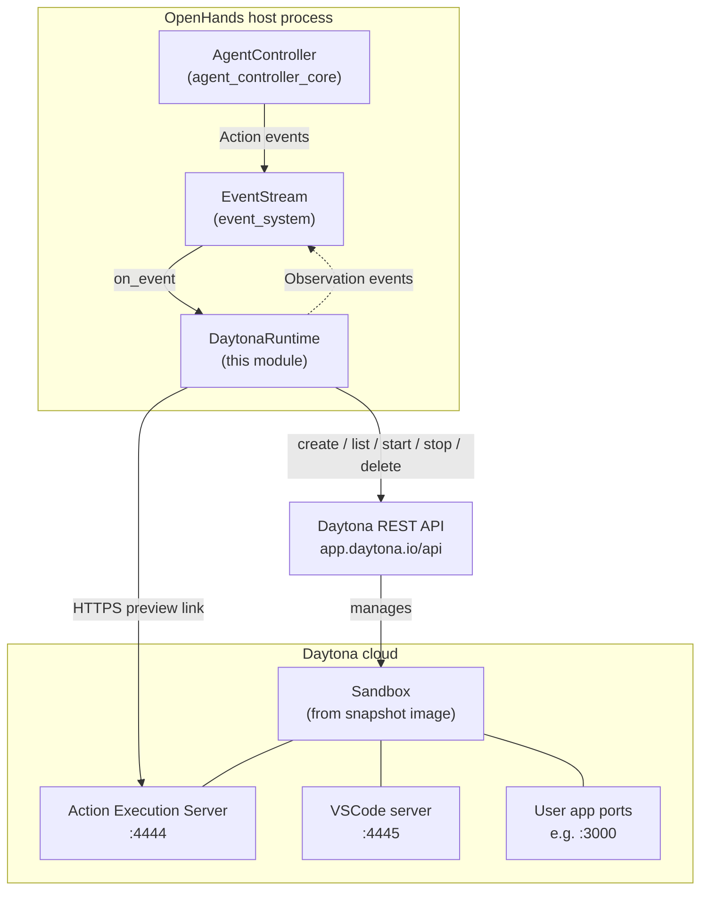

### Class hierarchy

`DaytonaRuntime` inherits almost all of its behaviour. It only overrides the parts that are
specific to Daytona: how a sandbox comes into being, what URL to talk to, and how to shut down.

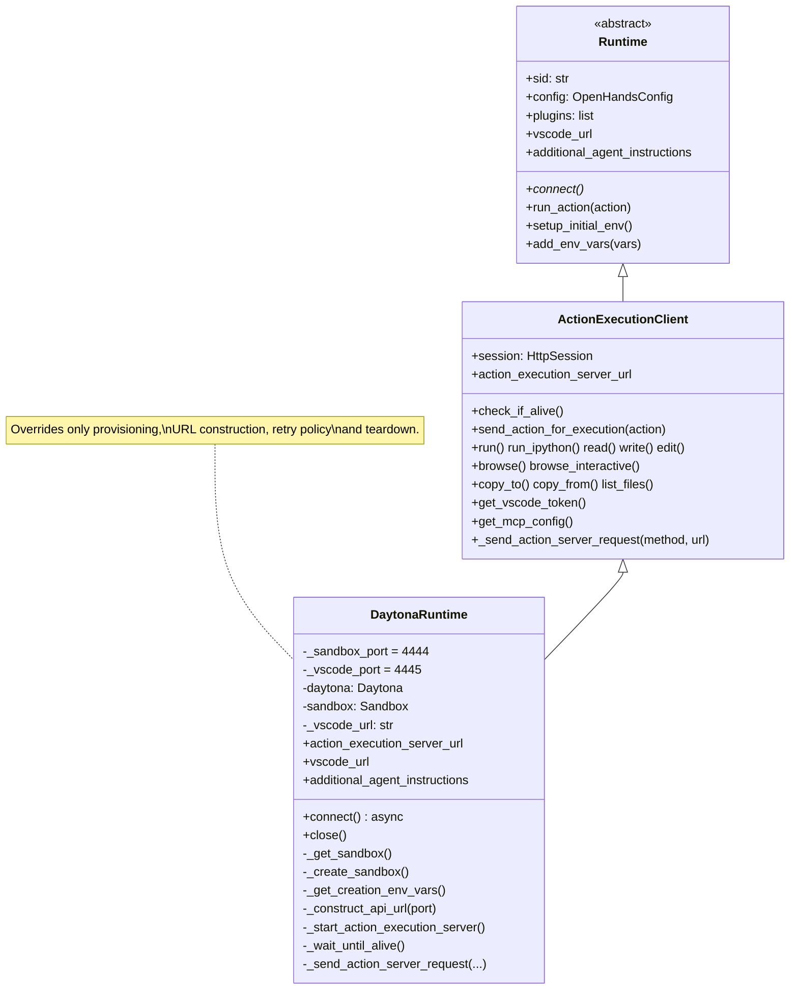

Sibling managed-sandbox runtimes solve the same problem against different vendors — see
[Modal Runtime](third_party_runtimes_managed_sandboxes_modal.md) and
[Runloop Runtime](third_party_runtimes_managed_sandboxes_runloop.md). The shared HTTP client logic
they all build on is described in
[Runtime Implementations](runtime_implementations.md) and
[Action Execution Server](runtime_implementations_action_execution_server.md).

---

## Configuration

Daytona settings are read straight from **environment variables** at construction time, not from
`OpenHandsConfig`. This keeps credentials out of the config file.

| Variable | Required | Default | Meaning |
| --- | --- | --- | --- |
| `DAYTONA_API_KEY` | **yes** | — | API key. Missing key raises `ValueError` immediately. |
| `DAYTONA_API_URL` | no | `https://app.daytona.io/api` | API endpoint (useful for self-hosted Daytona). |
| `DAYTONA_TARGET` | no | `eu` | Region / target where the sandbox is placed. |
| `DAYTONA_DISABLE_AUTO_STOP` | no | `false` | When `true`, the sandbox never auto-stops. Otherwise it stops after 60 idle minutes. |
| `DAYTONA_DELETE_ON_CLOSE` | no | `false` | When `true`, `close()` deletes the sandbox instead of stopping it. |

Values taken from the shared OpenHands config (see [Core Configuration](core_configuration.md)):

| Config field | Used for |
| --- | --- |
| `config.sandbox.runtime_container_image` | Passed as the Daytona **snapshot** name — the image the sandbox boots from |
| `config.workspace_mount_path_in_sandbox` | Working directory created before the server starts; also the folder opened in VSCode |
| `config.debug` | Sets `DEBUG=true` inside the sandbox |
| `config.workspace_base` | **Not supported** — a warning is logged and the value ignored |
| `config.sandbox.timeout` | Per-action timeout, applied by the parent class |

### A note on workspace mounting

Daytona sandboxes run in the vendor's cloud, so there is no way to bind-mount a host folder into
them. If `workspace_base` is set, `DaytonaRuntime` logs a warning and continues. Files must instead
be pushed in with `copy_to()` (inherited) or cloned from a Git provider through
[Git Provider Integrations](git_provider_integrations.md).

### Fixed ports

```
4444  ->  action execution server (the runtime's control channel)
4445  ->  VSCode server
```

Both are reached through `sandbox.get_preview_link(port).url`, so the caller never needs a raw IP
or an SSH tunnel. Any other port the agent's own app listens on (3000, 8080, …) can be exposed the
same way.

---

## Sandbox identity and reuse

Every sandbox is tagged with a label:

```python
OPENHANDS_SID_LABEL = "OpenHands_SID"
labels = {OPENHANDS_SID_LABEL: self.sid}
```

This label is the only link between an OpenHands conversation and a cloud sandbox. `_get_sandbox()`
looks a sandbox up by it, which is how a restarted server can re-attach to a still-running sandbox.

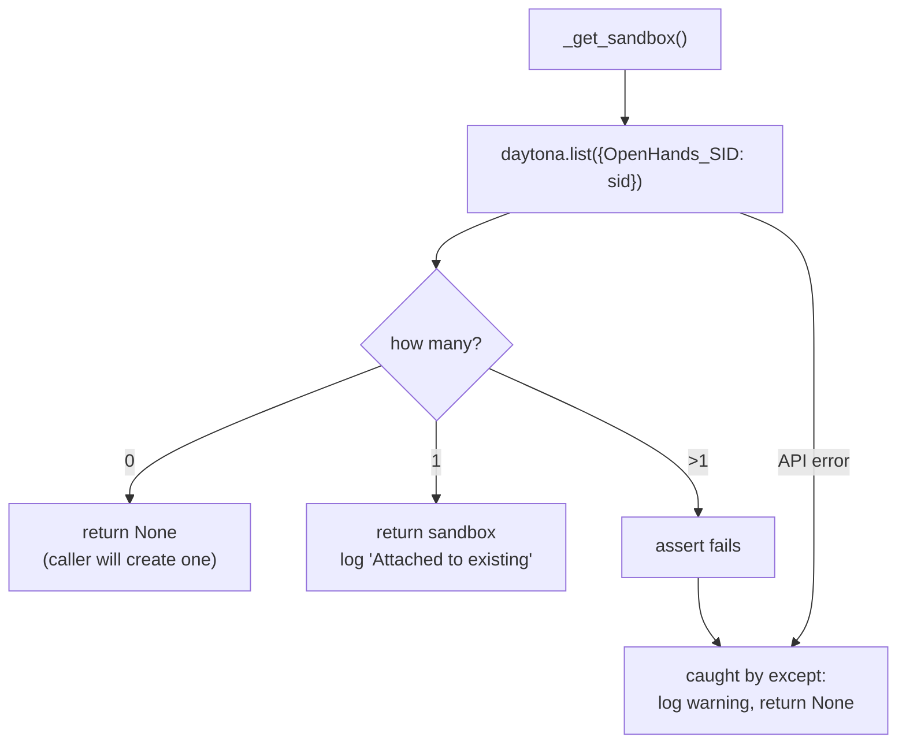

Note the `assert len(sandboxes) == 1`: two sandboxes with the same SID is treated as a broken state.
Because the assertion sits inside the `try`, the failure degrades into "no sandbox found" with a
warning rather than crashing the conversation — the runtime then creates a fresh sandbox.

---

## Connection lifecycle

`connect()` is the heart of the module. It has to cover four different starting situations with one
code path:

1. Fresh conversation — no sandbox exists.
2. Re-attach to a sandbox that is already **started**.
3. Re-attach to a sandbox that is **stopped** (Daytona auto-stopped it).
4. Re-attach to a sandbox that is currently **stopping**.

The single flag `should_start_action_execution_server` decides whether the sandbox already has a
live server process, or whether one must be launched (and the environment initialised).

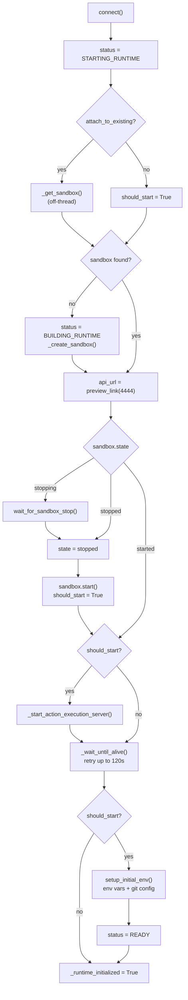

### Why `call_sync_from_async` everywhere

The Daytona SDK is synchronous and every call is a network round trip. `connect()` is `async`, so
each blocking call is pushed onto the default thread pool with
`call_sync_from_async` (from [Core Schema and Runtime Support](core_schema_and_runtime_support.md)).
Without this, sandbox creation — which can take tens of seconds — would freeze the whole server
event loop.

### Sandbox creation parameters

```python
CreateSandboxFromSnapshotParams(
    language="python",
    snapshot=self.config.sandbox.runtime_container_image,
    public=True,                       # preview links reachable without Daytona auth
    env_vars=self._get_creation_env_vars(),
    labels={OPENHANDS_SID_LABEL: self.sid},
    auto_stop_interval=0 or 60,        # 0 = never auto-stop
)
```

`public=True` is what makes the preview link usable by the OpenHands host and by the user's browser
(for VSCode). It also means the sandbox URL is a bearer-style secret — anyone with the link can
reach the action execution server, which is why the server itself checks a session API key.

### Starting the action execution server

The startup command is built by the shared helper
`get_action_execution_server_startup_command()`, the same one Docker and Kubernetes runtimes use, so
plugin flags, browser flags and the working directory stay consistent across runtimes. Daytona pins
the user explicitly:

```python
override_user_id=1000, override_username="openhands"
```

The command is then wrapped and run in a **named background session**:

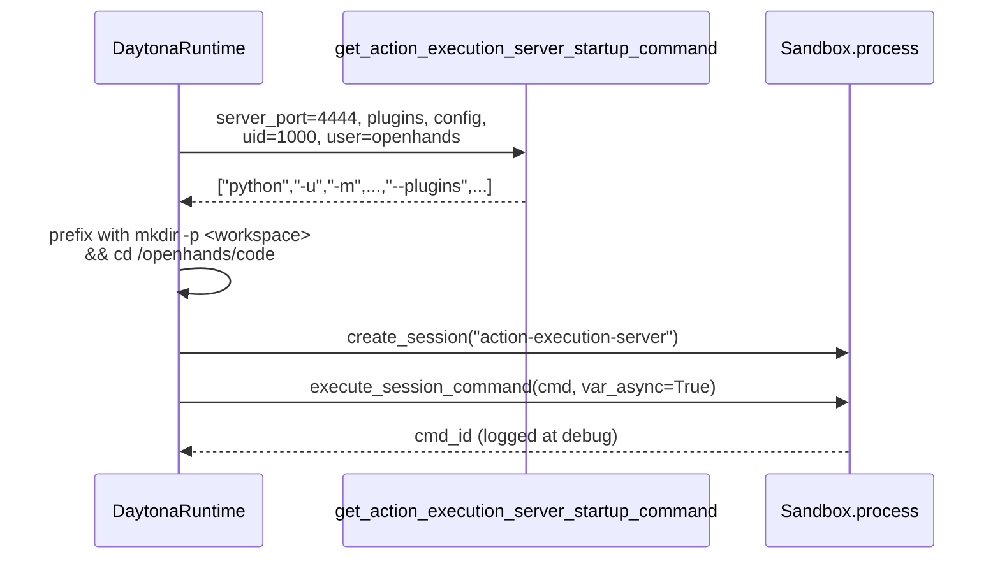

`var_async=True` means the call returns right away — the server keeps running in the session after
the request finishes. Readiness is then established by polling, not by the exec call's result.

---

## Retry and resilience

Two separate retry policies protect the two fragile moments of a managed sandbox.

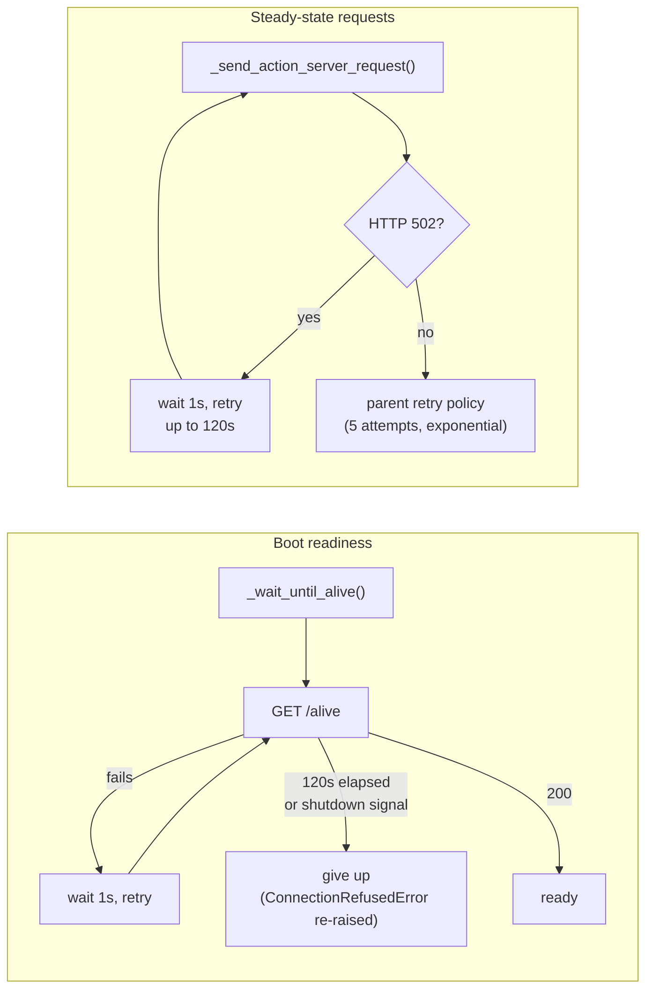

**`_wait_until_alive`** — retries `check_if_alive()` for up to 120 seconds at a fixed 1 second
interval. `stop_if_should_exit()` (see [Runtime Utils](runtime_utils.md)) makes the loop abandon
early if the process is shutting down, so Ctrl-C is not blocked for two minutes.

**`_send_action_server_request` override** — this exists because of how Daytona's edge proxy
behaves. A sandbox that has been resumed, or whose server is momentarily unavailable, answers
`502 Bad Gateway` at the proxy rather than refusing the connection. The base
`ActionExecutionClient` retry policy does not treat 502 as retryable, so this override adds a
Daytona-specific layer that retries *only* 502 responses, for up to 120 seconds, before delegating
to the parent (which then applies its own exponential-backoff policy for genuinely retryable
network errors).

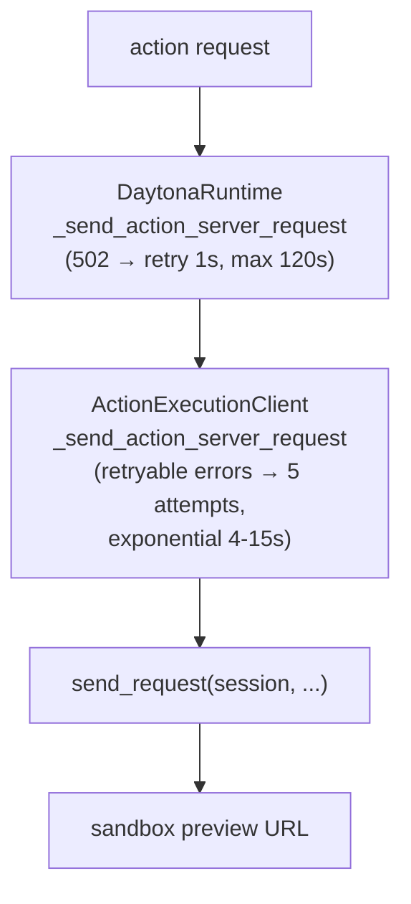

---

## Developer-facing URLs

### VSCode

`vscode_url` builds a browser-openable editor link, and caches it after the first successful build.

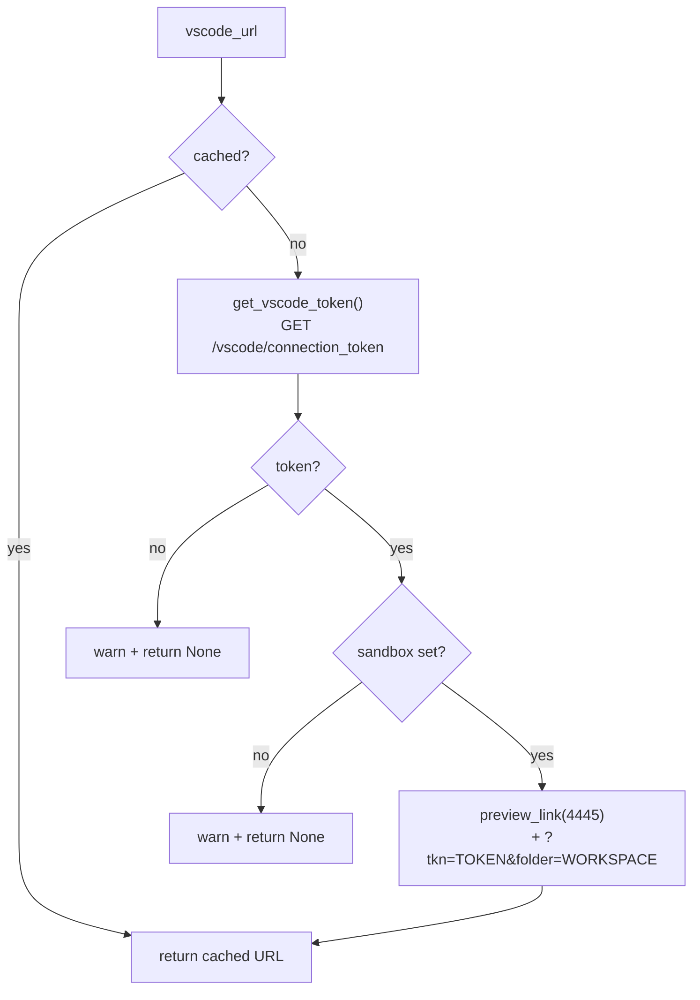

The token comes from the action execution server itself (inherited `get_vscode_token()`), which
returns an empty string unless the VSCode plugin is enabled and the runtime is initialised — see
[Runtime Plugins](runtime_plugins.md).

### Telling the agent how to share ports

`additional_agent_instructions` is the one place this module influences the **prompt**. Because a
Daytona sandbox has no reachable `localhost`, an agent that tells the user "open
`http://localhost:3000`" would be giving useless advice. The property injects a corrected
instruction containing a real preview link for port 3000:

> When showing endpoints to access applications for any port, e.g. port 3000, instead of
> localhost:3000, use this format: `<preview link for 3000>`.

This string is consumed by the prompt-building layer described in
[Core Schema and Runtime Support](core_schema_and_runtime_support.md) and reaches the model through
[Memory and Condensers](memory_and_condensers.md).

---

## Shutdown

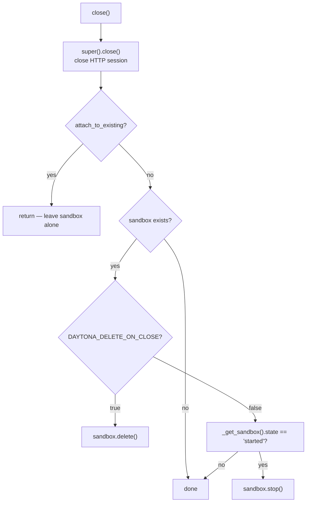

Three deliberate choices here:

- **Attach mode never destroys.** If this process only borrowed the sandbox, it must not take it
  away from whoever owns it.
- **Stop, not delete, by default.** A stopped sandbox keeps its disk, so the next `connect()` can
  resume the same workspace. Deletion is opt-in via `DAYTONA_DELETE_ON_CLOSE`.
- **Re-read state before stopping.** `_get_sandbox()` is called again to get a fresh state, because
  the cached `self.sandbox.state` may be stale after a long conversation (Daytona may already have
  auto-stopped it).

Note that `close()` is registered with `atexit` by the base `Runtime`, so a sandbox is stopped even
on an abrupt interpreter exit.

---

## End-to-end action flow

Once connected, this module is nearly invisible: it just supplies the URL. The sequence below shows
where Daytona-specific code participates (bold boxes) versus inherited behaviour.

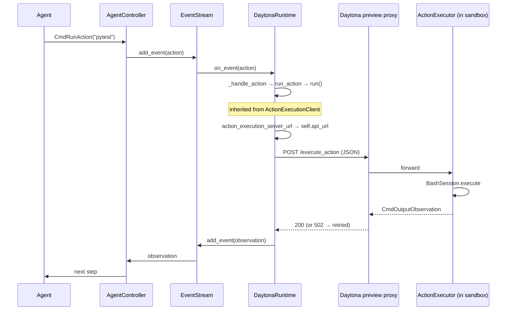

For what happens inside the sandbox, see
[Action Execution Server](runtime_implementations_action_execution_server.md),
[Runtime Utils](runtime_utils.md) (bash sessions, git handling) and
[Runtime Plugins](runtime_plugins.md) (Jupyter, VSCode, agent skills).

---

## Comparison with other runtimes

| Aspect | Daytona | [Docker](runtime_implementations_docker.md) | [Remote](runtime_implementations_orchestrated_remote_runtime.md) | [Modal](third_party_runtimes_managed_sandboxes_modal.md) / [Runloop](third_party_runtimes_managed_sandboxes_runloop.md) |
| --- | --- | --- | --- | --- |
| Who owns the machine | Daytona cloud | local Docker daemon | OpenHands remote service | vendor cloud |
| Image source | Daytona **snapshot** | local/registry image, may be built locally | prebuilt remote image | vendor image/snapshot |
| Reachability | public HTTPS preview link | localhost port mapping | service-issued URL | vendor-issued URL |
| Host folder mount | not possible | supported | not possible | not possible |
| Idle handling | auto-stop after 60 min (configurable) | container keeps running | service-managed | vendor-managed |
| Reattach key | `OpenHands_SID` label | container name | conversation id | vendor handle |
| Image building | none — snapshot must pre-exist | [Runtime Image Builders](runtime_image_builders.md) | remote builder | none |

The most consequential difference for operators: **Daytona does not build images.** There is no
`DockerRuntimeBuilder` step. `config.sandbox.runtime_container_image` must already exist as a
snapshot in the Daytona account, otherwise `_create_sandbox()` fails.

---

## Operational notes and limits

- **Hard requirement on `DAYTONA_API_KEY`.** The check happens in `__init__` *before*
  `super().__init__()`, so a missing key fails fast and cheaply.
- **Snapshot must pre-exist** in the Daytona account (see the table above).
- **`workspace_base` is silently degraded** to a warning — no host mount.
- **Public sandboxes.** `public=True` is required for preview links; treat the resulting URL as a
  credential.
- **Auto-stop interacts with long tasks.** A 60-minute idle window can stop a sandbox mid-session
  for a slow-thinking agent; `DAYTONA_DISABLE_AUTO_STOP=true` avoids this at the cost of billing.
  Recovery is automatic on the next `connect()` (the `stopped` branch restarts and relaunches the
  server).
- **One sandbox per SID.** Duplicate labels are treated as corrupt state and lead to a new sandbox
  being created.
- **`ConnectionRefusedError` is the only re-raised type** from `_wait_until_alive` (`reraise` is set
  to that tuple), so other boot failures surface through tenacity's own error wrapping.
- **Runtime status reporting** uses `RuntimeStatus` values (`STARTING_RUNTIME`, `BUILDING_RUNTIME`,
  `READY`), which reach the UI through the status callback wired up by
  [Server Sessions](server_sessions.md).

---

## Selecting this runtime

`DaytonaRuntime` is not in the built-in registry. It is resolved by `get_runtime_cls()`, which falls
back to `get_impl(Runtime, name)` for any dotted class path — so the runtime is chosen by pointing
the config at the class:

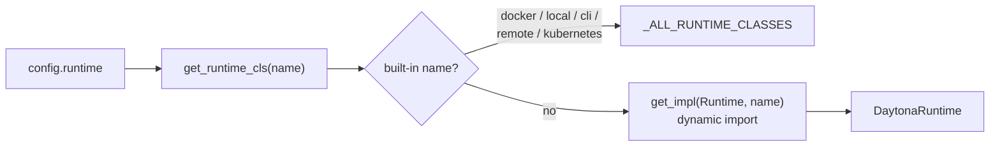

The `daytona` SDK must be installed in the host environment for that import to succeed.

---

## Related documentation

- [Sandboxed Execution Layer](sandboxed_execution_layer.md) — the whole execution subsystem
- [Third-Party Runtimes](third_party_runtimes.md) — parent module
- [Managed Sandboxes](third_party_runtimes_managed_sandboxes.md) — Daytona / Modal / Runloop group
- [Modal Runtime](third_party_runtimes_managed_sandboxes_modal.md),
  [Runloop Runtime](third_party_runtimes_managed_sandboxes_runloop.md) — sibling vendors
- [E2B Runtime](third_party_runtimes_e2b.md) — third-party runtime with a different architecture
- [Action Execution Server](runtime_implementations_action_execution_server.md) — the in-sandbox server
- [Runtime Utils](runtime_utils.md) — bash sessions, git handler, `stop_if_should_exit`
- [Runtime Plugins](runtime_plugins.md) — Jupyter, VSCode, agent skills
- [Core Configuration](core_configuration.md) — `OpenHandsConfig` and sandbox settings
- [Event System](event_system.md) — the `EventStream` this runtime subscribes to
- [Git Provider Integrations](git_provider_integrations.md) — token injection for repo cloning
