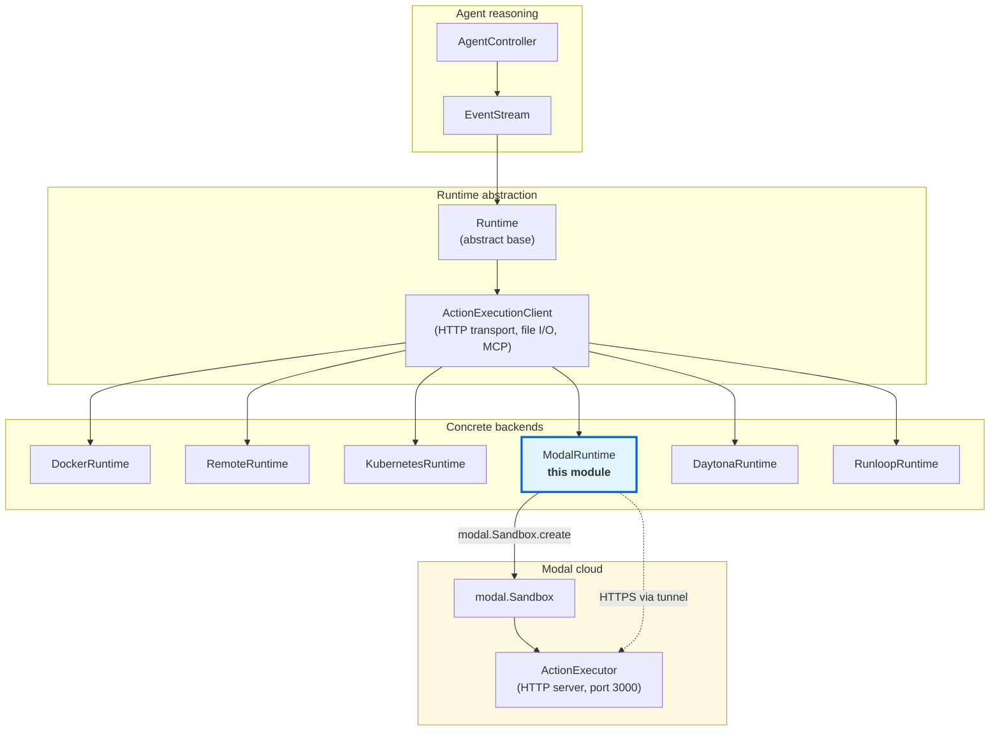
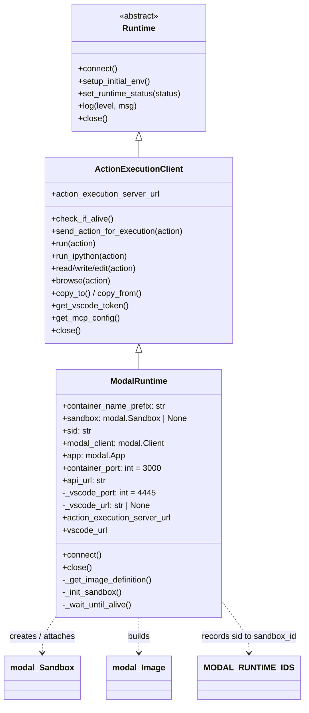
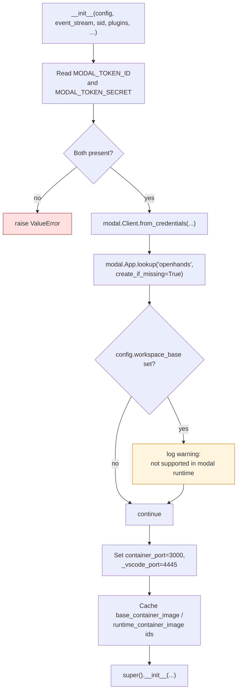
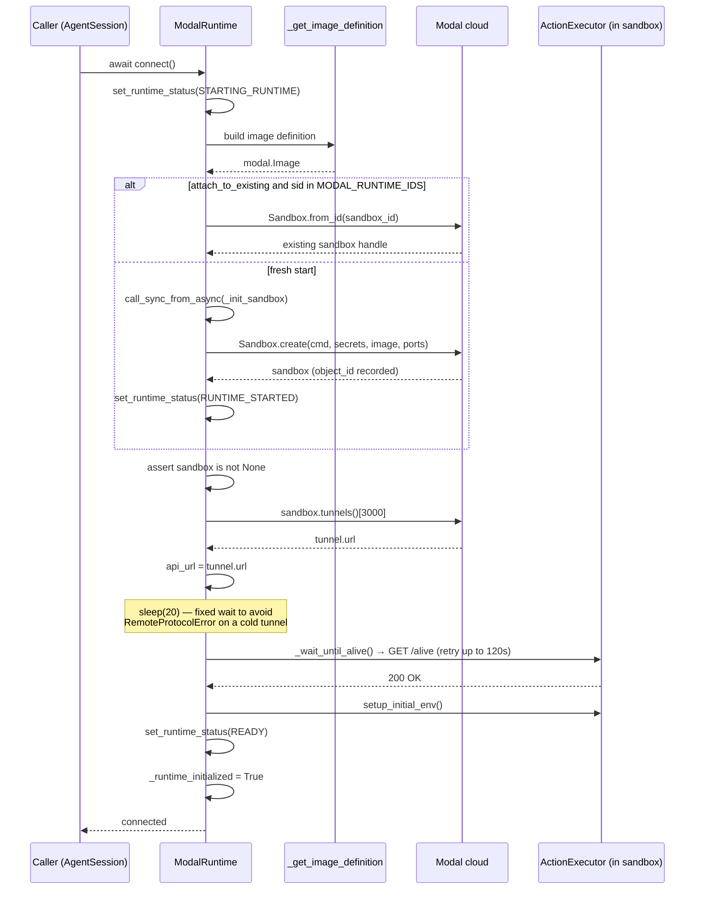
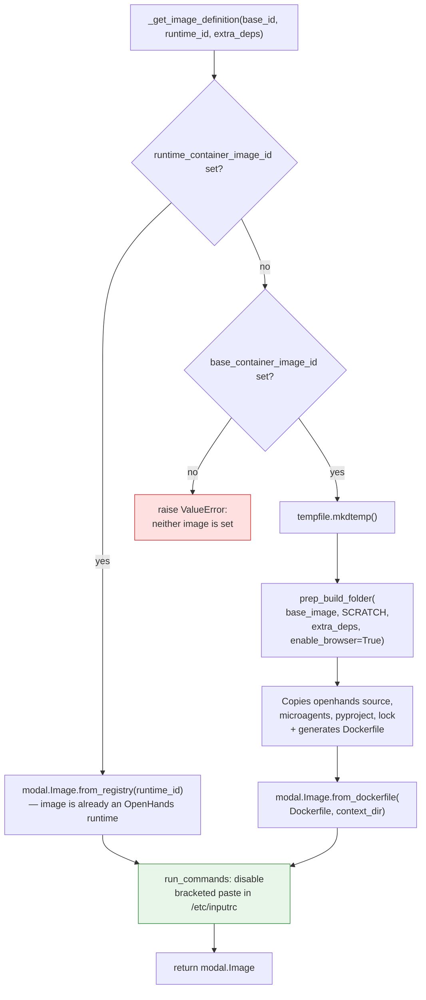
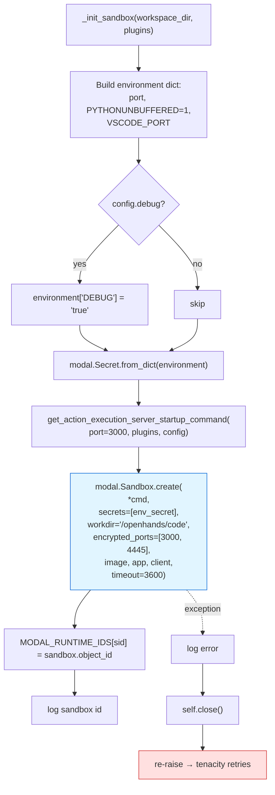
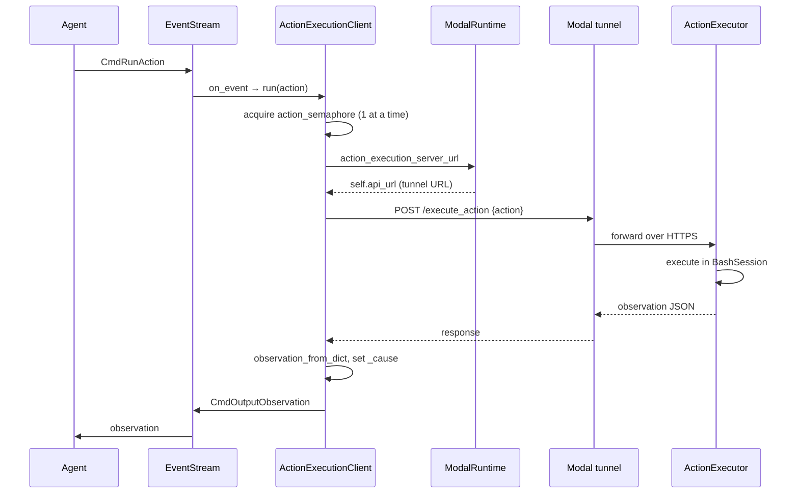
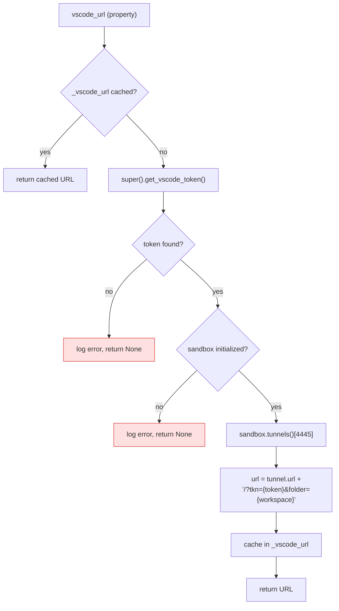
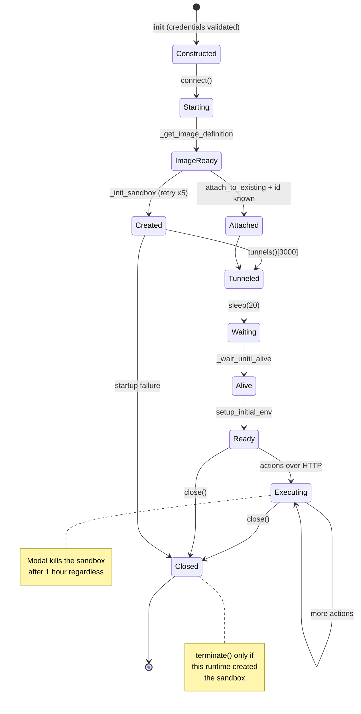

# Modal Managed Sandbox Runtime

## Introduction

The `third_party_runtimes_managed_sandboxes_modal` module holds a single class: **`ModalRuntime`**. It lets OpenHands run the agent's shell commands, file edits, Python cells, and browsing inside a [Modal](https://modal.com) sandbox instead of a local Docker container.

Modal is a serverless compute platform. You hand it a container image and a command; it starts the container in its own cloud and gives you back a public HTTPS tunnel. `ModalRuntime` uses that model directly:

1. Build (or reference) a runtime image.
2. Start a Modal sandbox that runs the OpenHands **action execution server** inside it.
3. Grab the sandbox's encrypted tunnel URL.
4. Talk to that URL over plain HTTP for the rest of the session.

The class is deliberately thin. All the real work of turning an `Action` into an HTTP call, uploading files, and wiring MCP lives in the shared base class `ActionExecutionClient` (see [runtime_implementations](runtime_implementations.md)). `ModalRuntime` only supplies the three things that are Modal-specific: **how to build the image**, **how to start the sandbox**, and **what URL to talk to**.

| Item | Value |
| --- | --- |
| Source | `third_party/runtime/impl/modal/modal_runtime.py` |
| Class | `ModalRuntime` |
| Base class | `ActionExecutionClient` → `Runtime` |
| Credentials | `MODAL_TOKEN_ID`, `MODAL_TOKEN_SECRET` (environment variables) |
| Modal app name | `openhands` (created on demand) |
| Container port | `3000` (action execution server) |
| VSCode port | `4445` |
| Sandbox lifetime | 1 hour (`timeout=60 * 60`) |
| Workspace mounting | **Not supported** — bind mounts are impossible in a Modal sandbox |

---

## Where It Sits in the System

`ModalRuntime` is one of several interchangeable runtime backends. Anything above the runtime boundary — the agent controller, the event stream, the server session — does not know or care that Modal is involved. It only sees the `Runtime` interface.



Related module docs:

- [runtime_implementations](runtime_implementations.md) — the `Runtime` / `ActionExecutionClient` contract and the `ActionExecutor` HTTP server that runs *inside* the sandbox.
- [third_party_runtimes_managed_sandboxes](third_party_runtimes_managed_sandboxes.md) — the sibling group (Daytona, Runloop) and what these backends share.
- [third_party_runtimes_managed_sandboxes_daytona](third_party_runtimes_managed_sandboxes_daytona.md) and [third_party_runtimes_managed_sandboxes_runloop](third_party_runtimes_managed_sandboxes_runloop.md) — the two closest cousins.
- [runtime_image_builders](runtime_image_builders.md) — `prep_build_folder` and `BuildFromImageType`, reused here.
- [runtime_plugins](runtime_plugins.md) — the `PluginRequirement` objects (Jupyter, VSCode, agent skills) passed into the startup command.
- [event_system](event_system.md) — `EventStream`, the source of the actions this runtime executes.
- [core_configuration](core_configuration.md) — `OpenHandsConfig` and its `sandbox` section.

---

## Component Structure



### Module-level state

```python
MODAL_RUNTIME_IDS: dict[str, str] = {}
```

A plain in-process dictionary mapping session id → Modal sandbox id. It exists so that `attach_to_existing=True` can find a sandbox started earlier in the same process.

> **Known limitation (flagged in the source):** this dict lives in process memory, so it does not work in HA / multi-worker deployments. A second worker will not see ids recorded by the first, and the attach path will silently fall through with `self.sandbox` still `None`, which then raises `Exception("Sandbox not initialized")`.

---

## Construction

`__init__` does credential checks and object setup only — no network calls to start a sandbox yet.



Notable points:

- **Credentials come from the environment, not from `OpenHandsConfig`.** Missing either token is a hard `ValueError` at construction time, so misconfiguration fails fast rather than mid-session.
- **`workspace_base` is ignored.** A Modal sandbox cannot bind-mount a host directory, so a warning is logged and the setting is dropped. Code must reach the sandbox through `copy_to()` (inherited) or a git clone.
- **One shared Modal app.** All sessions land in a single Modal app named `openhands`, created if it does not already exist. Individual sessions are separated by sandbox, not by app.
- **`runtime_extra_deps` is only logged here**; it is actually consumed later inside `_get_image_definition`.

> **Caveat for maintainers:** `ModalRuntime.__init__` does not accept an `llm_registry` argument, but the current `ActionExecutionClient.__init__` signature is `(config, event_stream, llm_registry, sid, ...)` and `ModalRuntime` forwards its arguments **positionally**. As written, `sid` would land in the `llm_registry` slot and every later argument would shift by one. This is a signature drift between the third-party runtime and the core base class, and it needs a fix (pass keyword arguments, or thread `llm_registry` through) before this backend can work against the current core.

---

## Connection Lifecycle

`connect()` is the async entry point the rest of OpenHands calls. It handles both the fresh-start path and the attach path.



### Status reporting

`connect()` walks the shared `RuntimeStatus` enum so the UI can show progress. See [core_schema_and_runtime_support](core_schema_and_runtime_support.md) for how these statuses reach the frontend.

| Point in `connect()` | Status emitted |
| --- | --- |
| Entry | `STARTING_RUNTIME` |
| Before `_init_sandbox` (fresh start only) | `STARTING_RUNTIME` |
| After sandbox created (fresh start only) | `RUNTIME_STARTED` |
| Before waiting on client (fresh start only) | `STARTING_RUNTIME` |
| After env setup (fresh start only) | `READY` |

On the attach path the status transitions after the first one are skipped, since the sandbox is already warm.

### The 20-second sleep

```python
self.log("info", "Waiting 20 secs for the container to be ready... (avoiding RemoteProtocolError)")
sleep(20)
```

This is a blunt fixed delay, not a poll. It exists because Modal's tunnel can accept a TCP connection before the server behind it is speaking HTTP, which surfaces as `httpx.RemoteProtocolError` — an error the `_wait_until_alive` retry policy does **not** catch (it only retries `ConnectionError` and `httpx.NetworkError`). The sleep is also a synchronous `time.sleep` inside an `async def`, so it blocks the event loop for the full 20 seconds. Both are pragmatic workarounds rather than intended design.

---

## Image Definition

`_get_image_definition` turns OpenHands' image configuration into a `modal.Image`. There are two mutually exclusive paths, and one error case.



Two things are worth calling out:

**`BuildFromImageType.SCRATCH`.** When only a base image is given, the build always starts from scratch — no layer reuse from a prior OpenHands image. `prep_build_folder` (documented in [runtime_image_builders](runtime_image_builders.md)) copies the `openhands` package, the `microagents` directory, and `pyproject.toml` / `poetry.lock` into a temp folder alongside a generated Dockerfile, and Modal builds that. The temp folder is never cleaned up.

**The bracketed-paste fix.** Both paths end in the same `run_commands` layer:

```sh
echo "set enable-bracketed-paste off" >> /etc/inputrc && \
echo 'export INPUTRC=/etc/inputrc' >> /etc/bash.bashrc
```

Bracketed paste makes the terminal wrap pasted text in escape sequences. `pexpect`, which the sandbox's `BashSession` uses to drive the shell, gets confused by those sequences (pexpect issue #669). Disabling it globally keeps command output clean and parseable. See [runtime_utils](runtime_utils.md) for `BashSession`.

---

## Sandbox Startup

`_init_sandbox` is the only place a Modal sandbox is actually created. It is wrapped in a tenacity retry — 5 attempts with exponential backoff from 4s to 60s — because sandbox provisioning is a cloud operation that can fail transiently.



### `modal.Sandbox.create` arguments explained

| Argument | Purpose |
| --- | --- |
| `*sandbox_start_cmd` | The `python -m openhands.runtime.action_execution_server ...` command, built by the shared `get_action_execution_server_startup_command` helper. It bakes in the port, the plugin list, the working directory, and the run-as user. |
| `secrets=[env_secret]` | Environment variables delivered as a Modal secret rather than plain env, so values are not exposed in the sandbox spec. |
| `workdir="/openhands/code"` | Where the OpenHands source lives inside the runtime image. Note this is *not* the agent's workspace — that is `config.workspace_mount_path_in_sandbox`, passed via the startup command. |
| `encrypted_ports=[3000, 4445]` | Asks Modal to expose both ports over HTTPS tunnels. 3000 is the action execution server, 4445 is VSCode. |
| `image` | The `modal.Image` from `_get_image_definition`. |
| `app`, `client` | Bind the sandbox to the shared `openhands` app and the credentialed client. |
| `timeout=60 * 60` | **Hard 1-hour cap.** Modal kills the sandbox after an hour regardless of activity. Long agent sessions will lose their runtime. |

### Error handling on failure

The `except` block logs, calls `self.close()`, then re-raises. Because tenacity is retrying, `close()` may run several times across attempts. `ActionExecutionClient.close()` guards against this with a `_runtime_closed` flag, so the HTTP session is only closed once — but that also means after the first failed attempt the session is already closed for the retries that follow. Worth knowing when reading failure logs.

---

## Request Path After Connection

Once `connect()` returns, `ModalRuntime` adds almost nothing to the hot path. Every action flows through inherited machinery, with `action_execution_server_url` as the single hook.



The only override is a one-liner:

```python
@property
def action_execution_server_url(self):
    return self.api_url
```

Everything else — the action semaphore that serializes execution, retry-on-transient-error, `copy_to` / `copy_from` zip streaming, MCP server registration — comes from `ActionExecutionClient`. See [runtime_implementations_action_execution_server](runtime_implementations_action_execution_server.md) for what the server side does with these requests.

### Liveness check

```python
@tenacity.retry(
    stop=tenacity.stop_after_delay(120) | stop_if_should_exit(),
    retry=tenacity.retry_if_exception_type((ConnectionError, httpx.NetworkError)),
    reraise=True,
    wait=tenacity.wait_fixed(2),
)
def _wait_until_alive(self):
    self.check_if_alive()
```

Polls `GET /alive` every 2 seconds for up to 120 seconds. The `stop_if_should_exit()` clause (from [runtime_utils](runtime_utils.md)) lets a shutdown signal break the loop immediately instead of stranding the process for two minutes. Note the narrow retry filter: only `ConnectionError` and `httpx.NetworkError` are retried, which is why the 20-second pre-sleep is needed for `RemoteProtocolError`.

---

## VSCode Access

`vscode_url` builds a browser-openable editor URL, lazily and with caching.



The token itself is fetched by the parent class from `GET /vscode/connection_token` inside the sandbox — so this only works after `connect()` has completed and the VSCode plugin is enabled. The `folder=` query parameter points VSCode at the agent's workspace directory, not the `/openhands/code` workdir.

---

## Teardown

```python
def close(self):
    super().close()
    if not self.attach_to_existing and self.sandbox:
        self.sandbox.terminate()
```

Ownership is explicit: a runtime that *created* its sandbox terminates it; a runtime that merely *attached* to an existing one leaves it running for whoever owns it. `super().close()` runs first to shut the HTTP session.



---

## Comparison With Sibling Backends

All three managed-sandbox backends follow the same shape — provision a remote sandbox, expose the action execution server, talk HTTP — but differ in the details.

| Aspect | Modal | Daytona | Runloop |
| --- | --- | --- | --- |
| Credentials | `MODAL_TOKEN_ID` + `MODAL_TOKEN_SECRET` env vars | Provider config | Provider config |
| Image handling | `from_registry` or `from_dockerfile` built via `prep_build_folder` | Provider snapshot/image | Provider blueprint |
| Public URL | Modal encrypted-port tunnel | Provider preview URL | Provider tunnel |
| Session tracking | In-process `MODAL_RUNTIME_IDS` dict | Provider-side lookup by label | Provider-side lookup |
| Hard lifetime cap | 1 hour | Provider policy | Provider policy |
| Workspace bind mount | Not supported | Not supported | Not supported |

See [third_party_runtimes_managed_sandboxes](third_party_runtimes_managed_sandboxes.md) for the shared pattern, and [runtime_implementations_docker](runtime_implementations_docker.md) for the local-Docker contrast (where bind mounts *are* available).

---

## Configuration Reference

| Setting | Source | Effect in `ModalRuntime` |
| --- | --- | --- |
| `MODAL_TOKEN_ID` | env var | Required. Modal client id. |
| `MODAL_TOKEN_SECRET` | env var | Required. Modal client secret. |
| `sandbox.runtime_container_image` | `OpenHandsConfig` | If set, pulled directly with `from_registry`; no build. Fastest path. |
| `sandbox.base_container_image` | `OpenHandsConfig` | Fallback when no runtime image. Triggers a full scratch build. |
| `sandbox.runtime_extra_deps` | `OpenHandsConfig` | Extra deps baked into the Dockerfile. **Only applies on the base-image build path** — ignored when a prebuilt runtime image is used. |
| `sandbox.timeout` | `OpenHandsConfig` | Per-action timeout, applied by the parent class. |
| `workspace_mount_path_in_sandbox` | `OpenHandsConfig` | Agent workspace inside the sandbox; passed to the startup command and the VSCode `folder=` param. |
| `workspace_base` | `OpenHandsConfig` | **Ignored** — warning logged. |
| `debug` | `OpenHandsConfig` | Sets `DEBUG=true` inside the sandbox. |
| `enable_browser` | `OpenHandsConfig` | Consumed by the startup command; the image build hardcodes `enable_browser=True`. |

---

## Operational Notes and Gotchas

A summary of the sharp edges, all visible in the source:

1. **1-hour hard sandbox cap.** `timeout=60 * 60` on `Sandbox.create`. Sessions longer than an hour lose their runtime with no renewal logic.
2. **`MODAL_RUNTIME_IDS` is process-local.** Attaching to an existing sandbox breaks under HA or multiple workers. The source flags this with a `FIXME`.
3. **20-second blocking sleep in an async method.** Uses `time.sleep` inside `async def connect`, so it blocks the whole event loop.
4. **`RemoteProtocolError` is not retried.** The `_wait_until_alive` filter covers only `ConnectionError` and `httpx.NetworkError`; the fixed sleep is the mitigation.
5. **Build temp directory leaks.** `tempfile.mkdtemp()` in `_get_image_definition` is never removed.
6. **No `workspace_base` support.** Get code in via git or `copy_to()`.
7. **Signature drift with `ActionExecutionClient`.** `llm_registry` is missing from `ModalRuntime.__init__` while the base class expects it as the third positional argument — see the caveat in [Construction](#construction).
8. **Shared Modal app.** All sessions share the app named `openhands`; isolation is per sandbox, and Modal-side quotas apply across the whole app.
9. **`close()` may run more than once** during `_init_sandbox` retries.
