# Runloop Runtime (`third_party_runtimes_managed_sandboxes_runloop`)

## Introduction

This module holds one class: `RunloopRuntime`. It lets OpenHands run agent
actions inside a **Runloop Devbox** — a cloud sandbox that Runloop starts,
hosts, and tears down for you.

The idea is simple. OpenHands needs a safe place to run shell commands, edit
files, and open a browser. Locally that place is a Docker container. With this
module, that place is a Devbox in Runloop's cloud instead. Your machine only
needs an API key and a network connection.

`RunloopRuntime` is thin on purpose. It does not know how to run a command. It
only knows how to:

1. Start a Devbox with the right boot command.
2. Wait until the Devbox is up.
3. Open a public tunnel to the port inside the Devbox.
4. Hand that tunnel URL to its parent class, which does all the real talking.

Everything after step 4 is shared code. See
[Action Execution Server](runtime_implementations_action_execution_server.md)
for the server side, and
[Third-Party Runtimes](third_party_runtimes.md) for the family this module
belongs to.

| Item | Value |
| --- | --- |
| File | `third_party/runtime/impl/runloop/runloop_runtime.py` |
| Class | `RunloopRuntime` |
| Parent | `ActionExecutionClient` |
| Vendor SDK | `runloop_api_client` |
| Required env var | `RUNLOOP_API_KEY` |
| Sandbox port | `4444` |
| VSCode port | `4445` |
| Devbox image | `prebuilt="openhands"` |
| Container name prefix | `openhands-runtime-` |

---

## Where this module sits

`RunloopRuntime` is one leaf in the sandbox layer. The agent side never imports
it directly. It asks for "a runtime" and gets whichever one the config picked.

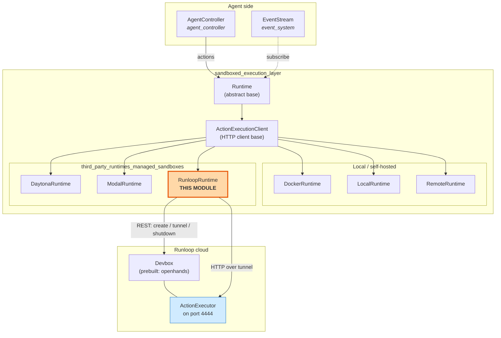

Related docs:

- [Managed Sandboxes overview](third_party_runtimes_managed_sandboxes.md)
- [Daytona Runtime](third_party_runtimes_managed_sandboxes_daytona.md) — sibling
- [Modal Runtime](third_party_runtimes_managed_sandboxes_modal.md) — sibling
- [Docker Runtime](runtime_implementations_docker.md) — the local template this
  class was copied from
- [Runtime Implementations](runtime_implementations.md)

---

## Inheritance and division of labour

The most useful thing to understand about this class is **how little it does**.
Three levels of inheritance split the work cleanly.

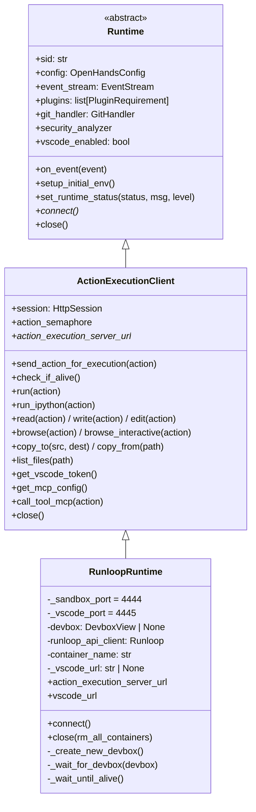

Read the table below as "who owns what".

| Concern | Owner | Notes |
| --- | --- | --- |
| Event subscription, plugin list, env vars, git config | `Runtime` | See [Event System](event_system.md) |
| Turning an `Action` into an HTTP POST | `ActionExecutionClient` | One action at a time, guarded by a semaphore |
| File upload / download, MCP config, VSCode token | `ActionExecutionClient` | Uses `action_execution_server_url` |
| **Where that URL comes from** | `RunloopRuntime` | This is the whole job |
| **Creating and killing the sandbox** | `RunloopRuntime` | Via the Runloop SDK |

`RunloopRuntime` overrides exactly three public members: the
`action_execution_server_url` property, `connect()`, and `close()`. Plus it adds
a `vscode_url` property. That is the full public surface.

---

## Construction

```python
RunloopRuntime(
    config,                 # OpenHandsConfig
    event_stream,           # EventStream
    sid="default",          # session id -> devbox name
    plugins=None,           # list[PluginRequirement]
    env_vars=None,
    status_callback=None,
    attach_to_existing=False,
    headless_mode=True,
    user_id=None,
    git_provider_tokens=None,
)
```

The constructor does four things, in order:

1. **Read `RUNLOOP_API_KEY` from the environment.** If it is missing or empty,
   raise `ValueError` right away. This is a deliberate fail-fast: there is no
   point building a runtime that can never reach the API.
2. **Build the SDK client** — `Runloop(bearer_token=runloop_api_key)`. One
   client per runtime instance.
3. **Derive the container name** — `"openhands-runtime-" + sid`. This is only
   used as Devbox metadata, so a human can match a Devbox in the Runloop
   dashboard back to an OpenHands session.
4. **Call `super().__init__(...)`**, which wires up the event stream, plugins,
   git handler, and so on.

Note that `self.devbox` is set to `None` **before** `super().__init__()`, and
`self._vscode_url` is set to `None` **after**. The ordering matters: the base
constructor registers `close()` with `atexit`, so `self.devbox` must already
exist or an early crash would raise `AttributeError` during shutdown.

The API key is read from `os.getenv` rather than from `OpenHandsConfig`. That
keeps the secret out of config files and out of logs, but it also means the key
cannot be set per-conversation — it is process-wide. See
[Core Configuration](core_configuration.md) for how the rest of the settings
flow in.

---

## Startup: `connect()`

`connect()` is the heart of the module. It is async, but every Runloop SDK call
inside it is blocking.

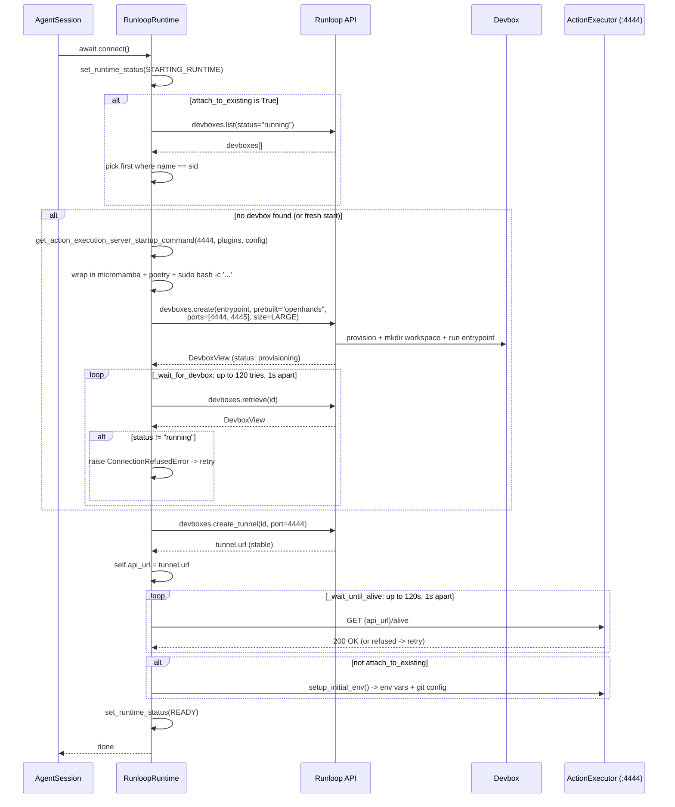

### The two waits are different

This is easy to miss. There are **two** separate readiness loops, and they check
different things.

| | `_wait_for_devbox` | `_wait_until_alive` |
| --- | --- | --- |
| Question asked | "Has Runloop finished booting the VM?" | "Is the Python server inside it serving?" |
| Who is asked | Runloop control plane (`devboxes.retrieve`) | The sandbox itself (`GET /alive`) |
| Stop condition | `stop_after_attempt(120)` | `stop_after_delay(120)` **or** `stop_if_should_exit()` |
| Retry signal | raises `ConnectionRefusedError` | inherited from `check_if_alive()` |

Only the second loop honours `stop_if_should_exit()`. That helper (from
[Runtime Utils](runtime_utils.md)) lets a Ctrl-C or a shutdown signal break the
loop early instead of making the user wait out the full window. The first loop
has no such escape, so an interrupt during VM provisioning can hang for up to
two minutes.

### Order of operations, and why

The tunnel is created **after** the "attach or create" branch, not inside it.
The comment in the code explains why: `create_tunnel` returns a **stable** URL
for a given Devbox and port. Calling it again for an already-tunnelled Devbox is
harmless and returns the same URL. So one call covers both the fresh-start and
the reattach path — no branching needed.

---

## Building the boot command

`_create_new_devbox()` builds the shell command that starts the action
execution server. It is a two-stage build.

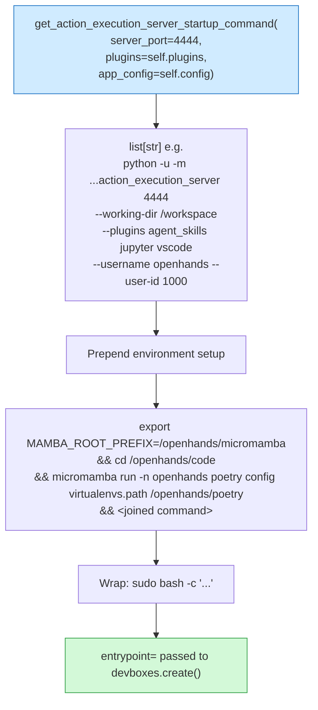

Three details are worth calling out:

**Why `sudo`.** The comment says it plainly: *start off as root,
`action_execution_server` will ultimately choose user but expects all context
(ie browser) to be installed as root*. Playwright and other browser deps need
root to install. The server then drops to `--username` / `--user-id` itself. So
the entrypoint runs as root even when the agent will not.

**Why the micromamba dance.** The `prebuilt="openhands"` image ships a
micromamba environment at `/openhands/micromamba` and code at
`/openhands/code`. The three prefix commands point Poetry at the right virtualenv
directory so the server can import its dependencies. These paths are hard-coded
and are a contract with the prebuilt image — if Runloop rebuilds that image with
a different layout, this line breaks.

**Plugins flow through, not around.** `self.plugins` comes from the base
`Runtime` constructor, which appends `VSCodeRequirement` automatically when
`headless_mode` is false. The plugin names become `--plugins` CLI flags. The
runtime itself never installs anything; the server does. See
[Runtime Plugins](runtime_plugins.md).

### `devboxes.create()` parameters

| Parameter | Value | Purpose |
| --- | --- | --- |
| `entrypoint` | the `sudo bash -c '...'` string | boots the action execution server |
| `name` | `self.sid` | the key used to find this Devbox again on reattach |
| `environment_variables` | `{"DEBUG": "true"}` if `config.debug` else `{}` | forwards debug flag into the sandbox |
| `prebuilt` | `"openhands"` | Runloop-hosted image with OpenHands deps baked in |
| `launch_parameters.available_ports` | `[4444, 4445]` | only these ports can be tunnelled |
| `launch_parameters.resource_size_request` | `"LARGE"` | fixed; not configurable from OpenHands config |
| `launch_parameters.launch_commands` | `mkdir -p <workspace_mount_path_in_sandbox>` | guarantees the workspace dir exists before the entrypoint runs |
| `metadata` | `{"container-name": self.container_name}` | dashboard-friendly label |

Note the naming split: `name` is the raw `sid`, while `metadata` carries the
prefixed `openhands-runtime-<sid>`. Lookups on reattach use `name`, so they
match on the bare `sid`.

---

## Networking: ports and tunnels

Runloop Devboxes are not directly reachable. Every connection goes through a
tunnel that Runloop mints on request.

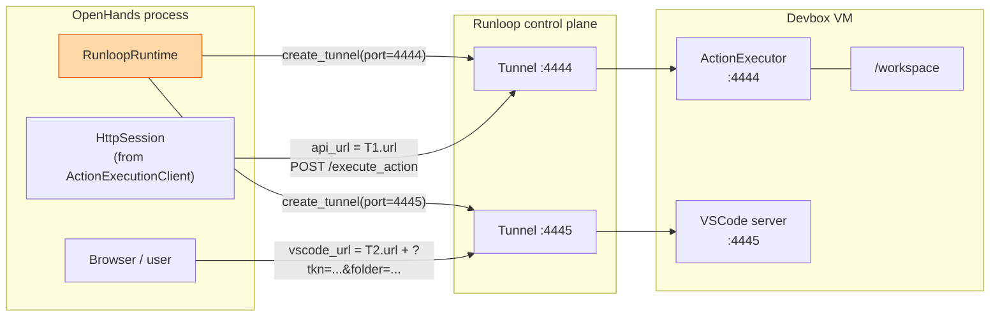

The class-level constants `_sandbox_port = 4444` and `_vscode_port = 4445` are
declared as class attributes, so they are shared by every instance and are not
configurable per session. They must both appear in `available_ports` at create
time, or the later `create_tunnel` call for VSCode will fail.

`action_execution_server_url` simply returns `self.api_url`, the field the base
class reads for every HTTP call. That one-line property is the entire bridge
between "Runloop gave me a tunnel" and "the shared client can now do its job".

---

## Action data flow

Once connected, `RunloopRuntime` is passive. Actions flow through inherited code.

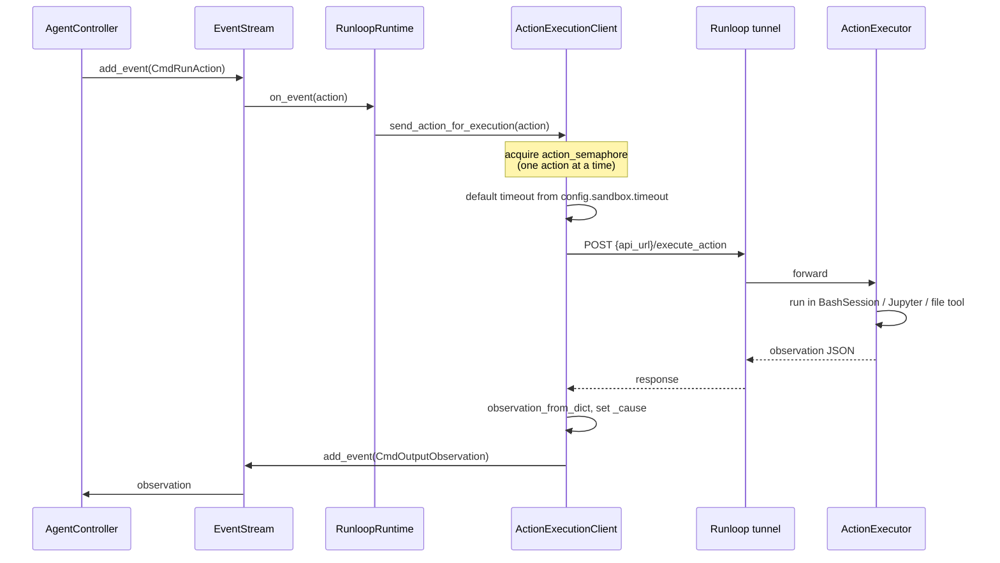

The Runloop-specific class appears only twice in this picture: it supplied
`api_url`, and it inherits `on_event`. Nothing else. That is why file copy,
Jupyter, MCP tool calls, and browsing all work here with no extra code — see
[Action Execution Server](runtime_implementations_action_execution_server.md).

---

## VSCode URL

`vscode_url` is a lazy, cached property.

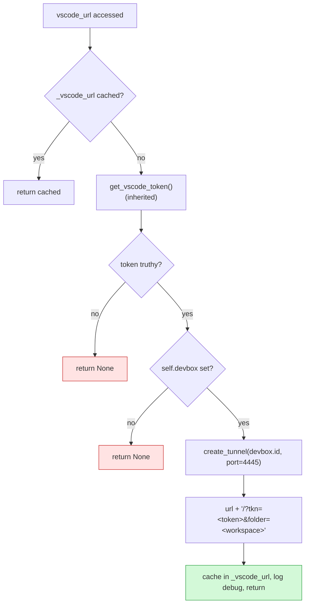

`get_vscode_token()` (from `ActionExecutionClient`) returns `''` unless both
`vscode_enabled` and `runtime_initialized` are true. So this property returns
`None` in headless mode, and `None` if it is read before `connect()` finishes.
Both guard clauses are needed.

The token is embedded in the query string as `?tkn=`. Anyone with the URL has
editor access to the sandbox, so the URL should be treated as a secret. The
`SensitiveDataFilter` in [Logging](logging.md) is the relevant safeguard, and
note that this property deliberately logs the full URL at `debug` level.

---

## Shutdown: `close()`

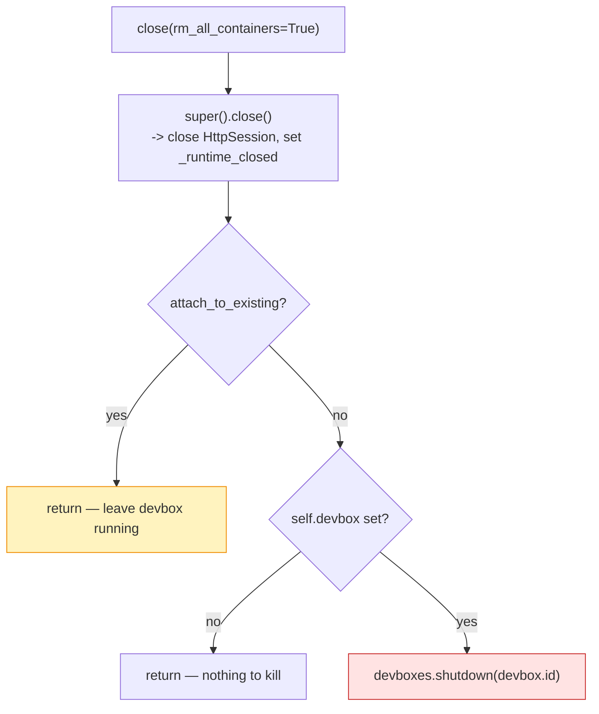

The `attach_to_existing` check is the important one. If OpenHands merely
borrowed a Devbox, it must not destroy it — another session may still be using
it. This is symmetric with `connect()`, which also skips `setup_initial_env()`
when attaching.

`close()` is registered with `atexit` by the base `Runtime` constructor, and
`ActionExecutionClient.close()` guards against double-close with the
`_runtime_closed` flag. So calling it twice is safe, but the Runloop
`shutdown` call itself is **not** behind that flag — it sits after the
`super().close()` early-return, which means a second explicit `close()` would
return early from the parent and never reach the shutdown call. Effectively
idempotent, but by accident rather than design.

The `rm_all_containers` parameter exists only to match the signature used by
`DockerRuntime`. It is accepted and ignored. A Devbox is not a container, and
there is no "remove all" concept here.

---

## Reattach flow

`attach_to_existing=True` changes three behaviours. Keeping them straight is
the key to using this runtime for long-lived or resumed conversations.

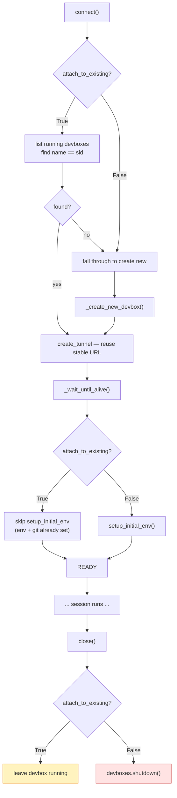

| Stage | `attach_to_existing=False` | `attach_to_existing=True` |
| --- | --- | --- |
| Discovery | skipped | list running Devboxes, match on `name == sid` |
| Creation | always create | create only if no match |
| `setup_initial_env` | runs | skipped |
| `close()` | shuts the Devbox down | leaves it running |

The lookup filters `status="running"`, so a Devbox that is suspended or still
provisioning will not be found and a **second** Devbox with the same name gets
created. Runloop does not enforce unique names, so duplicates are possible.

---

## Resilience and failure modes

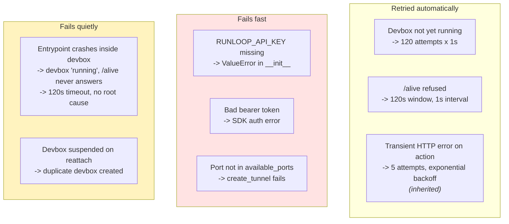

The third box is the one to watch in practice. Because the entrypoint runs
inside the Devbox and there is **no log streaming** here (unlike
[`DockerRuntime`](runtime_implementations_docker.md), which uses `LogStreamer`),
a broken boot command shows up only as a two-minute `/alive` timeout with no
explanation. Debugging means opening the Devbox logs in the Runloop dashboard.
This is the biggest operational gap in the module.

Status is reported outward through `set_runtime_status()`, which forwards to the
`status_callback` so the UI can show progress. This runtime emits
`STARTING_RUNTIME` twice — once at the top of `connect()` and again just before
`_wait_until_alive()` — then `READY`. It never emits `BUILDING_RUNTIME`, because
the `prebuilt="openhands"` image means there is no build step.

---

## Comparison with sibling runtimes

All three managed sandboxes solve the same problem in the same shape. The
differences are in the vendor primitives.

| Aspect | Runloop | [Daytona](third_party_runtimes_managed_sandboxes_daytona.md) | [Modal](third_party_runtimes_managed_sandboxes_modal.md) | [Docker](runtime_implementations_docker.md) |
| --- | --- | --- | --- | --- |
| Sandbox unit | Devbox | Workspace | Sandbox | Container |
| Credential source | `RUNLOOP_API_KEY` env var | config | config | local daemon |
| Image | `prebuilt="openhands"` | vendor image | built from image | built locally |
| Reaching the sandbox | tunnel URL | vendor preview URL | tunnel | host port map |
| Log streaming | none | varies | varies | `LogStreamer` |
| Resource sizing | fixed `"LARGE"` | configurable | configurable | host-limited |
| Base class | `ActionExecutionClient` | `ActionExecutionClient` | `ActionExecutionClient` | `ActionExecutionClient` |

Because they all extend `ActionExecutionClient`, they are interchangeable from
the agent's point of view. Swapping runtimes is a config change, not a code
change.

---

## Maintenance notes

These are real inconsistencies in the current file. They matter to anyone
touching this code.

**1. Constructor signature drift.** `ActionExecutionClient.__init__` and
`Runtime.__init__` both take an `llm_registry` parameter, third in the list.
`RunloopRuntime.__init__` does not accept it, and its `super().__init__()` call
passes arguments positionally:

```python
super().__init__(
    config, event_stream, sid, plugins, env_vars, status_callback,
    attach_to_existing, headless_mode, user_id, git_provider_tokens,
)
```

With the current parent signature, `sid` lands in `llm_registry`, `plugins`
lands in `sid`, and so on — every argument after the second is shifted by one.
The core runtimes were updated when `llm_registry` was added; this third-party
file was not. Fixing it means adding the parameter and threading it through.
Switching to keyword arguments here would also make the call resistant to future
signature changes.

**2. `_wait_for_devbox` has a dead guard.** The first line is:

```python
if devbox == "running":
    return devbox
```

`devbox` is a `DevboxView` object, so comparing it to a string is always false.
The intent was almost certainly `if devbox.status == "running"`. The effect is
harmless — the code falls through and does one extra `retrieve()` call before
returning — but it is misleading, and it means an already-running Devbox is
never short-circuited.

**3. Mixed logging.** The module imports both the standard `logging` module and
the project's `openhands_logger`. `_wait_for_devbox` uses
`logging.debug(...)` while `connect()` uses `logger.info(...)`. The bare
`logging` call bypasses the project's handlers and the `SensitiveDataFilter`.
It should use `logger` or `self.log` like the rest of the file. See
[Logging](logging.md).

**4. Hard-coded values.** `resource_size_request="LARGE"`, the two port
numbers, and the `/openhands/micromamba` and `/openhands/code` paths are all
literals. Any of them could reasonably be config-driven.

---

## Extension points

If you are adding a new managed-sandbox runtime, this file is a good template
because it is small. The recipe is:

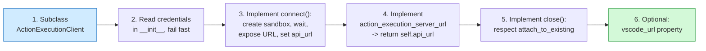

The boot command should always be derived from
`get_action_execution_server_startup_command()` rather than being hand-written.
That keeps plugin flags, the working directory, the username, and the browser
flag consistent across every runtime. See [Runtime Utils](runtime_utils.md).

---

## Related documentation

- [Third-Party Runtimes](third_party_runtimes.md) — parent module
- [Managed Sandboxes](third_party_runtimes_managed_sandboxes.md) — direct parent
- [Daytona Runtime](third_party_runtimes_managed_sandboxes_daytona.md) · [Modal Runtime](third_party_runtimes_managed_sandboxes_modal.md) — siblings
- [E2B Runtime](third_party_runtimes_e2b.md) — the other third-party family
- [Action Execution Server](runtime_implementations_action_execution_server.md) — what runs inside the Devbox
- [Docker Runtime](runtime_implementations_docker.md) — the local counterpart
- [Runtime Implementations](runtime_implementations.md) · [Sandboxed Execution Layer](sandboxed_execution_layer.md)
- [Runtime Plugins](runtime_plugins.md) — agent skills, Jupyter, VSCode
- [Runtime Utils](runtime_utils.md) — `stop_if_should_exit`, `BashSession`, `GitHandler`
- [Core Configuration](core_configuration.md) — `OpenHandsConfig`, sandbox settings
- [Event System](event_system.md) — `EventStream`, actions and observations
- [Git Provider Integrations](git_provider_integrations.md) — `PROVIDER_TOKEN_TYPE`
- [Logging](logging.md) — `openhands_logger`, `SensitiveDataFilter`
- [Server Sessions](server_sessions.md) — `AgentSession`, which calls `connect()`
