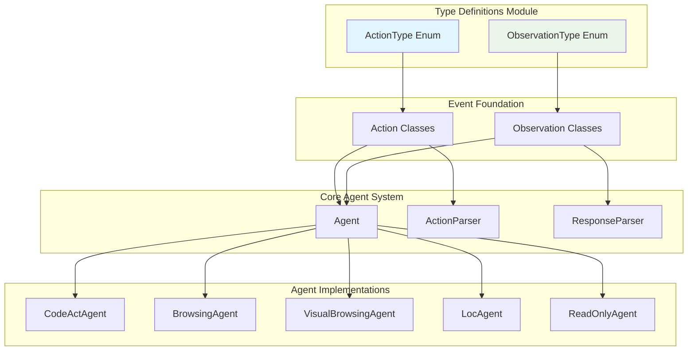
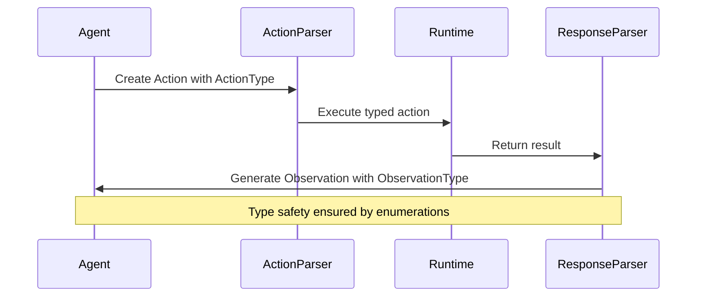
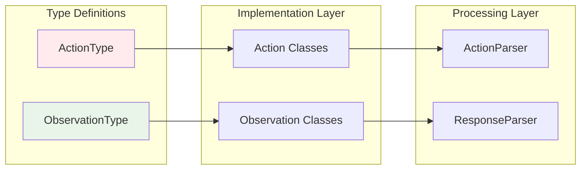
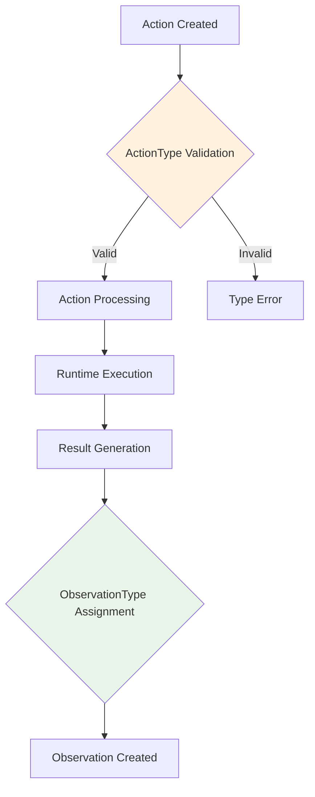

# Type Definitions Module

## Overview

The type_definitions module serves as the foundational schema layer for the OpenHands system, defining the core enumeration types that standardize action and observation types across the entire platform. This module provides the essential type definitions that enable consistent communication between agents, runtime systems, and the event processing framework.

## Core Components

### ActionType Enumeration
- **Purpose**: Defines all possible action types that can be performed within the OpenHands system
- **Location**: `openhands.core.schema.action.ActionType`
- **Type**: String-based enumeration extending both `str` and `Enum`

### ObservationType Enumeration
- **Purpose**: Defines all possible observation types that can be generated as responses to actions
- **Location**: `openhands.core.schema.observation.ObservationType`
- **Type**: String-based enumeration extending both `str` and `Enum`

## Architecture Overview



## ActionType Detailed Specification

The ActionType enumeration defines 26 distinct action types organized into several functional categories:

### Communication Actions
- **MESSAGE**: Represents a standard message
- **SYSTEM**: Represents a system-level message
- **CHAT**: User communication (referenced in observations)

### Task Management Actions
- **START**: Initiates a new development task or user chat session
- **FINISH**: Completes a task after verification
- **REJECT**: Refuses a task due to impossibility or constraints
- **PAUSE**: Temporarily suspends task execution
- **RESUME**: Continues a paused task
- **STOP**: Terminates task execution completely

### File Operations
- **READ**: Retrieves file content
- **WRITE**: Creates or overwrites file content
- **EDIT**: Modifies existing file content using drafts

### Code Execution
- **RUN**: Executes shell commands
- **RUN_IPYTHON**: Executes IPython/Jupyter cells

### Web Interaction
- **BROWSE**: Opens and retrieves web page content
- **BROWSE_INTERACTIVE**: Performs interactive browser operations

### Advanced Operations
- **MCP**: Interacts with Model Context Protocol servers
- **DELEGATE**: Assigns tasks to other agents
- **THINK**: Records internal reasoning processes
- **RECALL**: Retrieves content from workspace or microagents
- **CONDENSATION**: Summarizes event sequences
- **CONDENSATION_REQUEST**: Requests event summarization
- **TASK_TRACKING**: Manages task lists and progress

### Version Control
- **PUSH**: Pushes branches to GitHub
- **SEND_PR**: Creates pull requests

### State Management
- **CHANGE_AGENT_STATE**: Modifies agent operational state
- **NULL**: Represents empty or undefined actions

## ObservationType Detailed Specification

The ObservationType enumeration defines 19 observation types that correspond to action results:

### File Operation Results
- **READ**: Content retrieved from file reading
- **WRITE**: Confirmation of file writing operations
- **EDIT**: Results of file editing operations

### Execution Results
- **RUN**: Output from command execution
- **RUN_IPYTHON**: Results from IPython cell execution

### Web Operation Results
- **BROWSE**: HTML content from web browsing
- **DOWNLOAD**: Results from file downloads via browser

### Communication Results
- **CHAT**: Messages from users
- **MESSAGE**: General message observations

### Task Management Results
- **SUCCESS**: Successful operation completion
- **ERROR**: Error conditions and failures
- **USER_REJECTED**: User rejection of proposed actions

### Advanced Operation Results
- **DELEGATE**: Results from delegated tasks
- **RECALL**: Retrieved workspace or microagent content
- **MCP**: Results from MCP server interactions
- **CONDENSE**: Summarized event sequences
- **TASK_TRACKING**: Task management operation results

### State and Control Results
- **AGENT_STATE_CHANGED**: Notifications of agent state modifications
- **THINK**: Recorded thought processes
- **NULL**: Empty or undefined observations

## Data Flow Architecture



## Integration Patterns

### Type Safety Pattern


### Event Processing Flow


## Module Dependencies

### Upstream Dependencies
This module has minimal dependencies and serves as a foundational layer:
- Python's built-in `enum` module
- No external dependencies

### Downstream Dependencies
The type definitions are consumed by:
- **[event_foundation](event_foundation.md)**: Action and Observation base classes
- **[core_agent_system](core_agent_system.md)**: Agent implementations and parsers
- **[agent_implementations](agent_implementations.md)**: Specific agent types
- **[runtime_system](runtime_system.md)**: Runtime execution engines

## Usage Patterns

### Action Type Usage
```python
from openhands.core.schema.action import ActionType

# Type-safe action creation
action_type = ActionType.READ
if action_type == ActionType.WRITE:
    # Handle write operations
    pass
```

### Observation Type Usage
```python
from openhands.core.schema.observation import ObservationType

# Type-safe observation processing
obs_type = ObservationType.SUCCESS
if obs_type in [ObservationType.ERROR, ObservationType.USER_REJECTED]:
    # Handle error conditions
    pass
```

## Extension Guidelines

### Adding New Action Types
1. Add the new enum value to `ActionType`
2. Update corresponding action classes in [event_foundation](event_foundation.md)
3. Implement parsing logic in [action_processing](action_processing.md)
4. Add runtime support in [runtime_system](runtime_system.md)

### Adding New Observation Types
1. Add the new enum value to `ObservationType`
2. Update corresponding observation classes in [event_foundation](event_foundation.md)
3. Implement generation logic in response parsers
4. Update agent handling logic as needed

## Quality Assurance

### Type Safety Features
- String-based enums provide both type safety and serialization compatibility
- Exhaustive enumeration prevents undefined action/observation types
- IDE support for autocompletion and validation

### Consistency Guarantees
- Centralized type definitions ensure system-wide consistency
- Single source of truth for all action and observation types
- Version-controlled schema evolution

## Related Documentation

- **[event_foundation](event_foundation.md)**: Base classes that implement these type definitions
- **[core_agent_system](core_agent_system.md)**: Agent system that processes these types
- **[action_processing](action_processing.md)**: Action parsing and validation
- **[runtime_system](runtime_system.md)**: Runtime execution of typed actions

## Summary

The type_definitions module provides the essential schema foundation for the OpenHands system through two critical enumerations: ActionType and ObservationType. These type definitions ensure type safety, consistency, and clear communication protocols across all system components. The module's strategic position as a foundational layer makes it a dependency for virtually all other system modules, emphasizing the importance of careful schema design and evolution management.