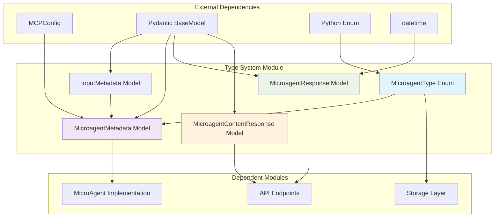
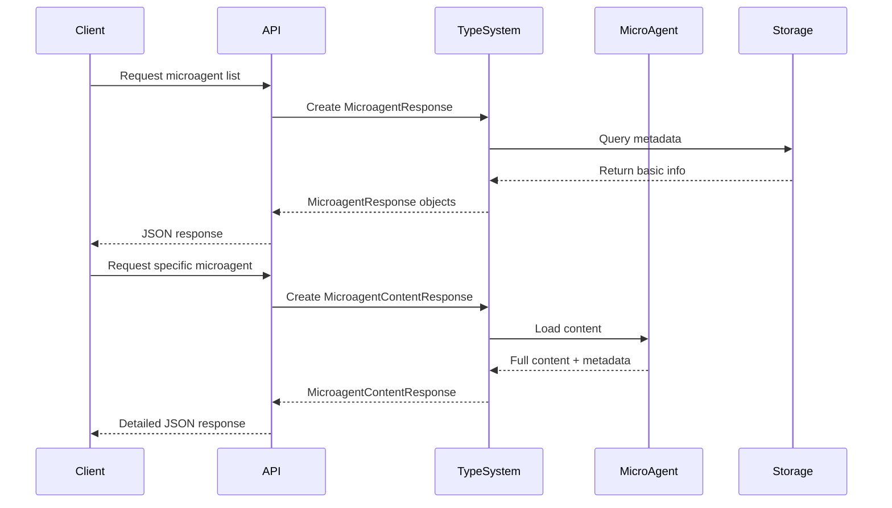
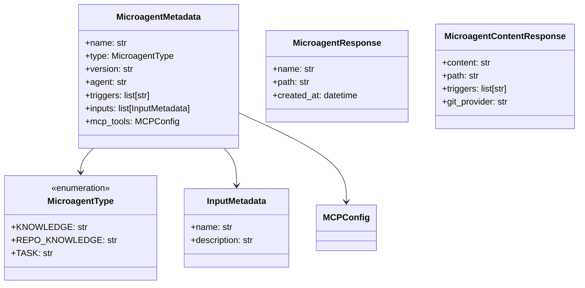

# Type System Module

The type_system module within the microagent_system provides essential type definitions and data models for microagent operations in OpenHands. This module defines the core types, enumerations, and response models that enable structured communication and metadata management for microagents.

## Overview

The type_system module serves as the foundational type layer for the microagent system, defining:
- Microagent classification and categorization
- Metadata structures for microagent configuration
- Response models for API interactions
- Input/output data contracts

This module ensures type safety and provides clear interfaces for microagent operations, supporting the broader [microagent_system](microagent_system.md) architecture.

## Architecture



## Core Components

### MicroagentType Enum

The `MicroagentType` enum defines the classification system for different types of microagents:

```python
class MicroagentType(str, Enum):
    KNOWLEDGE = 'knowledge'      # Optional microagent, triggered by keywords
    REPO_KNOWLEDGE = 'repo'      # Always active microagent
    TASK = 'task'               # Special type for task microagents that require user input
```

**Type Categories:**
- **KNOWLEDGE**: Optional microagents activated by specific keywords or triggers
- **REPO_KNOWLEDGE**: Always-active microagents that provide repository-wide context
- **TASK**: Interactive microagents requiring user input for task execution

### Metadata Models

#### InputMetadata

Defines the structure for task microagent input specifications:

```python
class InputMetadata(BaseModel):
    name: str
    description: str
```

This model ensures that task microagents can clearly specify their input requirements to users.

#### MicroagentMetadata

Comprehensive metadata model for all microagent types:

```python
class MicroagentMetadata(BaseModel):
    name: str = 'default'
    type: MicroagentType = Field(default=MicroagentType.REPO_KNOWLEDGE)
    version: str = Field(default='1.0.0')
    agent: str = Field(default='CodeActAgent')
    triggers: list[str] = []
    inputs: list[InputMetadata] = []
    mcp_tools: MCPConfig | None = None
```

**Key Features:**
- **Versioning**: Supports microagent version management
- **Agent Integration**: Links to specific agent implementations from [agent_implementations](agent_implementations.md)
- **Trigger System**: Defines activation keywords for knowledge microagents
- **Input Specification**: Describes required inputs for task microagents
- **MCP Integration**: Optional MCP tools configuration via [mcp_configuration](core_configuration.md)

### Response Models

#### MicroagentResponse

Basic response model for microagent listing endpoints:

```python
class MicroagentResponse(BaseModel):
    name: str
    path: str
    created_at: datetime
```

Provides essential metadata without requiring full content parsing.

#### MicroagentContentResponse

Detailed response model for individual microagent content:

```python
class MicroagentContentResponse(BaseModel):
    content: str
    path: str
    triggers: list[str] = []
    git_provider: str | None = None
```

Includes full content and additional context information for microagent execution.

## Data Flow



## Type Relationships



## Integration Points

### Configuration System
- **MCP Integration**: Links to [mcp_configuration](core_configuration.md) for tool configuration
- **Agent Selection**: References agent types from [agent_implementations](agent_implementations.md)

### Storage System
- **Metadata Persistence**: Works with [storage_system](storage_system.md) for microagent metadata storage
- **Content Management**: Supports file-based microagent storage

### API Layer
- **Response Serialization**: Provides structured responses for [server_and_api](server_and_api.md)
- **Type Validation**: Ensures data integrity across API boundaries

## Usage Patterns

### Microagent Registration

```python
# Define microagent metadata
metadata = MicroagentMetadata(
    name="code_reviewer",
    type=MicroagentType.KNOWLEDGE,
    version="1.2.0",
    agent="CodeActAgent",
    triggers=["review", "code quality", "lint"],
    mcp_tools=mcp_config
)
```

### Task Microagent Definition

```python
# Task microagent with input requirements
task_metadata = MicroagentMetadata(
    name="bug_fixer",
    type=MicroagentType.TASK,
    inputs=[
        InputMetadata(
            name="bug_description",
            description="Detailed description of the bug to fix"
        ),
        InputMetadata(
            name="priority",
            description="Bug priority level (low, medium, high, critical)"
        )
    ]
)
```

### API Response Handling

```python
# List microagents
response = MicroagentResponse(
    name="repo_analyzer",
    path="/microagents/repo_analyzer.md",
    created_at=datetime.now()
)

# Get microagent content
content_response = MicroagentContentResponse(
    content="# Repository Analyzer\n...",
    path="/microagents/repo_analyzer.md",
    triggers=["analyze", "repository", "structure"],
    git_provider="github"
)
```

## Validation and Constraints

The type system enforces several important constraints:

1. **Type Consistency**: Ensures microagent types match their operational behavior
2. **Input Validation**: Validates that task microagents specify required inputs
3. **Trigger Specification**: Ensures knowledge microagents define activation triggers
4. **Version Management**: Supports semantic versioning for microagent evolution

## Error Handling

The type system provides structured error handling through Pydantic validation:

- **Type Validation**: Automatic validation of enum values and data types
- **Required Fields**: Enforcement of mandatory metadata fields
- **Format Validation**: Ensures proper structure for complex fields like triggers and inputs

## Future Considerations

The type system is designed to support future enhancements:

- **Extended Metadata**: Additional fields for advanced microagent features
- **Type Hierarchies**: Support for microagent inheritance and specialization
- **Dynamic Types**: Runtime type registration and discovery
- **Integration Metadata**: Enhanced integration with external systems

This type system provides the foundational structure for the microagent ecosystem, ensuring consistent interfaces and enabling robust microagent management within the OpenHands platform.