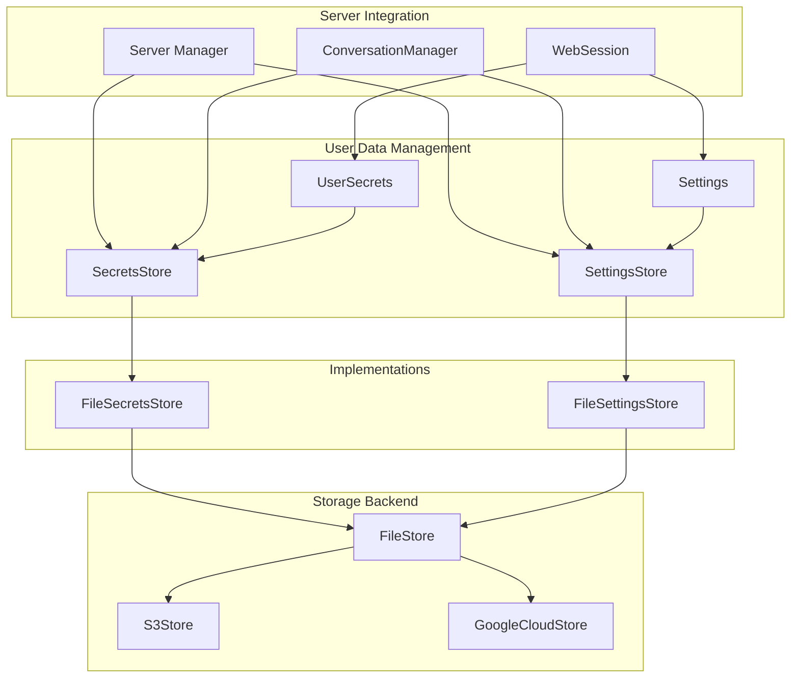
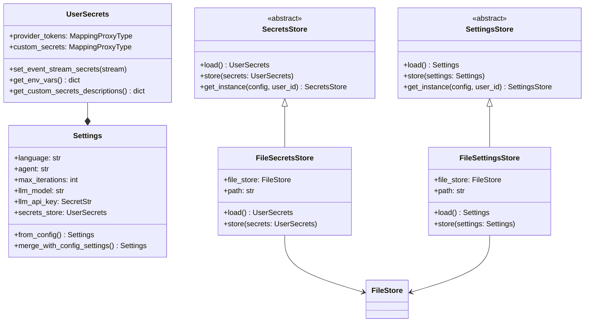
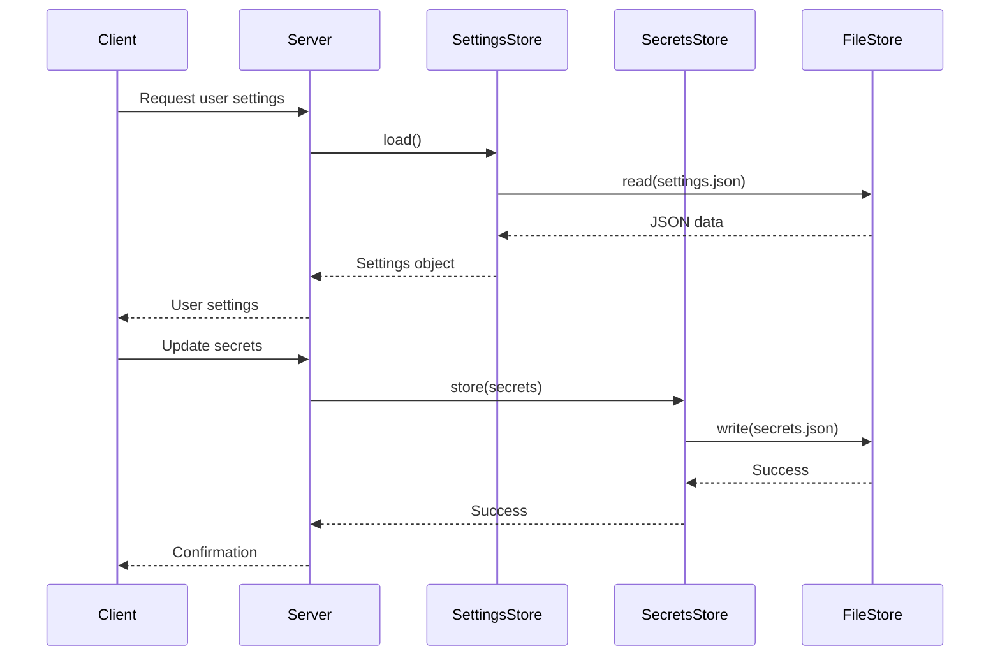
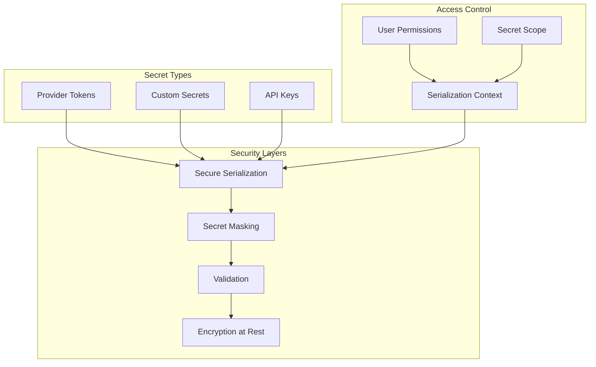

# User Data Management Module

The User Data Management module provides secure storage and management of user-specific data in OpenHands, including user settings and sensitive secrets like API keys and authentication tokens. This module implements an extensible architecture that allows applications to customize how user data is stored while maintaining security and consistency.

## Core Components

### SecretsStore
Abstract base class for storing user secrets including provider tokens and custom secrets. Provides secure handling of sensitive data with proper serialization controls.

### SettingsStore  
Abstract base class for storing user settings and preferences. Manages persistent configuration data that affects user experience and agent behavior.

### UserSecrets
Data model for user secrets containing provider tokens (for services like GitHub, GitLab) and custom secrets with secure serialization and validation.

### Settings
Data model for user settings including agent preferences, LLM configuration, security settings, and other persistent user preferences.

## Architecture Overview



## Component Relationships



## Data Flow



## Security Architecture



## Key Features

### Extensible Storage Architecture
- Abstract base classes allow custom implementations
- Plugin-based architecture via `get_impl()` utility
- Support for multiple storage backends (file, S3, Google Cloud)
- Configurable through server configuration

### Secure Secret Management
- Immutable data structures using `MappingProxyType`
- Context-aware serialization with secret masking
- Secure handling of provider tokens and custom secrets
- Integration with event stream for secret masking

### User Settings Persistence
- Comprehensive user preference storage
- LLM configuration management
- Agent behavior customization
- Security and confirmation mode settings

### Multi-User Support
- User-scoped data isolation
- Configurable user identification
- Support for both authenticated and anonymous users

## Integration Points

### Server System Integration
The module integrates with the [server_and_api](server_and_api.md) module through:
- Server configuration for store implementations
- Session management for user data access
- Authentication system for user identification

### Storage System Integration
Built on the [storage_system](storage_system.md) foundation:
- Uses FileStore for backend storage abstraction
- Supports multiple storage providers
- Consistent error handling and async operations

### Configuration Integration
Integrates with [core_configuration](core_configuration.md):
- Loads default settings from configuration files
- Merges user settings with system defaults
- Supports environment-specific configurations

## Usage Patterns

### Settings Management
```python
# Load user settings
settings_store = await SettingsStoreImpl.get_instance(config, user_id)
settings = await settings_store.load()

# Update settings
settings.agent = "CodeActAgent"
settings.max_iterations = 50
await settings_store.store(settings)
```

### Secrets Management
```python
# Load user secrets
secrets_store = await SecretsStoreImpl.get_instance(config, user_id)
secrets = await secrets_store.load()

# Add provider token
secrets.provider_tokens[ProviderType.GITHUB] = ProviderToken(
    token="ghp_...",
    host="github.com"
)
await secrets_store.store(secrets)
```

### Event Stream Integration
```python
# Mask secrets in event stream
user_secrets = await secrets_store.load()
user_secrets.set_event_stream_secrets(event_stream)
```

## Extension Points

### Custom Store Implementation
Applications can implement custom storage backends:

```python
class DatabaseSecretsStore(SecretsStore):
    async def load(self) -> UserSecrets | None:
        # Custom database implementation
        pass
    
    async def store(self, secrets: UserSecrets) -> None:
        # Custom database implementation
        pass
    
    @classmethod
    async def get_instance(cls, config, user_id):
        # Custom instantiation logic
        pass
```

### Configuration Integration
Set custom implementations in server configuration:
```python
server_config.secret_store_class = "myapp.stores.DatabaseSecretsStore"
server_config.settings_store_class = "myapp.stores.DatabaseSettingsStore"
```

## Security Considerations

### Secret Protection
- Secrets are masked by default in serialization
- Explicit context required to expose secret values
- Immutable data structures prevent accidental modification
- Secure deletion and cleanup of sensitive data

### Access Control
- User-scoped data isolation
- Authentication-based access control
- Configurable permission models
- Audit trail capabilities

### Data Validation
- Pydantic-based validation for all data models
- Type safety and constraint enforcement
- Sanitization of user inputs
- Error handling for malformed data

## Performance Considerations

### Caching Strategy
- In-memory caching of frequently accessed settings
- Lazy loading of user data
- Efficient serialization/deserialization
- Minimal I/O operations

### Scalability
- Async/await pattern for non-blocking operations
- Support for distributed storage backends
- Efficient data structures and algorithms
- Resource cleanup and memory management

## Related Modules

- [storage_system](storage_system.md) - Foundation storage infrastructure
- [server_and_api](server_and_api.md) - Server integration and session management
- [core_configuration](core_configuration.md) - Configuration management
- [git_integrations](git_integrations.md) - Provider token usage
- [llm_integration](llm_integration.md) - LLM configuration storage

## Future Enhancements

### Planned Features
- Encryption at rest for sensitive data
- Advanced access control and permissions
- Data migration and versioning support
- Enhanced audit logging and monitoring
- Multi-tenant data isolation improvements

### Extension Opportunities
- Database-backed storage implementations
- Cloud-native secret management integration
- Advanced caching and performance optimizations
- Real-time data synchronization capabilities