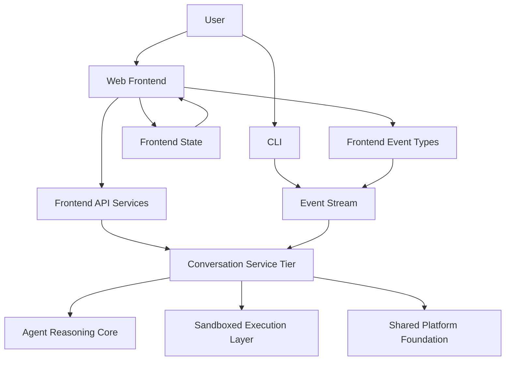
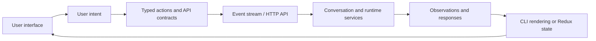

# User-Facing Clients

The `user_facing_clients` module contains OpenHands’ terminal and web-client interfaces. It connects users to conversations, agent events, runtime services, workspace files, and usage metrics through the CLI and frontend layers.

## Module Structure

| Component | Path | Purpose |
|---|---|---|
| CLI | `openhands/cli` | Terminal interaction, event rendering, confirmations, commands, and shell setup |
| Frontend API Services | `frontend/src/api` | Typed HTTP services for conversations, authentication, repositories, settings, secrets, and microagents |
| Frontend Event Types | `frontend/src/types/core` | TypeScript contracts for actions, observations, protocol messages, and microagent status |
| Frontend State | `frontend/src/state` | Redux Toolkit state for conversation UI, editor buffers, attachments, and usage metrics |

## Architecture

The CLI and web frontend are separate presentation clients. Both consume conversation events and submit user actions, while frontend services handle HTTP communication and frontend state manages client-side presentation data.

## Core Component References

- [CLI](cli.md)
- [Frontend API Services](frontend_api_services.md)
- [Frontend Event Types](frontend_event_types.md)
- [Frontend State](frontend_state.md)
- [Conversation Service Tier](conversation_service_tier.md)
- [Event System](event_system.md)
- [Agent Reasoning Core](agent_reasoning_core.md)
- [Sandboxed Execution Layer](sandboxed_execution_layer.md)
- [Shared Platform Foundation](shared_platform_foundation.md)