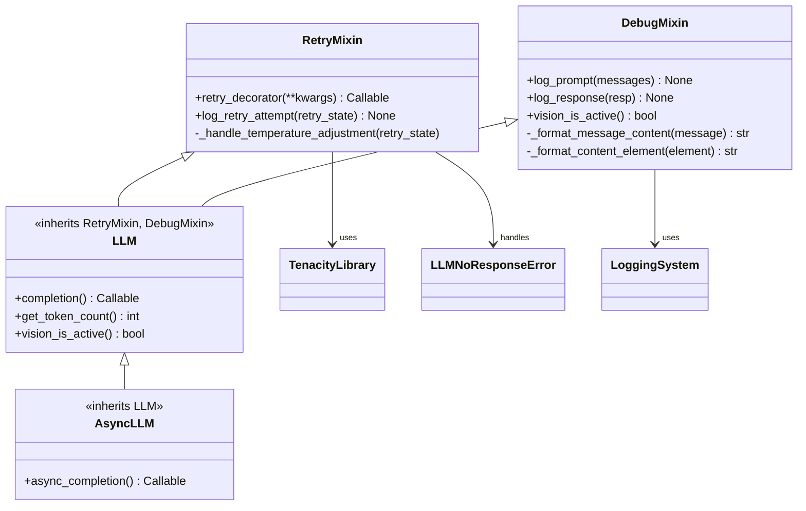
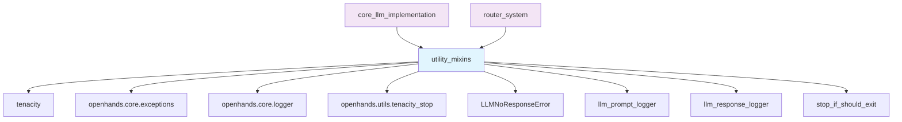
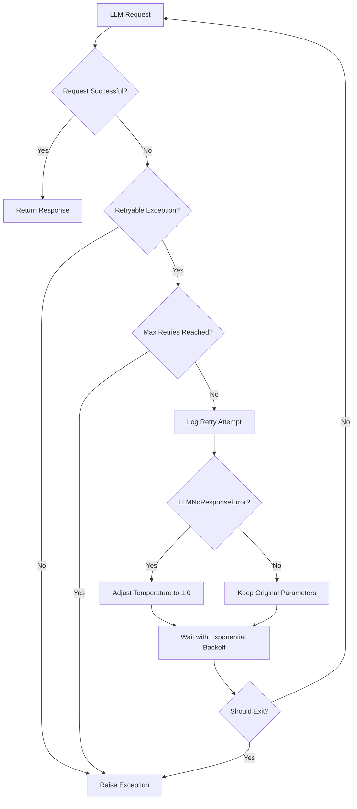
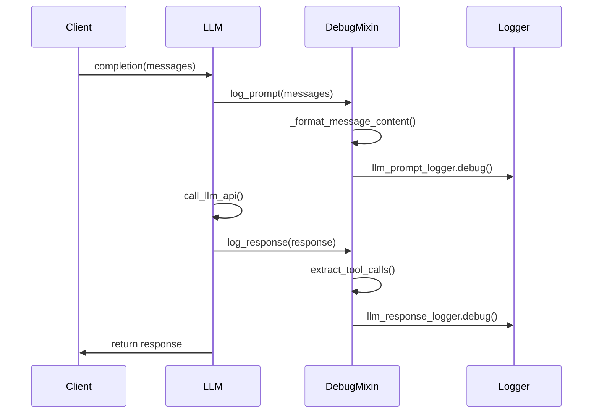
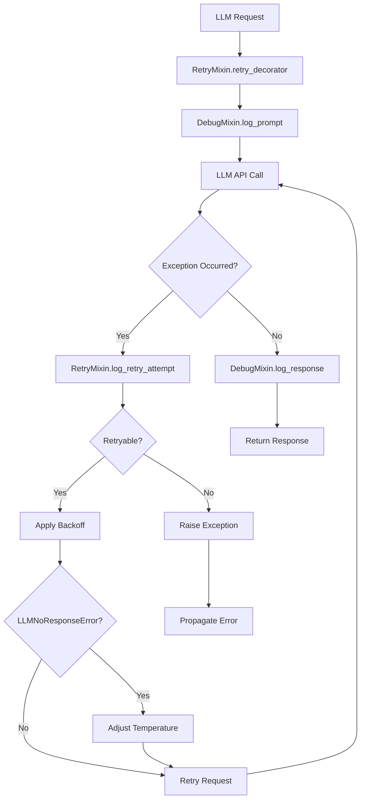
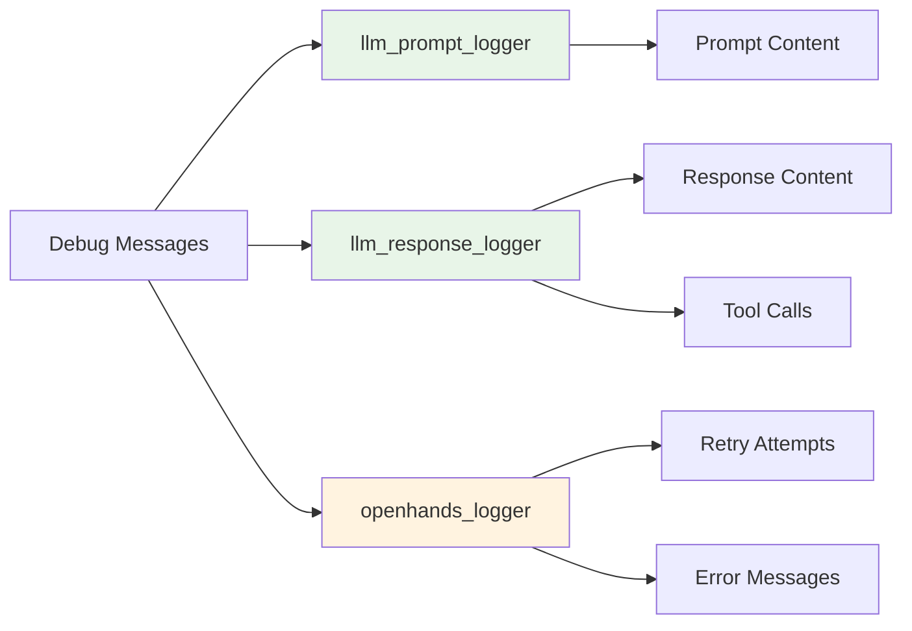

# Utility Mixins Module

The utility_mixins module provides essential mixin classes that enhance LLM functionality with retry logic and debugging capabilities. These mixins are fundamental components of the [llm_integration](llm_integration.md) system, providing cross-cutting concerns that are shared across all LLM implementations.

## Overview

This module contains two core mixin classes:
- **RetryMixin**: Implements configurable retry logic for handling transient LLM failures
- **DebugMixin**: Provides comprehensive logging and debugging capabilities for LLM interactions

These mixins are designed to be composed with LLM classes to provide robust error handling and observability without duplicating code across different LLM implementations.

## Architecture



## Component Dependencies



## Core Components

### RetryMixin

The RetryMixin class provides configurable retry logic for LLM operations, handling transient failures and implementing intelligent retry strategies.

#### Key Features

- **Configurable Retry Parameters**: Supports customizable retry counts, wait times, and multipliers
- **Exception-Specific Handling**: Targets specific exception types for retry logic
- **Temperature Adjustment**: Automatically adjusts temperature for `LLMNoResponseError` cases
- **Exponential Backoff**: Implements exponential backoff with jitter for optimal retry timing
- **Graceful Exit Handling**: Integrates with system shutdown signals

#### Retry Strategy



#### Configuration Parameters

| Parameter | Description | Default Behavior |
|-----------|-------------|------------------|
| `num_retries` | Maximum number of retry attempts | Configurable per LLM |
| `retry_exceptions` | Tuple of exception types to retry | LLM-specific exceptions |
| `retry_min_wait` | Minimum wait time between retries | Exponential backoff minimum |
| `retry_max_wait` | Maximum wait time between retries | Exponential backoff maximum |
| `retry_multiplier` | Backoff multiplier | Exponential growth factor |
| `retry_listener` | Callback for retry events | Optional notification handler |

### DebugMixin

The DebugMixin class provides comprehensive logging and debugging capabilities for LLM interactions, enabling detailed observability of LLM operations.

#### Key Features

- **Prompt Logging**: Detailed logging of input messages and prompts
- **Response Logging**: Comprehensive logging of LLM responses including tool calls
- **Multi-format Support**: Handles various message formats (text, images, tool calls)
- **Vision Content Handling**: Special handling for vision-enabled models
- **Performance Optimization**: Conditional logging based on debug level

#### Logging Flow



## Integration with LLM System

### Mixin Composition

The utility mixins are composed with LLM classes using multiple inheritance:

```python
class LLM(RetryMixin, DebugMixin):
    def __init__(self, config, service_id, metrics=None, retry_listener=None):
        # Initialize LLM-specific functionality
        self.retry_listener = retry_listener
        
        # Apply retry decorator to completion function
        @self.retry_decorator(
            num_retries=self.config.num_retries,
            retry_exceptions=LLM_RETRY_EXCEPTIONS,
            retry_min_wait=self.config.retry_min_wait,
            retry_max_wait=self.config.retry_max_wait,
            retry_multiplier=self.config.retry_multiplier,
            retry_listener=self.retry_listener,
        )
        def wrapper(*args, **kwargs):
            # Log prompt
            self.log_prompt(messages)
            
            # Make LLM call
            resp = self._completion_unwrapped(*args, **kwargs)
            
            # Log response
            self.log_response(resp)
            
            return resp
        
        self._completion = wrapper
```

### Error Handling Integration



## Error Handling Strategies

### Exception Types

The retry system handles specific exception types:

- **Rate Limiting (429)**: Exponential backoff with jitter
- **Service Unavailable (503)**: Retry with increasing delays
- **Connection Errors**: Network-level retry logic
- **LLMNoResponseError**: Special handling with temperature adjustment

### Temperature Adjustment Logic

For `LLMNoResponseError` (primarily seen in Gemini models):

1. **Detection**: Identify LLMNoResponseError during retry
2. **Temperature Check**: Verify current temperature setting
3. **Adjustment**: Set temperature to 1.0 if currently 0
4. **Logging**: Log the temperature adjustment
5. **Retry**: Attempt request with adjusted parameters

## Logging and Observability

### Log Levels and Destinations



### Message Formatting

The debug system handles various content types:

- **Text Messages**: Direct string logging
- **Image Content**: URL logging for vision models
- **Tool Calls**: Function name and arguments
- **Multi-part Content**: Structured formatting

## Performance Considerations

### Conditional Logging

```python
def log_prompt(self, messages):
    if not logger.isEnabledFor(DEBUG):
        # Skip expensive string operations if not debugging
        return
    
    # Proceed with detailed logging
    debug_message = MESSAGE_SEPARATOR.join(
        self._format_message_content(msg) for msg in messages
    )
```

### Memory Optimization

- **Lazy Evaluation**: String formatting only when needed
- **Conditional Processing**: Skip operations when debug disabled
- **Efficient Serialization**: Optimized message formatting

## Configuration Integration

### Retry Configuration

The mixins integrate with the broader configuration system:

```python
# From LLMConfig
num_retries: int = 8
retry_min_wait: int = 15
retry_max_wait: int = 120
retry_multiplier: float = 2
```

### Debug Configuration

```python
# From LLMConfig
log_completions: bool = False
log_completions_folder: Optional[str] = None
```

## Usage Patterns

### Basic Usage

```python
# Mixins are automatically applied to all LLM instances
llm = LLM(config=llm_config, service_id="main")

# Retry and debug functionality is transparent
response = llm.completion(messages=[{"role": "user", "content": "Hello"}])
```

### Custom Retry Listeners

```python
def retry_callback(attempt: int, max_retries: int):
    print(f"Retry attempt {attempt}/{max_retries}")

llm = LLM(config=llm_config, service_id="main", retry_listener=retry_callback)
```

## Related Documentation

- [llm_integration](llm_integration.md) - Overall LLM system architecture
- [core_llm_implementation](core_llm_implementation.md) - Base LLM classes
- [router_system](router_system.md) - LLM routing and load balancing
- [events_and_actions](events_and_actions.md) - Event system integration

## Future Enhancements

### Planned Improvements

1. **Adaptive Retry Strategies**: Dynamic adjustment based on error patterns
2. **Circuit Breaker Pattern**: Prevent cascading failures
3. **Metrics Integration**: Enhanced observability with custom metrics
4. **Structured Logging**: JSON-formatted logs for better parsing
5. **Retry Budget Management**: Global retry limits across requests

### Extension Points

- **Custom Retry Strategies**: Pluggable retry algorithms
- **Enhanced Debug Formatters**: Custom message formatting
- **Telemetry Integration**: OpenTelemetry support
- **Performance Profiling**: Request timing and resource usage