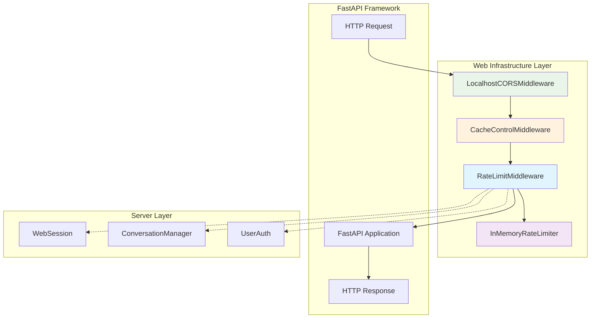
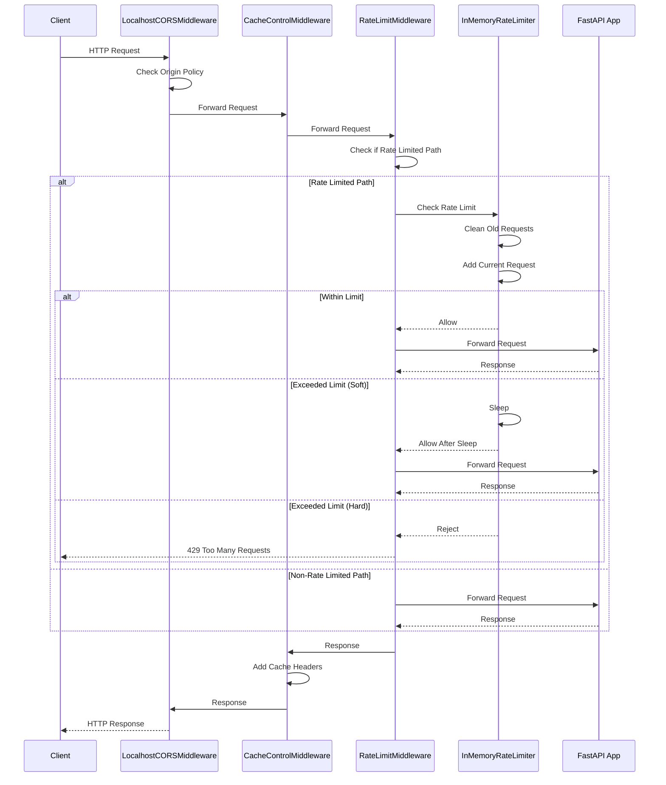
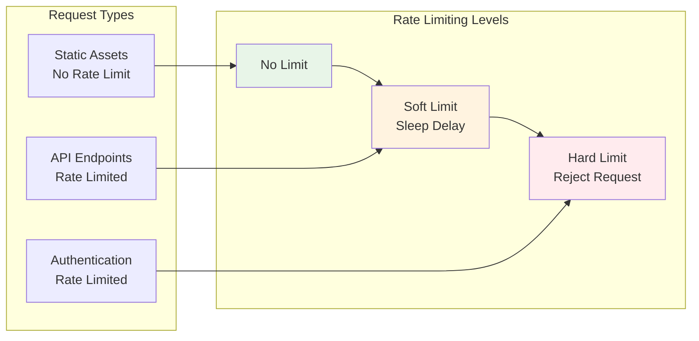

# Web Infrastructure Module

## Overview

The web_infrastructure module provides essential HTTP middleware components for the OpenHands server infrastructure. This module focuses on request processing, security, and performance optimization through specialized middleware implementations that handle CORS policies, caching strategies, and rate limiting mechanisms.

## Core Components

### RateLimitMiddleware
The primary component that implements request rate limiting to protect the server from abuse and ensure fair resource allocation across clients.

## Architecture



## Component Details

### RateLimitMiddleware

The `RateLimitMiddleware` is a FastAPI/Starlette middleware that provides request rate limiting functionality to protect the server from excessive requests.

**Key Features:**
- **Request Throttling**: Limits the number of requests per client within a specified time window
- **Selective Application**: Only applies rate limiting to specific request paths (excludes static assets)
- **Configurable Responses**: Returns HTTP 429 (Too Many Requests) with appropriate retry headers
- **Integration Ready**: Works seamlessly with FastAPI's middleware stack

**Configuration:**
- Uses `InMemoryRateLimiter` for tracking request history
- Configurable request limits and time windows
- Optional sleep mechanism for gradual throttling

### Supporting Components

#### InMemoryRateLimiter
An in-memory rate limiting implementation that tracks request history per client IP address.

**Features:**
- **Time-based Windows**: Tracks requests within configurable time periods
- **Automatic Cleanup**: Removes expired request records to prevent memory leaks
- **Gradual Throttling**: Optional sleep mechanism before rejecting requests
- **IP-based Tracking**: Uses client IP addresses as rate limiting keys

#### LocalhostCORSMiddleware
Custom CORS middleware that provides flexible cross-origin request handling.

**Features:**
- **Localhost Bypass**: Automatically allows requests from localhost/127.0.0.1
- **Environment Configuration**: Supports `PERMITTED_CORS_ORIGINS` environment variable
- **Standard Compliance**: Falls back to standard CORS rules for non-localhost origins

#### CacheControlMiddleware
Middleware for managing HTTP caching behavior across different resource types.

**Features:**
- **Asset Optimization**: Aggressive caching for fingerprinted static assets
- **Dynamic Content**: Disables caching for dynamic API responses
- **Performance Headers**: Sets appropriate Cache-Control, Pragma, and Expires headers

## Data Flow



## Integration Points

### Server and API Module
The web_infrastructure module integrates closely with the [server_and_api](server_and_api.md) module:

- **WebSession Integration**: Rate limiting protects session endpoints from abuse
- **ConversationManager Protection**: Prevents overwhelming conversation processing endpoints
- **UserAuth Coordination**: Works with authentication middleware for comprehensive security

### Configuration Management
Integrates with [core_configuration](core_configuration.md) for:

- **Environment Variables**: CORS origins configuration
- **Security Settings**: Rate limiting parameters
- **Performance Tuning**: Cache control policies

## Security Considerations

### Rate Limiting Strategy


### CORS Security Model
- **Localhost Development**: Permissive for local development
- **Production Origins**: Strict whitelist-based approach
- **Credential Handling**: Supports authenticated cross-origin requests

## Performance Optimization

### Caching Strategy
- **Static Assets**: Long-term caching with immutable headers
- **Dynamic Content**: Aggressive no-cache policies
- **Fingerprinted Resources**: Maximum cache efficiency

### Memory Management
- **Request History Cleanup**: Automatic removal of expired rate limit records
- **Efficient Data Structures**: Uses defaultdict for optimal memory usage
- **Configurable Retention**: Time-based cleanup prevents memory leaks

## Configuration Examples

### Rate Limiting Configuration
```python
# Basic rate limiter setup
rate_limiter = InMemoryRateLimiter(
    requests=10,        # Allow 10 requests
    seconds=60,         # Per 60 seconds
    sleep_seconds=1     # Sleep 1 second on soft limit
)

# Apply to FastAPI app
app.add_middleware(RateLimitMiddleware, rate_limiter=rate_limiter)
```

### CORS Configuration
```bash
# Environment variable for allowed origins
export PERMITTED_CORS_ORIGINS="https://app.example.com,https://admin.example.com"
```

## Error Handling

### Rate Limit Responses
- **Status Code**: 429 Too Many Requests
- **Retry Header**: Includes Retry-After header
- **JSON Response**: Structured error message
- **Client Guidance**: Clear indication of rate limit violation

### CORS Failures
- **Origin Validation**: Proper handling of disallowed origins
- **Preflight Requests**: Correct OPTIONS request processing
- **Error Responses**: Standard CORS error handling

## Monitoring and Observability

### Rate Limiting Metrics
- **Request Counts**: Per-client request tracking
- **Rejection Rates**: Monitor rate limit violations
- **Response Times**: Impact of sleep delays on performance

### Performance Monitoring
- **Cache Hit Rates**: Static asset caching effectiveness
- **Middleware Latency**: Processing time for each middleware layer
- **Memory Usage**: Rate limiter memory consumption patterns

## Future Enhancements

### Distributed Rate Limiting
- **Redis Backend**: Replace in-memory storage for multi-instance deployments
- **Consistent Hashing**: Distribute rate limiting across multiple servers
- **Cluster Coordination**: Synchronized rate limiting in containerized environments

### Advanced Security Features
- **IP Whitelisting**: Bypass rate limits for trusted sources
- **Dynamic Rate Limits**: Adjust limits based on server load
- **Behavioral Analysis**: Detect and prevent abuse patterns

## Dependencies

This module depends on:
- **FastAPI/Starlette**: Core web framework and middleware infrastructure
- **Standard Library**: datetime, collections, urllib for core functionality
- **Environment Configuration**: OS environment variables for CORS settings

## Related Documentation

- [Server and API](server_and_api.md) - Main server infrastructure and session management
- [Authentication System](authentication_system.md) - User authentication and authorization
- [Core Configuration](core_configuration.md) - System configuration management
- [Security System](security_system.md) - Comprehensive security analysis and protection