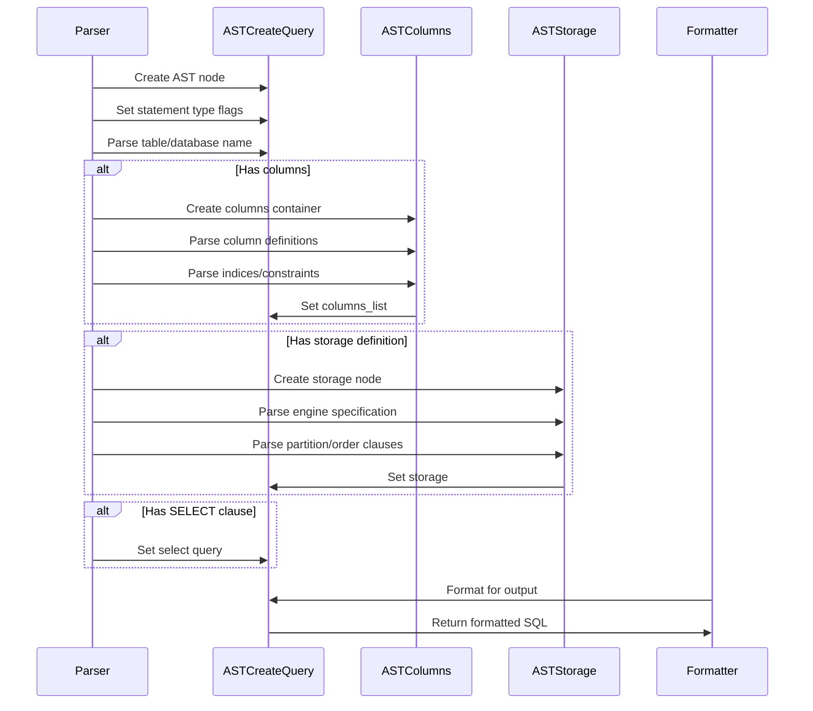
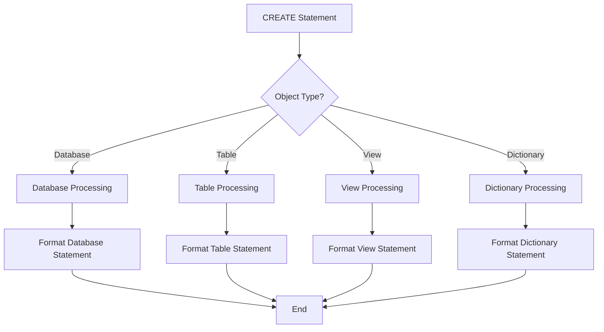
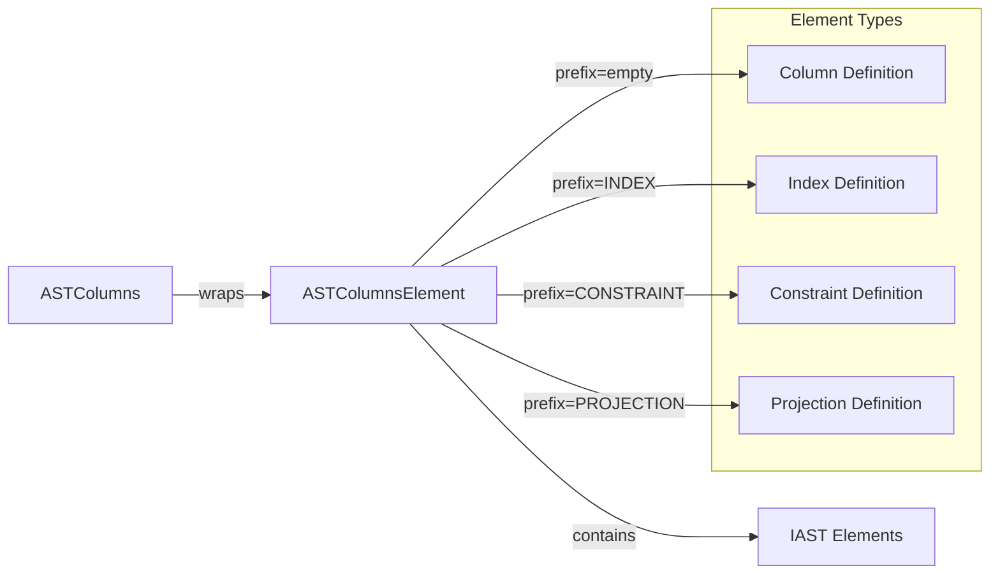
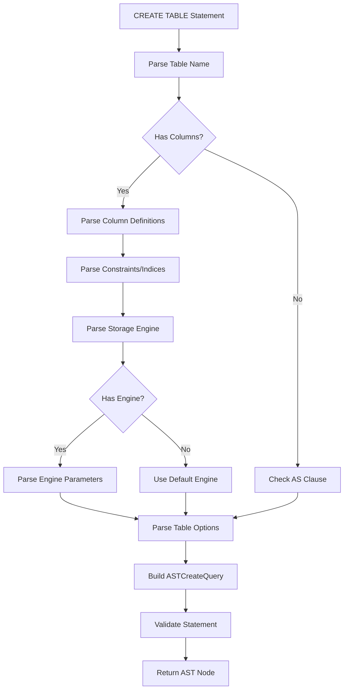
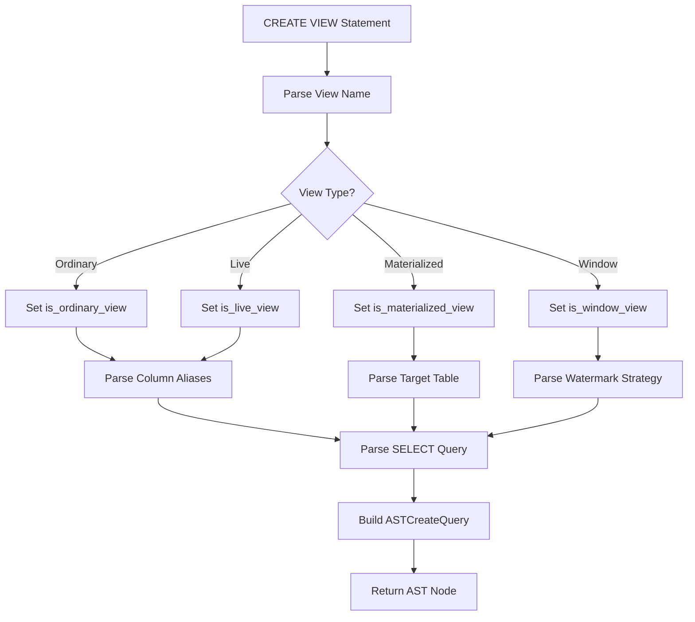

# AST_Create_Query Module Documentation

## Overview

The AST_Create_Query module is a core component of the ClickHouse SQL parser system, responsible for representing and handling CREATE, ATTACH, and related DDL (Data Definition Language) queries in Abstract Syntax Tree (AST) form. This module provides the foundational structures for parsing, storing, and formatting database object creation statements.

## Purpose and Core Functionality

The primary purpose of the AST_Create_Query module is to:

1. **Represent CREATE/ATTACH Statements**: Define AST nodes for various database object creation operations including tables, views, dictionaries, and databases
2. **Handle Complex DDL Syntax**: Support sophisticated CREATE statement syntax including storage engines, partitioning, indexing, and constraints
3. **Enable Query Manipulation**: Provide cloning and formatting capabilities for query transformation and serialization
4. **Support Multiple Object Types**: Handle different database objects through a unified interface

## Architecture and Component Relationships

### Core Components

#### 1. ASTColumnsElement
- **Purpose**: Wrapper class for individual column and constraint elements within CREATE statements
- **Key Features**:
  - Supports prefix-based formatting (e.g., "INDEX", "CONSTRAINT", "PROJECTION")
  - Provides cloning and formatting capabilities
  - Manages child element references through pointer manipulation

#### 2. ASTStorage
- **Purpose**: Represents storage engine configuration and table properties
- **Components**:
  - Engine specification (`ASTFunction *engine`)
  - Partitioning configuration (`IAST *partition_by`)
  - Primary key definition (`IAST *primary_key`)
  - Ordering configuration (`IAST *order_by`)
  - Sampling configuration (`IAST *sample_by`)
  - TTL settings (`IAST *ttl_table`)
  - Storage settings (`ASTSetQuery *settings`)

#### 3. ASTColumns
- **Purpose**: Container for column definitions, indices, constraints, and projections
- **Components**:
  - Column definitions (`ASTExpressionList *columns`)
  - Index definitions (`ASTExpressionList *indices`)
  - Constraint definitions (`ASTExpressionList *constraints`)
  - Projection definitions (`ASTExpressionList *projections`)
  - Primary key handling (`IAST *primary_key`, `IAST *primary_key_from_columns`)

#### 4. ASTCreateQuery
- **Purpose**: Main AST node representing CREATE/ATTACH statements
- **Key Features**:
  - Multi-object support (tables, views, dictionaries, databases)
  - Comprehensive flag system for different statement types
  - UUID management for replication and clustering
  - Target table support for materialized views
  - SQL security support for views

### Module Dependencies

```mermaid
graph TD
    AST_Create_Query[AST_Create_Query Module]
    
    subgraph "Parser Dependencies"
        ASTExpressionList[ASTExpressionList]
        ASTFunction[ASTFunction]
        ASTSelectWithUnionQuery[ASTSelectWithUnionQuery]
        CommonParsers[CommonParsers]
        CreateQueryUUIDs[CreateQueryUUIDs]
        ASTDictionary[ASTDictionary]
        ASTDictionaryAttributeDeclaration[ASTDictionaryAttributeDeclaration]
        ASTTableOverrides[ASTTableOverrides]
        ASTViewTargets[ASTViewTargets]
        ASTSQLSecurity[ASTSQLSecurity]
        ASTRefreshStrategy[ASTRefreshStrategy]
    end
    
    subgraph "Core Dependencies"
        StorageID[StorageID]
        QuoteString[quoteString]
        IOOperators[IO Operators]
        WriteBufferFromString[WriteBufferFromString]
    end
    
    AST_Create_Query --> ASTExpressionList
    AST_Create_Query --> ASTFunction
    AST_Create_Query --> ASTSelectWithUnionQuery
    AST_Create_Query --> CommonParsers
    AST_Create_Query --> CreateQueryUUIDs
    AST_Create_Query --> ASTDictionary
    AST_Create_Query --> ASTTableOverrides
    AST_Create_Query --> ASTViewTargets
    AST_Create_Query --> ASTSQLSecurity
    AST_Create_Query --> ASTRefreshStrategy
    AST_Create_Query --> StorageID
    AST_Create_Query --> QuoteString
    AST_Create_Query --> IOOperators
    AST_Create_Query --> WriteBufferFromString
```

## Data Flow and Processing

### Query Parsing Flow

### Object Type Handling

## Component Interactions

### ASTColumnsElement Usage

## Key Features and Capabilities

### 1. Multi-Object Support
The module handles various database objects through a unified interface:
- **Tables**: Standard tables with columns and storage engines
- **Views**: Ordinary, materialized, live, and window views
- **Dictionaries**: External data source dictionaries
- **Databases**: Database creation with storage engines

### 2. Advanced Storage Configuration
Supports complex storage engine configurations:
- Engine specification with parameters
- Partitioning strategies
- Primary key and ordering configurations
- TTL (Time To Live) settings
- Storage-specific settings

### 3. View Management
Comprehensive view support including:
- Multiple view types (ordinary, materialized, live, window)
- Target table specifications for materialized views
- SQL security configurations
- Refresh strategies for materialized views
- Parameterized view support

### 4. Clustering and Replication
Built-in support for distributed environments:
- UUID generation and management
- Cluster-aware formatting
- Replication configuration
- ON CLUSTER clause support

## Integration with Other Modules

### Related Modules
- **[Parsers](Parsers.md)**: Parent module providing base parsing infrastructure
- **[Interpreters](Interpreters.md)**: Processes AST nodes into executable operations
- **[Storage_Engine](Storage_Engine.md)**: Handles storage engine implementations
- **[Core_Engine](Core_Engine.md)**: Provides core system settings and utilities

### Usage Context
The AST_Create_Query module is typically used in:
1. **Query Parsing**: Converting SQL text to AST representation
2. **Query Analysis**: Examining CREATE statement structure
3. **Query Transformation**: Modifying or rewriting CREATE statements
4. **Query Serialization**: Converting AST back to SQL text
5. **Schema Management**: Database administration and migration tools

## Process Flow Examples

### CREATE TABLE Processing

### CREATE VIEW Processing

## Error Handling and Validation

The module incorporates several validation mechanisms:
- **Type Checking**: Ensures correct object type combinations
- **Required Elements**: Validates mandatory components for each object type
- **Syntax Validation**: Checks SQL syntax compliance during formatting
- **UUID Consistency**: Validates UUID generation and management

## Performance Considerations

### Memory Management
- Uses shared pointers for automatic memory management
- Implements efficient cloning through selective copying
- Minimizes string allocations during formatting

### Processing Optimization
- Lazy evaluation of complex components
- Efficient tree traversal algorithms
- Optimized formatting for large statements

## Extension Points

The module provides several extension mechanisms:
- **Custom Storage Engines**: Through ASTStorage extension
- **New Object Types**: Via ASTCreateQuery inheritance
- **Additional Constraints**: Through ASTColumns modification
- **Formatting Options**: Via FormatSettings customization

This comprehensive design makes the AST_Create_Query module a robust foundation for handling complex DDL operations in ClickHouse while maintaining flexibility for future enhancements.