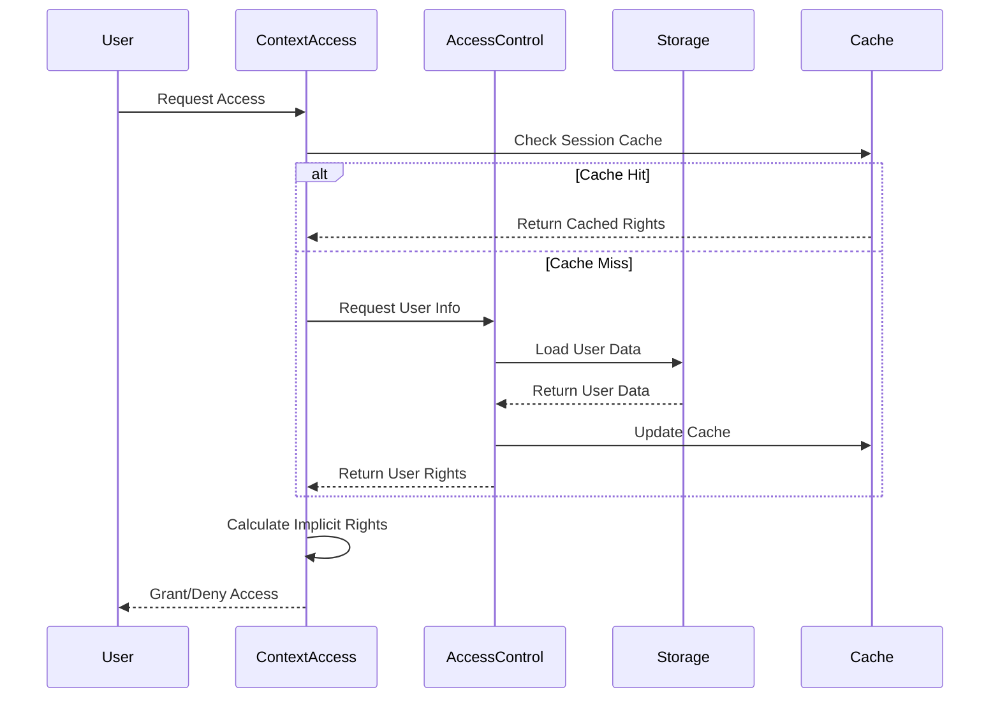

# Access Control Module Documentation

## Overview

The Access Control module is a critical security component of the ClickHouse database system that manages user authentication, authorization, and access rights. It provides a comprehensive framework for controlling who can access the database system and what operations they can perform.

## Purpose and Core Functionality

The Access Control module serves as the central security hub, responsible for:

- **User Authentication**: Verifying user identities through various authentication methods
- **Access Authorization**: Managing granular permissions and privileges
- **Role-Based Access Control (RBAC)**: Implementing role-based security models
- **Row-Level Security**: Applying fine-grained access controls at the row level
- **Quota Management**: Enforcing resource usage limits
- **Settings Management**: Controlling user-specific configuration settings

## Architecture Overview

```mermaid
graph TB
    subgraph "Access Control Core"
        AC[AccessControl<br/>Main Controller]
        CA[ContextAccess<br/>Session Context]
        AR[AccessRights<br/>Permission Engine]
    end
    
    subgraph "Storage Layer"
        MAS[MultipleAccessStorage<br/>Storage Manager]
        UAS[UsersConfigAccessStorage<br/>XML Storage]
        DAS[DiskAccessStorage<br/>File Storage]
        RAS[ReplicatedAccessStorage<br/>ZK Storage]
        MAS2[MemoryAccessStorage<br/>Memory Storage]
        LAS[LDAPAccessStorage<br/>LDAP Storage]
    end
    
    subgraph "Caching & Performance"
        CAC[ContextAccessCache<br/>Session Cache]
        RC[RoleCache<br/>Role Cache]
        RPC[RowPolicyCache<br/>Row Policy Cache]
        QC[QuotaCache<br/>Quota Cache]
        SPC[SettingsProfilesCache<br/>Settings Cache]
    end
    
    subgraph "Security Components"
        EA[ExternalAuthenticators<br/>Auth Providers]
        PCR[PasswordComplexityRules<br/>Password Policy]
        CSP[CustomSettingsPrefixes<br/>Settings Validation]
    end
    
    AC --> MAS
    AC --> CAC
    AC --> RC
    AC --> RPC
    AC --> QC
    AC --> SPC
    AC --> EA
    AC --> PCR
    AC --> CSP
    
    CA --> AR
    MAS --> UAS
    MAS --> DAS
    MAS --> RAS
    MAS --> MAS2
    MAS --> LAS
    
    style AC fill:#f9f,stroke:#333,stroke-width:4px
    style CA fill:#bbf,stroke:#333,stroke-width:2px
    style AR fill:#bbf,stroke:#333,stroke-width:2px
```

## Core Components

### 1. AccessControl (Main Controller)
The central orchestrator that coordinates all access control operations. It manages multiple storage backends, caching systems, and security policies.

**Key Responsibilities:**
- Storage management and coordination
- Authentication processing
- Configuration management
- Change notification handling

### 2. ContextAccess (Session Context)
Manages access rights for individual user sessions, providing contextual security enforcement.

**Key Responsibilities:**
- Session-specific access validation
- Implicit access rights calculation
- User and role information management
- Real-time access checking

### 3. AccessRights (Permission Engine)
Implements the core permission system using a sophisticated radix tree structure for efficient access rights management.

**Key Responsibilities:**
- Permission storage and retrieval
- Grant/revoke operations
- Wildcard permission handling
- Permission inheritance and optimization

## Sub-modules

### [Access Rights Management](Access_Rights_Management.md)
Handles the core permission system with granular control over database operations. Implements a sophisticated radix tree structure for efficient permission storage and retrieval, supporting wildcard permissions and multi-level access control.

### [Authentication Management](Authentication_Management.md)
Provides multiple authentication methods including LDAP, external providers, and local authentication. Manages password complexity rules and external authenticator configurations.

### [Access Flags System](Access_Flags_System.md)
Implements the core permission flag system that defines all available access types and their relationships. Provides conversion utilities between different permission representations.

### [Context Access System](Context_Access_System.md)
Manages session-specific access contexts with precalculated flags for optimal performance. Handles implicit access rights calculation and real-time access validation.

### Storage Backend Management
Manages multiple storage backends for access control data persistence, including XML configuration files, disk-based storage, memory storage, LDAP integration, and ZooKeeper-based replicated storage.

### Caching and Performance
Implements sophisticated caching mechanisms including session caches, role caches, row policy caches, quota caches, and settings profile caches for optimal performance.

## Data Flow

## Integration with Other Modules

The Access Control module integrates with several other system modules:

- **[Core_Engine](Core_Engine.md)**: Provides settings management and server configuration
- **[Interpreters](Interpreters.md)**: Supplies context information and query execution permissions
- **[Storage_Engine](Storage_Engine.md)**: Manages table-level access controls
- **[Query_Planning](Query_Planning.md)**: Enforces access controls during query planning

## Security Features

### Multi-Level Access Control
- **Global Level**: System-wide permissions
- **Database Level**: Database-specific permissions
- **Table Level**: Table-specific permissions
- **Column Level**: Column-specific permissions

### Advanced Security Policies
- **Row-Level Security**: Fine-grained row access controls
- **Quota Enforcement**: Resource usage limitations
- **Password Complexity**: Configurable password policies
- **External Authentication**: Integration with external identity providers

## Configuration and Management

The module supports extensive configuration options including:

- Multiple storage backends (XML, disk, memory, LDAP, ZooKeeper)
- Configurable password policies and complexity rules
- Custom settings validation and prefixes
- Role-based access control with inheritance
- Quota management and enforcement

## Performance Considerations

The Access Control module implements several performance optimizations:

- **Multi-level Caching**: Session, role, and policy caching
- **Radix Tree Structure**: Efficient permission storage and lookup
- **Lazy Loading**: On-demand loading of access information
- **Change Notifications**: Efficient cache invalidation

This comprehensive access control system ensures robust security while maintaining high performance in enterprise-scale deployments.