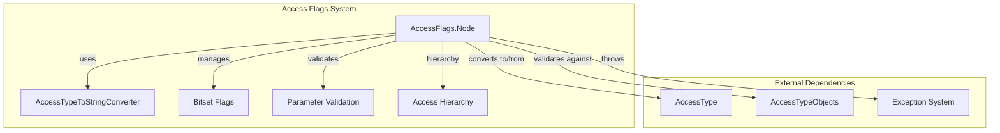
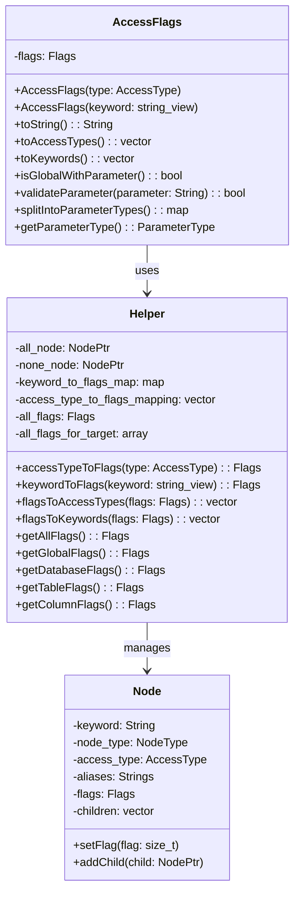
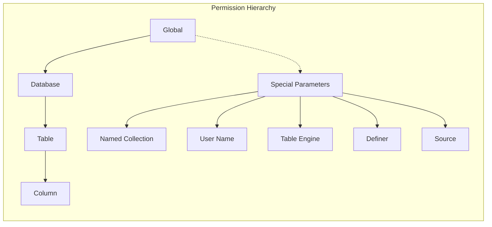
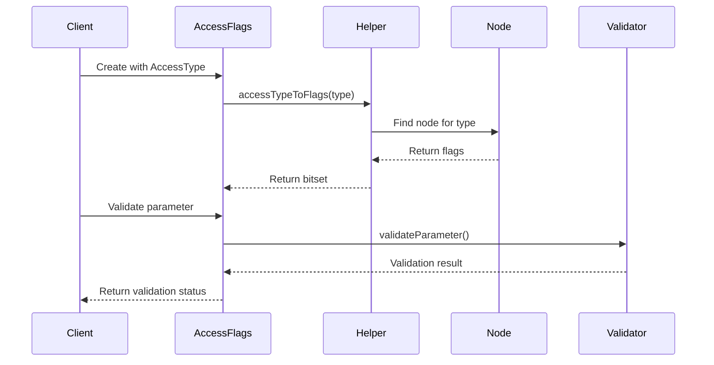
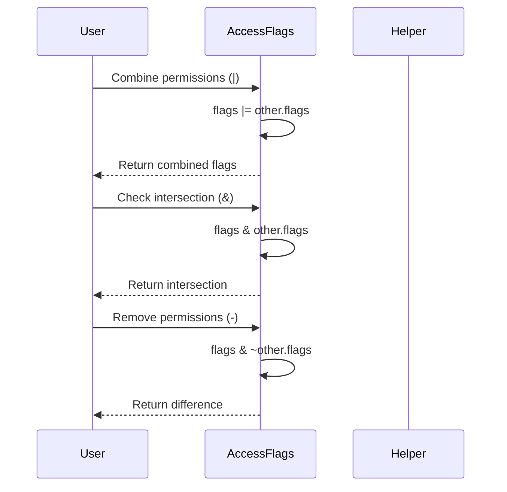
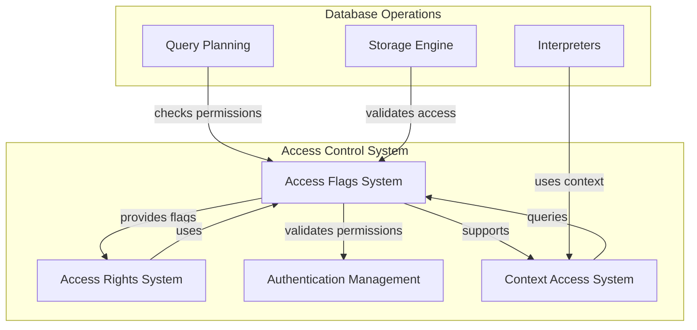

# Access Flags System Documentation

## Introduction

The Access Flags System is a critical component of the Access Control module that manages and validates database access permissions. It provides a hierarchical flag-based system for representing, combining, and validating different types of access rights across various database objects including global permissions, databases, tables, columns, dictionaries, and specialized entities like named collections and table engines.

## Core Architecture

### Component Overview

The Access Flags System consists of two primary components:

1. **AccessFlags.Node** - The core flag management system that handles bitset-based permission representation
2. **AccessType.AccessTypeToStringConverter** - Utility for converting between access types and string representations

### System Architecture



## Core Components

### AccessFlags.Node

The `AccessFlags.Node` component is the heart of the access control system. It implements a sophisticated hierarchical flag management system using bitset operations for efficient permission handling.

#### Key Features:
- **Hierarchical Structure**: Organizes access types in a tree structure with parent-child relationships
- **Bitset-based Storage**: Uses `std::bitset` for efficient flag operations
- **Multi-level Support**: Handles permissions at global, database, table, column, and specialized levels
- **Parameter Validation**: Validates access parameters for different object types
- **Alias Support**: Supports multiple aliases for the same access type

#### Architecture Details:



#### Node Hierarchy System:

The system organizes access types into a hierarchical tree structure:

```mermaid
graph TD
    ALL[ALL - Root Node]
    NONE[NONE - No Access]
    
    ALL --> GLOBAL[Global Level]
    ALL --> DATABASE[Database Level]
    ALL --> TABLE[Table Level]
    ALL --> COLUMN[Column Level]
    ALL --> DICTIONARY[Dictionary Level]
    ALL --> NAMED_COLLECTION[Named Collection]
    ALL --> USER_NAME[User Name]
    ALL --> TABLE_ENGINE[Table Engine]
    ALL --> DEFINER[Definer]
    ALL --> SOURCE[Source]
    
    GLOBAL --> SELECT[SELECT]
    GLOBAL --> INSERT[INSERT]
    GLOBAL --> UPDATE[UPDATE]
    GLOBAL --> DELETE[DELETE]
    GLOBAL --> CREATE[CREATE]
    GLOBAL --> DROP[DROP]
    GLOBAL --> ALTER[ALTER]
    
    DATABASE --> DB_SELECT[DATABASE SELECT]
    DATABASE --> DB_INSERT[DATABASE INSERT]
    DATABASE --> DB_CREATE[DATABASE CREATE]
    DATABASE --> DB_DROP[DATABASE DROP]
    
    TABLE --> TBL_SELECT[TABLE SELECT]
    TABLE --> TBL_INSERT[TABLE INSERT]
    TABLE --> TBL_UPDATE[TABLE UPDATE]
    TABLE --> TBL_DELETE[TABLE DELETE]
    TABLE --> TBL_ALTER[TABLE ALTER]
    
    COLUMN --> COL_SELECT[COLUMN SELECT]
    COLUMN --> COL_UPDATE[COLUMN UPDATE]
```



#### Permission Levels:

The system supports multiple permission granularity levels:



### AccessType.AccessTypeToStringConverter

This utility component provides bidirectional conversion between `AccessType` enum values and their string representations.

#### Features:
- **Enum to String**: Converts `AccessType` enum values to human-readable strings
- **String Normalization**: Handles underscore-to-space conversion for better readability
- **Singleton Pattern**: Uses singleton pattern for efficient resource usage
- **Static Mapping**: Maintains a static mapping for O(1) lookup performance

## Data Flow

### Flag Creation and Validation Flow



### Permission Combination Flow



## Key Operations

### 1. Flag Creation
```cpp
// From AccessType
AccessFlags flags(AccessType::SELECT);

// From keyword
AccessFlags flags("SELECT");

// From multiple keywords
std::vector<std::string_view> keywords = {"SELECT", "INSERT"};
AccessFlags flags(keywords);
```

### 2. Permission Operations
```cpp
// Combine permissions
auto combined = flags1 | flags2;

// Check intersection
auto intersection = flags1 & flags2;

// Remove permissions
auto difference = flags1 - flags2;

// Invert permissions
auto inverted = ~flags;
```

### 3. Validation and Conversion
```cpp
// Convert to string
String str = flags.toString();

// Convert to access types
auto types = flags.toAccessTypes();

// Convert to keywords
auto keywords = flags.toKeywords();

// Validate parameter
String parameter = "my_source";
bool valid = flags.validateParameter(parameter);
```

### 4. Parameter Type Handling
```cpp
// Check if has parameters
bool has_params = flags.isGlobalWithParameter();

// Get parameter type
auto param_type = flags.getParameterType();

// Split by parameter types
auto split_flags = flags.splitIntoParameterTypes();
```

## Integration with Access Control System

The Access Flags System integrates with the broader access control architecture:



## Error Handling

The system implements comprehensive error handling for various scenarios:

- **Unknown Access Type**: Throws `UNKNOWN_ACCESS_TYPE` when invalid access type is provided
- **Logical Errors**: Throws `LOGICAL_ERROR` for internal consistency issues
- **Mixed Parameter Types**: Throws `MIXED_ACCESS_PARAMETER_TYPES` when incompatible parameter types are combined

## Performance Characteristics

- **Flag Operations**: O(1) for bitwise operations
- **Type Conversion**: O(1) for enum-to-flag conversion via static mapping
- **Hierarchy Traversal**: O(n) where n is the depth of the access type hierarchy
- **String Conversion**: O(m) where m is the number of access types represented
- **Parameter Validation**: O(k) where k is the number of valid parameter values

## Security Considerations

1. **Permission Inheritance**: Child permissions properly inherit from parent groups
2. **Parameter Validation**: Strict validation prevents injection attacks
3. **Case Sensitivity**: Keyword matching is case-insensitive for user convenience
4. **Alias Handling**: Multiple aliases provide flexibility while maintaining security
5. **Flag Combination**: Bitwise operations ensure atomic permission changes

## Dependencies

The Access Flags System depends on:

- **[AccessType](Access_Control.md)**: Core access type definitions
- **[AccessTypeObjects](Access_Control.md)**: Parameter validation objects
- **[Exception System](Common_Utilities.md)**: Error handling infrastructure
- **[String Utilities](Common_Utilities.md)**: String manipulation functions

## Usage Examples

### Basic Permission Management
```cpp
// Create read permissions
AccessFlags read_flags("SELECT");

// Create write permissions
AccessFlags write_flags(std::vector<std::string_view>{"INSERT", "UPDATE"});

// Combine permissions
AccessFlags read_write = read_flags | write_flags;

// Check if has specific permission
bool can_read = read_write.contains("SELECT");
```

### Parameter-based Permissions
```cpp
// Create source-related permissions
AccessFlags source_flags(AccessType::SOURCES);

// Validate source parameter
String source_name = "kafka_source";
if (source_flags.validateParameter(source_name)) {
    // Parameter is valid, proceed with operation
}
```

### Hierarchical Permission Checking
```cpp
// Get all table-level permissions
auto table_flags = AccessFlags::allTableFlags();

// Get all database-level permissions
auto db_flags = AccessFlags::allDatabaseFlags();

// Check if permission is grantable at specific level
bool grantable_at_table = table_flags.contains(specific_permission);
```

This comprehensive system provides a robust foundation for managing database access permissions with fine-grained control, efficient operations, and extensive validation capabilities.