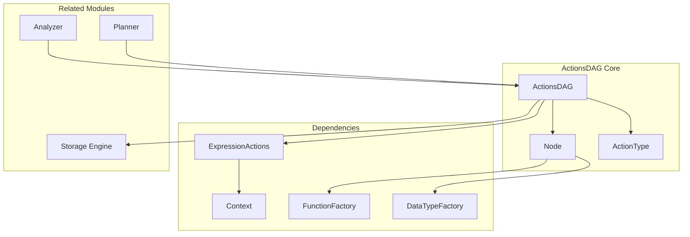
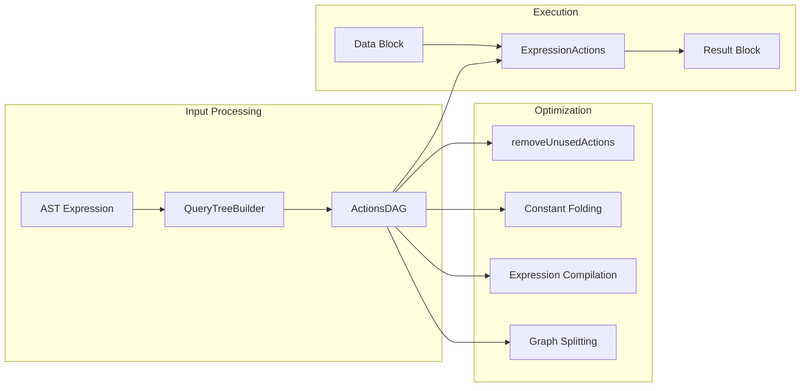
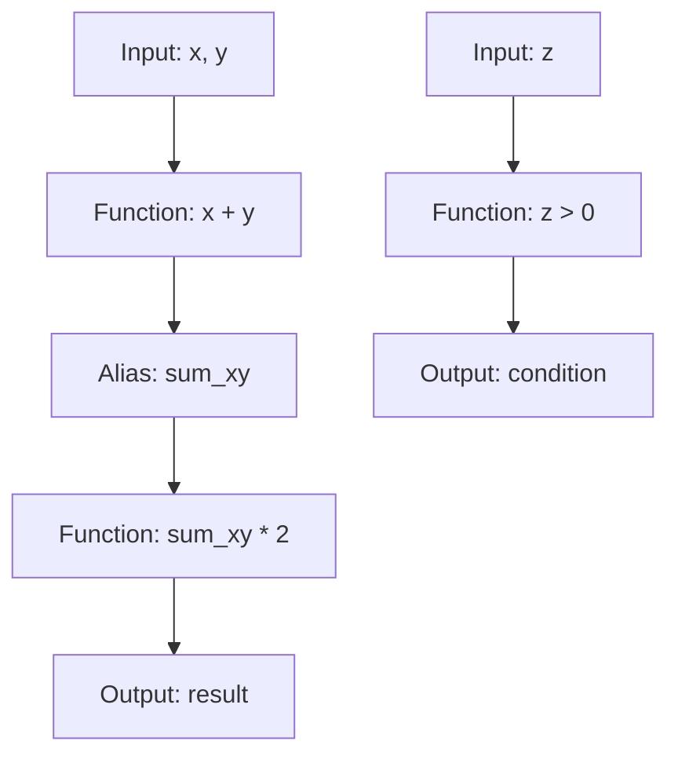
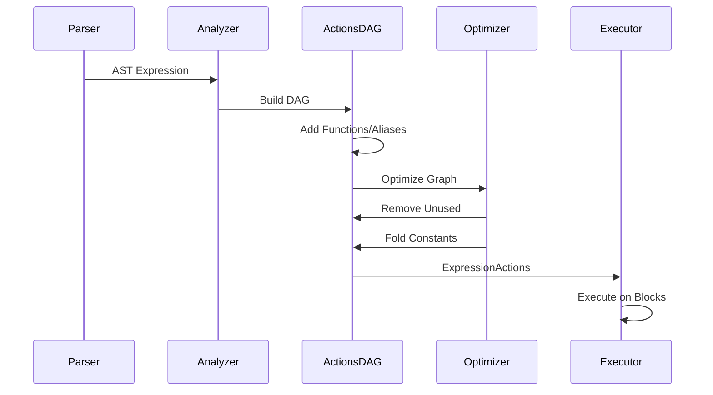
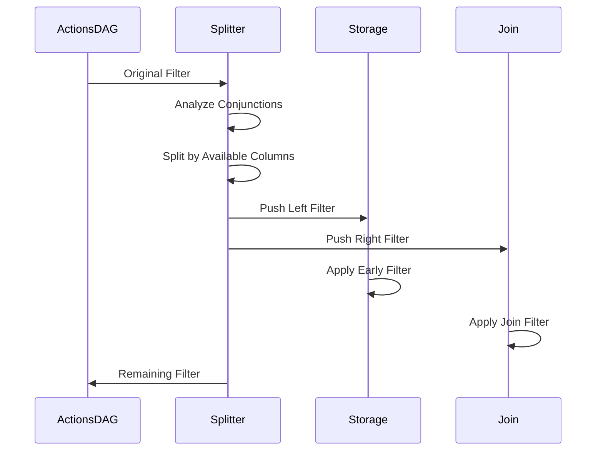

# ActionsDAG Module Documentation

## Overview

The ActionsDAG module is a core component of ClickHouse's query execution engine that represents expressions as a Directed Acyclic Graph (DAG). This module provides an intermediate representation for actions built from expression list ASTs, enabling sophisticated optimization and execution strategies for query processing.

## Purpose and Core Functionality

ActionsDAG serves as the central abstraction for representing and manipulating expressions in ClickHouse. It transforms SQL expressions into a graph structure where nodes represent individual operations (functions, constants, inputs, aliases) and edges represent data dependencies. This representation enables:

- **Expression Optimization**: Removal of unused expressions, constant folding, and subexpression compilation
- **Query Planning**: Analysis of dependencies and execution order optimization
- **Code Generation**: Compilation of expressions to native code for performance
- **Distributed Execution**: Splitting expressions for parallel processing
- **Filter Pushdown**: Optimization of WHERE conditions for early filtering

## Architecture

### Core Components

#### 1. Node Structure (`src.Interpreters.ActionsDAG.Node`)
The fundamental building block representing a single operation in the expression graph:

```cpp
struct Node {
    NodeRawConstPtrs children;        // Child dependencies
    ActionType type;                  // Node type (INPUT, COLUMN, ALIAS, etc.)
    std::string result_name;          // Output column name
    DataTypePtr result_type;          // Output data type
    FunctionBasePtr function_base;    // Function signature and properties
    ExecutableFunctionPtr function;   // Prepared function for execution
    bool is_function_compiled;        // Compilation status
    bool is_deterministic_constant;   // Constant folding property
    ColumnPtr column;                 // Constant value (if applicable)
};
```

#### 2. Action Types
- **INPUT**: Columns that must be present in input blocks
- **COLUMN**: Constant columns with known values
- **ALIAS**: Alternative names for existing columns
- **ARRAY_JOIN**: Special operation that changes row count
- **FUNCTION**: General function applications
- **PLACEHOLDER**: Nodes for correlated columns (subqueries)

#### 3. Graph Structure
The DAG maintains three key collections:
- **nodes**: All nodes in the graph (std::list for stable pointers)
- **inputs**: Input nodes required for execution
- **outputs**: Result nodes produced by the graph

### Component Relationships



## Data Flow Architecture



## Key Features and Capabilities

### 1. Expression Representation and Manipulation

The DAG structure enables sophisticated expression analysis:



### 2. Optimization Strategies

#### Constant Folding
Automatically evaluates constant expressions at compile time:
- Identifies deterministic functions with constant arguments
- Pre-computes results to avoid runtime evaluation
- Maintains determinism properties for query planning

#### Unused Action Removal
Eliminates unnecessary computations:
- Traverses graph from required outputs
- Removes unreachable nodes
- Preserves input dependencies when needed

#### Expression Compilation
Compiles hot paths to native code:
- Identifies frequently executed expressions
- Uses LLVM for code generation
- Improves performance for complex calculations

### 3. Graph Splitting and Merging

#### Split Operations
Divides graphs for optimization:
- **Filter Pushdown**: Separates filter expressions for early evaluation
- **Array Join Splitting**: Isffects before/after array operations
- **Sorting Split**: Separates sort-dependent expressions

#### Merge Operations
Combines multiple expression graphs:
- Chains sequential operations
- Eliminates intermediate results
- Preserves execution semantics

## Process Flows

### Query Expression Processing



### Filter Pushdown Optimization



## Integration with Other Modules

### ExpressionActions Integration
ActionsDAG serves as the blueprint for [ExpressionActions](ExpressionActions.md), which handles actual block execution:
- DAG provides execution plan
- ExpressionActions manages runtime state
- Column data flows through the execution pipeline

### Analyzer Integration
The [Analyzer](Analyzer.md) module builds ActionsDAG from query AST:
- Resolves function calls and types
- Handles subqueries and correlations
- Manages scope and name resolution

### Storage Engine Integration
ActionsDAG enables storage-level optimizations:
- [Storage engines](Storage_Engine.md) can push down filters
- Index analysis uses DAG structure
- Projection matching leverages graph properties

## Advanced Features

### Projection Folding
Optimizes queries using materialized projections:
- Matches expression patterns to projection columns
- Substitutes complex expressions with simple inputs
- Reduces computation by using pre-calculated results

### Correlated Subquery Handling
Manages correlated columns through placeholders:
- PLACEHOLDER nodes represent correlated expressions
- Decorrelation transforms placeholders to inputs
- Enables efficient subquery execution

### Sorting Preservation Analysis
Determines if expressions preserve sort order:
- Analyzes function monotonicity
- Enables optimization of ORDER BY operations
- Prevents unnecessary re-sorting

## Performance Considerations

### Memory Management
- Uses std::list for stable node pointers
- Avoids unnecessary copying through move semantics
- Implements efficient graph traversal algorithms

### Compilation Strategy
- Compiles only hot expressions
- Balances compilation overhead vs. runtime benefit
- Supports lazy compilation for large queries

### Optimization Trade-offs
- Constant folding vs. compilation opportunities
- Graph complexity vs. optimization potential
- Memory usage vs. execution speed

## Error Handling

The module implements comprehensive error checking:
- Type validation during DAG construction
- Dependency cycle detection
- Input/output consistency verification
- Runtime error propagation with context

## Future Enhancements

Potential improvements include:
- Enhanced cost-based optimization
- Improved parallel execution support
- Advanced vectorization strategies
- Machine learning-based optimization hints

## References

- [ExpressionActions Module](ExpressionActions.md) - Runtime execution engine
- [Analyzer Module](Analyzer.md) - Query analysis and DAG construction
- [Storage Engine Module](Storage_Engine.md) - Storage-level optimizations
- [Query Planning Module](Query_Planning.md) - Query optimization strategies