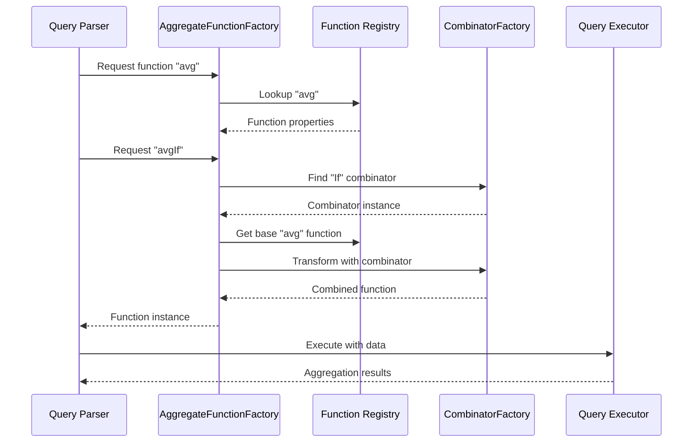

# Aggregate Functions Module Documentation

## Overview

The Aggregate Functions module is a core component of the database system that provides comprehensive support for aggregate operations across various data types and use cases. This module serves as the central hub for managing, creating, and executing aggregate functions, which are essential for analytical queries, data summarization, and statistical computations.

## Purpose and Scope

The Aggregate Functions module is responsible for:
- **Function Registration and Management**: Centralized registry for all aggregate functions available in the system
- **Function Factory Pattern**: Dynamic creation of aggregate function instances based on function names and parameters
- **Combinator Support**: Extensible system for combining aggregate functions with modifiers (e.g., Null, If, Array)
- **Type Safety**: Ensuring proper type handling and conversion for aggregate operations
- **Performance Optimization**: Compiled aggregate functions and efficient execution strategies

## Architecture Overview

```mermaid
graph TB
    subgraph "Aggregate Functions Module"
        AF[AggregateFunctionFactory]
        ACF[AggregateFunctionCombinatorFactory]
        RF[registerAggregateFunctions]
        
        subgraph "Core Components"
            AF --> |"manages"| AFS[Settings]
            ACF --> |"creates"| AFCF[AggregateFunctionCombinatorFactory]
            RF --> |"registers"| AF
            RF --> |"registers"| ACF
        end
        
        subgraph "Function Categories"
            AF --> |"creates"| Basic[Basic Functions<br/>- avg, count, sum<br/>- min, max, any]
            AF --> |"creates"| Statistical[Statistical Functions<br/>- quantile, stddev<br/>- corr, covar]
            AF --> |"creates"| Array[Array Functions<br/>- groupArray, groupUniqArray<br/>- arrayIntersect]
            AF --> |"creates"| Specialized[Specialized Functions<br/>- uniq, topK<br/>- retention, funnel]
        end
        
        subgraph "Combinators"
            ACF --> |"provides"| NullC[Null Combinator]
            ACF --> |"provides"| IfC[If Combinator]
            ACF --> |"provides"| ArrayC[Array Combinator]
            ACF --> |"provides"| StateC[State Combinator]
            ACF --> |"provides"| MergeC[Merge Combinator]
        end
    end
    
    subgraph "External Dependencies"
        Context[Interpreters.Context]
        Settings[Core.Settings]
        DataTypes[Data_Types Module]
        Functions[Functions Module]
        
        AF --> |"uses"| Context
        AF --> |"uses"| Settings
        AF --> |"validates"| DataTypes
        AF --> |"coordinates"| Functions
    end
```

## Core Components

### 1. AggregateFunctionFactory
The central factory class responsible for creating and managing aggregate function instances. It implements the factory pattern to dynamically instantiate aggregate functions based on their names, argument types, and parameters.

**Key Responsibilities:**
- Function registration and lookup
- Type validation and conversion
- Combinator application
- Null handling strategies
- Case-insensitive function name support

For detailed implementation details, see [Function Factory Documentation](Function_Factory.md).

### 2. AggregateFunctionCombinatorFactory
Manages aggregate function combinators that modify the behavior of base aggregate functions. Combinators allow for powerful function composition and specialized behaviors.

**Available Combinators:**
- **Null**: Handles nullable arguments
- **If**: Conditional aggregation
- **Array**: Array-based aggregation
- **ForEach**: Apply to each array element
- **SimpleState**: State serialization
- **State**: Advanced state management
- **Merge**: Merge partial aggregations
- **OrFill**: Fill missing values
- **Resample**: Resampling operations
- **Distinct**: Distinct value aggregation
- **Map**: Map-based operations

### 3. Function Registration System
The registration system serves as the initialization point for all aggregate functions in the system. It systematically registers functions across multiple categories.

For detailed registration process and implementation, see [Function Registration Documentation](Function_Registration.md).

## Function Categories

### Basic Aggregate Functions
- **Counting**: `count`, `countDistinct`
- **Summation**: `sum`, `sumWithOverflow`
- **Averaging**: `avg`, `avgWeighted`
- **Comparison**: `min`, `max`, `argMin`, `argMax`
- **Selection**: `any`, `anyLast`, `anyHeavy`

### Statistical Functions
- **Quantiles**: Multiple quantile implementations (exact, approximate, t-digest)
- **Standard Statistics**: `stddev`, `var`, `covar`, `corr`
- **Advanced Statistics**: Statistical tests, moment calculations
- **Distribution Analysis**: Histogram, entropy calculations

### Array and Collection Functions
- **Grouping**: `groupArray`, `groupUniqArray`, `groupArrayInsertAt`
- **Intersection**: `groupArrayIntersect`
- **Concatenation**: `groupConcat`
- **Sorting**: `groupArraySorted`

### Specialized Analytics
- **Uniqueness**: `uniq`, `uniqCombined`, `uniqUpTo`, `uniqExact`
- **Top Analysis**: `topK`, `topKWeighted`
- **Funnel Analysis**: `windowFunnel`
- **Retention**: `retention`
- **Sequence Matching**: `sequenceMatch`, `sequenceCount`

## Data Flow Architecture

## Integration with Other Modules

### Interpreters Module
The Aggregate Functions module works closely with the [Interpreters](Interpreters.md) module, particularly:
- **Context Management**: Uses query context for settings and configuration
- **Expression Actions**: Integrates with expression evaluation pipeline
- **Aggregator Component**: Coordinates with the compiled aggregate functions holder

### Data Types Module
Strong integration with the [Data_Types](Data_Types.md) module ensures:
- **Type Safety**: Proper validation of argument types
- **Type Conversion**: Automatic handling of type compatibility
- **Low Cardinality Optimization**: Special handling for low cardinality types
- **Nullable Types**: Seamless integration with nullable data types

### Functions Module
Coordination with the [Functions](Functions.md) module provides:
- **Function Distinction**: Clear separation between aggregate and scalar functions
- **Name Resolution**: Avoid conflicts between function types
- **Overload Resolution**: Consistent function resolution strategies

## Performance Considerations

### Compilation and Optimization
- **Compiled Functions**: Support for compiled aggregate functions for performance
- **State Management**: Efficient aggregation state handling
- **Memory Management**: Optimized memory usage for large aggregations

### Query Planning Integration
The module integrates with the [Query_Planning](Query_Planning.md) module to:
- **Cost Estimation**: Provide function execution cost estimates
- **Optimization Hints**: Suggest optimal execution strategies
- **Resource Planning**: Estimate memory and CPU requirements

## Error Handling and Validation

### Validation Strategies
- **Name Validation**: Function name length and format checks
- **Type Validation**: Argument type compatibility verification
- **Parameter Validation**: Parameter count and type checking
- **Combinator Validation**: Nested combinator restrictions

### Error Categories
- **Unknown Functions**: Clear error messages with suggestions
- **Type Mismatches**: Detailed type compatibility information
- **Invalid Combinations**: Prevention of unsupported combinator combinations
- **Resource Limits**: Protection against excessive resource usage

## Extension Points

### Adding New Functions
The modular design allows for easy extension:
1. Implement the aggregate function interface
2. Register in the appropriate category
3. Add to the registration system
4. Update documentation and tests

### Custom Combinators
New combinators can be added by:
1. Implementing the combinator interface
2. Registering with the combinator factory
3. Defining transformation logic
4. Testing with various base functions

## Configuration and Settings

The module respects system settings for:
- **Query Logging**: Optional logging of function usage
- **Memory Limits**: Aggregation memory constraints
- **Performance Tuning**: Various optimization settings
- **Compatibility**: Backward compatibility modes

This comprehensive approach ensures the Aggregate Functions module provides a robust, extensible, and performant foundation for all analytical operations within the database system.