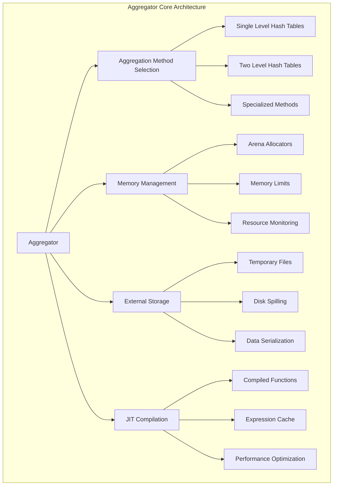
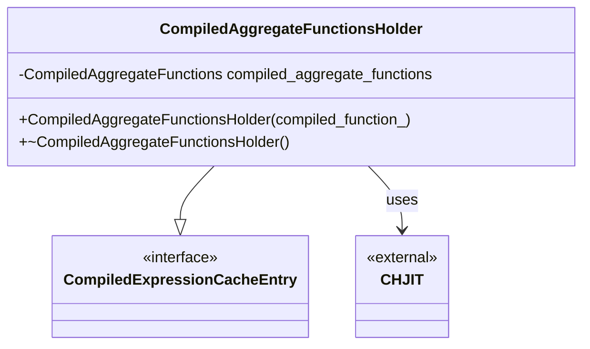
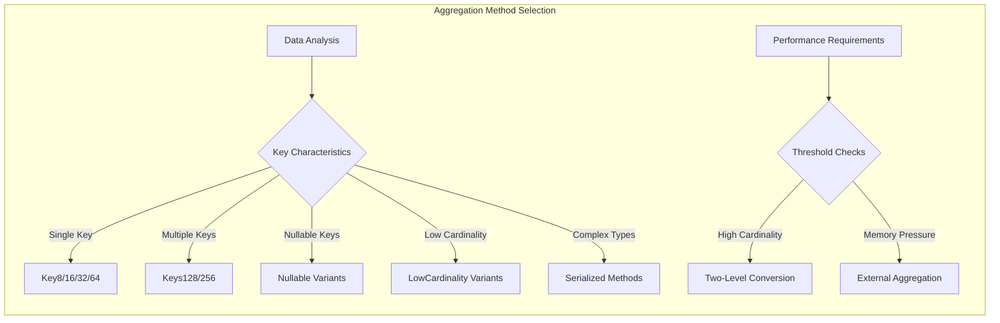
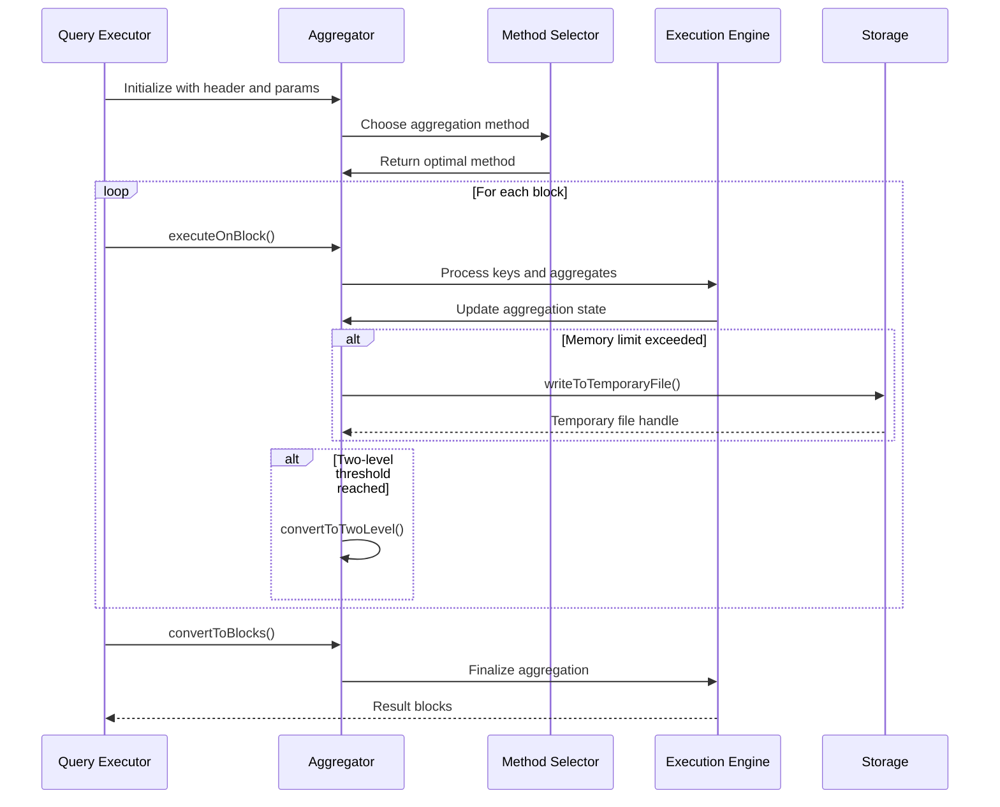
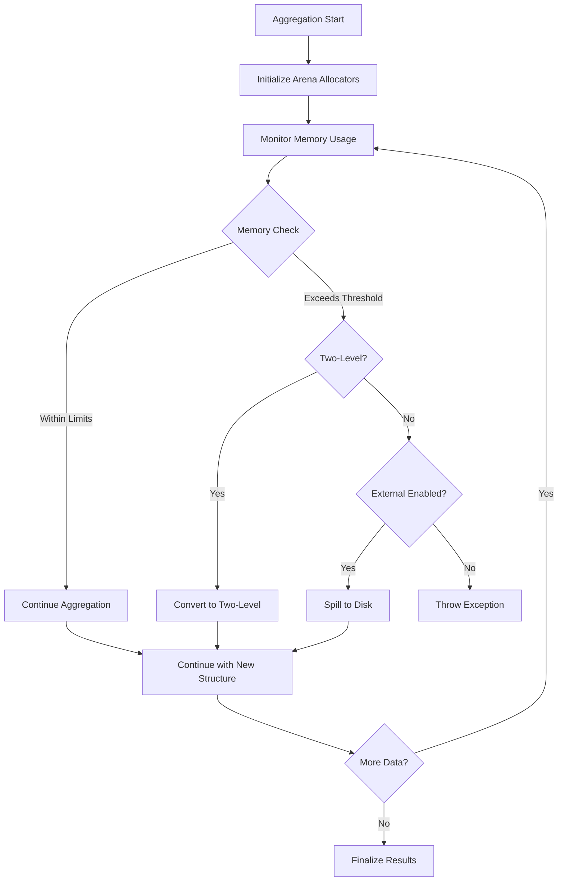
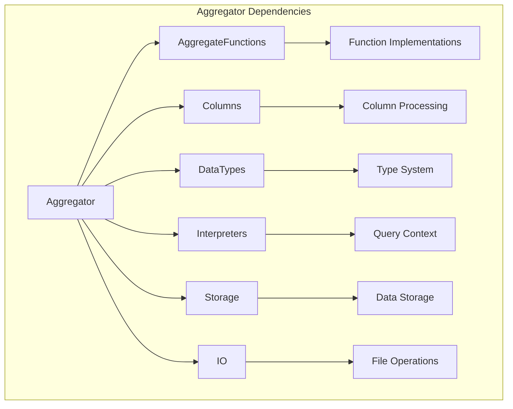

# Aggregator Module Documentation

## Introduction

The Aggregator module is a core component of the ClickHouse database system responsible for executing aggregation operations. It provides high-performance, memory-efficient aggregation capabilities with support for distributed computing, external memory usage, and JIT compilation optimizations. The module handles complex GROUP BY operations, aggregate function computations, and manages memory resources during large-scale data processing.

## Architecture Overview

The Aggregator module implements a sophisticated multi-level aggregation architecture that adapts to data characteristics and system constraints. It supports various aggregation methods, from simple in-memory hash tables to complex two-level structures that can spill to disk when memory limits are exceeded.



## Core Components

### CompiledAggregateFunctionsHolder

The `CompiledAggregateFunctionsHolder` is a critical component that manages JIT-compiled aggregate functions for performance optimization. It integrates with the embedded compiler system to provide compiled versions of aggregate functions when beneficial.



### Aggregator::Params

The `Params` structure encapsulates all configuration parameters for aggregation operations, including memory limits, thresholds, and optimization settings.

Key parameters include:
- **Memory Management**: `max_bytes_before_external_group_by`, `min_free_disk_space`
- **Performance Tuning**: `group_by_two_level_threshold`, `max_threads`, `enable_prefetch`
- **Compilation Control**: `compile_aggregate_expressions`, `min_count_to_compile_aggregate_expression`
- **Optimization**: `optimize_group_by_constant_keys`, `min_hit_rate_to_use_consecutive_keys_optimization`

### Aggregation Methods

The module implements multiple aggregation methods optimized for different data characteristics:



## Data Flow Architecture

### Aggregation Pipeline



### Memory Management Flow



## Key Features

### 1. Adaptive Aggregation Methods

The module automatically selects the most efficient aggregation method based on:
- Key data types and sizes
- Cardinality estimates
- Nullable key presence
- Low cardinality optimization opportunities

### 2. Two-Level Aggregation

When data cardinality exceeds thresholds, the system converts to two-level hash tables:
- **First Level**: In-memory hash table with limited buckets
- **Second Level**: Disk-based storage for overflow data
- **Benefits**: Enables parallel processing and memory efficiency

### 3. External Aggregation

For large datasets exceeding memory limits:
- Automatic spilling to temporary files
- Compressed storage format
- Parallel merge operations
- Configurable disk space management

### 4. JIT Compilation

Performance optimization through runtime compilation:
- Compiles frequently used aggregate functions
- Reduces function call overhead
- Integrates with expression cache
- Configurable compilation thresholds

### 5. Memory Management

Sophisticated memory management including:
- Arena-based allocation for efficiency
- Memory usage tracking
- Configurable limits and thresholds
- Automatic cleanup and resource management

## Integration with Other Modules

### Dependencies



### Related Modules

- **[AggregateFunctions](Aggregate_Functions.md)**: Provides aggregate function implementations
- **[Columns](Columns.md)**: Handles columnar data structures
- **[DataTypes](Data_Types.md)**: Manages data type system
- **[Interpreters](Interpreters.md)**: Query execution context and coordination
- **[Storage_Engine](Storage_Engine.md)**: Data storage and retrieval
- **[IO_System](IO_System.md)**: File operations and temporary storage

## Performance Optimizations

### 1. Prefetching

The module implements intelligent prefetching for large hash tables:
- L2 cache size detection
- Configurable prefetch thresholds
- Automatic enablement based on data size

### 2. Consecutive Keys Optimization

Optimizes processing of consecutive identical keys:
- Cache hit rate monitoring
- Automatic optimization enablement
- Reduced function call overhead

### 3. Simple Count Optimization

Special handling for COUNT() operations:
- Inline counting without state allocation
- Direct memory updates
- Significant performance improvement

### 4. Parallel Processing

Multi-threaded aggregation support:
- Configurable thread pools
- Lock-free data structures where possible
- Efficient work distribution

## Configuration and Usage

### Key Parameters

```cpp
struct AggregatorParams {
    // Memory management
    size_t max_bytes_before_external_group_by;
    size_t min_free_disk_space;
    
    // Performance tuning
    size_t group_by_two_level_threshold;
    size_t group_by_two_level_threshold_bytes;
    size_t max_threads;
    
    // Compilation settings
    bool compile_aggregate_expressions;
    size_t min_count_to_compile_aggregate_expression;
    
    // Optimization settings
    bool enable_prefetch;
    bool optimize_group_by_constant_keys;
    float min_hit_rate_to_use_consecutive_keys_optimization;
};
```

### Usage Patterns

1. **Standard Aggregation**: Direct aggregation with automatic method selection
2. **External Aggregation**: Large dataset processing with disk spilling
3. **Parallel Aggregation**: Multi-threaded processing for performance
4. **Compiled Aggregation**: JIT-optimized functions for repeated operations

## Error Handling and Monitoring

### Exception Management

The module implements comprehensive error handling:
- Memory allocation failures
- Disk space exhaustion
- Data corruption detection
- Resource limit violations

### Performance Monitoring

Built-in metrics and logging:
- Memory usage tracking
- Aggregation method statistics
- Performance counters
- Debug information

## Future Enhancements

### Planned Improvements

1. **Advanced JIT Compilation**: Broader function support and better optimization
2. **GPU Acceleration**: CUDA/OpenCL support for massive parallel aggregation
3. **Machine Learning Integration**: Adaptive method selection based on historical data
4. **Cloud Storage Integration**: Direct spilling to cloud storage systems

### Scalability Considerations

- Horizontal scaling support for distributed aggregation
- Improved memory efficiency for ultra-large datasets
- Better integration with query planning optimization
- Enhanced support for real-time streaming aggregation

## Conclusion

The Aggregator module represents a sophisticated, high-performance aggregation engine that forms the backbone of ClickHouse's analytical capabilities. Its adaptive architecture, comprehensive optimization features, and robust error handling make it suitable for processing massive datasets in production environments. The module's design enables both real-time query processing and batch analytics while maintaining excellent performance characteristics across diverse workload patterns.