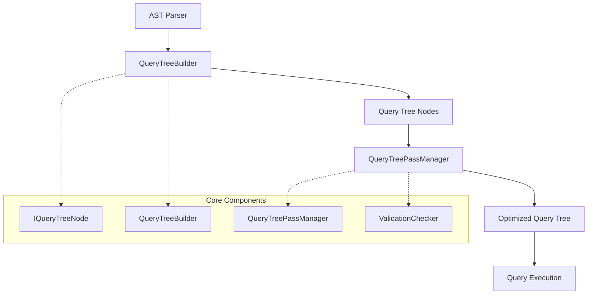

# Analyzer Module Documentation

## Overview

The Analyzer module is a core component of the ClickHouse query processing system responsible for transforming Abstract Syntax Trees (AST) into Query Trees. This transformation is a crucial step in query compilation that enables advanced query optimization and analysis.

## Purpose

The Analyzer module serves as the bridge between the parsing phase and the execution phase of query processing. It:

- Converts parsed AST representations into structured Query Tree nodes
- Performs semantic analysis and validation of queries
- Applies various optimization passes to improve query performance
- Resolves identifiers, functions, and expressions
- Manages query context and settings propagation

## Architecture



## Core Components

### 1. IQueryTreeNode
The base interface for all query tree nodes, providing:
- Tree structure management with parent-child relationships
- Hash computation for query tree nodes
- Equality comparison with cycle detection
- Cloning and replacement capabilities
- AST conversion functionality

For detailed information, see [Query Tree Node Management](Query_Tree_Node_Management.md).

### 2. QueryTreeBuilder
Responsible for converting AST nodes into Query Tree nodes:
- Handles SELECT, UNION, and INTERSECT/EXCEPT queries
- Processes expressions, functions, and subqueries
- Manages table expressions and joins
- Builds sort lists, window definitions, and column transformers

For detailed information, see [Query Tree Builder](Query_Tree_Builder.md).

### 3. QueryTreePassManager
Orchestrates query optimization passes:
- Manages a sequence of optimization passes
- Provides validation in debug builds
- Supports partial pass execution
- Includes over 25 different optimization passes

### 4. ValidationChecker
Ensures query tree integrity after each optimization pass:
- Validates column nodes have proper source references
- Verifies function resolution and argument types
- Checks for logical consistency in debug builds

For detailed information about optimization passes, see [Query Optimization Passes](Query_Optimization_Passes.md).

## Query Tree Node Types

The Analyzer supports various node types representing different query constructs:

- **IDENTIFIER**: Column and table references
- **FUNCTION**: Function calls and expressions
- **CONSTANT**: Literal values
- **QUERY**: Complete query representations
- **JOIN**: Join operations between tables
- **UNION**: Union operations between queries
- **SORT**: Order by clauses
- **WINDOW**: Window function definitions
- **TABLE**: Table references
- **COLUMN**: Column references with type information

## Optimization Passes

The QueryTreePassManager applies numerous optimization passes:

### Analysis Passes
- **QueryAnalysisPass**: Core semantic analysis and resolution
- **GroupingFunctionsResolvePass**: Resolves grouping functions
- **AutoFinalOnQueryPass**: Applies FINAL modifiers automatically

### Function Optimization
- **AggregateFunctionOfGroupByKeysPass**: Optimizes aggregate functions
- **CountDistinctPass**: Transforms COUNT(DISTINCT) operations
- **UniqToCountPass**: Converts uniq functions to count
- **RegexpFunctionRewritePass**: Optimizes regular expression functions

### Predicate Optimization
- **ConvertQueryToCNFPass**: Converts to Conjunctive Normal Form
- **CrossToInnerJoinPass**: Converts cross joins to inner joins
- **LogicalExpressionOptimizerPass**: Optimizes boolean expressions

### Expression Simplification
- **IfConstantConditionPass**: Simplifies constant conditions
- **MultiIfToIfPass**: Converts multiIf to simpler if expressions
- **ComparisonTupleEliminationPass**: Removes redundant tuple comparisons

## Integration with Other Modules

The Analyzer module interacts with several other system modules:

- **[Parsers](Parsers.md)**: Receives AST nodes from the parsing module
- **[Interpreters](Interpreters.md)**: Provides context and catalog information
- **[Functions](Functions.md)**: Resolves and validates function calls
- **[Data Types](Data_Types.md)**: Handles type resolution and validation
- **[Storage Engine](Storage_Engine.md)**: Processes table and column references

## Usage Example

```cpp
// Build query tree from AST
auto query_tree = buildQueryTree(ast_node, context);

// Create and configure pass manager
QueryTreePassManager pass_manager(context);
addQueryTreePasses(pass_manager, only_analyze);

// Run optimization passes
pass_manager.run(query_tree);

// Use optimized query tree for execution
executeQueryTree(query_tree);
```

## Key Features

1. **Comprehensive AST Support**: Handles all major SQL constructs including complex joins, subqueries, and window functions
2. **Extensible Architecture**: Easy to add new node types and optimization passes
3. **Robust Validation**: Extensive validation in debug builds ensures correctness
4. **Performance Optimization**: Multiple optimization passes improve query execution efficiency
5. **Type Safety**: Strong type checking and resolution throughout the analysis process

## Error Handling

The Analyzer module provides detailed error messages for:
- Invalid query syntax and semantics
- Type mismatches and resolution failures
- Missing columns or tables
- Function resolution errors
- Invalid join conditions

## Future Enhancements

Potential areas for improvement include:
- Additional optimization passes for specific query patterns
- Enhanced support for complex analytical functions
- Improved error reporting with suggestions
- Performance optimizations for large query trees
- Extended support for new SQL standards and features