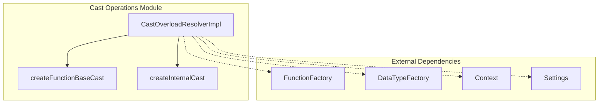
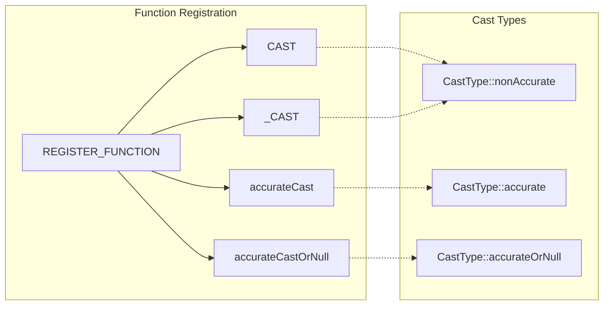
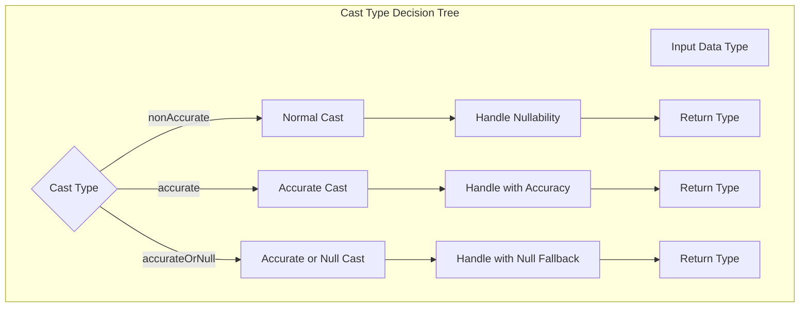
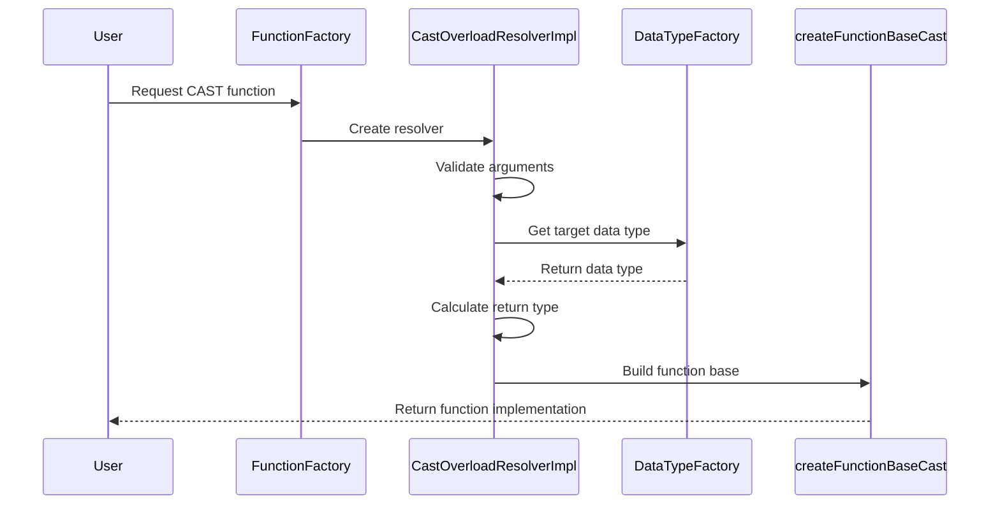
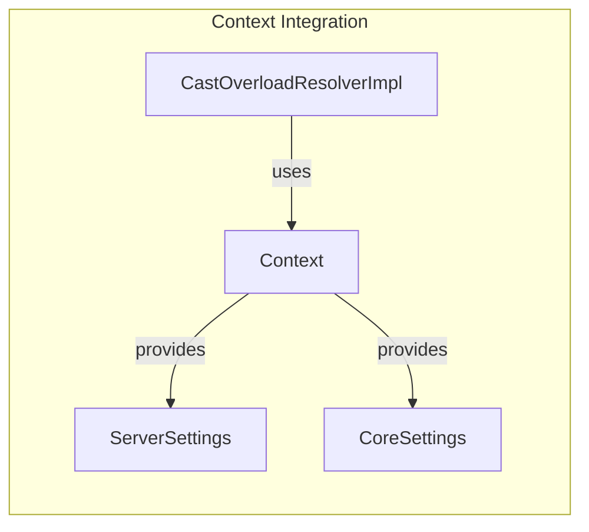
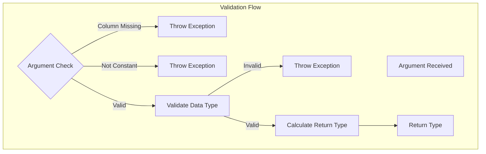

# Cast Operations Module Documentation

## Introduction

The Cast Operations module is a critical component of the ClickHouse database system that handles type conversion operations within SQL queries. This module provides the infrastructure for converting data between different types while maintaining data integrity and handling edge cases such as null values, overflow conditions, and accuracy requirements.

The module implements various casting functions including `CAST`, `accurateCast`, `accurateCastOrNull`, and the internal `_CAST` function, each serving specific use cases in query processing and data transformation.

## Architecture Overview

### Core Components

The Cast Operations module centers around the `CastOverloadResolverImpl` class, which implements the `IFunctionOverloadResolver` interface. This design allows the module to integrate seamlessly with ClickHouse's function resolution system while providing specialized casting logic.

### Function Registration and Resolution

The module registers multiple casting functions with the FunctionFactory, each with distinct behaviors:

## Detailed Component Analysis

### CastOverloadResolverImpl Class

The `CastOverloadResolverImpl` class serves as the primary implementation for all casting operations. It handles:

1. **Function Name Resolution**: Determines the appropriate function name based on cast type and internal flag
2. **Argument Validation**: Ensures proper argument types and counts
3. **Return Type Calculation**: Determines the output data type based on input types and settings
4. **Function Base Creation**: Builds the actual function implementation

#### Key Properties

- **Context Management**: Maintains execution context for accessing settings and validation rules
- **Cast Type Configuration**: Supports different casting behaviors (non-accurate, accurate, accurate-or-null)
- **Nullability Handling**: Manages nullable type conversions based on settings
- **Internal Flag**: Distinguishes between user-facing and internal casting operations

### Cast Type Behaviors

## Data Flow and Processing

### Cast Operation Flow

### Internal Cast Processing

The module provides an internal casting mechanism through `createInternalCast` that:

1. **Bypasses User Settings**: Uses system-level configurations
2. **Handles DateTime Overflow**: Consistently uses saturation behavior for internal conversions
3. **Maintains Index Analysis**: Ensures monotonic behavior for proper index usage
4. **Supports Variant Types**: Handles complex type conversions including Variant types

## Integration with System Components

### Settings Integration

The Cast Operations module integrates with ClickHouse's settings system through:

- **cast_keep_nullable**: Controls whether to preserve nullability in cast operations
- **DataTypeValidationSettings**: Enforces data type validation rules
- **FormatSettings**: Manages overflow behavior for date/time conversions

### Context Dependency

## Error Handling and Validation

### Exception Types

The module handles several error conditions:

- **ILLEGAL_TYPE_OF_ARGUMENT**: Raised when argument types don't match expected patterns
- **Invalid Type Strings**: When the second argument isn't a constant string
- **Data Type Validation**: When target types fail validation rules

### Validation Process

## Performance Considerations

### Optimization Strategies

1. **Constant Argument Detection**: Identifies and optimizes constant type strings
2. **Nullability Preservation**: Avoids unnecessary null checks when possible
3. **Internal Cast Optimization**: Uses saturated arithmetic for DateTime conversions
4. **Lazy Evaluation**: Defers expensive operations until necessary

### Memory Management

The module carefully manages memory through:
- Smart pointer usage for automatic cleanup
- Move semantics for efficient data transfer
- Optional parameters to avoid unnecessary allocations

## Usage Patterns and Best Practices

### Function Selection Guidelines

- **CAST**: General-purpose casting with user-controlled nullability
- **accurateCast**: When precision is critical and overflow should be handled
- **accurateCastOrNull**: When null results are preferred over exceptions
- **_CAST**: Internal use only, bypasses user settings

### Integration Examples

The module integrates with various ClickHouse subsystems:

- **Query Planning**: Provides type information for optimization
- **Expression Evaluation**: Handles runtime type conversions
- **Data Loading**: Converts external data to internal formats
- **Index Analysis**: Maintains type consistency for index usage

## Dependencies and References

### Related Modules

- [Data_Types](Data_Types.md) - Provides data type definitions and factories
- [Functions](Functions.md) - Parent module containing function implementations
- [Core_Engine](Core_Engine.md) - Contains settings and validation components
- [Interpreters](Interpreters.md) - Provides execution context and parsing utilities

### External Dependencies

- **DataTypeFactory**: For type resolution and validation
- **FunctionFactory**: For function registration and resolution
- **Context**: For settings access and validation rules
- **ColumnString**: For handling type name strings

## Future Enhancements

### Potential Improvements

1. **Extended Type Support**: Adding support for more complex type conversions
2. **Performance Optimization**: Implementing vectorized casting operations
3. **Error Reporting**: Enhanced diagnostic information for failed casts
4. **Type Inference**: Automatic type detection in certain scenarios

### Compatibility Considerations

The module maintains backward compatibility through:
- Consistent function signatures
- Preserved behavior for existing cast types
- Graceful handling of deprecated features
- Clear migration paths for breaking changes

## Conclusion

The Cast Operations module serves as a fundamental building block in ClickHouse's type system, providing robust and flexible data conversion capabilities. Its careful design balances performance, accuracy, and usability while maintaining integration with the broader system architecture. Through its various casting functions and careful error handling, it enables reliable data transformation across the entire database system.