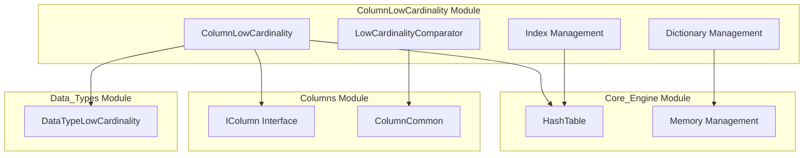
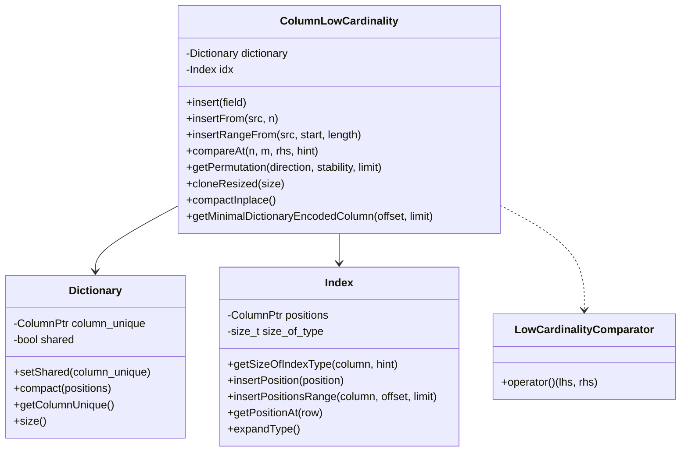
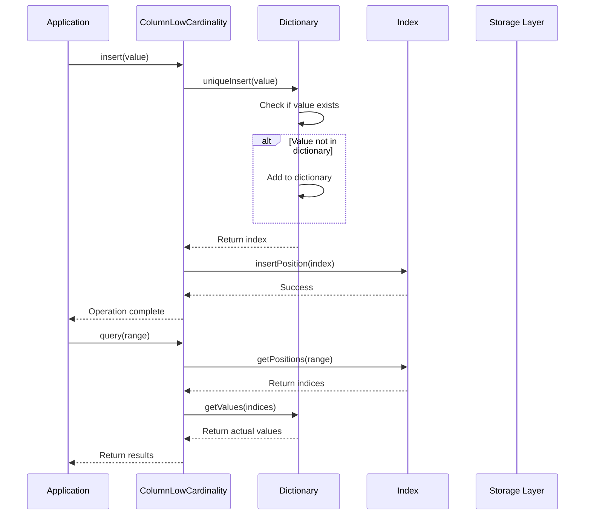
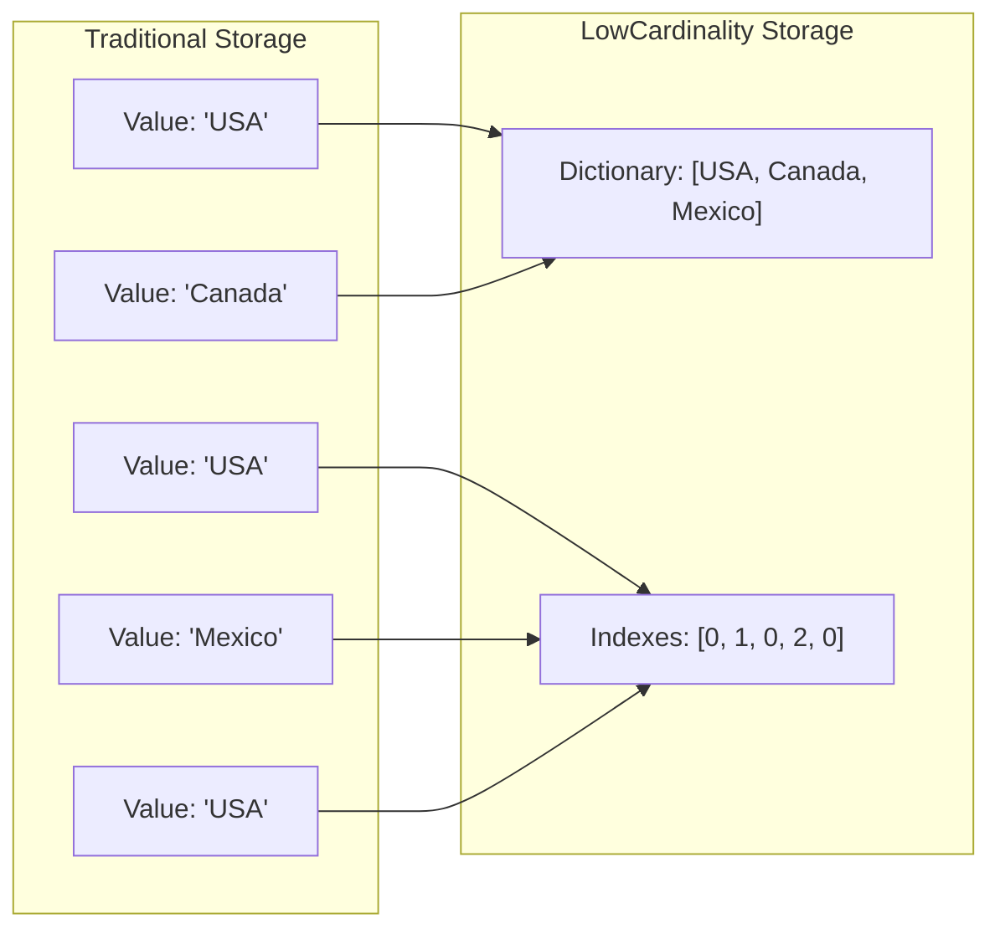

# ColumnLowCardinality Module Documentation

## Introduction

The ColumnLowCardinality module implements a specialized column type designed for efficient storage and processing of columns with low cardinality (few unique values). This module is a core component of the ClickHouse database system, providing significant performance improvements and storage optimization for datasets where values repeat frequently.

The ColumnLowCardinality achieves efficiency by storing unique values in a dictionary and representing actual data as indexes into this dictionary, rather than storing the full values repeatedly. This approach can dramatically reduce memory usage and improve query performance for suitable datasets.

## Architecture Overview

### Core Components

The module is built around three primary components:

1. **ColumnLowCardinality** - The main column class that implements the low cardinality storage mechanism
2. **LowCardinalityComparator** - A specialized comparator for efficient sorting operations
3. **Dictionary Management** - Handles the unique value dictionary and index mapping

### Module Relationships

The ColumnLowCardinality module interacts with several other key modules in the system:

- **Data_Types**: Integrates with [DataType_LowCardinality](DataTypes.md#DataType_LowCardinality) for type system support
- **Columns**: Part of the broader [Columns](Columns.md) module ecosystem
- **Core_Engine**: Utilizes core utilities for hash tables and memory management
- **Interpreters**: Works with expression evaluation and query processing components



## Detailed Component Architecture

### ColumnLowCardinality Class Structure



### Data Flow Architecture



## Key Features and Functionality

### 1. Dictionary-Based Storage

The module implements a sophisticated dictionary-based storage mechanism:

- **Unique Value Dictionary**: Stores all unique values in a separate column
- **Index Array**: Maintains indices pointing to dictionary entries
- **Automatic Type Selection**: Dynamically chooses optimal index type (UInt8, UInt16, UInt32, UInt64) based on dictionary size

### 2. Memory Optimization



### 3. Shared Dictionary Support

The module supports dictionary sharing between columns to further optimize memory usage:

- **Shared Dictionaries**: Multiple columns can share the same dictionary
- **Automatic Compaction**: Converts shared dictionaries to private when necessary
- **Thread Safety**: Ensures safe concurrent access to shared dictionaries

### 4. Advanced Sorting Capabilities

Implements specialized sorting algorithms optimized for low cardinality data:

- **Dictionary-Aware Sorting**: Sorts dictionary once, then applies permutation to indices
- **Stable Sorting**: Supports both stable and unstable sorting modes
- **Collation Support**: Handles locale-specific sorting requirements

## Performance Optimizations

### 1. Index Type Optimization

The module automatically selects the most compact index type based on dictionary size:

```cpp
// Automatic type selection based on dictionary cardinality
UInt8  -> Max 255 unique values
UInt16 -> Max 65,535 unique values  
UInt32 -> Max 4,294,967,295 unique values
UInt64 -> Theoretical unlimited unique values
```

### 2. Hash Table Utilization

Leverages advanced hash table implementations for efficient operations:

- **Fast Lookup**: O(1) average case for dictionary lookups
- **Memory Efficient**: Optimized hash table implementations
- **Collision Handling**: Robust collision resolution mechanisms

### 3. SIMD Optimizations

Where applicable, the module utilizes SIMD instructions for:

- **Index Processing**: Batch processing of index operations
- **Comparison Operations**: Vectorized comparison of index arrays
- **Memory Operations**: Efficient memory copying and initialization

## Integration Points

### Data Type Integration

The module integrates with the [DataType_LowCardinality](DataTypes.md#DataType_LowCardinality) component to provide:

- Type system integration
- Serialization/deserialization support
- Cast operations between types

### Storage Engine Integration

Works with the [Storage_Engine](Storage_Engine.md) module for:

- Persistent storage of low cardinality columns
- Compression algorithms optimized for dictionary data
- MergeTree engine integration for distributed processing

### Query Processing Integration

Coordinates with [Query_Planning](Query_Planning.md) for:

- Query optimization recognizing low cardinality patterns
- Execution plan generation for dictionary operations
- Cost estimation for low cardinality operations

## Usage Patterns

### 1. Column Creation

```cpp
// Create a low cardinality column
auto column = ColumnLowCardinality::create(
    dictionary_column,
    index_column,
    is_shared
);
```

### 2. Data Insertion

```cpp
// Insert single value
column->insert(field_value);

// Insert range from another column
column->insertRangeFrom(source_column, start, length);

// Insert with data sharing
column->insertFrom(source_low_cardinality_column, position);
```

### 3. Data Retrieval

```cpp
// Get value at position
auto value = column->getDataAt(position);

// Get dictionary
const auto& dictionary = column->getDictionary();

// Get indexes
const auto& indexes = column->getIndexes();
```

### 4. Sorting Operations

```cpp
// Get permutation for sorting
Permutation perm;
column->getPermutation(direction, stability, limit, nan_direction_hint, perm);

// Update existing permutation
column->updatePermutation(direction, stability, limit, nan_direction_hint, perm, equal_ranges);
```

## Error Handling

The module implements comprehensive error handling for:

- **Type Mismatches**: Validates column types during operations
- **Index Bounds**: Ensures index values are within dictionary bounds
- **Memory Allocation**: Handles allocation failures gracefully
- **Dictionary Corruption**: Detects and prevents dictionary corruption

## Performance Characteristics

### Time Complexity

- **Insertion**: O(1) average case, O(n) worst case for dictionary expansion
- **Lookup**: O(1) average case
- **Comparison**: O(1) for index comparison
- **Sorting**: O(n log n) for dictionary sort, O(n) for index permutation

### Space Complexity

- **Storage**: O(unique_values + n) where n is the number of rows
- **Memory Overhead**: Minimal overhead for index management
- **Dictionary Sharing**: Significant memory savings when dictionaries are shared

## Best Practices

### 1. When to Use Low Cardinality

- Columns with < 10,000 unique values typically benefit
- String columns with repeated values (countries, statuses, categories)
- Columns used frequently in GROUP BY operations
- Dimension columns in star schemas

### 2. When NOT to Use Low Cardinality

- High cardinality columns (> 100,000 unique values)
- Columns with mostly unique values (IDs, timestamps)
- Very small tables where overhead outweighs benefits

### 3. Optimization Tips

- Enable dictionary sharing for related columns
- Monitor dictionary size growth
- Use appropriate index types for your data cardinality
- Consider memory vs. performance trade-offs

## Testing and Validation

The module includes comprehensive testing for:

- **Correctness**: Validates data integrity after all operations
- **Performance**: Benchmarks operations against standard columns
- **Memory Usage**: Monitors memory consumption patterns
- **Edge Cases**: Handles empty columns, single values, maximum cardinality

## Future Enhancements

Potential areas for future development include:

- **Advanced Compression**: Better compression algorithms for dictionary data
- **GPU Acceleration**: Utilizing GPU for large-scale dictionary operations
- **Adaptive Cardinality**: Dynamic switching between storage modes
- **Distributed Dictionaries**: Shared dictionaries across cluster nodes

## Related Documentation

- [DataTypes Module](DataTypes.md) - Type system integration
- [Columns Module](Columns.md) - General column operations
- [Storage Engine](Storage_Engine.md) - Persistent storage integration
- [Query Planning](Query_Planning.md) - Query optimization integration
- [Core Engine](Core_Engine.md) - Core utilities and settings