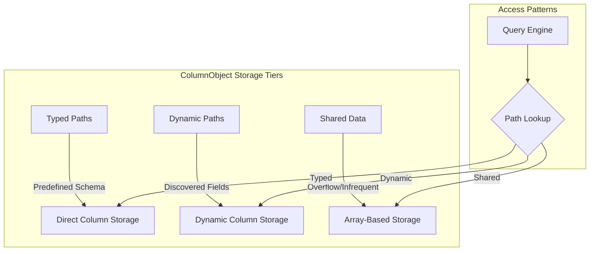
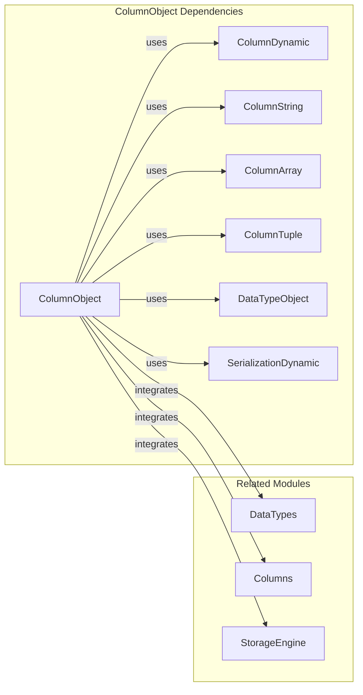
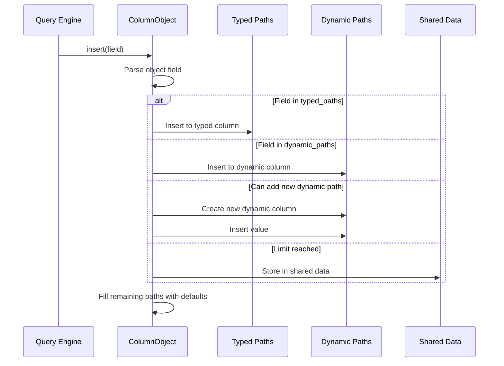
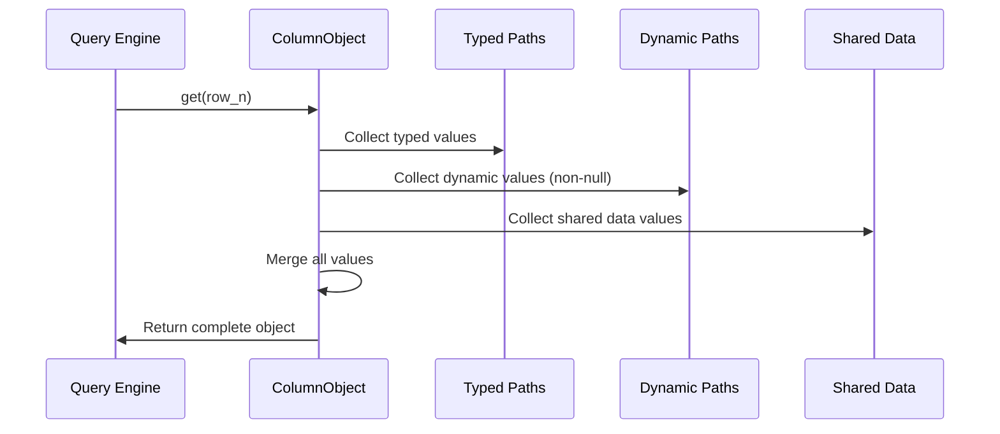
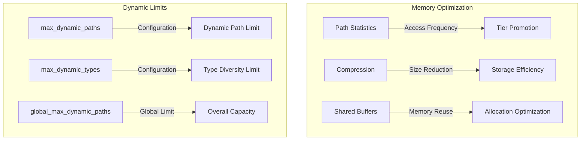
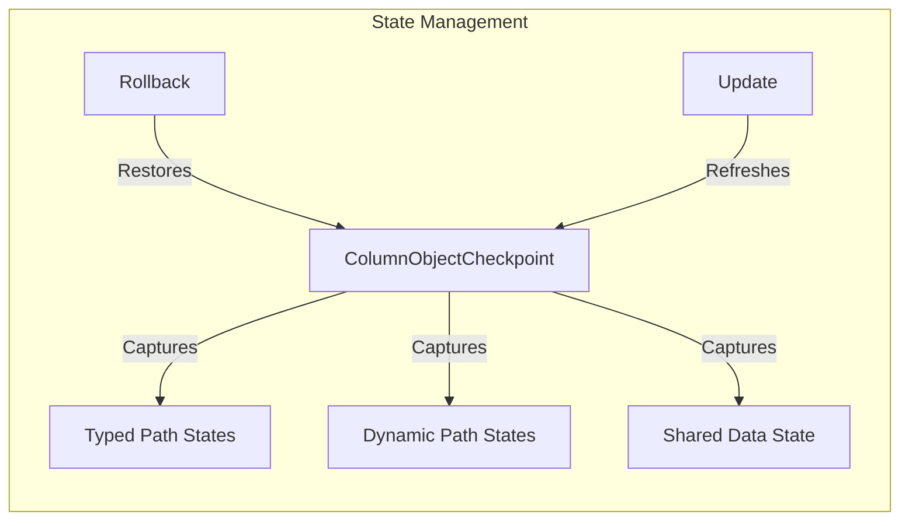

# ColumnObject Module Documentation

## Introduction

The ColumnObject module provides a specialized column type for handling semi-structured data with dynamic schema. It implements a sophisticated storage mechanism that efficiently manages object-like data structures with both predefined (typed) and dynamically discovered fields (paths). This module is essential for handling JSON-like data, dynamic columns, and schema evolution scenarios in ClickHouse.

## Core Purpose

ColumnObject serves as ClickHouse's primary mechanism for:
- Storing semi-structured data with flexible schema
- Managing dynamic field discovery and type inference
- Optimizing storage and query performance for object-like data
- Supporting schema evolution without data migration
- Balancing between storage efficiency and query performance

## Architecture Overview

### Core Components

The module consists of two primary components:

1. **ColumnObjectCheckpoint**: Manages state persistence and rollback capabilities
2. **Iterator**: Provides sorted traversal over object paths across different storage tiers

### Storage Architecture

ColumnObject employs a three-tier storage strategy:



### Key Design Principles

1. **Path-Based Organization**: Data is organized by field paths rather than traditional column structure
2. **Dynamic Schema Evolution**: New fields can be discovered and stored without predefined schema
3. **Storage Tier Optimization**: Frequently accessed paths are promoted to higher-performance tiers
4. **Memory Management**: Efficient memory usage through shared data structures and compression
5. **Type Safety**: Maintains type information while allowing schema flexibility

## Component Relationships

### Dependencies



### Integration Points

- **[DataTypes Module](DataTypes.md)**: Provides type system integration through DataTypeObject
- **[Columns Module](Columns.md)**: Inherits from IColumn and integrates with column ecosystem
- **[StorageEngine Module](StorageEngine.md)**: Supports MergeTree storage and compression
- **[IO System](IO_System.md)**: Handles serialization and deserialization operations

## Data Flow Architecture

### Insertion Flow



### Query Flow



## Storage Strategy

### Path Classification

ColumnObject automatically classifies data paths into three categories:

1. **Typed Paths**: Predefined fields with known types and high access frequency
2. **Dynamic Paths**: Discovered fields with moderate access frequency
3. **Shared Data**: Infrequently accessed or overflow fields

### Memory Management



## Advanced Features

### Schema Evolution

ColumnObject supports seamless schema evolution through:
- Dynamic path discovery and type inference
- Automatic path promotion between storage tiers
- Backward compatibility with existing data
- Statistics-driven optimization

### Compression and Serialization

The module implements sophisticated compression strategies:
- Per-tier compression optimization
- Path-specific encoding schemes
- Shared data serialization with type information
- Arena-based memory management for efficient serialization

### Checkpoint and Rollback



## Performance Characteristics

### Access Patterns

- **Typed Paths**: O(1) direct column access
- **Dynamic Paths**: O(log n) with hash map lookup
- **Shared Data**: O(log n) with binary search
- **Sorted Iteration**: O(n) with merge-style traversal

### Optimization Strategies

1. **Path Statistics**: Tracks access patterns for optimization decisions
2. **Tier Promotion**: Automatically promotes frequently accessed paths
3. **Memory Preallocation**: Prepares structures for bulk operations
4. **Parallel Processing**: Supports vectorized operations where possible

## Configuration and Limits

### Dynamic Path Management

- `max_dynamic_paths`: Per-column limit for dynamic paths
- `global_max_dynamic_paths`: System-wide dynamic path limit
- `max_dynamic_types`: Maximum distinct types in dynamic columns

### Statistics Collection

The module maintains comprehensive statistics:
- Path access frequency
- Type distribution analysis
- Storage tier utilization
- Compression effectiveness metrics

## Error Handling

ColumnObject implements robust error handling for:
- Dynamic path limit exhaustion
- Type conversion failures
- Memory allocation issues
- Data corruption detection

## Integration Examples

### Object Column Creation

```cpp
// Create object column with typed and dynamic paths
auto object_column = ColumnObject::create(
    typed_paths,      // Predefined schema
    dynamic_paths,    // Discovered fields
    shared_data,      // Overflow storage
    max_dynamic_paths,
    global_max_dynamic_paths,
    max_dynamic_types,
    statistics
);
```

### Path Access Pattern

```cpp
// Efficient path-based data access
if (auto* dynamic_column = tryToAddNewDynamicPath(path)) {
    dynamic_column->insert(value);
} else {
    // Store in shared data when limits reached
    serializePathAndValueIntoSharedData(paths, values, path, value);
}
```

## Future Enhancements

### Planned Improvements

1. **Adaptive Path Migration**: Machine learning-based path tier optimization
2. **Advanced Compression**: Context-aware compression algorithms
3. **Distributed Statistics**: Cross-node statistics sharing for better optimization
4. **Query Optimization**: Cost-based optimization for object column queries

### Performance Roadmap

- Vectorized path operations
- Parallel shared data processing
- Improved memory locality
- Enhanced compression ratios

## Related Documentation

- **[DataTypes Module](DataTypes.md)**: Type system integration
- **[Columns Module](Columns.md)**: Column ecosystem overview
- **[StorageEngine Module](StorageEngine.md)**: Storage backend integration
- **[IO System](IO_System.md)**: Serialization infrastructure
- **[Common Utilities](Common_Utilities.md)**: Shared utility functions

---

*This documentation covers the core functionality of the ColumnObject module. For implementation details, see the source code in `src/Columns/ColumnObject.cpp`.*