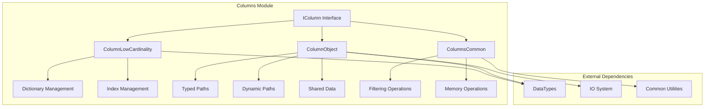
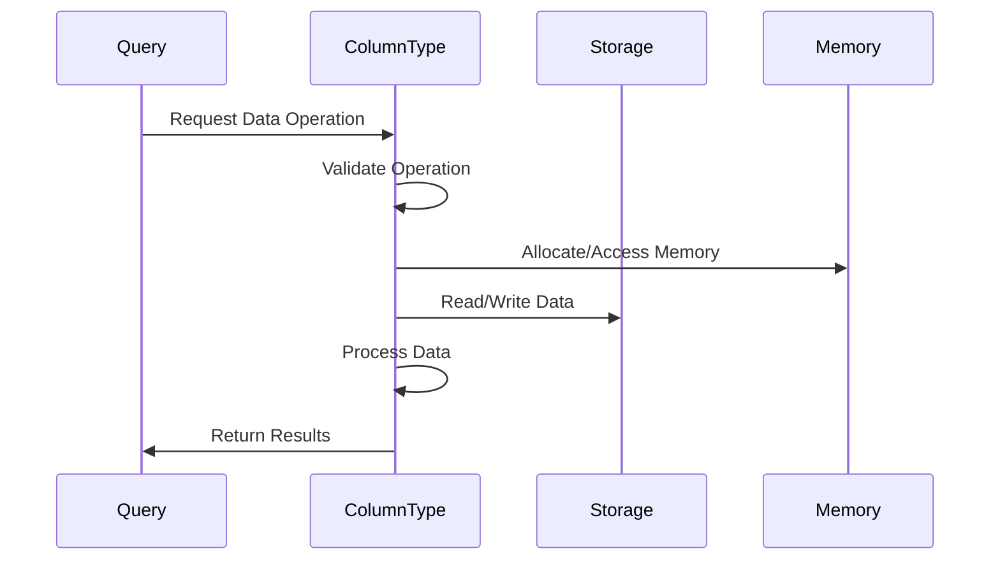

# Columns Module Documentation

## Overview

The Columns module is a fundamental component of the database system that provides the core data storage and manipulation infrastructure. It implements various column types and their operations, serving as the foundation for data processing throughout the system.

## Purpose

The Columns module is responsible for:
- **Data Storage**: Implementing efficient columnar data structures for different data types
- **Data Operations**: Providing optimized operations for data manipulation, filtering, sorting, and aggregation
- **Memory Management**: Handling memory allocation, compression, and optimization for large datasets
- **Type System**: Supporting various data types including primitive types, complex objects, and specialized formats
- **Performance Optimization**: Implementing SIMD optimizations and other performance-critical operations

## Architecture



## Core Components

### 1. ColumnLowCardinality
Implements low cardinality columns that store unique values in a dictionary and use indexes to reference them. This provides significant memory savings for columns with many repeated values.

**Key Features:**
- Dictionary-based storage for unique values
- Dynamic index type selection (UInt8, UInt16, UInt32, UInt64)
- Shared dictionary support for memory efficiency
- Optimized sorting and comparison operations

**Detailed Documentation**: [ColumnLowCardinality.md](ColumnLowCardinality.md)

### 2. ColumnObject
Handles semi-structured data with dynamic schema, supporting both typed and dynamic paths for flexible data storage.

**Key Features:**
- Typed paths for predefined schema elements
- Dynamic paths for runtime schema extension
- Shared data storage for overflow paths
- Path-based data access and manipulation

**Detailed Documentation**: [ColumnObject.md](ColumnObject.md)

### 3. ColumnsCommon
Provides common utilities and optimized operations used across all column types.

**Key Features:**
- SIMD-optimized filtering operations
- Array processing utilities
- Memory operation helpers
- Performance-critical algorithms

**Detailed Documentation**: [ColumnsCommon.md](ColumnsCommon.md)

## Data Flow



## Integration with Other Modules

The Columns module integrates closely with:

- **[DataTypes](Data_Types.md)**: Type system integration for column data types
- **[Storage Engine](Storage_Engine.md)**: Physical data storage and retrieval
- **[Query Planning](Query_Planning.md)**: Query optimization and execution planning
- **[IO System](IO_System.md)**: Data serialization and deserialization

## Performance Considerations

### Memory Optimization
- **Dictionary Compression**: Low cardinality columns use dictionary encoding to reduce memory usage
- **Shared Dictionaries**: Multiple columns can share dictionaries for common values
- **Dynamic Path Management**: Object columns optimize path storage based on usage patterns

### SIMD Optimizations
- **Filtering Operations**: Common filtering operations use SIMD instructions for performance
- **Array Processing**: Batch operations on arrays are optimized for vectorized execution
- **Memory Operations**: Bulk memory operations use optimized algorithms

### Type-Specific Optimizations
- **Index Type Selection**: Low cardinality columns automatically select optimal index types
- **Path Sorting**: Object columns maintain sorted paths for efficient access
- **Compression**: Various compression techniques based on data characteristics

## Usage Patterns

### Column Creation
```cpp
// Low Cardinality Column
auto low_card_column = ColumnLowCardinality::create(unique_column, indexes);

// Object Column
auto object_column = ColumnObject::create(typed_paths, dynamic_paths, shared_data);
```

### Data Operations
```cpp
// Insert data
column->insert(field);

// Filter data
auto filtered = column->filter(mask);

// Sort data
Permutation perm;
column->getPermutation(direction, stability, limit, perm);
```

## Error Handling

The module implements comprehensive error handling for:
- **Type Validation**: Ensures data types match column expectations
- **Memory Management**: Handles allocation failures and memory limits
- **Data Integrity**: Validates data consistency during operations
- **Bounds Checking**: Prevents out-of-bounds access

## Future Enhancements

Potential areas for improvement include:
- **Advanced Compression**: Implementing more sophisticated compression algorithms
- **GPU Acceleration**: Leveraging GPU resources for column operations
- **Adaptive Indexing**: Dynamic index type selection based on data patterns
- **Parallel Processing**: Enhanced parallelization for large-scale operations

## References

- [DataTypes Module](Data_Types.md) - Type system integration
- [Storage Engine](Storage_Engine.md) - Physical storage integration
- [Query Planning](Query_Planning.md) - Query execution integration
- [IO System](IO_System.md) - Serialization support