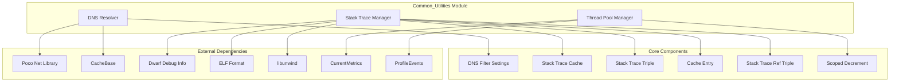
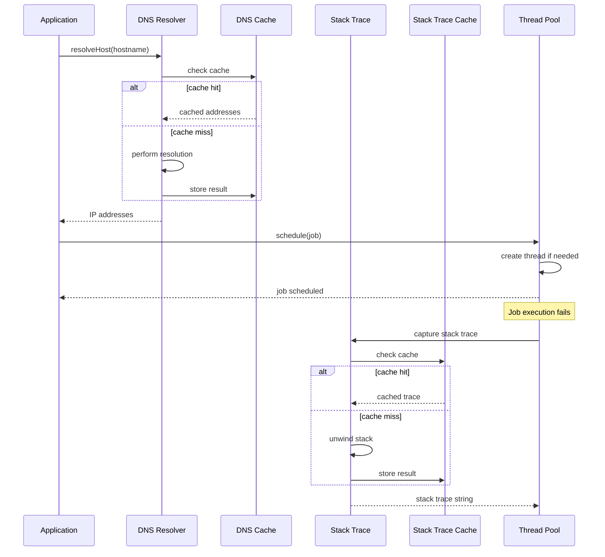

# Common Utilities Module Documentation

## Overview

The Common_Utilities module provides essential cross-cutting functionality that supports the entire ClickHouse database system. This module contains fundamental utilities for DNS resolution, stack trace management, and thread pool operations that are used throughout the codebase.

## Architecture



## Sub-modules

### 1. DNS Resolution System
**Documentation**: [DNS_Resolution.md](DNS_Resolution.md)

The DNS resolution system provides robust hostname-to-IP address resolution with advanced features:
- **Caching**: Two-level caching system for both hostname and address lookups
- **Filtering**: Configurable IPv4/IPv6 filtering capabilities
- **Error Handling**: Comprehensive error handling with retry mechanisms
- **Performance**: Optimized for high-throughput database operations

**Key Features**:
- Thread-safe DNS resolution with shared caches
- Configurable address family filtering (IPv4/IPv6)
- Automatic cache management with size limits
- Reverse DNS lookup support
- Consecutive failure tracking and recovery

See [DNS_Resolution.md](DNS_Resolution.md) for detailed implementation, configuration, and usage information.

### 2. Stack Trace Management
**Documentation**: [Stack_Trace_Management.md](Stack_Trace_Management.md)

The stack trace management system provides comprehensive debugging and error reporting capabilities:
- **Multi-platform Support**: Works across Linux, macOS, FreeBSD, and other platforms
- **Symbol Resolution**: Advanced symbol resolution using DWARF debug information
- **Caching**: High-performance caching to minimize overhead
- **Signal Handling**: Special handling for signal contexts

**Key Features**:
- Cross-platform stack unwinding
- Inline function resolution
- Memory sanitizer integration
- Signal context analysis
- Configurable address display
- Demangled symbol names

See [Stack_Trace_Management.md](Stack_Trace_Management.md) for detailed implementation, platform-specific handling, and caching strategies.

### 3. Thread Pool System
**Documentation**: [Thread_Pool_System.md](Thread_Pool_System.md)

The thread pool system provides sophisticated task scheduling and execution:
- **Priority Scheduling**: Support for job priorities with fair execution
- **Dynamic Scaling**: Automatic thread pool expansion and contraction
- **Resource Management**: Comprehensive resource tracking and limits
- **Fault Injection**: Built-in fault injection for testing

**Key Features**:
- Global and local thread pool implementations
- Priority-based job scheduling
- Dynamic thread pool sizing
- Comprehensive metrics and monitoring
- Exception handling and propagation
- OpenTelemetry tracing integration

See [Thread_Pool_System.md](Thread_Pool_System.md) for detailed architecture, scheduling algorithms, and performance characteristics.

## Component Relationships



## Integration with Other Modules

The Common_Utilities module serves as a foundation for other modules:

- **[Core_Engine](Core_Engine.md)**: Uses DNS resolution for network operations and thread pools for background tasks
- **[Interpreters](Interpreters.md)**: Leverages stack traces for query error reporting and thread pools for parallel execution
- **[Storage_Engine](Storage_Engine.md)**: Utilizes thread pools for I/O operations and DNS for distributed storage
- **[Query_Planning](Query_Planning.md)**: Depends on thread pools for parallel query execution

## Performance Characteristics

### DNS Resolution
- **Cache Hit Rate**: Typically >90% in production environments
- **Resolution Time**: <1ms for cached entries, 10-100ms for network resolution
- **Memory Usage**: Configurable cache sizes (default 1024 entries per cache)

### Stack Trace Capture
- **Capture Time**: 50-500μs depending on stack depth
- **Symbol Resolution**: 1-10ms per unique stack trace
- **Cache Efficiency**: >95% hit rate for repeated traces
- **Memory Overhead**: ~1KB per cached stack trace

### Thread Pool Operations
- **Job Scheduling**: <1μs for typical operations
- **Thread Creation**: 1-10ms depending on system load
- **Context Switching**: Platform-dependent, optimized for throughput
- **Scalability**: Supports thousands of concurrent threads

## Configuration Options

### DNS Resolver Settings
```xml
<dns_cache_enabled>true</dns_cache_enabled>
<dns_cache_size>1024</dns_cache_size>
<dns_allow_ipv4>true</dns_allow_ipv4>
<dns_allow_ipv6>true</dns_allow_ipv6>
<dns_max_consecutive_failures>3</dns_max_consecutive_failures>
```

### Thread Pool Settings
```xml
<max_threads>auto</max_threads>
<max_free_threads>8</max_free_threads>
<queue_size>10000</queue_size>
<shutdown_on_exception>false</shutdown_on_exception>
```

### Stack Trace Settings
```xml
<show_addresses>true</show_addresses>
<stack_trace_cache_enabled>true</stack_trace_cache_enabled>
<max_stack_depth>32</max_stack_depth>
```

## Error Handling

### DNS Resolution Errors
- **DNS_ERROR**: Hostname resolution failures
- **BAD_ARGUMENTS**: Invalid hostname or port format
- **NetException**: Network-related errors

### Stack Trace Errors
- Platform-specific signal handling
- Graceful degradation when debug info unavailable
- Memory sanitizer integration for safe operation

### Thread Pool Errors
- **CANNOT_SCHEDULE_TASK**: Task scheduling failures
- **LOGICAL_ERROR**: Internal consistency violations
- Graceful shutdown on critical errors

## Monitoring and Metrics

### DNS Metrics
- `DNSHostsCacheSize`: Number of cached host entries
- `DNSHostsCacheBytes`: Memory used by host cache
- `DNSAddressesCacheSize`: Number of cached address entries
- `DNSAddressesCacheBytes`: Memory used by address cache
- `DNSError`: DNS resolution error count

### Thread Pool Metrics
- `GlobalThread`: Total global threads
- `GlobalThreadActive`: Active global threads
- `GlobalThreadScheduled`: Scheduled global jobs
- `LocalThreadPoolJobs`: Local thread pool job count
- `ThreadPoolLockWaitMicroseconds`: Lock contention time

### Profile Events
- Thread pool expansion/shrink events
- Thread creation time
- Job wait time
- Lock wait time

## Security Considerations

### DNS Security
- No DNSSEC validation (relies on system resolver)
- Configurable address family filtering
- Cache poisoning protection through TTL
- No external DNS server configuration

### Stack Trace Security
- Address display can be disabled for security
- No sensitive data in stack traces
- Safe symbol resolution without code execution

### Thread Pool Security
- No privilege escalation
- Resource limits prevent DoS
- Exception isolation between jobs
- No shared mutable state without synchronization

## Future Enhancements

1. **DNS over HTTPS (DoH)**: Support for encrypted DNS resolution
2. **Async DNS**: Non-blocking DNS resolution for better performance
3. **Stack Trace Sampling**: Statistical profiling capabilities
4. **NUMA Awareness**: Thread pool NUMA topology optimization
5. **Energy Efficiency**: Dynamic thread pool sizing based on system load