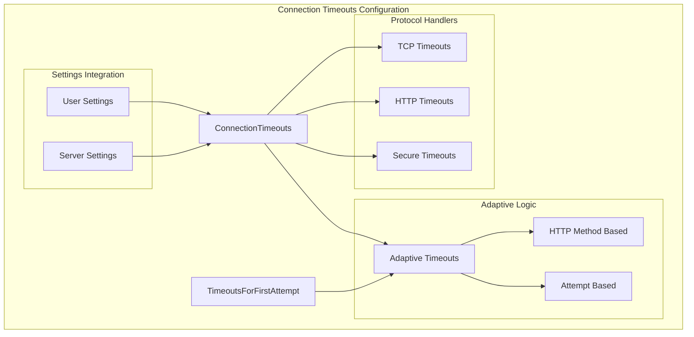
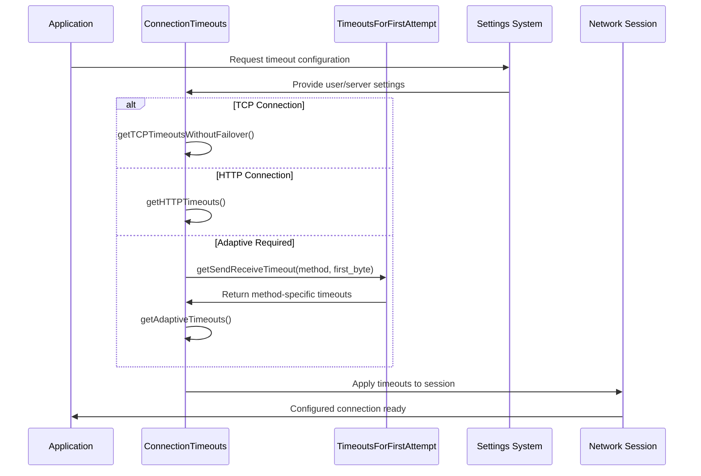
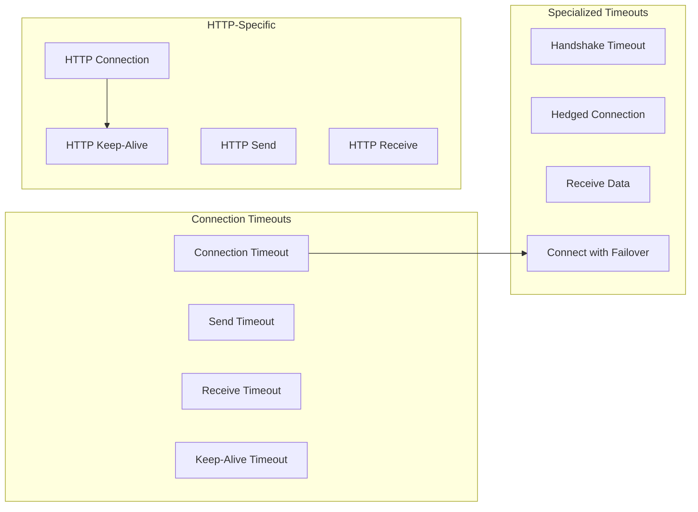

# Connection Timeouts Configuration Module

## Introduction

The Connection Timeouts Configuration module is a critical component of the IO System that manages network connection timeout settings across different protocols and connection scenarios. It provides a centralized system for configuring and managing timeout values for TCP, HTTP, and secure connections, with adaptive capabilities for different HTTP methods and connection attempts.

## Core Functionality

The module's primary responsibilities include:

- **Timeout Configuration Management**: Centralized management of connection, send, receive, and keep-alive timeouts
- **Protocol-Specific Timeouts**: Specialized timeout configurations for TCP and HTTP protocols
- **Adaptive Timeout Logic**: Dynamic timeout adjustment based on HTTP methods and connection attempt numbers
- **Failover Support**: Different timeout strategies for single connections versus connection loops with failover
- **Integration with Settings**: Seamless integration with user settings and server settings

## Architecture

### Component Structure



### Core Components

#### ConnectionTimeouts Class
The main class that encapsulates all timeout-related configurations and provides factory methods for different scenarios:

- **TCP Timeouts**: `getTCPTimeoutsWithoutFailover()`, `getTCPTimeoutsWithFailover()`
- **HTTP Timeouts**: `getHTTPTimeouts()`, `getFetchPartHTTPTimeouts()`
- **Adaptive Timeouts**: `getAdaptiveTimeouts()` with method and attempt awareness

#### TimeoutsForFirstAttempt Class
A specialized component that provides HTTP method-specific timeout configurations:

- **Method-Specific Timeouts**: Different timeout values for GET, POST, DELETE, PUT, HEAD, PATCH
- **First Byte vs Rest Bytes**: Separate timeout strategies for initial response and subsequent data
- **Connection Attempt Logic**: Different timeouts for first attempt versus subsequent attempts

## Data Flow



## Configuration Integration

### Settings Dependencies
The module integrates with the broader settings system through:

- **User Settings**: Connect timeout, send timeout, receive timeout, TCP keep-alive timeout
- **Server Settings**: HTTP keep-alive timeout, replicated fetch timeouts
- **Specialized Settings**: Handshake timeout, hedged connection timeout, receive data timeout

### Timeout Categories



## Adaptive Timeout Logic

### HTTP Method-Based Adaptation
The module implements sophisticated timeout logic based on HTTP methods:

- **GET/HEAD**: Standard timeouts (500ms for rest bytes)
- **POST**: Extended timeouts for multipart uploads (30s for rest bytes)
- **DELETE/PATCH**: Moderate extension (10s for rest bytes)
- **PUT**: Balanced approach (3s for rest bytes)

### Connection Attempt Logic
Different timeout strategies for connection attempts:

- **First Attempt**: Quick timeout (500ms) for Azure blob storage compatibility
- **Subsequent Attempts**: Extended timeout (3s) for reliability

## Integration with IO System

The Connection Timeouts Configuration module is part of the larger IO System and interacts with:

- **[ReadBuffer Management](ReadBuffer_Management.md)**: Provides timeout configurations for read operations
- **[SeekableReadBuffer Operations](SeekableReadBuffer_Operations.md)**: Ensures proper timeout handling for seekable buffers

## Usage Patterns

### Basic Timeout Configuration
```cpp
// Get TCP timeouts without failover
auto timeouts = ConnectionTimeouts::getTCPTimeoutsWithoutFailover(settings);

// Apply to network session
setTimeouts(session, timeouts);
```

### Adaptive Timeout Configuration
```cpp
// Get adaptive timeouts for POST request, first attempt, first byte
auto adaptive = timeouts.getAdaptiveTimeouts("POST", true, true);

// Apply to session
setTimeouts(session, adaptive);
```

### HTTP-Specific Configuration
```cpp
// Get HTTP timeouts with server settings integration
auto http_timeouts = ConnectionTimeouts::getHTTPTimeouts(user_settings, server_settings);
```

## Key Features

1. **Comprehensive Timeout Management**: Covers all aspects of network communication timeouts
2. **Protocol Awareness**: Different strategies for TCP and HTTP protocols
3. **Adaptive Logic**: Dynamic adjustment based on context and method
4. **Settings Integration**: Seamless integration with user and server settings
5. **Failover Support**: Specialized handling for connection failover scenarios
6. **Cloud Storage Optimization**: Specific optimizations for Azure blob storage

## Performance Considerations

- **Timeout Saturation**: Implements timeout limits to prevent excessive values
- **Method-Specific Optimization**: Tailored timeouts for different HTTP operation patterns
- **Connection Attempt Efficiency**: Quick timeouts for first attempts to enable rapid failover
- **Memory Efficiency**: Static configuration arrays for method-specific timeouts

This module ensures reliable network communication across different protocols and scenarios while providing the flexibility needed for various deployment environments and use cases.