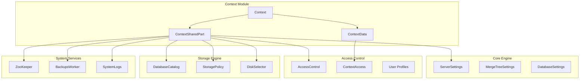
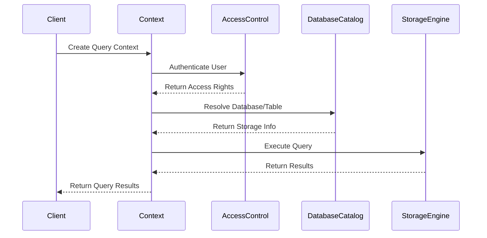
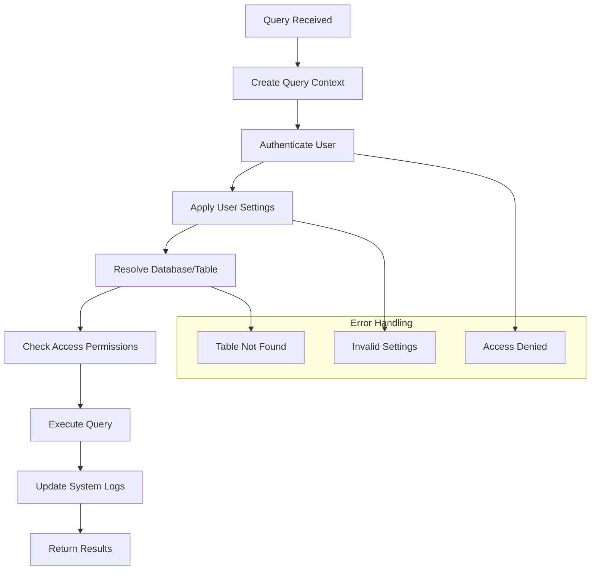
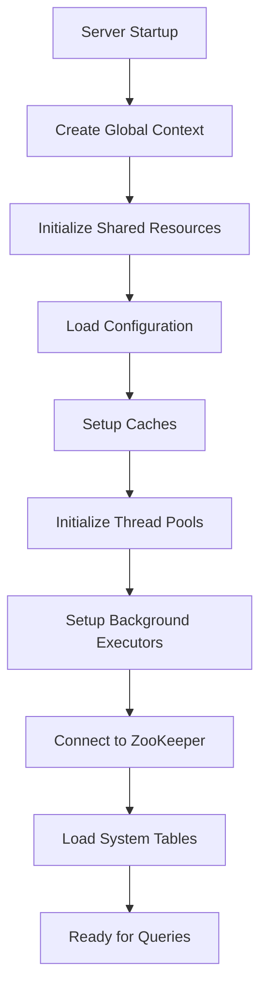

# Context Module Documentation

## Overview

The Context module is a central component of the ClickHouse database system that manages the execution environment for queries and operations. It serves as a container for all the necessary information and resources required during query execution, including settings, access control, caches, and system resources.

## Purpose and Core Functionality

The Context module provides:

1. **Query Execution Environment**: Maintains the state and configuration for query execution
2. **Resource Management**: Manages shared resources like caches, thread pools, and storage policies
3. **Access Control**: Handles user authentication, authorization, and security policies
4. **Configuration Management**: Manages system settings, profiles, and runtime configuration
5. **System Integration**: Coordinates with other system components like ZooKeeper, databases, and storage engines

## Architecture

### Core Components

#### 1. ContextSharedPart
The `ContextSharedPart` struct contains the global shared state that is common across all query contexts. It includes:

- **System Resources**: Thread pools, caches, background executors
- **Configuration**: Server settings, storage policies, cluster configurations
- **External Services**: ZooKeeper connections, backup workers, system logs
- **Access Control**: User management, role-based access control
- **Storage Management**: Disk selectors, storage policies, compression settings

#### 2. ContextData
The `ContextData` class contains query-specific information:

- **Query State**: Current database, query ID, client information
- **User Context**: User ID, roles, access permissions
- **Execution State**: Process list element, progress callbacks
- **Temporary Data**: External tables, scalars, temporary storage

### Component Relationships

## Data Flow

## Key Features

### 1. Multi-Level Context Hierarchy

The Context module supports a hierarchical structure:
- **Global Context**: Server-wide configuration and shared resources
- **Session Context**: User session-specific data
- **Query Context**: Individual query execution state
- **Buffer Context**: Special context for buffer operations

### 2. Resource Management

#### Thread Pools
- Background schedule pools for different operations
- I/O thread pools for read/write operations
- Mark loading and prefetch thread pools
- Build vector similarity index thread pool

#### Caches
- Uncompressed data cache
- Mark cache for efficient data skipping
- Primary index cache
- Query result cache
- Page cache for disk operations

### 3. Access Control Integration

The Context module integrates with the Access Control system to:
- Authenticate users and validate credentials
- Manage role-based permissions
- Enforce row-level security policies
- Handle quota management

### 4. Configuration Management

Supports multiple configuration levels:
- Server-level settings
- Profile-based settings
- Query-level overrides
- MergeTree-specific settings

## Process Flow

### Query Execution Flow

### Context Initialization

## Integration with Other Modules

### Dependencies

- **[Core_Engine](Core_Engine.md)**: Provides core settings and server configuration
- **[Access_Control](Access_Control.md)**: Manages user authentication and authorization
- **[DatabaseCatalog](DatabaseCatalog.md)**: Handles database and table resolution
- **[Storage_Engine](Storage_Engine.md)**: Manages storage policies and disk configurations

### Services Provided

- **[Query_Planning](Query_Planning.md)**: Provides execution context and settings
- **[Interpreters](Interpreters.md)**: Supplies query execution environment
- **[IO_System](IO_System.md)**: Manages I/O settings and throttling

## Configuration

The Context module supports extensive configuration through:

1. **Server Configuration**: Global settings in `config.xml`
2. **User Profiles**: Role-based settings in `users.xml`
3. **Query Settings**: Runtime settings that can be overridden per query
4. **Storage Configuration**: Disk and storage policy settings

### Key Configuration Areas

- **Cache Settings**: Size limits, eviction policies, enable/disable flags
- **Thread Pool Settings**: Pool sizes, queue sizes, priority settings
- **Network Settings**: Connection timeouts, bandwidth throttling
- **Security Settings**: Access control, encryption, authentication

## Performance Considerations

### Thread Safety
- Uses multiple mutexes for different components to minimize contention
- Implements lock-free patterns where possible
- Provides both shared and exclusive locking mechanisms

### Memory Management
- Implements smart pointer patterns for resource management
- Uses RAII for automatic cleanup
- Provides memory tracking and limits

### Scalability
- Supports concurrent query execution
- Implements connection pooling
- Provides resource throttling and limits

## Error Handling

The Context module implements comprehensive error handling:

- **Validation**: Input validation for all configuration and settings
- **Exception Handling**: Proper exception propagation and handling
- **Logging**: Detailed logging for debugging and monitoring
- **Recovery**: Graceful recovery from errors and connection failures

## Monitoring and Observability

### Metrics
- Context lock wait times and contention
- Cache hit rates and performance
- Thread pool utilization
- Resource usage statistics

### System Logs
- Query execution logs
- Access control events
- Configuration changes
- Error and warning messages

## Best Practices

1. **Context Lifecycle**: Always properly initialize and cleanup contexts
2. **Resource Management**: Use appropriate cache sizes and thread pool configurations
3. **Security**: Implement proper access control and validate all inputs
4. **Monitoring**: Monitor context performance and resource usage
5. **Configuration**: Use profiles and settings appropriately for different workloads

## Related Documentation

- [Core_Engine](Core_Engine.md) - Core system settings and configuration
- [Access_Control](Access_Control.md) - User authentication and authorization
- [DatabaseCatalog](DatabaseCatalog.md) - Database and table management
- [Storage_Engine](Storage_Engine.md) - Storage policies and disk management
- [Query_Planning](Query_Planning.md) - Query execution planning
- [Interpreters](Interpreters.md) - Query interpretation and execution