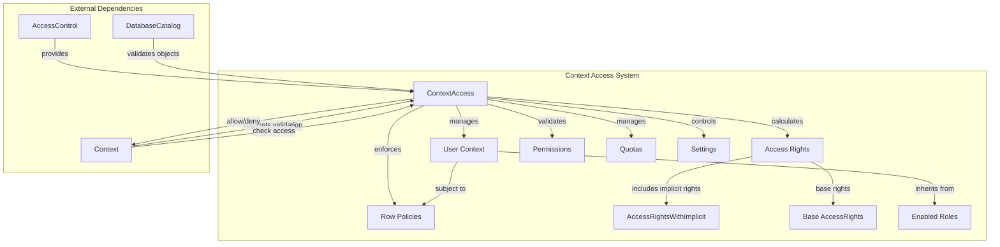
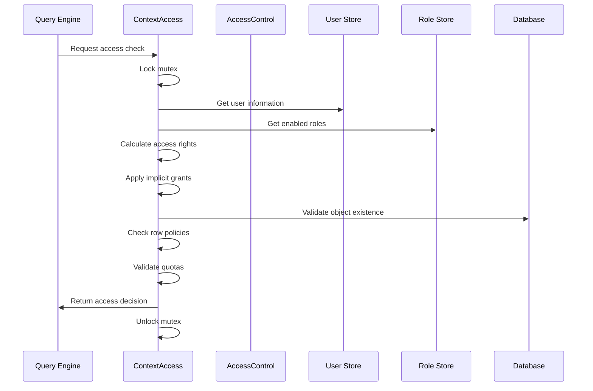
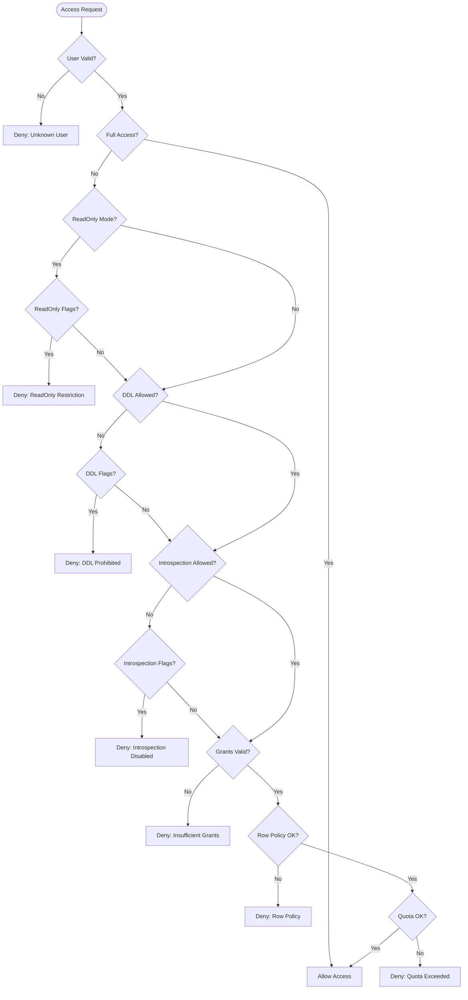

# Context Access System Documentation

## Introduction

The Context Access System is a critical security component within the Access Control module that manages user permissions and access rights validation in ClickHouse. It serves as the primary interface between user authentication/authorization data and query execution, ensuring that all database operations are properly validated against user privileges before execution.

This system provides fine-grained access control by managing user roles, permissions, quotas, and row-level security policies. It acts as a centralized authority that determines whether users can execute specific operations on database objects, making it essential for maintaining database security and compliance requirements.

## Architecture Overview

The Context Access System operates as a permission validation layer that sits between the query execution engine and the access control infrastructure. It maintains user context information, calculates effective access rights by combining user and role permissions, and provides runtime validation for all database operations.

## Core Components

### ContextAccess Class

The `ContextAccess` class is the central component that manages user access validation. It maintains user information, calculates effective permissions, and provides methods for checking access rights across different database objects and operations.

**Key Responsibilities:**
- User authentication and role management
- Access rights calculation and caching
- Permission validation for database operations
- Row-level security policy enforcement
- Quota management and validation
- Settings profile application

**Core Properties:**
- `user`: Current user information
- `access`: Base access rights
- `access_with_implicit`: Access rights including implicit grants
- `enabled_roles`: Active roles for the user
- `enabled_row_policies`: Row-level security policies
- `enabled_quota`: User quota information
- `enabled_settings`: Applied settings profiles

### PrecalculatedFlags Structure

The `PrecalculatedFlags` structure contains pre-computed flag combinations used for efficient permission checking during query validation.

**Flag Categories:**
- **DDL Operations**: CREATE, ALTER, DROP operations for tables, dictionaries, and functions
- **Write Operations**: INSERT, OPTIMIZE, and other data modification operations
- **Read-Only Restrictions**: Operations blocked in read-only mode
- **System Operations**: KILL_QUERY, SYSTEM commands
- **Introspection**: Functions for system introspection

## Data Flow Architecture

## Permission Validation Process

The permission validation process follows a hierarchical approach, checking access rights at multiple levels:

## Implicit Access Rights

The system automatically calculates and applies implicit access rights based on explicit grants and system configuration:

### Table-Level Implicit Rights
- **CREATE_TABLE** implies **CREATE_VIEW**
- **DROP_TABLE** implies **DROP_VIEW**
- **ALTER_TABLE** implies **ALTER_VIEW**
- **CREATE_TABLE** (any level) implies **CREATE_TEMPORARY_TABLE** and **CREATE_ARBITRARY_TEMPORARY_TABLE**

### Show Operations Hierarchy
- Any **column flag** implies **SHOW_COLUMNS**
- Any **table flag** or **SHOW_COLUMNS** implies **SHOW_TABLES**
- Any **dictionary flag** implies **SHOW_DICTIONARIES**
- Any **database flag** or **SHOW_TABLES/SHOW_DICTIONARIES** implies **SHOW_DATABASES**

### System Database Access
The system provides selective access to system tables based on configuration and user privileges:
- Constant tables (one, contributors, licenses, etc.)
- Function and format metadata tables
- Session-specific tables (settings, current_roles, quota_usage)
- Conditional access based on SHOW privileges

## Row-Level Security

Row-level security policies are enforced through the `getRowPolicyFilter()` method, which combines:
- User-specific row policies from enabled roles
- Initial user row policies for distributed query scenarios
- Filter conditions applied during query execution

## Quota Management

The system enforces resource quotas through:
- User-specific quota limits
- Role-based quota aggregation
- Real-time usage tracking
- Query-level quota validation

## Integration with Other Modules

### Access Control Module
The Context Access System integrates closely with the [Access Control](Access_Control.md) module:
- **AccessRights Management**: Validates against calculated access rights
- **Authentication Management**: Uses user authentication information
- **Access Flags System**: Leverages flag definitions and conversions

### Interpreters Module
Integration with the [Interpreters](Interpreters.md) module provides:
- **Context Management**: Access validation within query execution context
- **Database Catalog**: Object existence validation and metadata access

### Core Engine Module
The system relies on [Core Engine](Core_Engine.md) components for:
- **Settings Management**: Applying user and role-based settings
- **Server Settings**: System-wide configuration parameters

## Security Considerations

### Thread Safety
All access validation operations are protected by mutex locks to ensure thread-safe operation in multi-user environments.

### User Consistency
The system maintains user consistency checks to prevent access validation after user deletion or modification.

### Privilege Escalation Prevention
Multiple validation layers prevent privilege escalation through:
- Grant option validation for administrative operations
- Role admin option verification
- Grantee permission checks

### Audit Trail
The system provides detailed logging for security auditing:
- Access grant/deny decisions
- Role and permission changes
- Quota violations
- Row policy applications

## Performance Optimizations

### Caching Strategy
- Access rights are calculated once and cached
- Role information is cached with subscription-based invalidation
- Implicit grants are pre-calculated during initialization

### Flag Precalculation
Common flag combinations are pre-calculated to reduce runtime computation overhead during permission checks.

### Subscription-Based Updates
The system uses subscription patterns to receive real-time updates for:
- User modifications
- Role changes
- Permission updates

## Error Handling

The system provides comprehensive error handling with specific error codes:
- **ACCESS_DENIED**: Insufficient privileges
- **READONLY**: Operation blocked in read-only mode
- **QUERY_IS_PROHIBITED**: DDL operations disabled
- **FUNCTION_NOT_ALLOWED**: Introspection functions disabled
- **UNKNOWN_USER**: User no longer exists
- **LOGICAL_ERROR**: System consistency issues

## Configuration Options

### System-Wide Settings
- `select_from_system_db_requires_grant`: Controls system database access
- `select_from_information_schema_requires_grant`: Information schema access
- `doesOnClusterQueriesRequireClusterGrant`: Cluster operation requirements
- `doesTableEnginesRequireGrant`: Table engine permission requirements

### User-Level Parameters
- `readonly`: Read-only mode enforcement
- `allow_ddl`: DDL operation permissions
- `allow_introspection`: Introspection function access
- `full_access`: Bypass all permission checks

## Best Practices

### Permission Design
- Use role-based access control for scalable permission management
- Apply the principle of least privilege
- Regular audit of user permissions and roles
- Implement proper separation of duties

### Performance Considerations
- Minimize complex permission hierarchies
- Use wildcard permissions judiciously
- Monitor quota usage patterns
- Regular cleanup of unused roles and permissions

### Security Implementation
- Enable audit logging for all permission changes
- Implement proper user lifecycle management
- Regular security reviews of access patterns
- Use row-level security for sensitive data protection