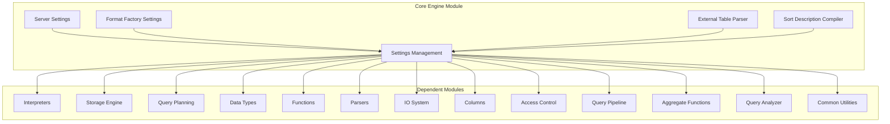

# Core Engine Module Documentation

## Overview

The Core Engine module serves as the foundational layer of the ClickHouse database system, providing essential configuration management, server settings, and core utilities that support all other system components. This module acts as the central nervous system of ClickHouse, managing everything from query execution parameters to server-wide resource allocation.

## Architecture



## Core Components

### 1. Settings Management ([Settings_Management.md](Settings_Management.md))
The Settings component provides comprehensive configuration management for query execution parameters. It handles:
- **Query Execution Settings**: Thread limits, memory usage, timeout configurations
- **Storage Settings**: MergeTree parameters, compression settings, caching policies
- **Network Settings**: Connection limits, bandwidth throttling, protocol configurations
- **Performance Settings**: Optimization flags, compilation thresholds, resource limits

### 2. Server Settings ([Server_Settings.md](Server_Settings.md))
Server-wide configuration management that controls:
- **Resource Management**: Memory limits, thread pool sizes, connection limits
- **Background Operations**: Merge and mutation scheduling, cleanup processes
- **Caching Policies**: Mark cache, uncompressed cache, query condition cache
- **System Behavior**: Startup behavior, shutdown procedures, monitoring settings

### 3. Format Factory Settings ([Format_Factory.md](Format_Factory.md))
Specialized settings for file format handling:
- **Input/Output Formats**: CSV, JSON, Parquet, ORC format configurations
- **Parsing Options**: Delimiter settings, encoding options, schema inference
- **Performance Tuning**: Parallel parsing, buffer sizes, compression levels

### 4. External Table Parser ([External_Table_Parser.md](External_Table_Parser.md))
Handles external data source integration:
- **Type Parsing**: Dynamic type inference and validation
- **Structure Parsing**: Column definition and schema extraction
- **Format Support**: Multiple input format handling

### 5. Sort Description Compiler ([Sort_Description_Compiler.md](Sort_Description_Compiler.md))
Advanced sorting optimization:
- **JIT Compilation**: Runtime compilation of sort operations
- **Performance Optimization**: Native code generation for sorting
- **Memory Management**: Efficient sort description caching

## Key Features

### Configuration Management
- **Hierarchical Settings**: User-level, profile-level, and server-level configurations
- **Runtime Updates**: Dynamic setting changes without server restart
- **Validation**: Comprehensive validation of setting values and dependencies
- **Compatibility**: Version-aware configuration management

### Performance Optimization
- **Compiled Expressions**: JIT compilation for frequently used expressions
- **Caching Strategies**: Multi-level caching for metadata and data
- **Resource Management**: Intelligent resource allocation and throttling
- **Parallel Processing**: Configurable parallelism for various operations

### System Integration
- **Cross-Module Communication**: Unified configuration interface for all modules
- **Monitoring Integration**: Built-in metrics and logging capabilities
- **Security Integration**: Access control and privilege management
- **Cloud Support**: Cloud-specific optimizations and configurations

## Dependencies

The Core Engine module is fundamental to all other ClickHouse modules:

- **[Interpreters](Interpreters.md)**: Uses settings for query execution parameters
- **[Storage Engine](Storage_Engine.md)**: Relies on storage and caching settings
- **[Query Planning](Query_Planning.md)**: Leverages optimization settings
- **[Data Types](Data_Types.md)**: Uses type-related configuration
- **[Functions](Functions.md)**: Applies function execution settings
- **[Parsers](Parsers.md)**: Utilizes parsing and format settings
- **[IO System](IO_System.md)**: Depends on I/O and network settings
- **[Columns](Columns.md)**: Uses column processing configurations
- **[Access Control](Access_Control.md)**: Integrates security settings
- **[Query Pipeline](Query_Pipeline.md)**: Applies pipeline execution settings
- **[Aggregate Functions](Aggregate_Functions.md)**: Uses aggregation settings
- **[Analyzer](Analyzer.md)**: Leverages analysis and optimization settings
- **[Common Utilities](Common_Utilities.md)**: Utilizes utility configurations

## Usage Examples

### Basic Settings Configuration
```sql
-- Configure query execution settings
SET max_threads = 8;
SET max_memory_usage = 10000000000;
SET timeout_overflow_mode = 'break';

-- Configure storage settings
SET merge_tree_min_rows_for_concurrent_read = 100000;
SET use_uncompressed_cache = 1;
```

### Server Configuration
```xml
<clickhouse>
    <max_thread_pool_size>10000</max_thread_pool_size>
    <max_server_memory_usage>0</max_server_memory_usage>
    <background_pool_size>16</background_pool_size>
    <mark_cache_size>5368709120</mark_cache_size>
</clickhouse>
```

### Format Settings
```sql
-- Configure CSV format settings
SET format_csv_delimiter = ',';
SET format_csv_allow_single_quotes = 1;
SET input_format_parallel_parsing = 1;
```

## Best Practices

1. **Settings Hierarchy**: Understand the precedence of user, profile, and server settings
2. **Resource Limits**: Set appropriate memory and thread limits based on available resources
3. **Performance Tuning**: Use compiled expressions and appropriate caching strategies
4. **Monitoring**: Regularly monitor system settings and their impact on performance
5. **Compatibility**: Use the compatibility setting for version-specific behavior

## Performance Considerations

- **Memory Usage**: Settings directly impact memory consumption patterns
- **CPU Utilization**: Thread pool sizes and compilation settings affect CPU usage
- **I/O Performance**: Caching and buffering settings influence I/O efficiency
- **Network Throughput**: Connection and bandwidth settings affect network performance

## Troubleshooting

Common issues and solutions:
- **Memory Issues**: Adjust `max_memory_usage` and related memory settings
- **Performance Problems**: Tune thread pool sizes and compilation thresholds
- **Connection Issues**: Configure appropriate connection limits and timeouts
- **Storage Problems**: Adjust MergeTree and caching settings

## Future Enhancements

The Core Engine module continues to evolve with:
- **Dynamic Configuration**: Enhanced runtime configuration capabilities
- **Machine Learning**: AI-driven setting optimization
- **Cloud Integration**: Improved cloud-native configuration management
- **Performance Analytics**: Advanced performance monitoring and tuning