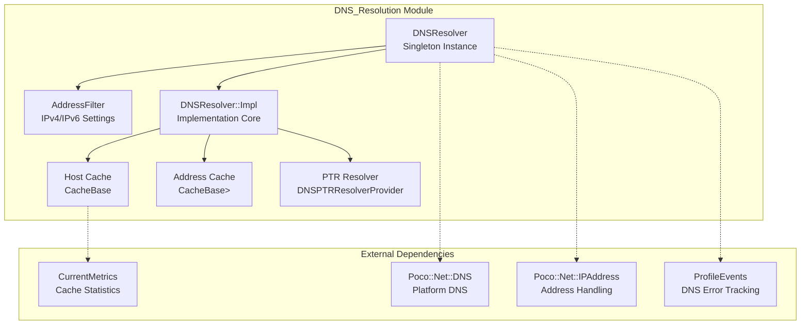
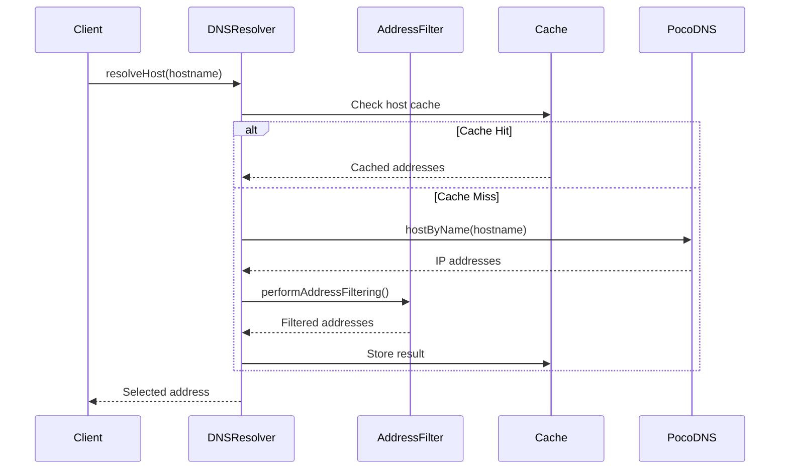
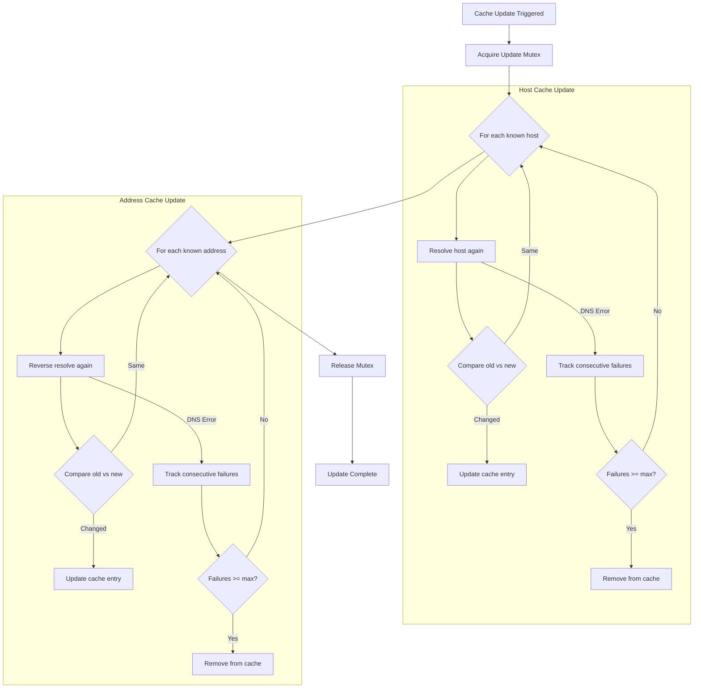
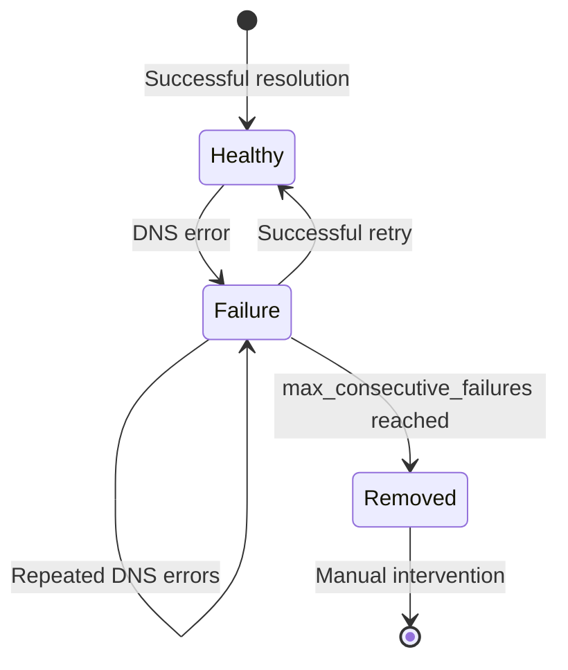

# DNS Resolution Module Documentation

## Introduction

The DNS_Resolution module provides a comprehensive DNS resolution service for the ClickHouse database system. It handles hostname-to-IP address resolution, reverse DNS lookups, and caching mechanisms with configurable filtering capabilities. The module is designed to be thread-safe, performant, and resilient to DNS failures while providing extensive monitoring and configuration options.

## Core Architecture

### Component Overview

The DNS_Resolution module is built around the `DNSResolver` class, which implements a singleton pattern and provides a centralized DNS resolution service. The architecture consists of several key components:

1. **DNSResolver Core**: Main resolution engine with caching and filtering
2. **AddressFilter**: IPv4/IPv6 filtering and configuration management
3. **Cache Management**: Dual-cache system for hosts and addresses
4. **Failure Tracking**: Consecutive failure monitoring and recovery
5. **PTR Resolution**: Reverse DNS resolution support

### Architecture Diagram



## Core Components

### DNSFilterSettings

The `DNSFilterSettings` structure provides configurable filtering options for DNS resolution:

```cpp
struct DNSFilterSettings
{
    bool dns_allow_resolve_names_to_ipv4{true};
    bool dns_allow_resolve_names_to_ipv6{true};
};
```

This component allows runtime configuration of IPv4 and IPv6 resolution preferences, enabling administrators to restrict resolution to specific IP families based on network configuration and security requirements.

### DNSResolver Implementation

The main `DNSResolver` class provides a comprehensive set of resolution methods:

- **Host Resolution**: `resolveHost()`, `resolveHostAll()`, `resolveHostAllInOriginOrder()`
- **Address Resolution**: `resolveAddress()` with host+port and string variants
- **Address List Resolution**: `resolveAddressList()` for multiple addresses
- **Reverse Resolution**: `reverseResolve()` for PTR lookups
- **Cache Management**: `updateCache()`, `dropCache()`, `removeHostFromCache()`

### Multi-Version Configuration

The module uses a `MultiVersion<DNSFilterSettings>` pattern to ensure thread-safe configuration updates without blocking resolution operations. This allows dynamic reconfiguration of DNS filtering rules while maintaining service availability.

## Data Flow Architecture

### Resolution Process Flow



### Cache Update Process



## Component Interactions

### Thread Safety Model

The DNSResolver implements a sophisticated thread safety model using multiple mutexes:

- **drop_mutex**: Protects cache modifications and host/address tracking
- **update_mutex**: Serializes cache update operations
- **CacheBase internal locks**: Protect individual cache operations

### Failure Handling

The module implements comprehensive failure handling with configurable consecutive failure thresholds:



## Integration with System Components

### Metrics and Monitoring

The DNS_Resolution module integrates with ClickHouse's monitoring infrastructure:

- **CurrentMetrics**: Tracks cache memory usage and entry counts
  - `DNSHostsCacheBytes`: Memory used by host cache
  - `DNSHostsCacheSize`: Number of host cache entries
  - `DNSAddressesCacheBytes`: Memory used by address cache
  - `DNSAddressesCacheSize`: Number of address cache entries

- **ProfileEvents**: Tracks DNS resolution failures
  - `DNSError`: Incremented on each DNS resolution failure

### Configuration Integration

The module supports runtime configuration through the `setFilterSettings()` method, allowing dynamic adjustment of IPv4/IPv6 resolution preferences without service restart.

## Dependencies

### Internal Dependencies

The DNS_Resolution module has minimal internal dependencies within the ClickHouse codebase:

- **CacheBase**: Generic caching infrastructure from [Common_Utilities](Common_Utilities.md)
- **MultiVersion**: Thread-safe configuration management
- **DNSPTRResolverProvider**: Reverse DNS resolution provider

### External Dependencies

The module relies on Poco C++ Libraries for core DNS functionality:

- **Poco::Net::DNS**: Platform DNS resolution
- **Poco::Net::IPAddress**: IP address handling
- **Poco::Net::SocketAddress**: Network address representation

## Performance Characteristics

### Caching Strategy

The module implements a two-tier caching system:

1. **Host Cache**: Maps hostnames to resolved IP addresses with timestamps
2. **Address Cache**: Maps IP addresses to reverse DNS names

Both caches support configurable size limits and automatic eviction based on memory usage.

### Resolution Optimization

- **Address Shuffling**: Randomizes address order for load balancing
- **IPv4/IPv6 Filtering**: Reduces resolution overhead based on network configuration
- **Concurrent Access**: Lock-free read operations when possible

## Error Handling

### Exception Types

The module defines specific exception handling for DNS-related errors:

- **DNS_ERROR**: General DNS resolution failure
- **BAD_ARGUMENTS**: Invalid hostname or port format
- **NetException**: Network-related resolution errors

### Recovery Mechanisms

- **Consecutive Failure Tracking**: Monitors repeated resolution failures
- **Automatic Cache Updates**: Periodic refresh of cached entries
- **Manual Cache Management**: Administrative cache clearing capabilities

## Security Considerations

### DNS Security Features

- **IPv4/IPv6 Filtering**: Prevents resolution of unwanted address families
- **Cache Isolation**: Thread-safe cache operations prevent data races
- **Input Validation**: Strict hostname and port format validation

### Network Security Integration

The module's filtering capabilities integrate with network security policies, allowing administrators to restrict DNS resolution based on network configuration and security requirements.

## Usage Examples

### Basic Host Resolution

```cpp
DNSResolver& resolver = DNSResolver::instance();
Poco::Net::IPAddress address = resolver.resolveHost("example.com");
```

### Address List Resolution

```cpp
std::vector<Poco::Net::SocketAddress> addresses = 
    resolver.resolveAddressList("example.com", 8080);
```

### Reverse DNS Resolution

```cpp
Poco::Net::IPAddress ip("192.168.1.1");
std::unordered_set<std::string> hostnames = resolver.reverseResolve(ip);
```

### Configuration Management

```cpp
// Disable IPv6 resolution
resolver.setFilterSettings(true, false);
```

## Maintenance and Administration

### Cache Management

Administrators can manage DNS caches through several methods:

- **dropCache()**: Clear all cached entries
- **removeHostFromCache()**: Remove specific host from cache
- **setCacheMaxEntries()**: Adjust cache size limits
- **updateCache()**: Force cache refresh with failure tracking

### Monitoring and Diagnostics

The module provides diagnostic capabilities through:

- **cacheEntries()**: Retrieve current cache contents
- **getHostName()**: Get cached server hostname
- **Metrics integration**: Monitor cache performance and DNS errors

## Future Enhancements

### Potential Improvements

1. **DNS over HTTPS (DoH)**: Support for encrypted DNS resolution
2. **DNSSEC Validation**: Cryptographic verification of DNS responses
3. **Custom DNS Servers**: Configurable DNS server selection
4. **Resolution Timeouts**: Configurable timeout values for resolution operations
5. **Geographic DNS**: Location-aware resolution strategies

### Scalability Considerations

The current implementation is designed for single-server deployments. Future enhancements may include:

- **Distributed Caching**: Shared cache across cluster nodes
- **Load Balancing**: Intelligent resolution based on server load
- **Health Checking**: Proactive monitoring of resolved addresses

## Conclusion

The DNS_Resolution module provides a robust, performant, and configurable DNS resolution service for ClickHouse. Its comprehensive caching system, failure handling mechanisms, and integration with monitoring infrastructure make it suitable for production database environments. The modular design allows for easy extension and customization while maintaining backward compatibility and system stability.