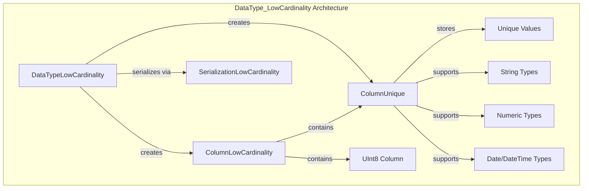
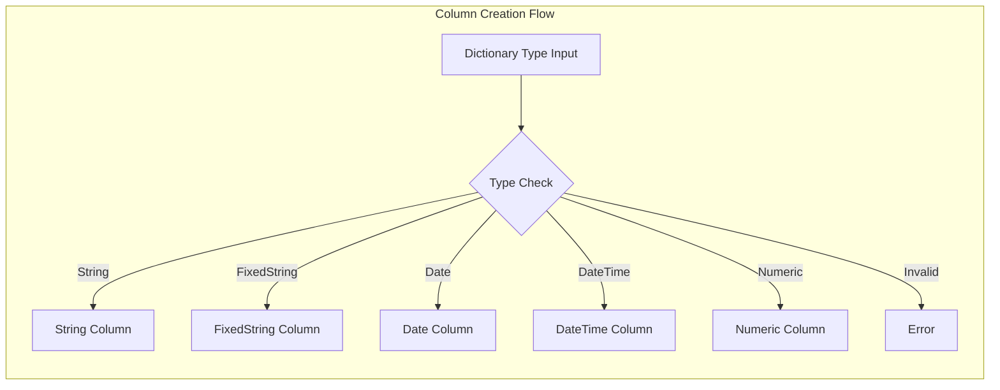
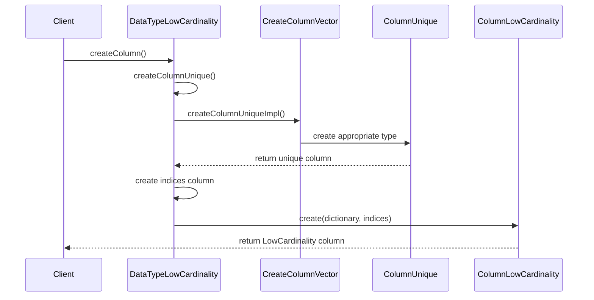
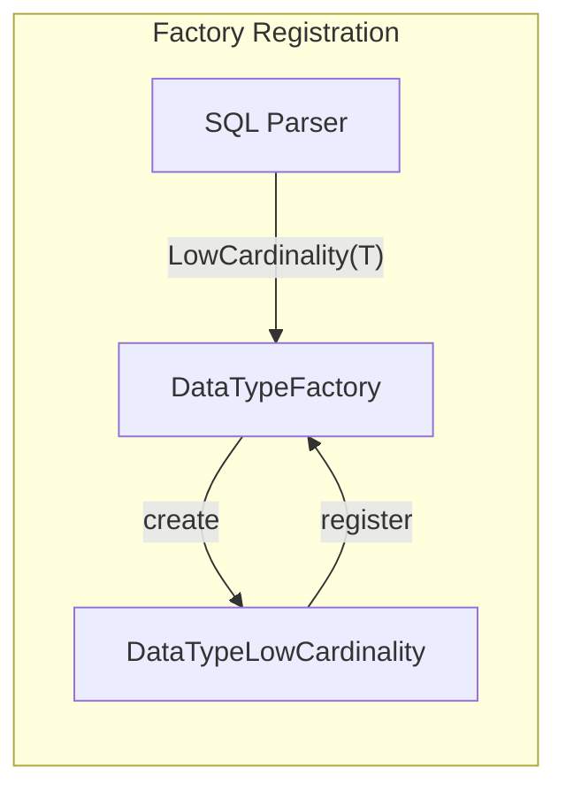

# DataType_LowCardinality Module Documentation

## Introduction

The DataType_LowCardinality module implements ClickHouse's LowCardinality data type, a specialized columnar storage optimization that significantly reduces memory usage and improves query performance for columns with repetitive string or numeric values. This module provides the core functionality for creating, managing, and serializing LowCardinality columns, which are particularly effective for categorical data with high repetition rates.

## Architecture Overview

The LowCardinality data type operates on a dictionary-based compression principle where unique values are stored once in a dictionary, and the actual column data contains only references (indices) to these unique values. This approach can dramatically reduce storage requirements and improve query performance for columns with many repeated values.

## Core Components

### DataTypeLowCardinality Class

The main class that implements the LowCardinality data type functionality. It wraps an underlying dictionary type and provides methods for column creation, serialization, and type operations.

**Key Responsibilities:**
- Type validation and constraint enforcement
- Column creation with appropriate unique column types
- Serialization management
- Type comparison and hashing

### CreateColumnVector Implementation

A template-based factory mechanism for creating appropriate column types based on the underlying dictionary type. This component ensures that the correct column implementation is selected for different data types (strings, numbers, dates, etc.).

## Data Flow and Processing

### Column Creation Process

### Type Validation and Constraints

The module enforces strict type constraints to ensure LowCardinality optimization is only applied to compatible data types:

- **Supported Types**: Numbers, strings, Date, DateTime, UUID, IPv4, IPv6, Interval
- **Unsupported Types**: Complex nested types, arrays, maps, JSON
- **Nullable Support**: Handles nullable types by extracting the nested type for validation

## Integration with Other Modules

### Column Module Integration

The module heavily depends on the [Columns](Columns.md) module, particularly:
- `ColumnLowCardinality`: The main column implementation
- `ColumnUnique`: Dictionary storage implementation
- `ColumnVector`: Numeric value storage
- `ColumnString`: String value storage

### Serialization Integration

Integrates with the [Data_Types](Data_Types.md) serialization framework through:
- `SerializationLowCardinality`: Custom serialization for LowCardinality columns
- `ISerialization`: Base serialization interface

### Data Type Factory Integration

Registers itself with the global DataTypeFactory to enable parsing and creation from SQL statements:

## Performance Characteristics

### Memory Efficiency
- Dictionary compression reduces memory usage for repetitive data
- Index size optimization (UInt8, UInt16, UInt32 based on dictionary size)
- Automatic dictionary size management

### Query Performance
- Faster comparisons due to index-based operations
- Improved cache locality for repeated values
- Vectorized operations on dictionary indices

### Storage Optimization
- Reduced disk I/O for repetitive data
- Efficient serialization format
- Dictionary sharing across column chunks

## Error Handling and Validation

The module implements comprehensive error handling for:

- **Type Validation**: Ensures only compatible types are wrapped
- **Argument Validation**: Validates constructor arguments
- **Runtime Errors**: Handles dictionary overflow and memory allocation failures

Error codes used:
- `NUMBER_OF_ARGUMENTS_DOESNT_MATCH`: Invalid constructor arguments
- `LOGICAL_ERROR`: Internal consistency violations
- `ILLEGAL_TYPE_OF_ARGUMENT`: Unsupported dictionary types

## Usage Patterns and Best Practices

### When to Use LowCardinality
- Columns with high repetition rates (>70% unique values)
- Categorical data (status, category, type fields)
- String enumerations and codes
- Low-cardinality numeric identifiers

### When to Avoid
- High cardinality data (>100K unique values)
- Unique identifiers (primary keys, UUIDs)
- Continuous numeric values
- Frequently updated columns with changing dictionaries

### Integration Examples

The module supports various integration patterns:

1. **Direct Type Creation**: `LowCardinality(String)`
2. **Nullable Support**: `LowCardinality(Nullable(String))`
3. **Nested Operations**: Compatible with array functions and aggregations
4. **Type Conversion**: Automatic conversion to/from regular types when needed

## Dependencies and Relationships

### Direct Dependencies
- [Columns](Columns.md): Column implementations and interfaces
- [Data_Types](Data_Types.md): Base data type interfaces and serialization
- [Core_Engine](Core_Engine.md): Core type system and field handling

### Indirect Dependencies
- [Interpreters](Interpreters.md): Query execution context
- [Storage_Engine](Storage_Engine.md): Column storage and retrieval
- [IO_System](IO_System.md): Data serialization and deserialization

## Future Considerations

### Potential Enhancements
- Adaptive dictionary size management
- Improved compression algorithms for large dictionaries
- Better integration with vectorized execution engines
- Enhanced support for complex nested types

### Scalability Considerations
- Dictionary size limits and overflow handling
- Memory management for large dictionaries
- Concurrent access and dictionary sharing
- Performance optimization for mixed workloads

## Conclusion

The DataType_LowCardinality module provides a crucial optimization layer for ClickHouse's columnar storage system. By implementing dictionary-based compression for repetitive data, it enables significant memory and performance improvements for analytical workloads with categorical data. The module's careful design ensures type safety, efficient memory usage, and seamless integration with ClickHouse's broader data type and column systems.