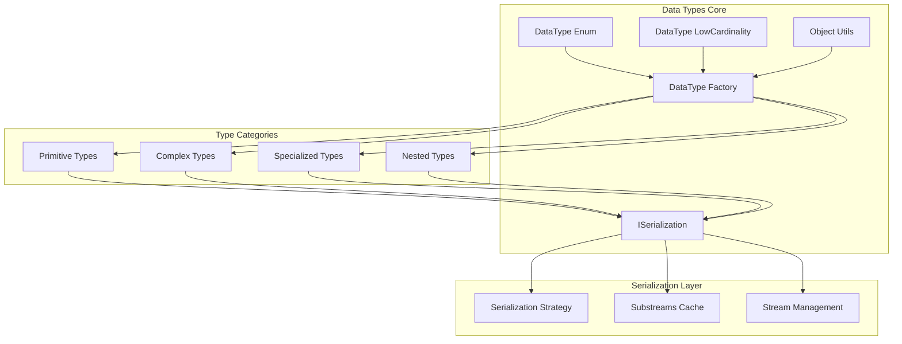
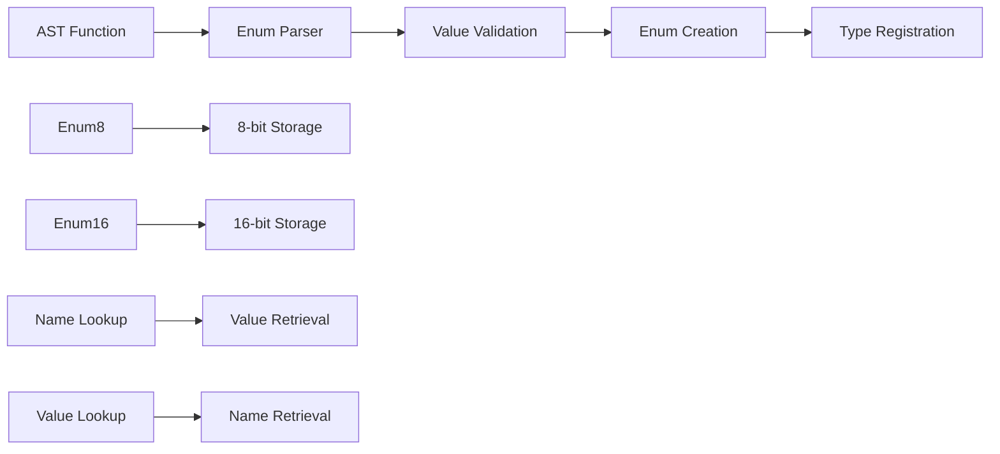
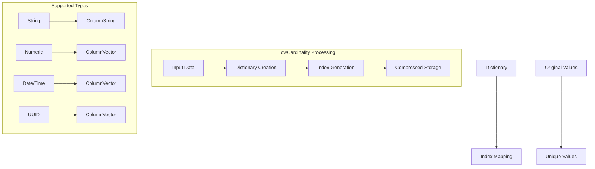
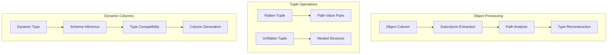
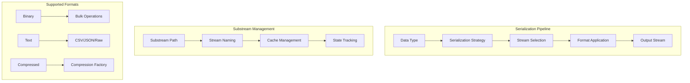
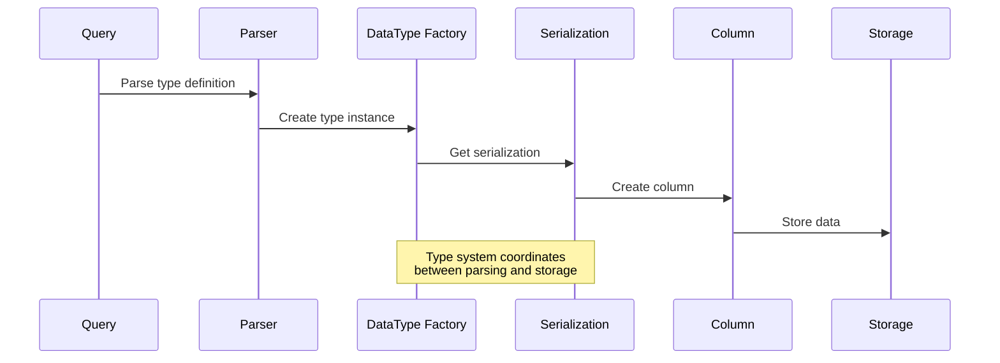

# Data Types Module Documentation

## Overview

The Data_Types module is a fundamental component of the ClickHouse database system that provides the core type system infrastructure. This module defines, manages, and serializes the various data types supported by ClickHouse, serving as the foundation for data storage, processing, and query execution throughout the system.

## Purpose and Scope

The Data_Types module is responsible for:

- **Type Definition and Management**: Defining all supported data types including primitive types, complex types, and specialized types
- **Type Serialization and Deserialization**: Converting data between in-memory representations and storage formats
- **Type Validation and Conversion**: Ensuring data integrity through type checking and conversion operations
- **Memory Management**: Optimizing memory usage through specialized type implementations like LowCardinality
- **Schema Evolution**: Supporting dynamic schema changes and type compatibility checks

## Architecture Overview

## Core Components

### 1. DataTypeEnum Implementation
**File**: `src/DataTypes/DataTypeEnum.cpp`
**Core Component**: `src.DataTypes.DataTypeEnum.EnumName`
**Detailed Documentation**: [DataType_Enum.md](DataType_Enum.md)

The DataTypeEnum component provides support for enumerated types in ClickHouse, allowing users to define custom types with named values. It supports both 8-bit and 16-bit enumeration variants.

**Key Features:**
- Support for Enum8 and Enum16 types
- Automatic value assignment for enum elements
- Name-to-value and value-to-name conversion
- UTF-8 validation for enum names
- Type compatibility checking between enum types

**Architecture:**

### 2. DataTypeLowCardinality Implementation
**File**: `src/DataTypes/DataTypeLowCardinality.cpp`
**Core Component**: `src.DataTypes.DataTypeLowCardinality.CreateColumnVector`
**Detailed Documentation**: [DataType_LowCardinality.md](DataType_LowCardinality.md)

The LowCardinality type is a specialized data type designed to optimize storage and processing of columns with repetitive values. It uses dictionary encoding to reduce memory footprint and improve query performance.

**Key Features:**
- Dictionary-based value encoding
- Automatic column unique creation
- Support for various underlying data types
- Memory-efficient storage for repetitive data
- Optimized for string and numeric types with low cardinality

**Architecture:**

### 3. ObjectUtils Implementation
**File**: `src/DataTypes/ObjectUtils.cpp`
**Core Component**: `src.DataTypes.ObjectUtils.ColumnWithTypeAndDimensions`
**Detailed Documentation**: [Object_Utils.md](Object_Utils.md)

ObjectUtils provides utilities for handling complex nested data structures, including dynamic columns, object types, and nested data transformations. It supports flattening and unflattening of complex data types.

**Key Features:**
- Dynamic column handling
- Nested data structure manipulation
- Tuple flattening and unflattening
- Object-to-tuple conversion
- Path-based data access
- Schema evolution support

**Architecture:**

### 4. ISerialization Implementation
**File**: `src/DataTypes/Serializations/ISerialization.cpp`
**Core Component**: `src.DataTypes.Serializations.ISerialization.SubstreamsCacheColumnWithNumReadRowsElement`
**Detailed Documentation**: [Serialization_Core.md](Serialization_Core.md)

ISerialization provides the base interface and common functionality for serializing and deserializing data types. It manages substreams, caching, and various serialization formats.

**Key Features:**
- Multi-stream serialization support
- Substreams caching for performance
- Various serialization formats (binary, text, JSON, CSV)
- Compression support
- Schema evolution handling
- Subcolumn support

**Architecture:**

## Module Relationships

The Data_Types module interacts with several other core modules:

### Dependencies
- **Core_Engine**: Uses settings and server configuration for type behavior
- **Columns**: Provides column implementations for data storage
- **IO_System**: Utilizes read/write buffers for serialization
- **Parsers**: Integrates with AST parsing for type creation
- **Interpreters**: Supports query context and execution

### Dependents
- **Storage_Engine**: Relies on data types for table schema definition
- **Query_Planning**: Uses type information for query optimization
- **Functions**: Depends on type system for function overloading
- **Analyzer**: Utilizes type information for query analysis

## Data Flow Architecture

## Performance Considerations

### Memory Optimization
- **LowCardinality**: Reduces memory usage for repetitive data by up to 90%
- **Substreams Caching**: Minimizes redundant data deserialization
- **Dictionary Encoding**: Efficient storage for enum and string types

### Processing Optimization
- **Bulk Operations**: Vectorized processing for large datasets
- **Type Specialization**: Optimized code paths for specific types
- **Lazy Evaluation**: Deferred processing for complex types

### Storage Optimization
- **Compression**: Type-aware compression strategies
- **Columnar Storage**: Efficient disk layout for analytical workloads
- **Schema Evolution**: Minimal storage overhead for schema changes

## Extension Points

The Data_Types module provides several extension mechanisms:

1. **Custom Data Types**: Implement IDataType interface
2. **Custom Serializations**: Extend ISerialization for specialized formats
3. **Type Factories**: Register new types through DataTypeFactory
4. **Format Support**: Add new serialization formats

## Best Practices

### Type Selection
- Use LowCardinality for columns with < 10,000 unique values
- Choose appropriate numeric types to minimize storage
- Consider Enum types for categorical data
- Use nested types for complex data structures

### Serialization Strategy
- Leverage substreams caching for repeated access
- Choose appropriate compression based on data characteristics
- Use binary formats for performance-critical operations
- Consider text formats for interoperability

### Schema Design
- Plan for schema evolution using dynamic columns
- Use consistent naming conventions
- Consider query patterns when designing nested structures
- Validate type compatibility during schema changes

## Related Documentation

- [Core_Engine.md](Core_Engine.md) - Core system settings and configuration
- [Columns.md](Columns.md) - Column implementations and storage
- [Storage_Engine.md](Storage_Engine.md) - Storage layer integration
- [IO_System.md](IO_System.md) - Input/output operations
- [Parsers.md](Parsers.md) - Type parsing and AST integration