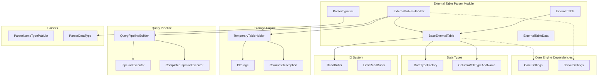
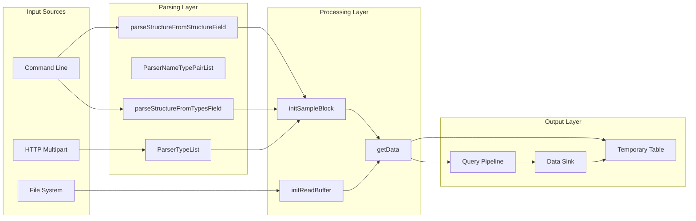

# External Table Parser Module

## Introduction

The External Table Parser module provides functionality for parsing and processing external table data in ClickHouse. It enables the system to handle temporary tables created from external data sources, supporting various input formats and structures. This module is essential for data ingestion workflows where external data needs to be temporarily available for querying without permanent storage.

## Core Functionality

The module's primary responsibilities include:

- **External Table Data Parsing**: Parsing table structures from external data sources
- **Format Handling**: Supporting multiple input formats (TabSeparated, CSV, JSON, etc.)
- **Structure Definition**: Allowing table structure specification via column definitions or type lists
- **HTTP Multipart Data Processing**: Handling external table data submitted via HTTP requests
- **Temporary Table Creation**: Creating in-memory temporary tables from parsed external data

## Architecture

### Component Structure



### Data Flow Architecture



## Core Components

### ParserTypeList

The `ParserTypeList` class is a specialized parser for handling comma-separated type definitions. It extends `IParserBase` and uses `ParserList` with `ParserDataType` to parse type sequences like `Int, Enum('foo'=1,'bar'=2), Double`.

**Key Features:**
- Parses comma-separated data type lists
- Used in `parseStructureFromTypesField` method
- Integrates with the broader parser framework

### BaseExternalTable

The abstract base class that provides core functionality for external table handling:

**Key Methods:**
- `getData()`: Creates a query pipeline for reading external table data
- `parseStructureFromStructureField()`: Parses column definitions with names and types
- `parseStructureFromTypesField()`: Parses type-only definitions and generates column names
- `initSampleBlock()`: Initializes the sample block with proper column types
- `initReadBuffer()`: Abstract method for initializing the read buffer

**Data Members:**
- `name`: Table name
- `file`: Source file path
- `format`: Input format (CSV, TabSeparated, etc.)
- `structure`: Column definitions vector
- `sample_block`: Block containing column metadata
- `read_buffer`: Read buffer for data input

### ExternalTable

Concrete implementation of `BaseExternalTable` for command-line interface usage:

**Constructor:**
- Accepts `boost::program_options::variables_map` with configuration
- Validates required parameters (file, name, format, structure/types)
- Throws exceptions for missing required fields

**Special Features:**
- Supports stdin input via file parameter "-"
- Integrates with command-line argument parsing

### ExternalTablesHandler

Handles HTTP multipart form data containing external table information:

**Key Features:**
- Processes HTTP multipart form submissions
- Implements size limits via `LimitReadBuffer`
- Creates temporary tables in the database catalog
- Handles streaming data ingestion

**Process Flow:**
1. Parse HTTP headers and extract parameters
2. Configure read buffer with size limits
3. Parse table structure from parameters
4. Create temporary table holder
5. Stream data into the temporary table
6. Register table in the context

## Dependencies

### Internal Dependencies

The module relies on several core ClickHouse components:

- **[Core.Settings](Core_Engine.md#settings-management)**: For configuration management and HTTP size limits
- **[Storage_Engine](Storage_Engine.md)**: For temporary table creation and management
- **[IO_System](IO_System.md)**: For read buffer implementations and data streaming
- **[Query_Pipeline](Query_Pipeline.md)**: For pipeline construction and execution
- **[Data_Types](Data_Types.md)**: For data type factory and column creation
- **[Parsers](Parsers.md)**: For parsing infrastructure and AST handling

### External Dependencies

- **Boost.ProgramOptions**: For command-line argument parsing
- **Poco**: For HTTP message header processing

## Usage Patterns

### Command Line Usage

```cpp
// Example: Creating external table from command line
ExternalTable table(external_options);
auto data = table.getData(context);
```

### HTTP Usage

```cpp
// Example: Handling HTTP multipart data
ExternalTablesHandler handler(context, params);
handler.handlePart(header, stream);
```

## Error Handling

The module implements comprehensive error handling:

- **Missing Parameters**: Throws `BAD_ARGUMENTS` exceptions for required field validation
- **Parse Errors**: Provides detailed error messages for structure parsing failures
- **Size Limits**: Enforces HTTP multipart size constraints
- **Resource Management**: Uses RAII patterns and scope guards for proper cleanup

## Integration Points

### Database Catalog Integration

External tables are registered in the database catalog via `Context::addExternalTable()`, making them available for query execution.

### Query Pipeline Integration

The module creates query pipelines that integrate with ClickHouse's execution engine, supporting parallel processing and proper resource management.

### Settings Integration

Configuration is managed through the settings system, allowing dynamic adjustment of parameters like `http_max_multipart_form_data_size`.

## Performance Considerations

### Memory Management

- Uses `LimitReadBuffer` to prevent excessive memory usage
- Implements streaming data processing to handle large files
- Employs move semantics for efficient data transfer

### Threading

- Pipeline execution uses single-threaded mode for external tables
- Integrates with ClickHouse's thread pool for resource management

## Security Considerations

### Input Validation

- Validates all input parameters before processing
- Enforces size limits on HTTP uploads
- Uses proper escaping for identifier formatting

### Resource Limits

- Implements configurable limits on data size
- Provides proper error messages for limit violations
- Uses scope guards for resource cleanup

## Future Enhancements

Potential areas for improvement include:

- Support for additional input formats
- Enhanced error reporting with line/column information
- Streaming validation during data ingestion
- Integration with external authentication systems
- Support for compressed input streams

## Related Documentation

- [Core Engine](Core_Engine.md) - Core system components and settings
- [Storage Engine](Storage_Engine.md) - Table storage and management
- [IO System](IO_System.md) - Input/output operations and buffering
- [Query Pipeline](Query_Pipeline.md) - Query execution pipeline
- [Data Types](Data_Types.md) - Data type system and serialization
- [Parsers](Parsers.md) - Parsing infrastructure and AST handling