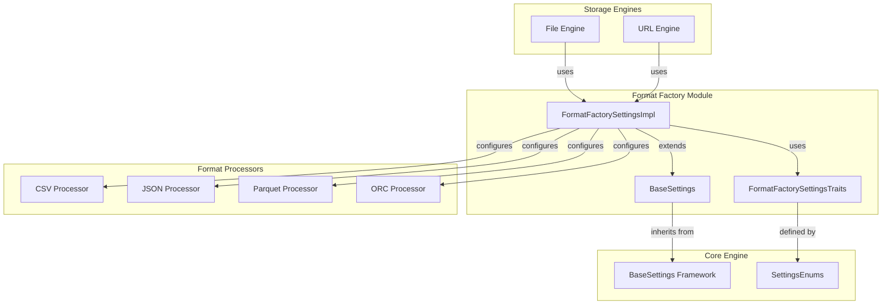
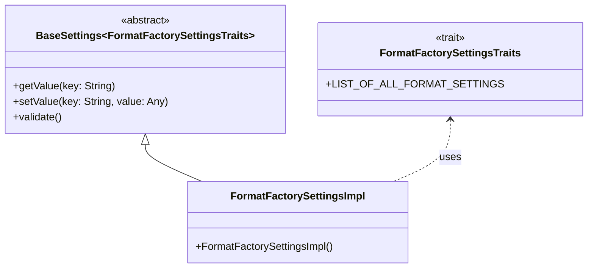
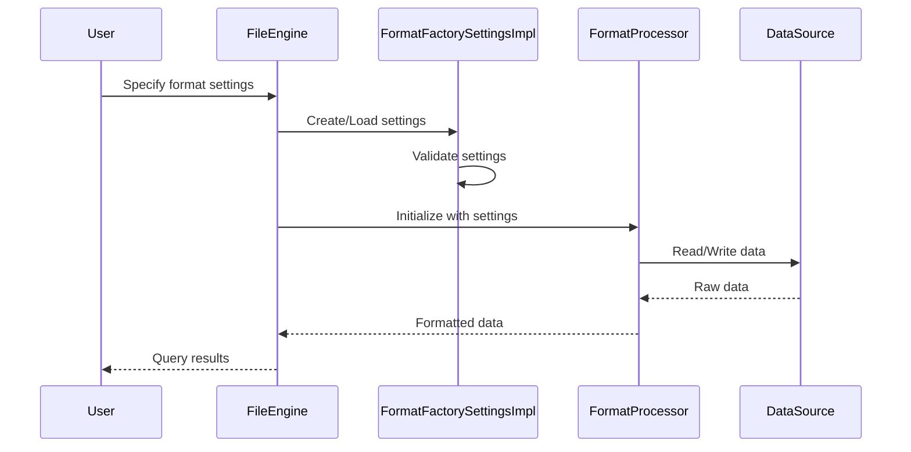
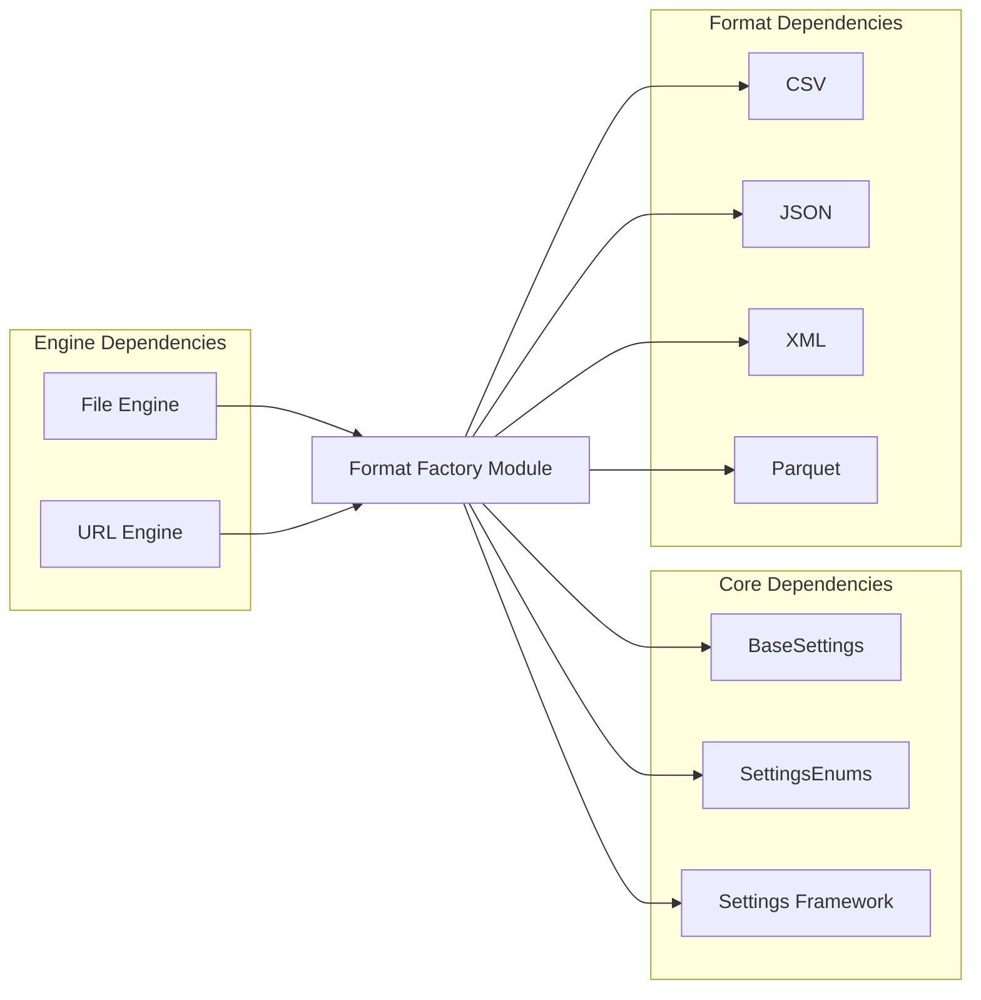
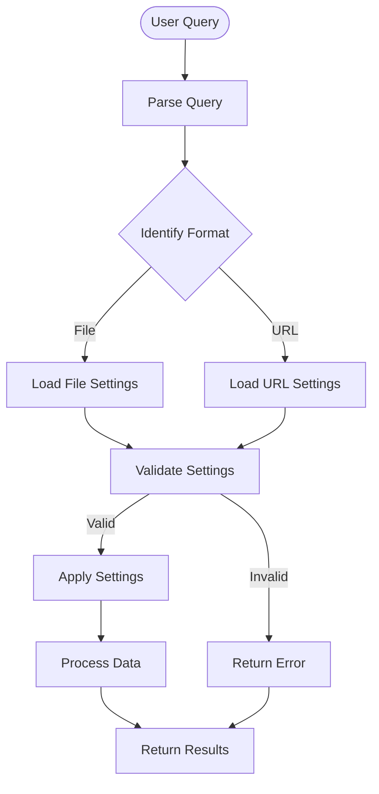

# Format Factory Module Documentation

## Introduction

The Format Factory module is a core component of the database system that manages user-specified file format settings for File and URL engines. It provides a centralized configuration system for controlling how data is read from and written to various file formats, ensuring consistent behavior across different storage engines and data sources.

## Architecture Overview

The Format Factory module implements a settings-based architecture that extends the system's base settings framework to handle format-specific configurations. It serves as a bridge between user-defined format preferences and the actual format processing engines.

## Core Components

### FormatFactorySettingsImpl

The `FormatFactorySettingsImpl` is the primary implementation class that inherits from `BaseSettings<FormatFactorySettingsTraits>`. This design pattern allows the module to:

- Leverage the base settings framework for consistent configuration management
- Define format-specific settings through the traits system
- Provide type-safe access to format configuration parameters

## Data Flow

The Format Factory module follows a configuration-driven data flow pattern:

## Dependencies

The Format Factory module has the following key dependencies:

### Internal Dependencies
- **BaseSettings Framework**: Provides the foundational settings management capabilities
- **SettingsEnums**: Defines enumeration types used in format settings
- **Core Engine**: Integrates with the main system configuration framework

### External Dependencies
- **File Engine**: Uses format settings for file-based data operations
- **URL Engine**: Applies format settings to URL-based data sources
- **Format Processors**: Various format-specific processors that consume the settings

## Configuration Management

The Format Factory module manages configuration through a trait-based system that defines all available format settings. This approach provides:

- **Type Safety**: Compile-time validation of setting types
- **Extensibility**: Easy addition of new format-specific settings
- **Consistency**: Uniform configuration interface across all formats
- **Validation**: Built-in validation of setting values and combinations

## Integration with Storage Engines

The module integrates seamlessly with the File and URL storage engines, providing them with the necessary configuration to handle different file formats correctly. This integration ensures that:

- Format settings are consistently applied across all operations
- Users can specify format preferences at the query level
- The system can adapt to different data source requirements

## Process Flow

## Related Modules

The Format Factory module works closely with several other system modules:

- **[Settings_Management](Settings_Management.md)**: Provides the base framework for configuration management
- **[Server_Settings](Server_Settings.md)**: Manages server-level configuration that may affect format processing
- **[External_Table_Parser](External_Table_Parser.md)**: Handles parsing of external table formats
- **[Storage_Engine](Storage_Engine.md)**: Contains the File and URL engines that use format settings

## Key Features

1. **Unified Configuration**: Single interface for all format-related settings
2. **Format Flexibility**: Support for multiple file formats through extensible architecture
3. **Type Safety**: Compile-time validation of configuration parameters
4. **Performance Optimization**: Efficient settings management and validation
5. **User Control**: Fine-grained control over format processing behavior

## Usage Patterns

The Format Factory module is typically used in the following scenarios:

- Reading data from files in various formats (CSV, JSON, Parquet, etc.)
- Writing query results to files with specific format requirements
- Configuring format-specific behaviors (delimiters, encoding, compression)
- Handling URL-based data sources with format specifications

This modular approach ensures that format configuration is centralized, consistent, and easily maintainable across the entire database system.